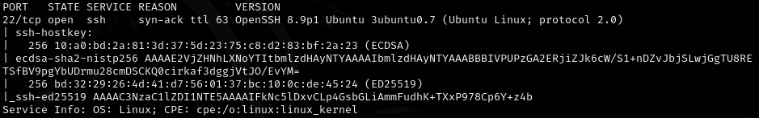
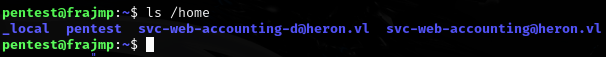

# Heron -- Vulnlab (write-up)

**Difficulty:** Medium
**Box:** Heron (Vulnlab)
**Author:** dsec
**Date:** 2025-11-13

---

## TL;DR

### Assumed breach scenario with provided creds `pentest:Heron123!`. Incomplete -- notes end after initial enumeration.
---
## Target info

- Host: Vulnlab target
- Assumed breach creds: `pentest:Heron123!`
---
## Enumeration

Used the assumed breach credentials: `pentest:Heron123!`

---
## Lessons & takeaways

- Assumed breach scenarios skip the initial foothold -- focus on post-exploitation enumeration immediately
---
