# Hetemit -- Proving Grounds (write-up)

**Difficulty:** Intermediate
**Box:** Hetemit (Proving Grounds)
**Author:** dkrxhn
**Date:** 2025-05-29

---

## TL;DR

### Gained initial access through open services. Privesc by editing a writable systemd service file and rebooting via sudo.
---

## Target info

- Host: `192.168.238.117`

---

## Enumeration

Nmap results:

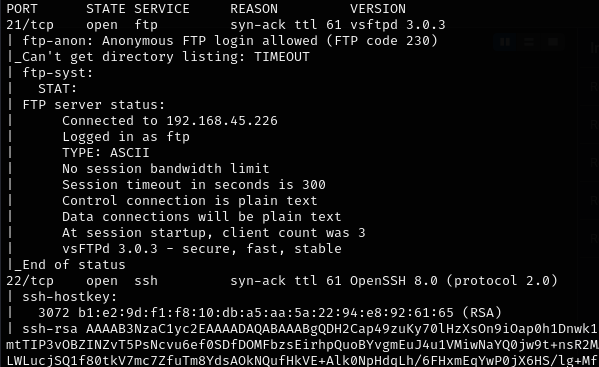

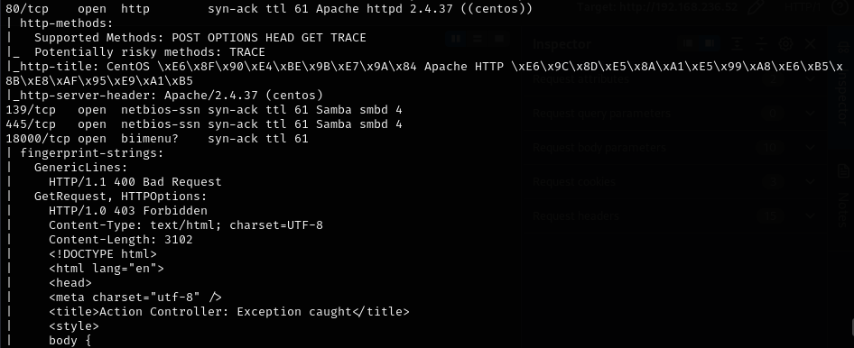

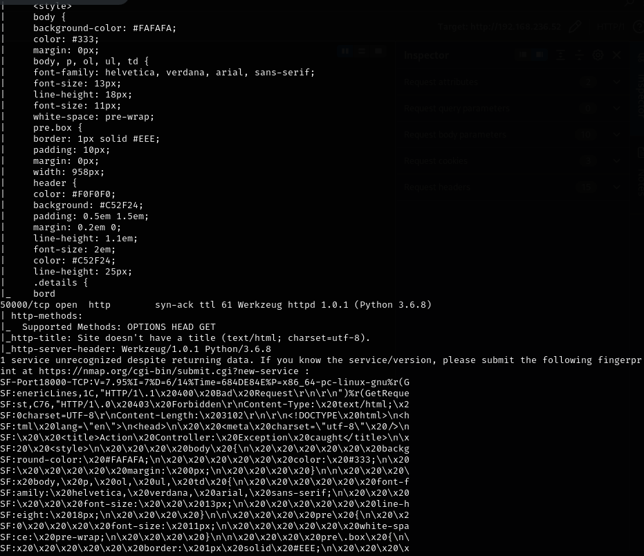

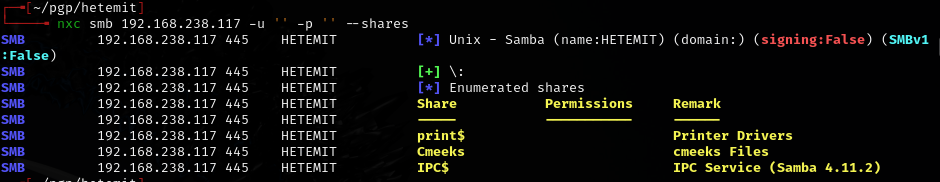

Ran enum4linux:

```bash
enum4linux -a -u "" -p '' 192.168.238.117
```

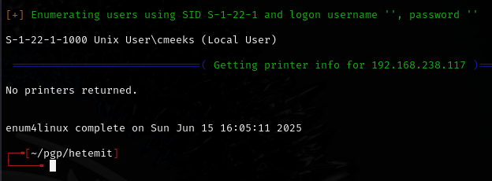

## Exploitation

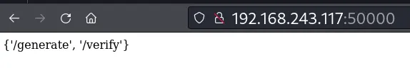

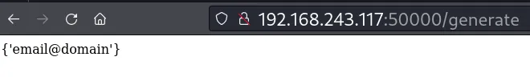

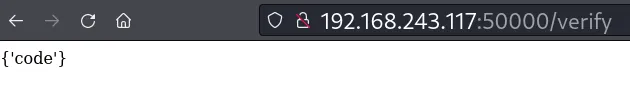

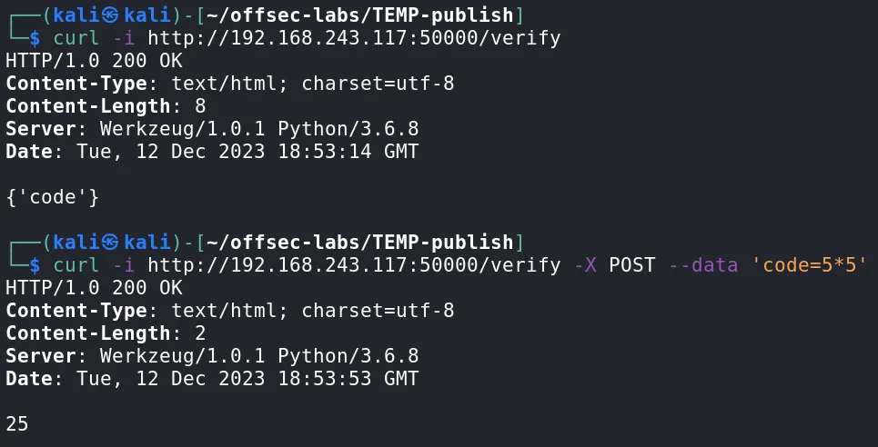

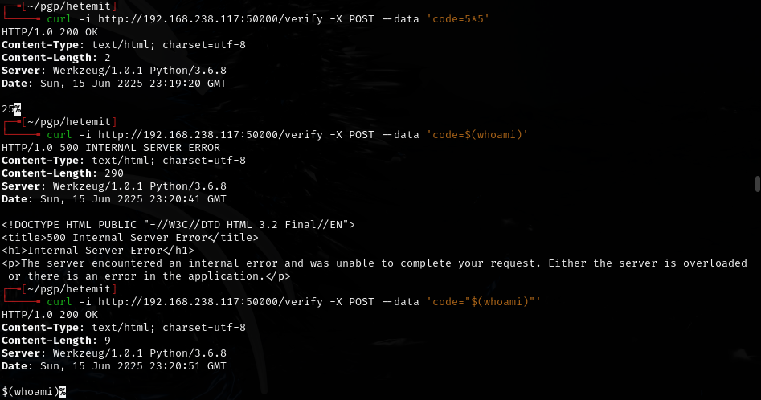

## Privilege escalation

Checked sudo permissions:

```bash
sudo -l
```

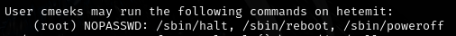

Ran linpeas:

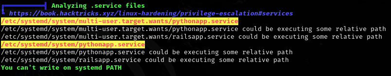

Found writable systemd service:

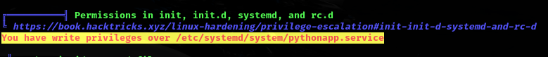

`/etc/systemd/system/pythonapp.service` is writable and we have `sudo -l` permissions for `/sbin/reboot`. Edited the service to include a reverse shell:

```bash
vi /etc/systemd/system/pythonapp.service
```

- Changed `ExecStart` to a reverse shell and `User` to root.

Then rebooted:

```bash
sudo /sbin/reboot
```

Caught root shell on listener.

---

## Lessons & takeaways

- Always check for writable systemd service files with linpeas
- If you can sudo reboot, writable service files are an easy privesc path
- Edit `ExecStart` and `User` fields in the service file to escalate
---
