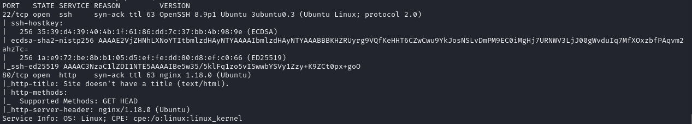
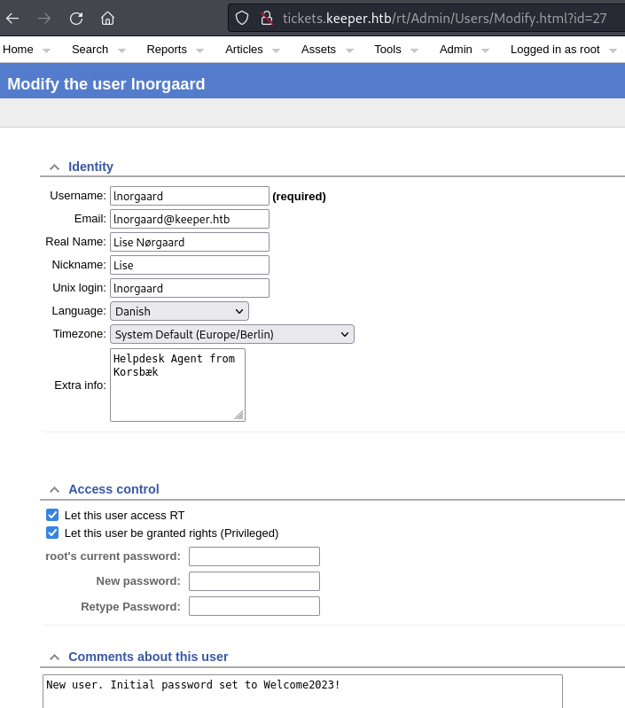
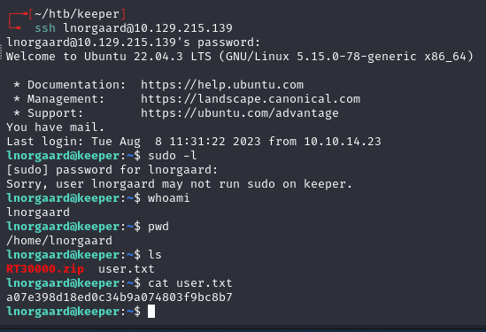
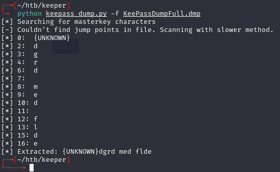
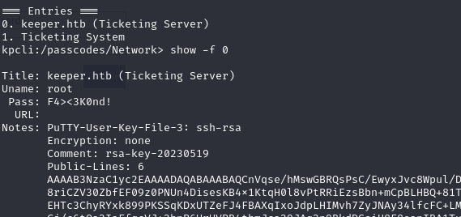
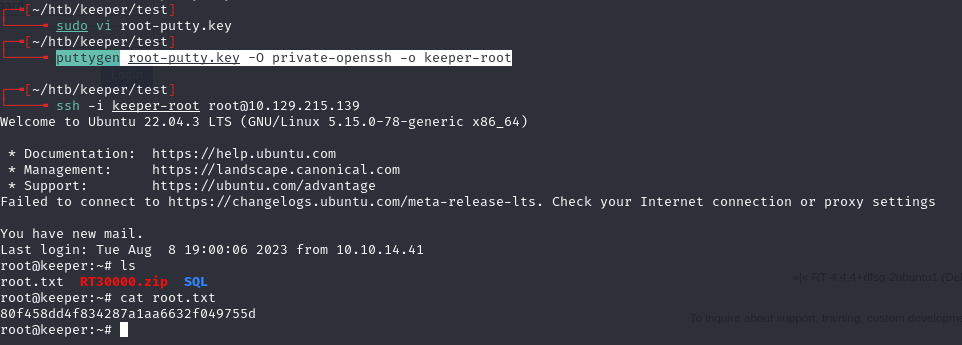

# Keeper -- HackTheBox (write-up)

**Difficulty:** Easy
**Box:** Keeper (HackTheBox)
**Author:** dkrxhn
**Date:** 2025-03-16

---

## TL;DR

### Request Tracker with default creds. User profile leaked SSH password. KeePass dump revealed master password. Root SSH key extracted from KeePass notes.
---
## Target info

- Host: `tickets.keeper.htb`
- Services discovered: `22/tcp (ssh)`, `80/tcp (http)`
---
## Enumeration

Browsed to port 80 and found a redirect to `tickets.keeper.htb/rt/`. Added to `/etc/hosts`.

---
## Initial access

Request Tracker login page -- default creds `root:password` worked.

Found user `lnorgaard` who mentions issues with a KeePass program. Clicked user > edit:

Password in user profile: `lnorgaard:Welcome2023!`

---
## Privilege escalation

KeePass master password from CVE dump: `rodgrod med flode`

Found root creds: `root:F4><3K0nd!`

Extracted the PuTTY key from the notes field -- copied everything after `notes:` to a file, removed leading whitespace in vim with `%s/^\s\//`:

---
## Lessons & takeaways

- Always check default credentials on web apps (Request Tracker default is `root:password`)
- User profile descriptions and comments can contain plaintext passwords
- KeePass notes fields can store SSH keys
---
