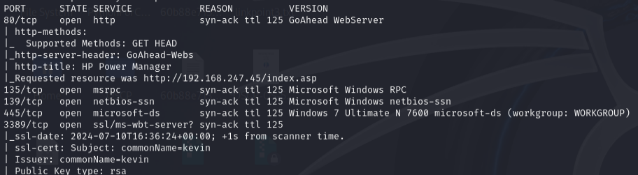
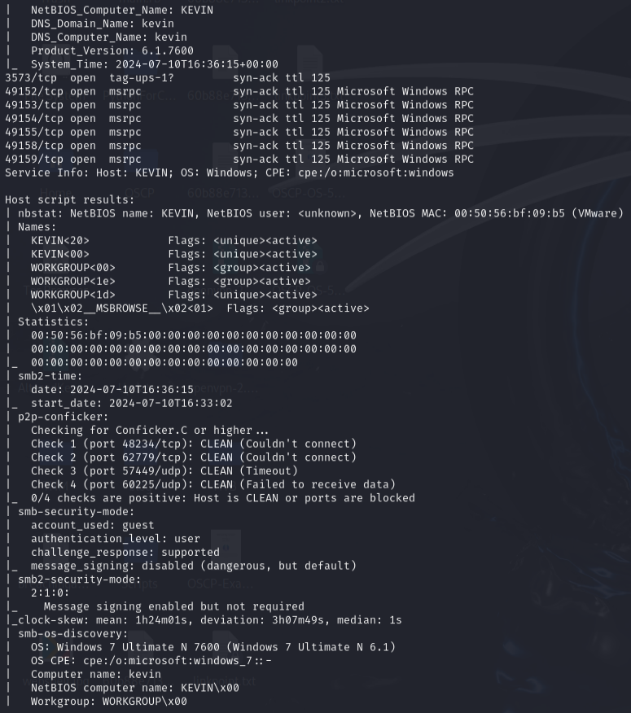
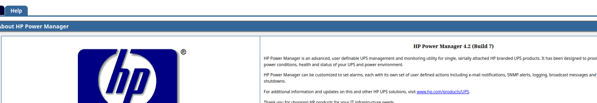
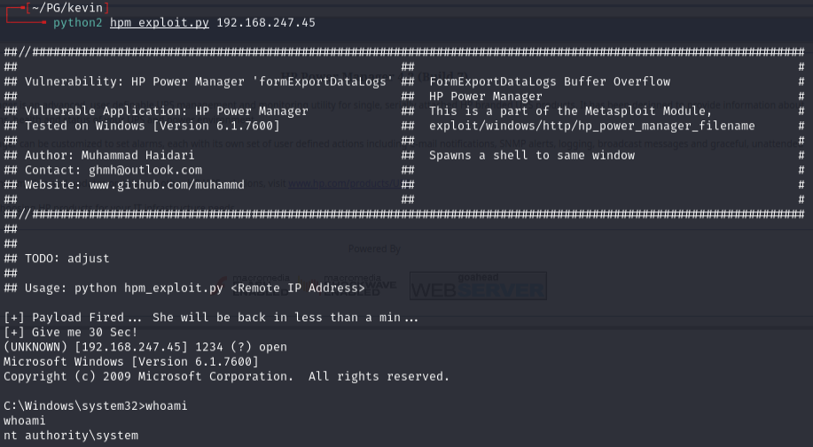

# Kevin -- Proving Grounds (write-up)

**Difficulty:** Easy / Beginner
**Box:** Kevin (Proving Grounds)
**Author:** dsec
**Date:** 2024-12-01

---

## TL;DR

### HP Power Manager running default creds. Found a public Python2 exploit for HP Power Manager 4.2 that gave a shell immediately.
---
## Target info

- Host: `192.168.247.45`
- Services discovered via nmap
---
## Enumeration

```bash
sudo nmap -Pn -n 192.168.247.45 -sCV -p- --open -vvv
```





---
## HP Power Manager

Found HP Power Manager on the web port. Logged in with default creds `admin:admin`.



HP Power Manager version 4.2.

---
## Exploitation

Googled for HP Power Manager 4.2 exploits and found a working Python2 exploit.

```bash
python2 hpm_exploit.py 192.168.247.45
```



---
## Lessons & takeaways

- Always try default credentials on management interfaces
- Old software with known versions often has public exploits ready to go
- Python2 exploits still work -- just need the right environment
