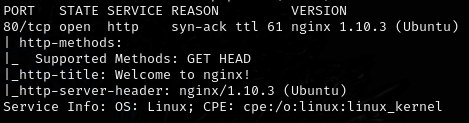
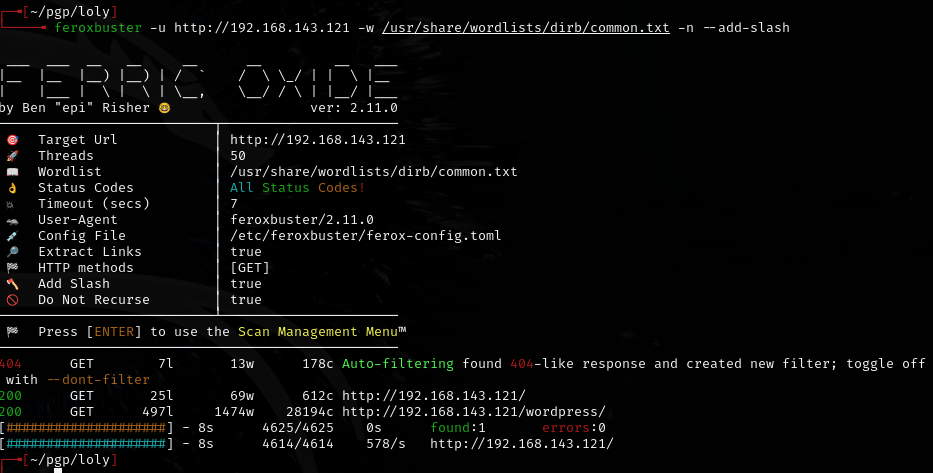
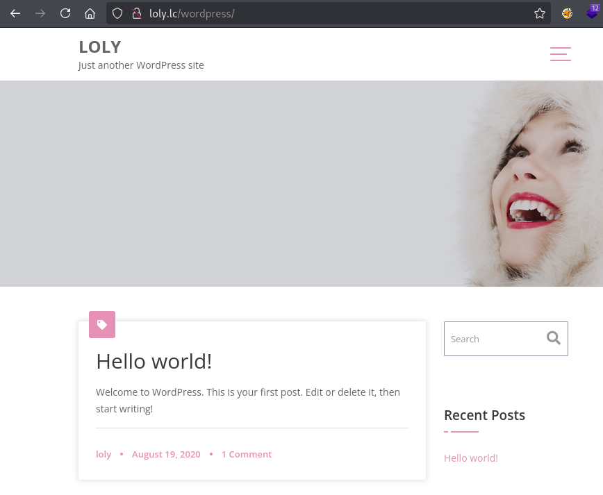
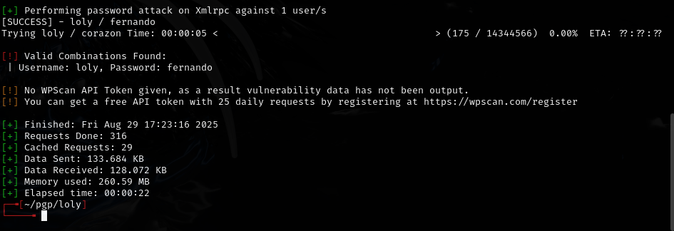
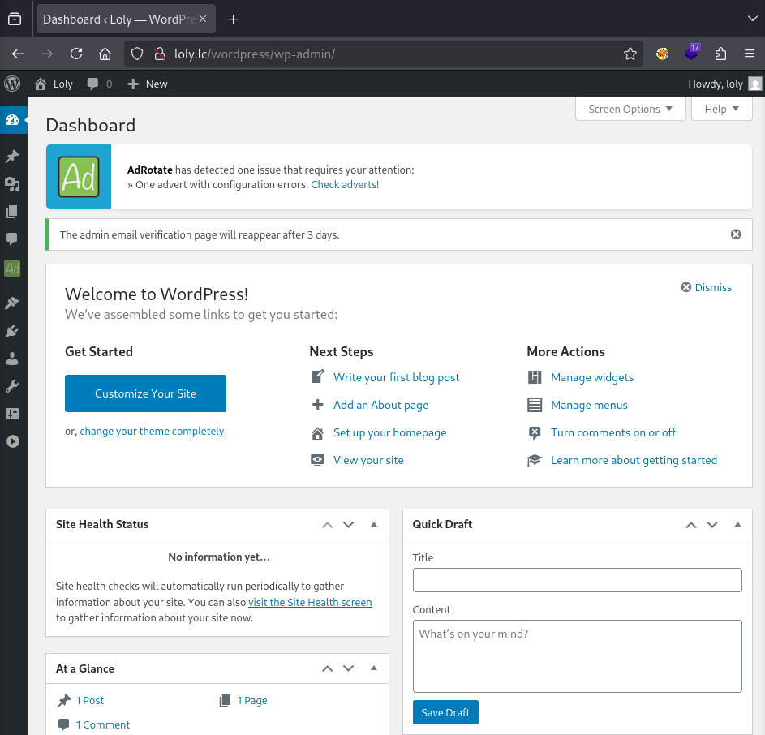
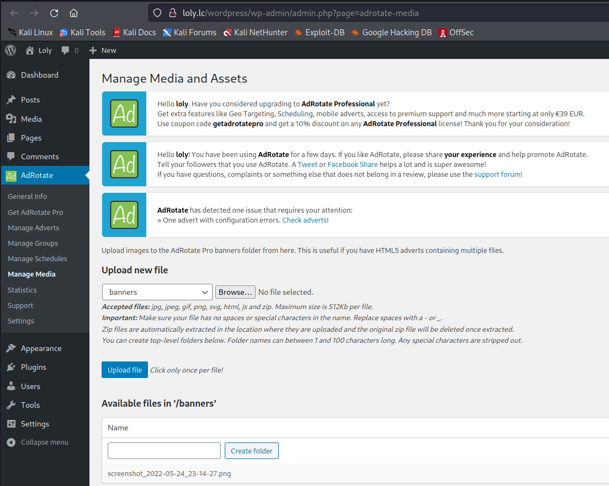
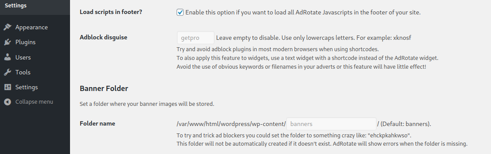

# Loly -- PG Play (write-up)

**Difficulty:** Easy
**Box:** Loly (PG Play)
**Author:** dkrxhn
**Date:** 2025-09-14

---

## TL;DR

### WordPress brute force with wpscan gave credentials. Uploaded PHP shell via wp-admin. Kernel exploit for root.
---

## Target info

- Host: `192.168.188.121`
- Hostname: `loly.lc` (added to `/etc/hosts`)

---

## Enumeration



Checked for nginx exploits:

- CVE for nginx 1.10.3: `https://github.com/gemboxteam/exploit-nginx-1.10.3/blob/main/cve-nginx-1.10.3.py`



Added `loly.lc` to `/etc/hosts`:



---

## Foothold

Brute forced WordPress credentials:

```bash
wpscan --url http://192.168.188.121/wordpress -U loly -P /usr/share/wordlists/rockyou.txt
```



- `loly:fernando`

Logged into `/wp-admin`:





Uploaded PHP shell (`ivan.php`) via the banners upload:



Browsed to `http://loly.lc/wordpress/wp-content/banners/ivan.php` and caught shell.

Stabilized shell, then:

```bash
su loly
```

Password from WordPress config (`wp-config.php`) worked.

---

## Privilege escalation

Ubuntu kernel exploit:

- `https://www.exploit-db.com/exploits/45010`

---

## Lessons & takeaways

- wpscan user brute force is effective when you have a known username
- WordPress upload directories are common shell drop locations
- Check kernel version for known local privilege escalation exploits
---
