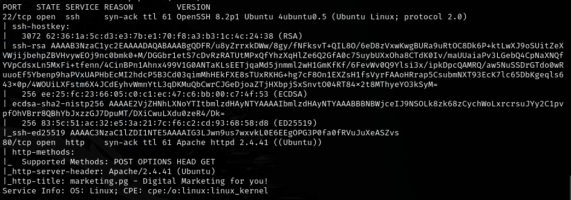
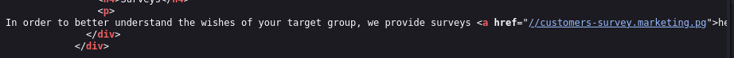
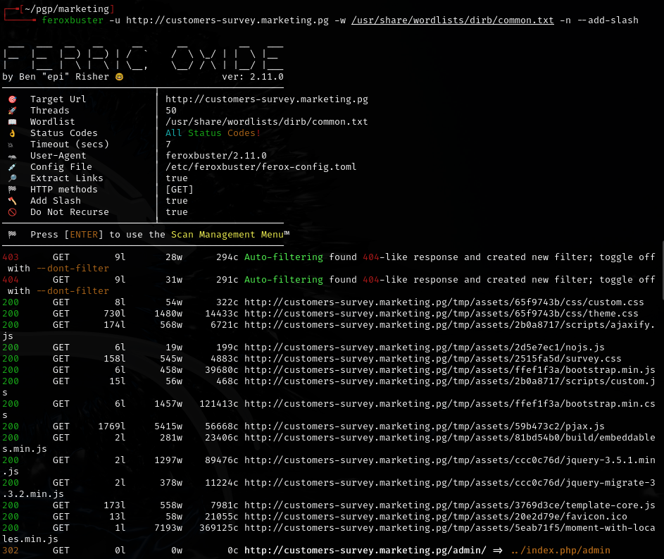
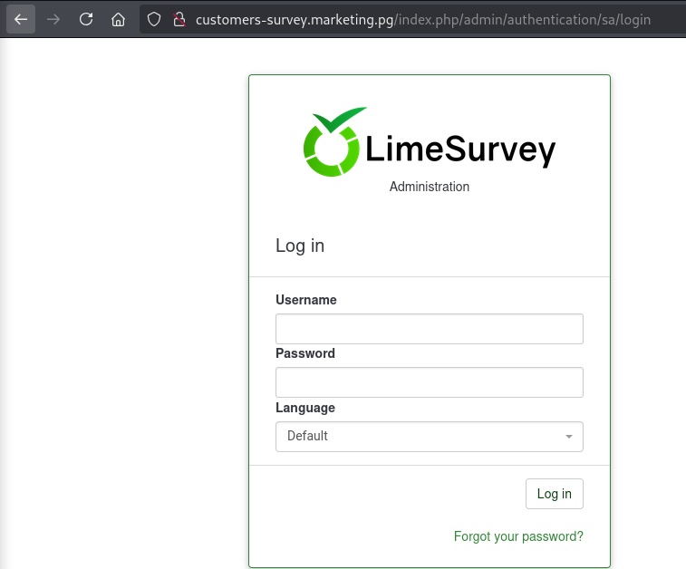
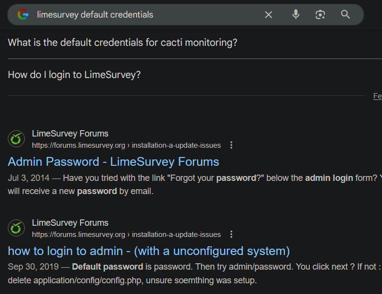
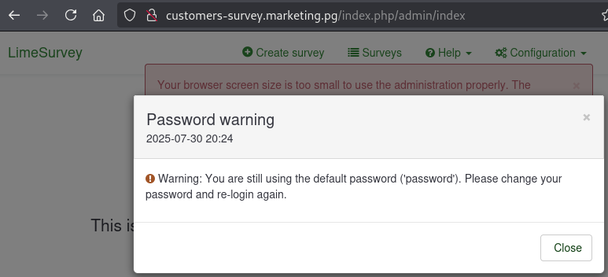
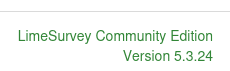
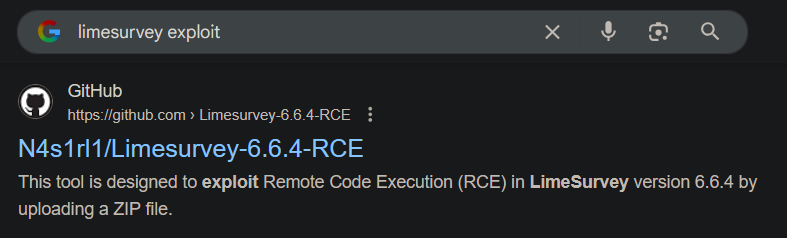
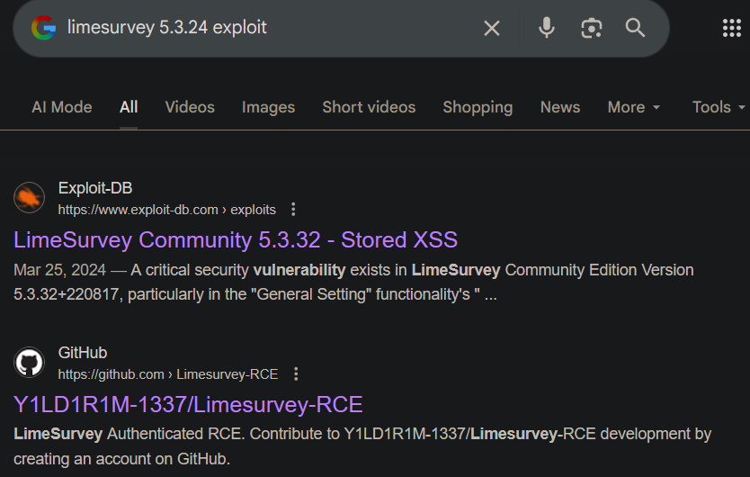
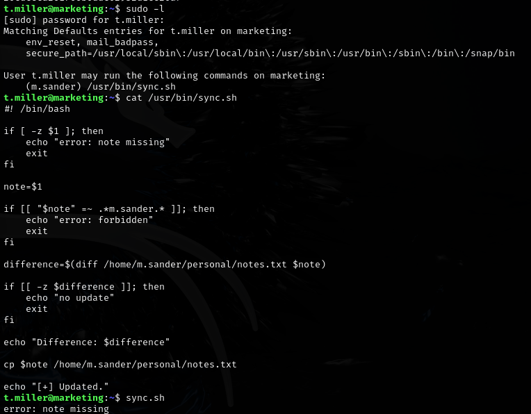

# Marketing -- Proving Grounds (write-up)

**Difficulty:** Hard
**Box:** Marketing (Proving Grounds)
**Author:** dkrxhn
**Date:** 2025-01-17

---

## TL;DR

### Subdomain and directory enumeration led to a Limesurvey admin panel. RCE exploit gave foothold. Privesc involved mlocate group membership, symlink tricks, and sudo ALL.

---

## Target info

- Host: `marketing.pg`
- Services discovered: `22/tcp (ssh)`, `80/tcp (http)`

---

## Enumeration

Added host to `/etc/hosts`. Ran feroxbuster, found `/old` directory. Source code revealed:

Found subdomain `customers-survey.marketing.pg`:

- Found email: `admin@marketing.pg`

Found `/admin` path.

---

## Foothold

**First exploit attempt failed.**

Used Limesurvey RCE exploit from: `https://github.com/Y1LD1R1M-1337/Limesurvey-RCE/tree/main`

---

## Privilege escalation

User was in the `mlocate` group. Needed to use symlinks against entries in the `mlocate.db` file to discover a credential file in `m.sanders` home directory. Symlink comparison revealed creds for `m.sanders`.

After pivoting to `m.sanders`, had `sudo ALL` -- straight to root.

---

## Lessons & takeaways

- The `mlocate` group grants access to the locate database, which can reveal sensitive file paths
- Symlink tricks can be used to read files you normally cannot access
- Always check group memberships after landing a shell
---
