# Mentor — HackTheBox (write-up)

**Difficulty:** Medium
**Box:** Mentor (HackTheBox)
**Author:** dkrxhn
**Date:** 2025-01-02

---

## TL;DR

### SNMP with community string `internal` leaked an API key. Accessed a FastAPI docs endpoint, used the API to get a JWT, then triggered a backup endpoint for command injection into a Docker container. Pivoted to Postgres for a password hash, cracked it, then SSH'd as `svc`. Found SNMP config with root's password for sudo escalation.
---
## Target info

- Host: `10.129.228.102`
- Vhost: `api.mentorquotes.htb`
---
## Enumeration

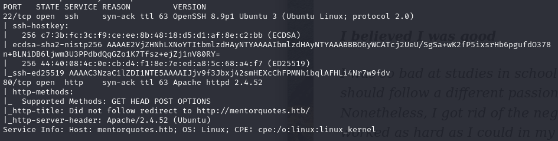

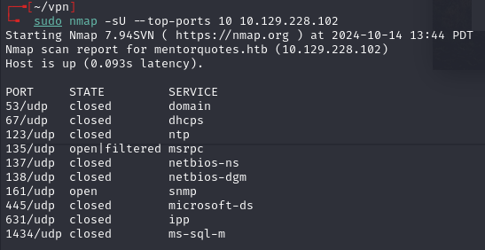

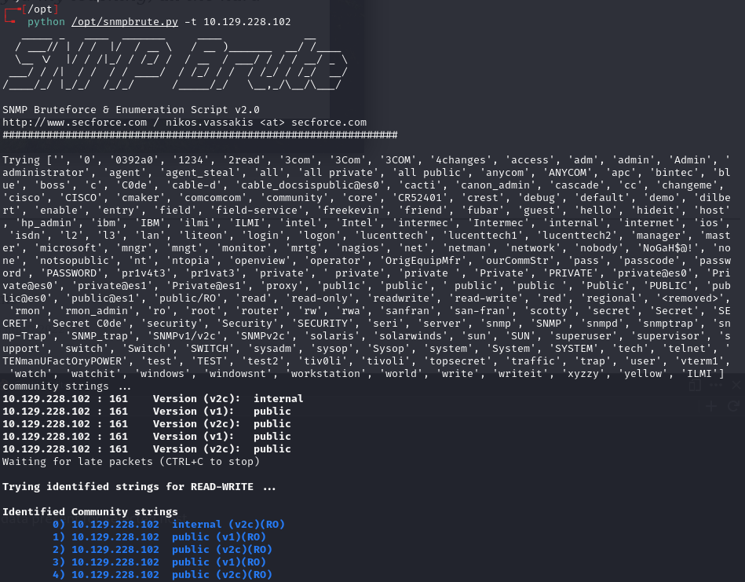

SNMP walk with community string `internal`:

```bash
time snmpbulkwalk -v2c -c internal 10.129.228.102
```

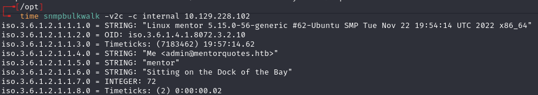

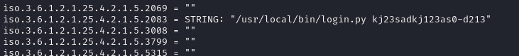

Found API key: `kj23sadkj123as0-d213`

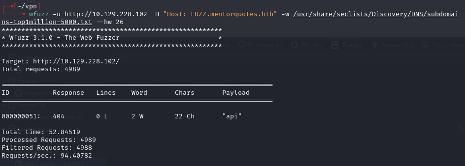

Discovered `api.mentorquotes.htb`, added to `/etc/hosts`.

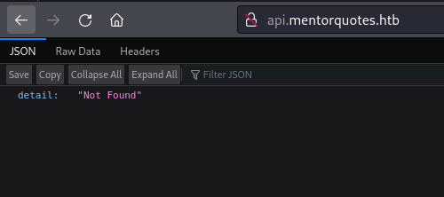

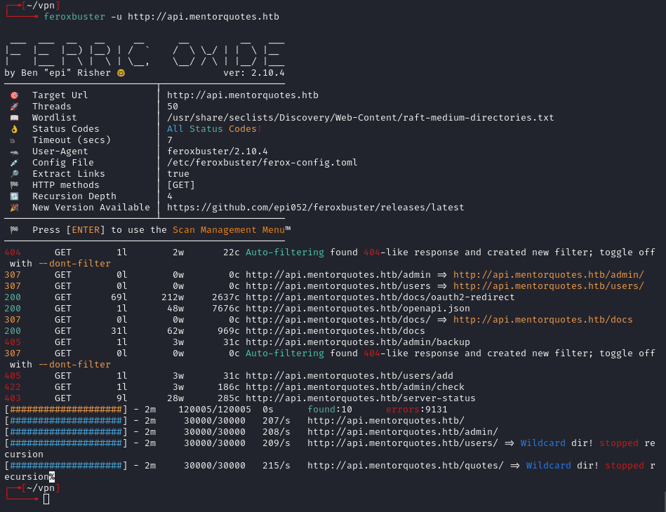

---
## Foothold

Found `/docs` endpoint (FastAPI Swagger):

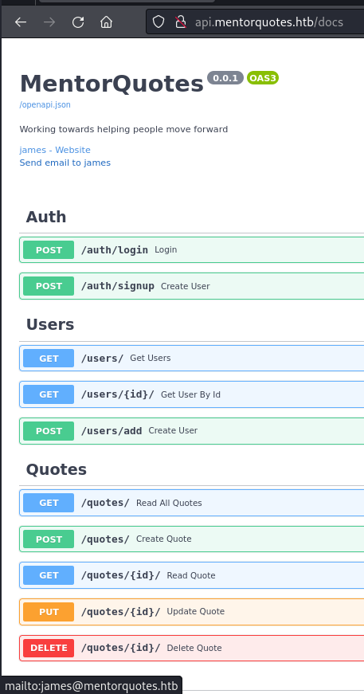

User `james@mentorquotes.htb` visible. Used `/auth/login`:

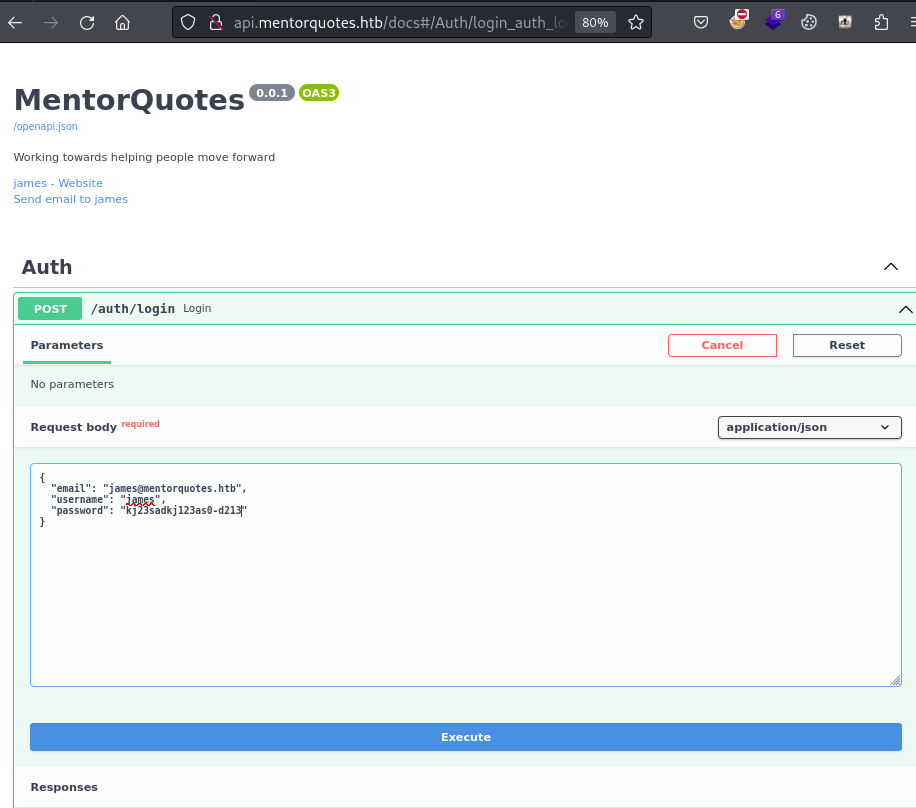

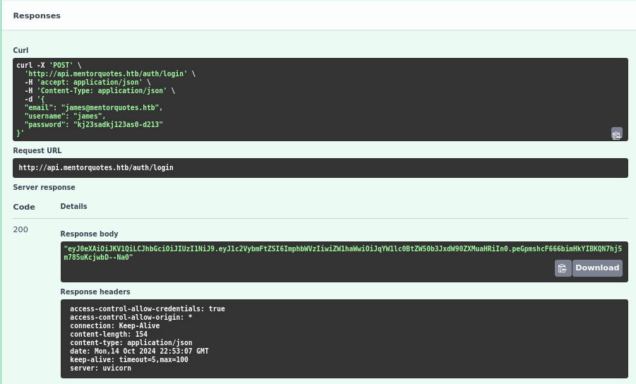

Got JWT: `eyJ0eXAiOiJKV1QiLCJhbGciOiJIUzI1NiJ9...`

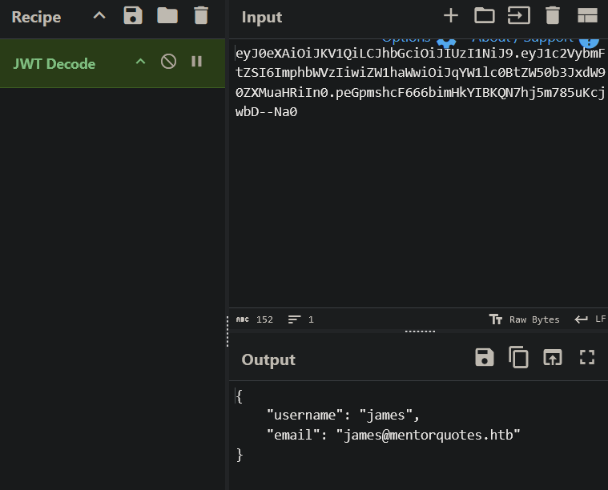

Used the JWT with various API requests (`/users`, `/admin/backup`) and iterated until finding a command injection point:

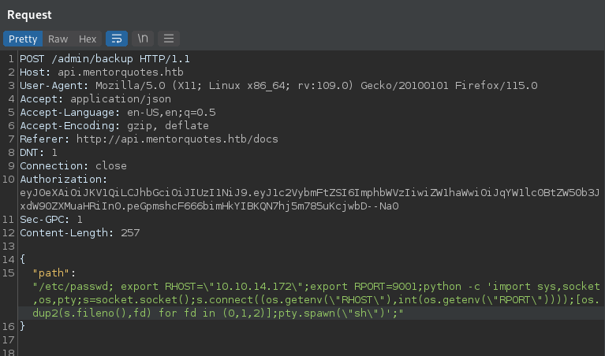

Used Python reverse shell from revshells.com (escaped double quotes):

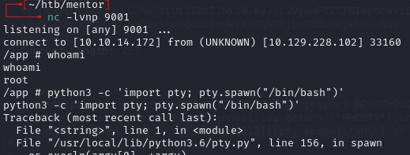

No bash available:

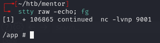

---
## Lateral movement

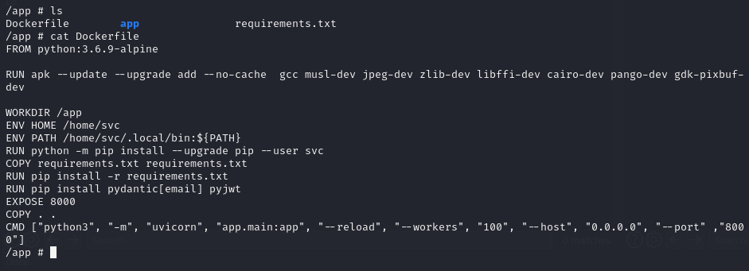

uvicorn was running with `--reload`, meaning changes to the API auto-apply.

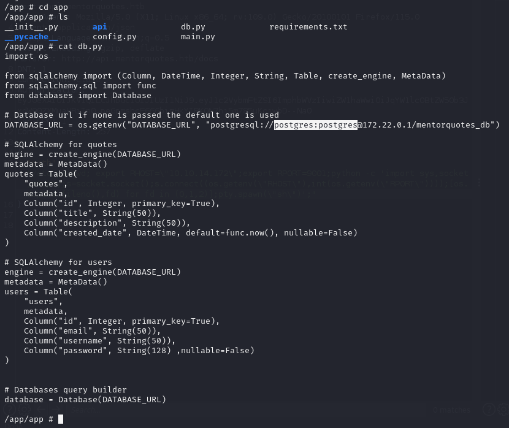

Connected to Postgres with default creds `postgres:postgres`. Found password column in the database that wasn't exposed via the API:

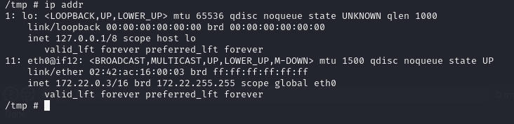

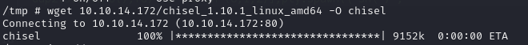

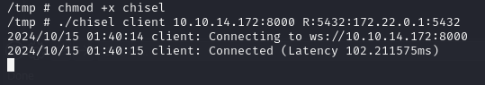

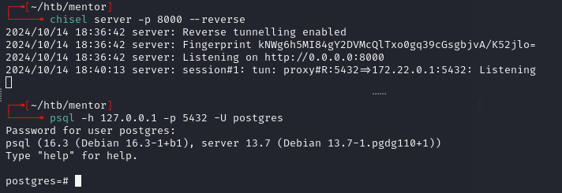

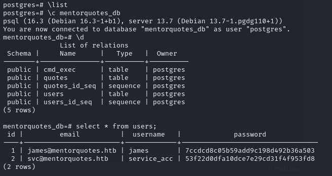

`\list` showed `mentorquotes_db`.

Cracked hash: `53f22d0dfa10dce7e29cd31f4f953fd8` -> `123meunomeeivani`

```bash
ssh svc@mentorquotes.htb
```

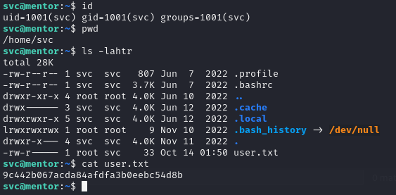

---
## Privesc

Checked SNMP configuration:

```bash
cat snmpd.conf | grep -v "^#" | grep .
```

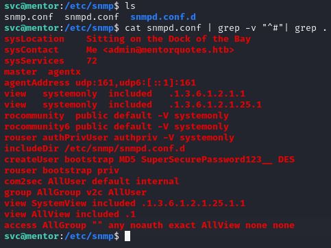

Found: `SuperSecurePassword123__`

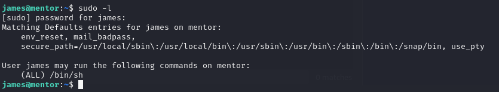

Used the SNMP config password with `sudo su` for root.

---
## Lessons & takeaways

- SNMP community strings beyond `public`/`private` (like `internal`) can leak sensitive data -- always brute-force community strings
- FastAPI `/docs` endpoint exposes the full API spec including hidden admin routes
- Docker containers often have default Postgres credentials and can be pivoted through
- SNMP configuration files (`snmpd.conf`) can contain reused passwords
---
