# Monitored -- HackTheBox (write-up)

**Difficulty:** Medium
**Box:** Monitored (HackTheBox)
**Author:** dkrxhn
**Date:** 2025-07-16

---

## TL;DR

### SNMP enumeration leaked credentials. Used Nagios XI API to authenticate and exploit SQL injection + API user creation for a shell. Privesc via sudo nagios script symlink or process hijack after restart.
---

## Target info

- Host: `10.129.181.173`
- Services discovered: `22/tcp (ssh)`, `80/tcp (http)`, `161/udp (snmp)`, `443/tcp (https)`

---

## Enumeration

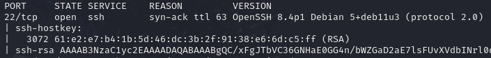

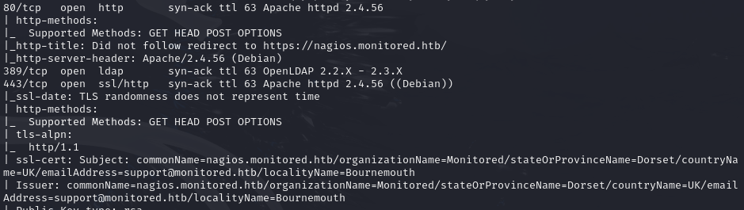

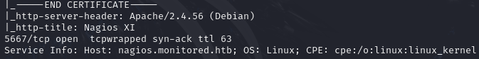

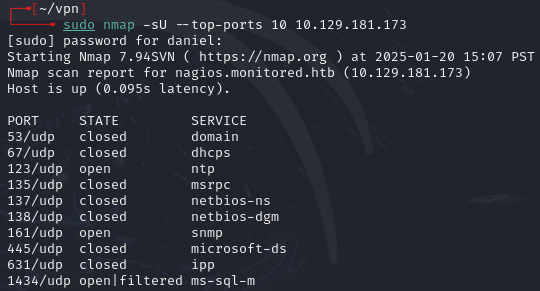

UDP scan for SNMP:

```bash
sudo nmap -sU -p161,123,1434 -sCV 10.129.181.173 -vvv --open -Pn
```

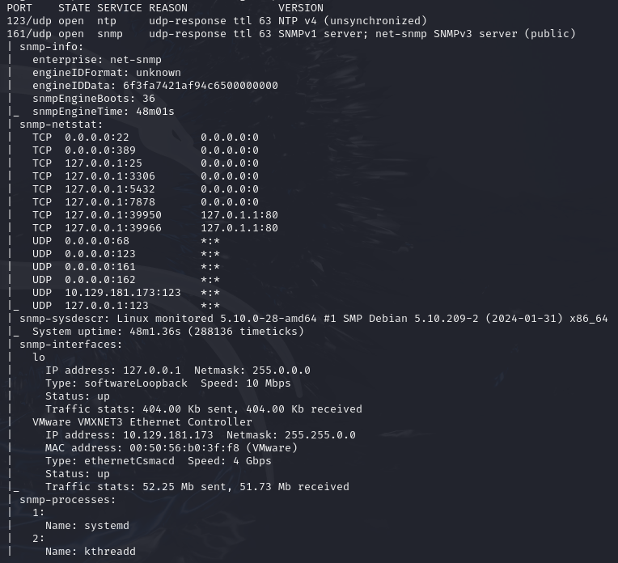

SNMP brute:

```bash
python /opt/snmpbrute.py -t 10.129.181.173
```

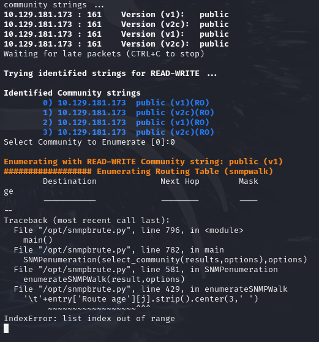

SNMP walk:

```bash
snmpbulkwalk -v2c -c public 10.129.181.173
```

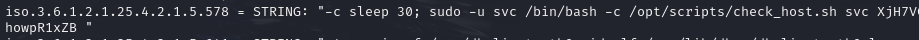

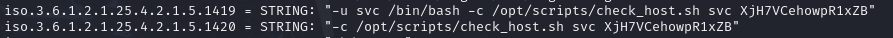

- Found creds: `svc:XjH7VCehowpR1xZB`

## Exploitation

Logged into Nagios with discovered creds:

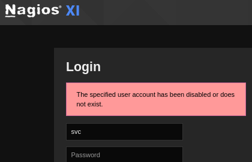

**Wrong password gives different response:**

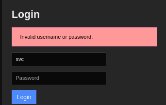

Found the API authentication endpoint:

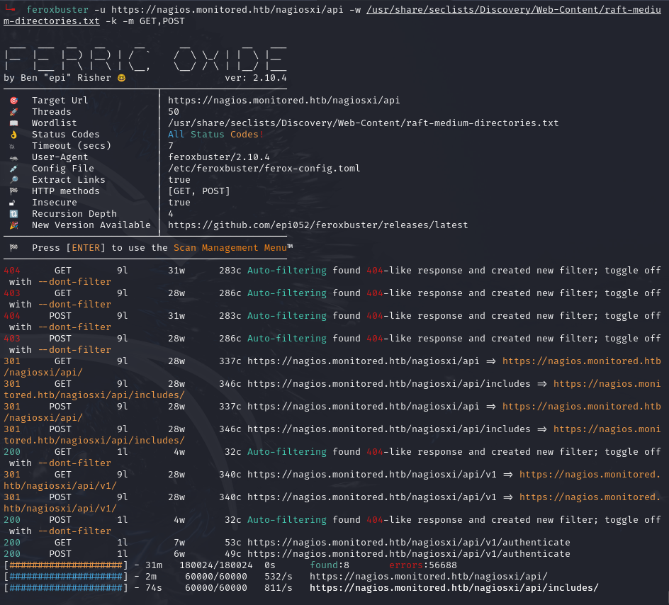

- `/nagiosxi/api/v1/authenticate`

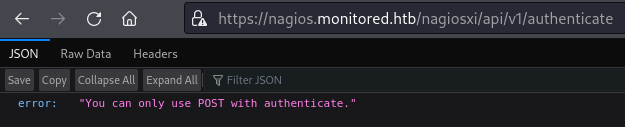

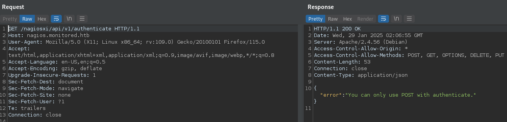

Switched to POST:

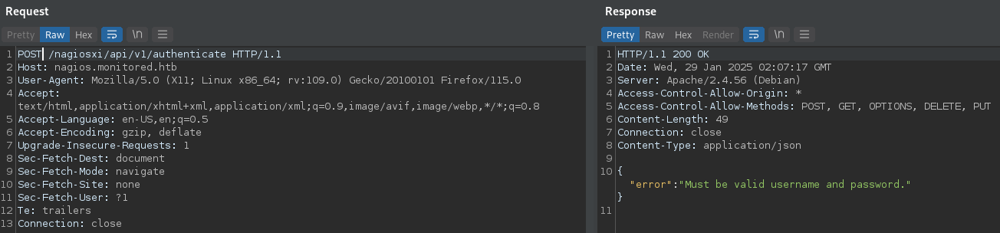

Added username and password headers, removed extras:

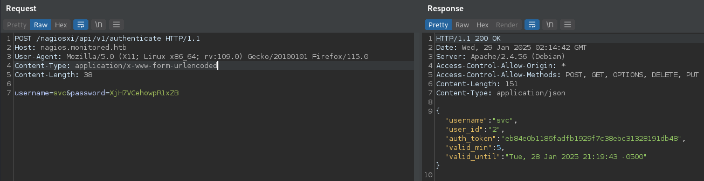

Used API token to access site: <https://support.nagios.com/forum/viewtopic.php?t=58783>

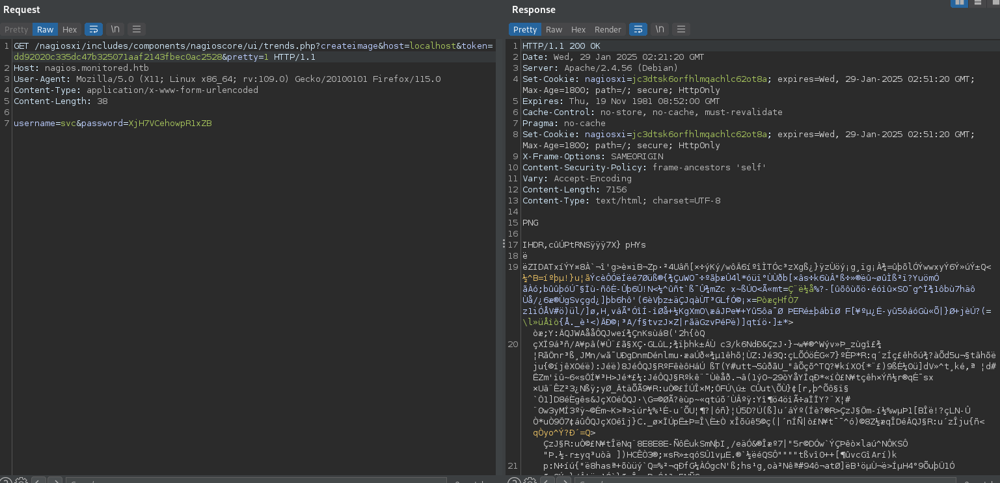

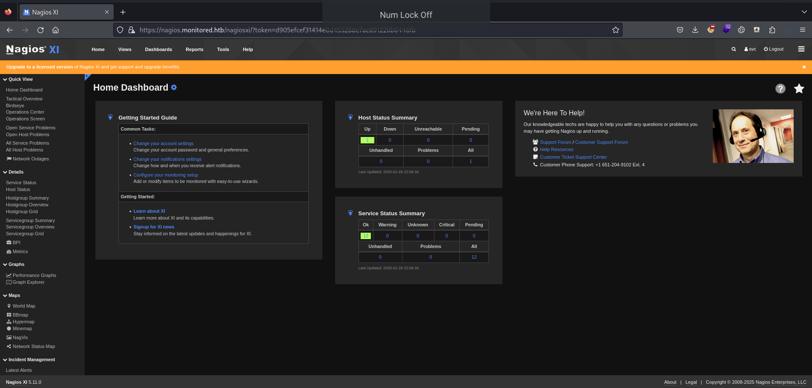

- Version 5.11

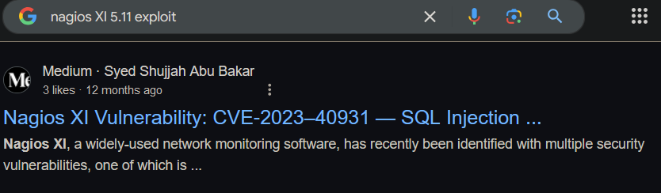

Reference walkthrough: [HackTheBox - Monitored](https://www.youtube.com/watch?v=Ulb2rm2qbJY)


SQL injection was possible but tedious manually -- used sqlmap. Involved API hacking to create a user, then called a shell. From there, used a sudo permission symlink from a nagios script to get root shell. Can also restart as sudo and hijack a process.

---

## Lessons & takeaways

- Always scan UDP -- SNMP can leak credentials via snmpbulkwalk
- Nagios XI API authentication endpoint can be used to get tokens
- SQL injection + API user creation is a powerful combo on Nagios XI
---
