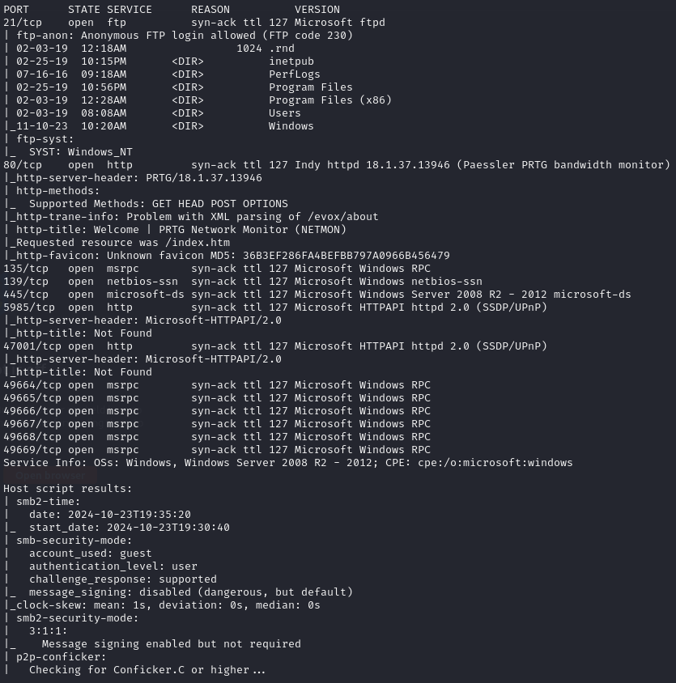
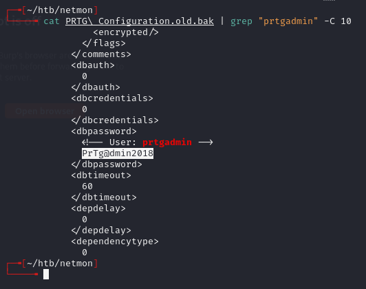
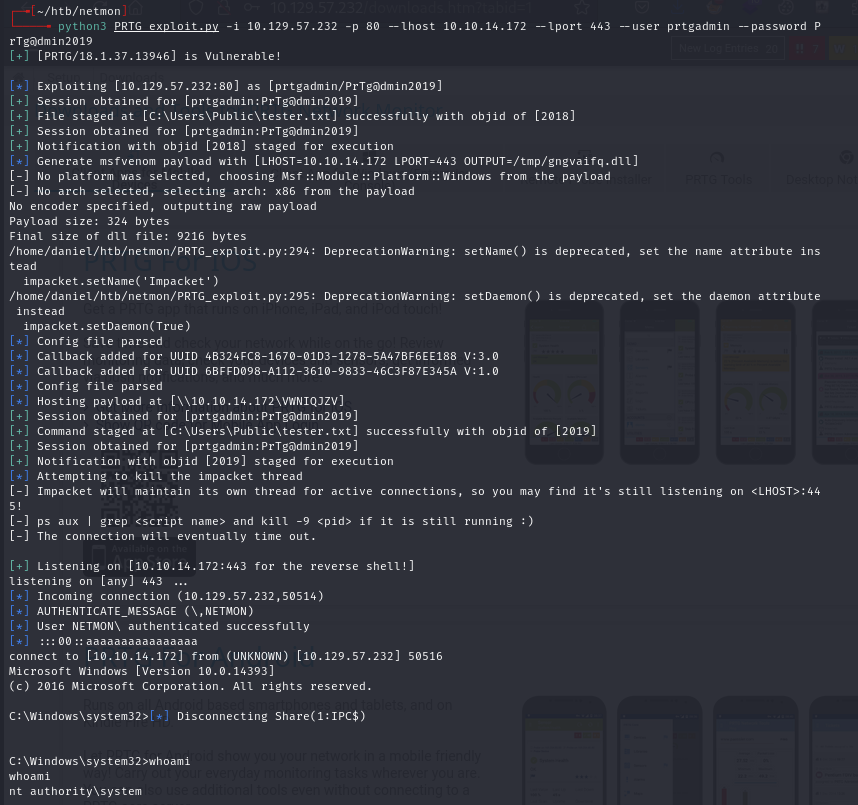

# Netmon -- HackTheBox (write-up)

**Difficulty:** Easy
**Box:** Netmon (HackTheBox)
**Author:** dsec
**Date:** 2025-01-15

---

## TL;DR

### PRTG Network Monitor with default creds (year incremented from 2018 to 2019). Used a known PRTG RCE exploit (CVE-2018-9276) for SYSTEM.
---
## Target info

- Host: `10.129.229.146`
- Services discovered via nmap
---
## Enumeration

Found default creds `prtgadmin:PrTg@dmin2018` but they **did not** work. Incremented the year -- `PrTg@dmin2019` worked.

---
## Exploitation -- CVE-2018-9276

Used the PRTG authenticated RCE exploit:

---
## Lessons & takeaways

- Default creds with predictable year patterns are worth trying with incremented values
- PRTG Network Monitor has well-known RCE once authenticated
