# Nibbles -- HackTheBox (write-up)

**Difficulty:** Easy
**Box:** Nibbles (HackTheBox)
**Author:** dkrxhn
**Date:** 2024-10-25

---

## TL;DR

### Found Nibbleblog CMS, guessed the password (`nibbles`), uploaded a PHP reverse shell via the My Image plugin, then escalated via a writable script that could be run with sudo.
---
## Target info

- Host: `10.129.35.101`
- Services discovered: `22/tcp (ssh)`, `80/tcp (http)`
---
## Enumeration

Nmap:

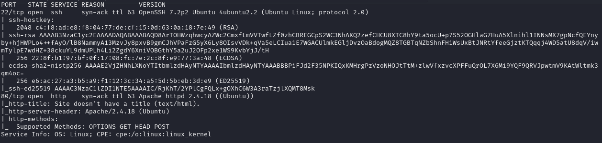

Port 80:

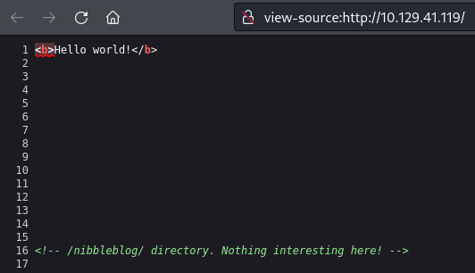

Found `/nibbleblog`:

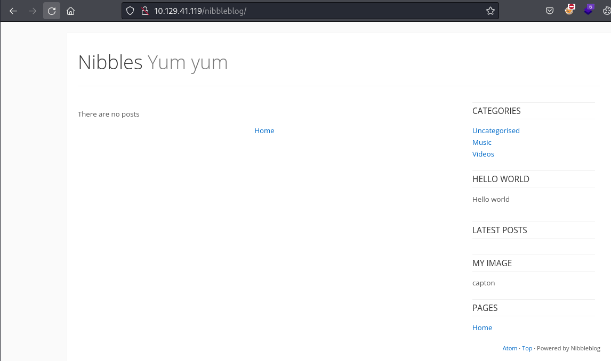

Ran feroxbuster -- lots of results, switched to gobuster:

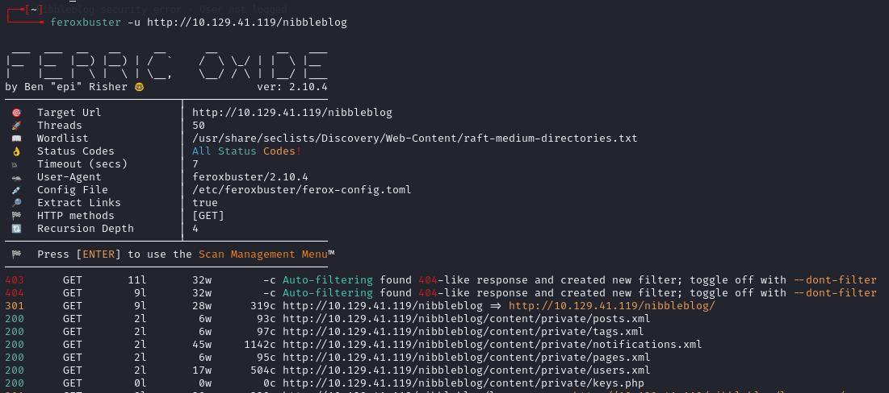

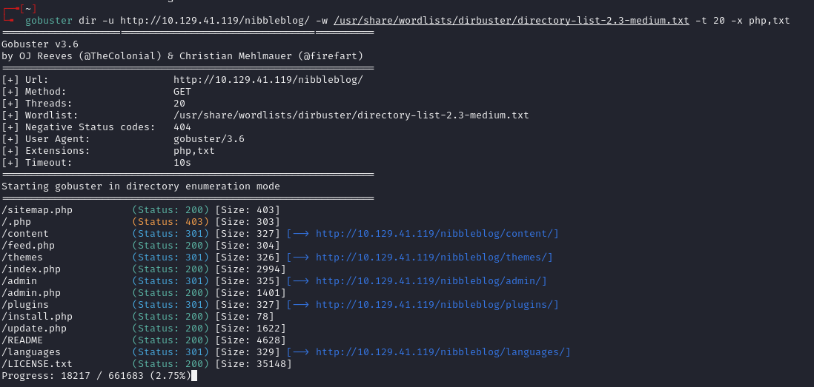

---
## Credential discovery

Found `/nibbleblog/content/private/users.xml`:

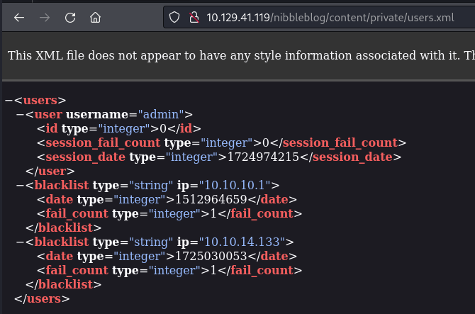

Username: `admin`. Guessed the password as the box name: `nibbles`.

Logged in at `/nibbleblog/admin.php`:

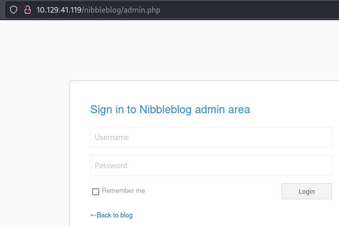

Settings page showed version:

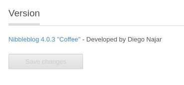

Nibbleblog 4.0.3.

---
## PHP shell upload

Uploaded pentestmonkey PHP shell to the My Image plugin.

Triggered at:

```
http://10.129.35.101/nibbleblog/content/private/plugins/my_image/image.php
```

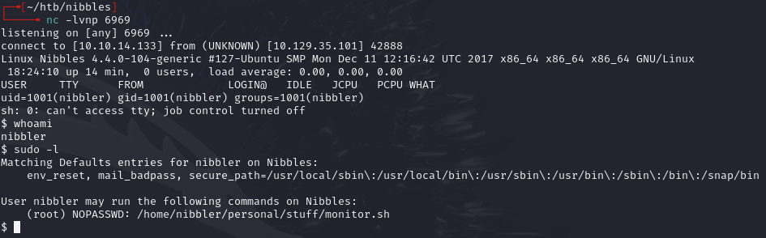

---
## Privilege escalation

Found `personal.zip`:

```bash
unzip personal.zip
```

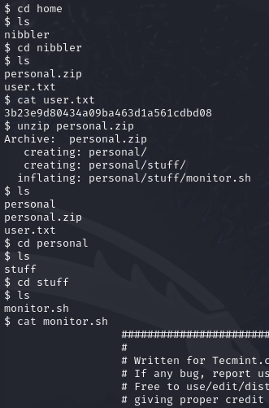

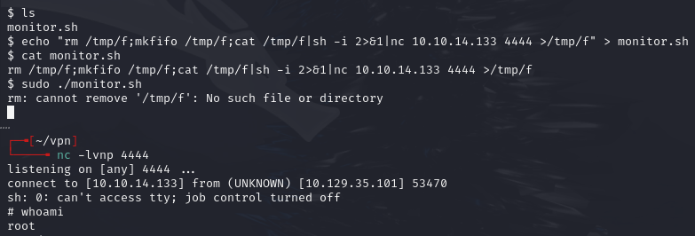

---
## Lessons & takeaways

- Guessing passwords based on the box/application name is worth trying early
- Nibbleblog My Image plugin allows arbitrary file upload -- classic attack vector
- Always check for writable scripts that run with elevated privileges
