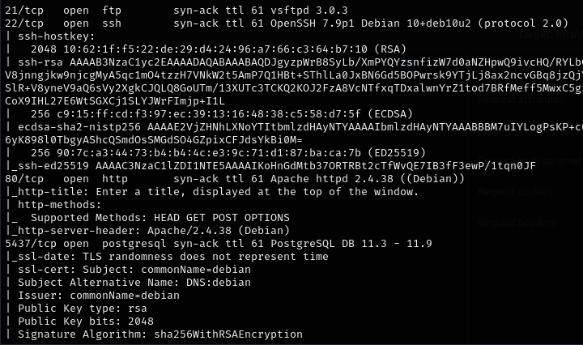
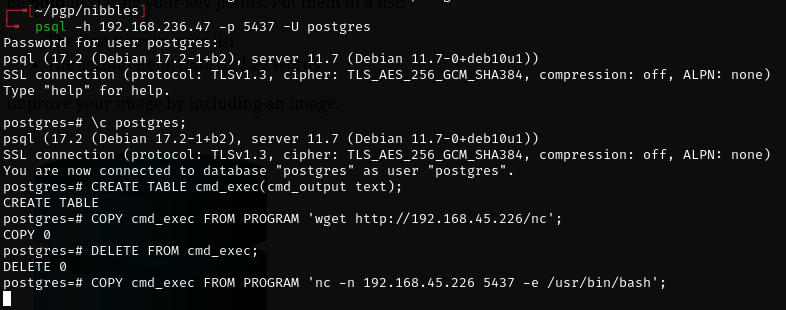

# Nibbles -- Proving Grounds (write-up)

**Difficulty:** Easy
**Box:** Nibbles (Proving Grounds)
**Author:** dsec
**Date:** 2025-11-30

---

## TL;DR

### PostgreSQL with default credentials. Privesc via SUID on find.
---

## Target info

- Host: `192.168.236.47`
- Services discovered: `5437/tcp (postgresql)`

---

## Enumeration & foothold



Connected to PostgreSQL with default credentials:

```bash
psql -h 192.168.236.47 -p 5437 -U postgres
```

`postgres:postgres` worked.



---

## Privilege escalation

SUID on `find` -- used GTFOBins payload.

---

## Lessons & takeaways

- Always check for default credentials on exposed database services
- SUID on `find` is a classic GTFOBins privesc
---
