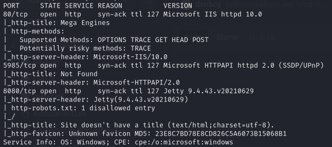
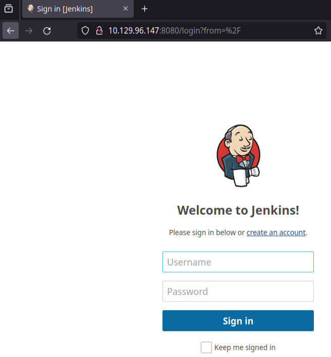
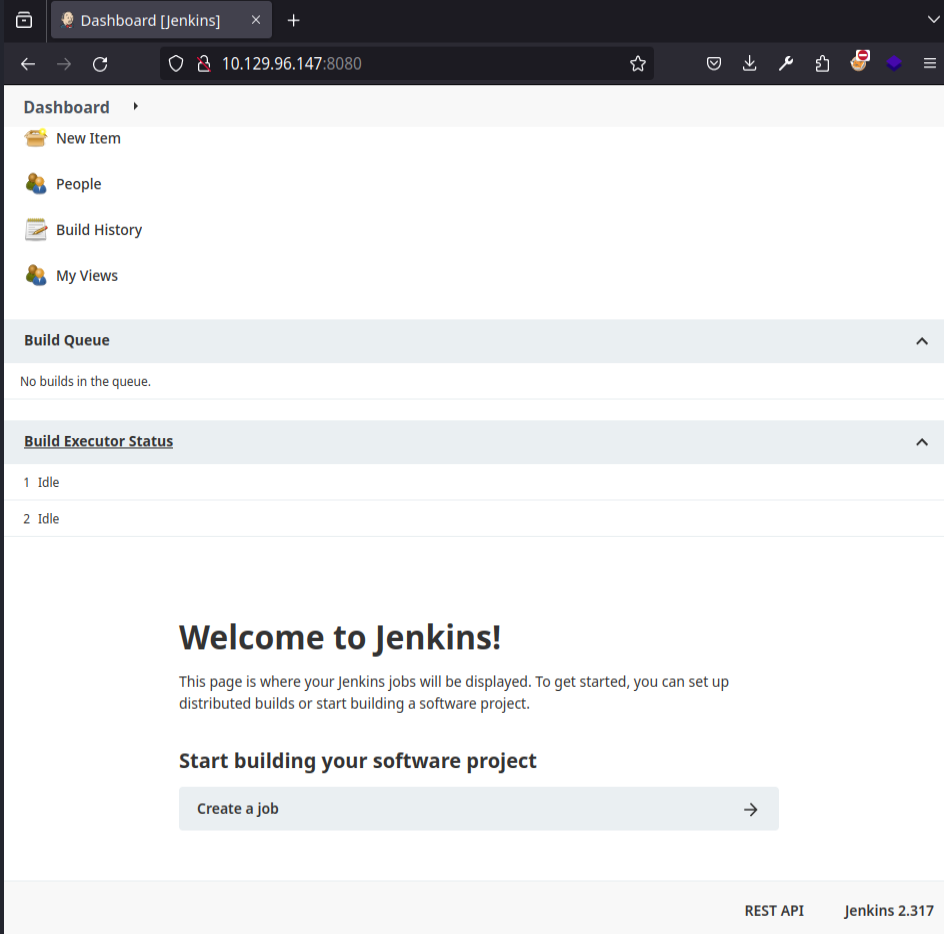
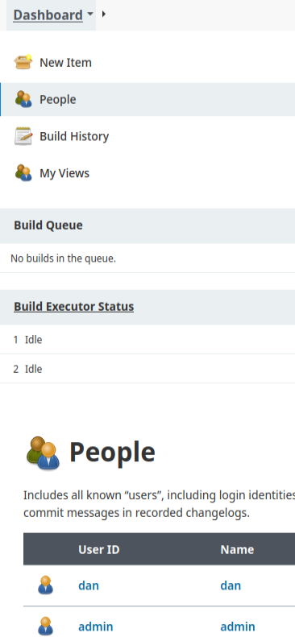
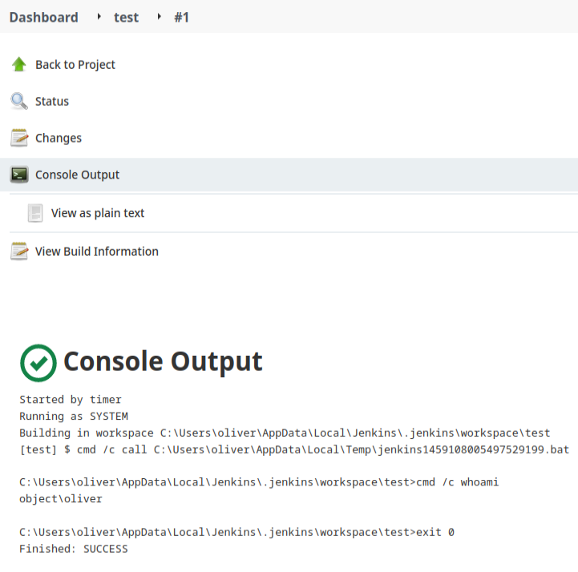

# Object — HackTheBox (write-up)

**Difficulty:** Hard
**Box:** Object (HackTheBox)
**Author:** dkrxhn
**Date:** 2025-03-28

---

## TL;DR

### Jenkins instance allowed account creation and job scheduling. Configured a freestyle project with a build trigger to execute commands, confirming RCE via console output.
---
## Target info

- Host: `10.129.96.147`
- Services discovered via nmap
---
## Enumeration

```bash
sudo nmap -Pn -n 10.129.96.147 -sCV -p- --open -vvv
```





---
## Foothold

Created an account on the Jenkins instance.





Clicked "top of page" > create a job > freestyle project > build triggers tab > Build periodically > in schedule field put `* * * * *` > add build step > `cmd /c whoami` > save.

Hovered over the #1 build and checked console output:



Shows the command executed successfully.

---
## Lessons & takeaways

- Jenkins instances with open registration are a common foothold vector
- Freestyle projects with build triggers allow arbitrary command execution
- Always check console output for build results
---
