# Payday -- Proving Grounds (write-up)

**Difficulty:** Easy
**Box:** Payday (Proving Grounds)
**Author:** dkrxhn
**Date:** 2024-08-07

---

## TL;DR

### Default admin creds on a web app led to a PHP reverse shell. Found MySQL creds and password reuse for a local user who had full sudo privileges.

---

## Enumeration

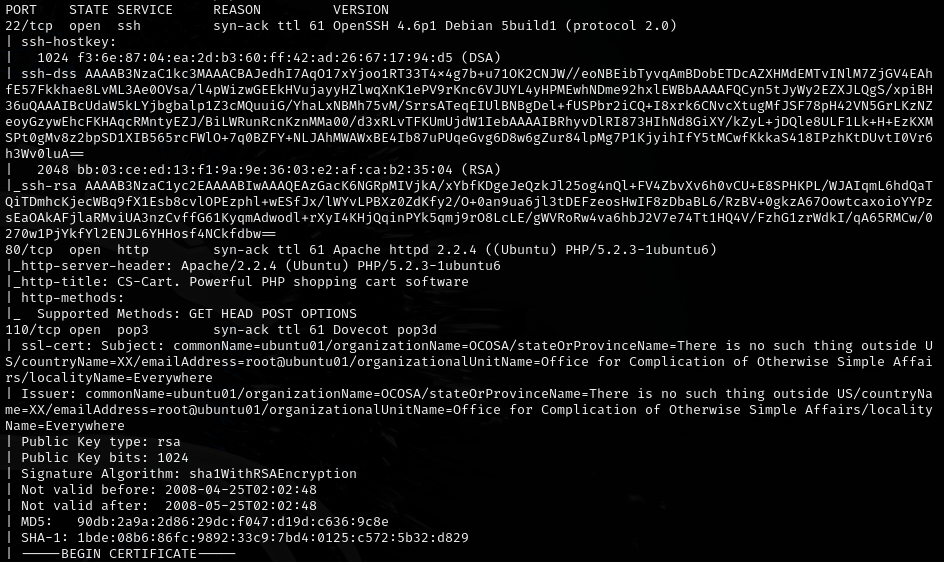

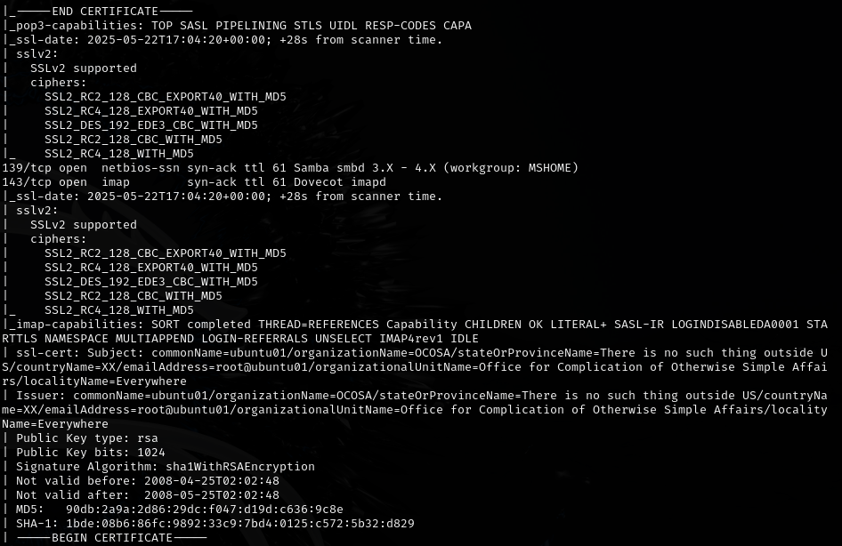

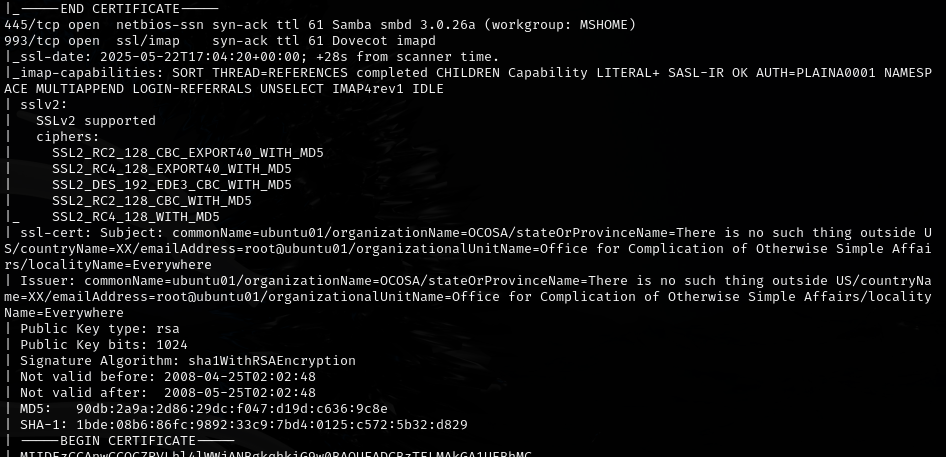

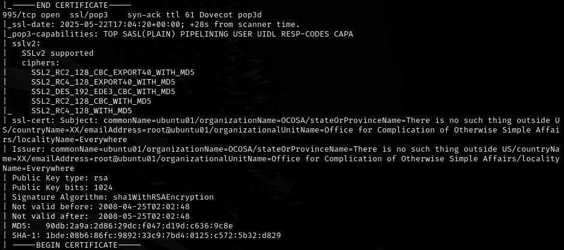

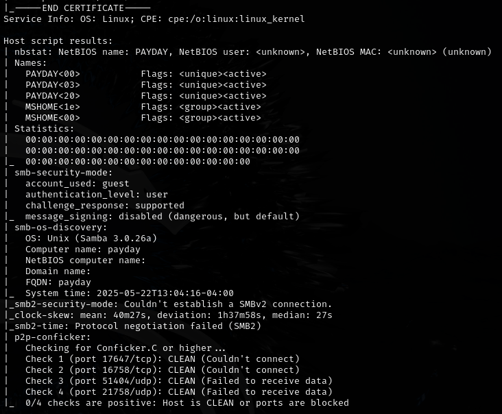

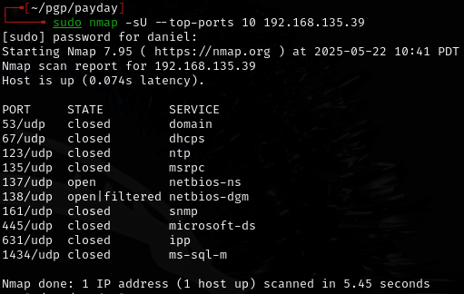

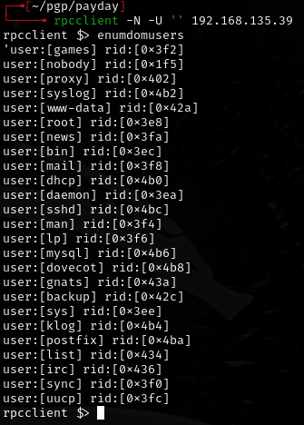

---

## Exploitation

Found `/admin.php` with default credentials:

- `admin:admin`

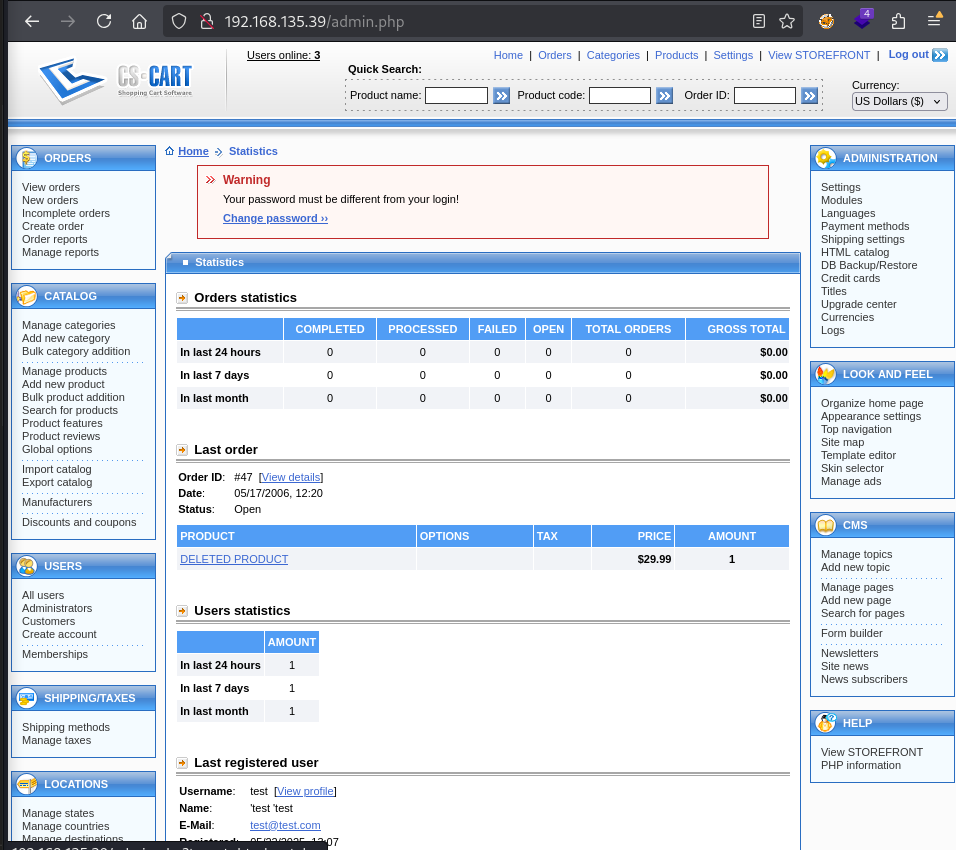

Used a PHP Ivan shell from revshells to get a reverse shell.

---

## Privilege escalation

Found MySQL running:

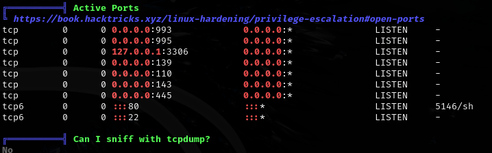

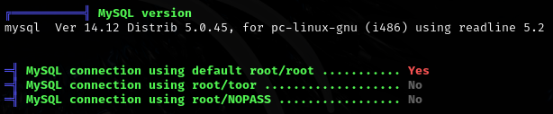

```bash
mysql -h 127.0.0.1 -u root -p
```

Found SSH authorized key:

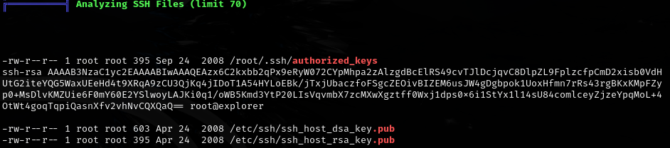

Checked for SUID binaries:

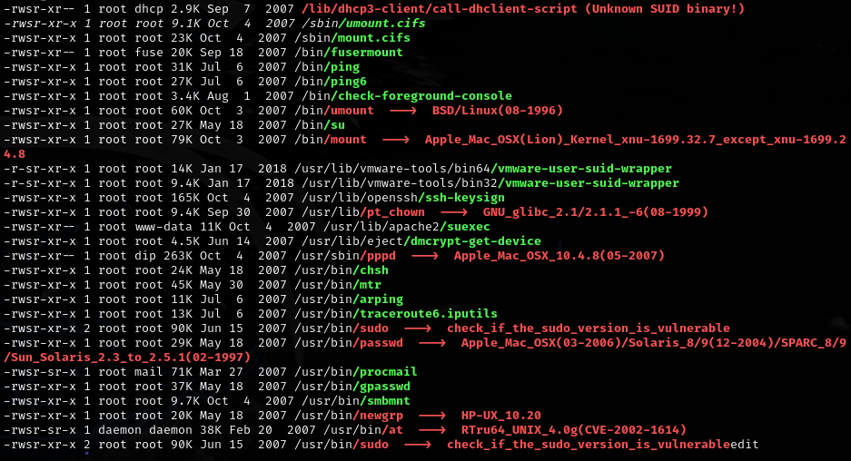

Found interesting backup/config files:
- `/var/lib/belocs/hashfile.old`
- `/var/backups/infodir.bak`
- `/etc/dovecot/dovecot.conf.bak`
- `/var/cache/debconf/passwords.dat`
- `/etc/mysql/conf.d/old_passwords.cnf`

Password reuse: `patrick:patrick`

```bash
su patrick
sudo -l
```

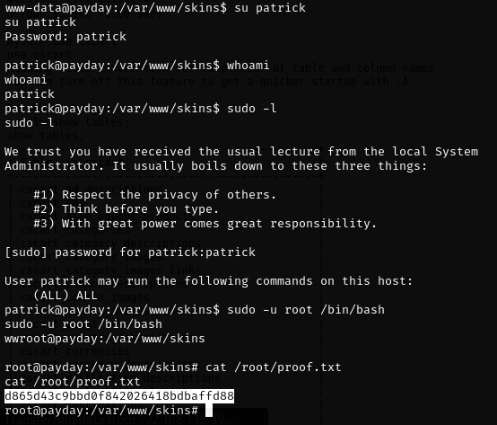

- Full sudo privileges.

---

## Lessons & takeaways

- Always try default credentials on admin panels -- `admin:admin` still works more often than you'd think
- Check MySQL for stored credentials and SSH keys
- Password reuse between database users and system accounts is a common privesc path
