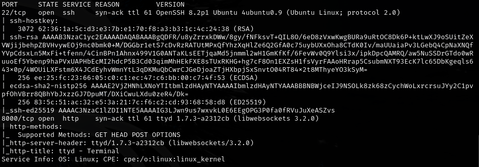
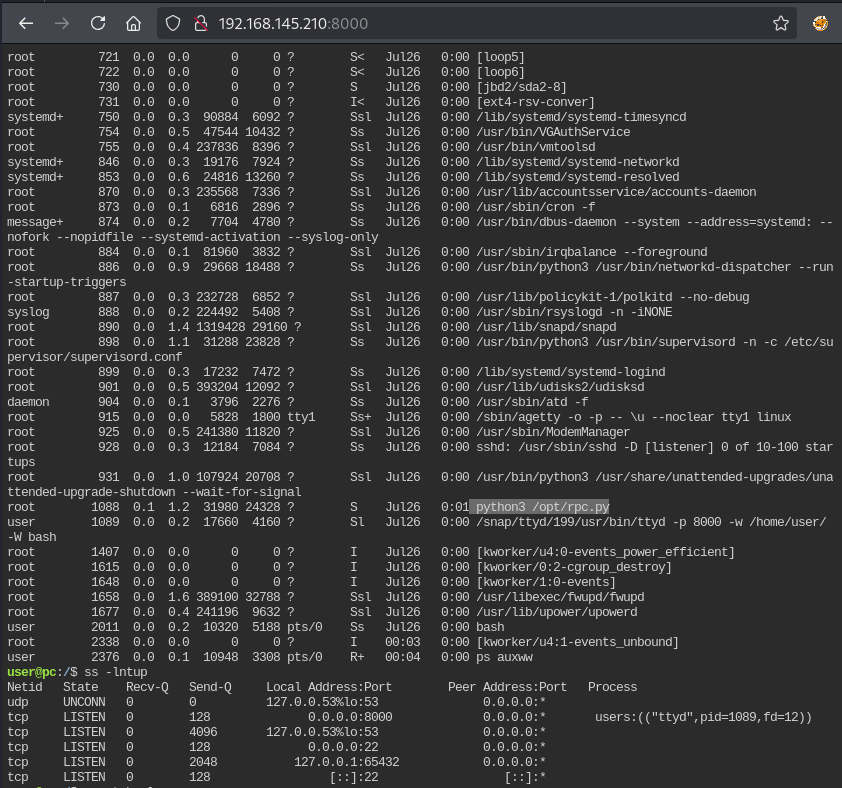
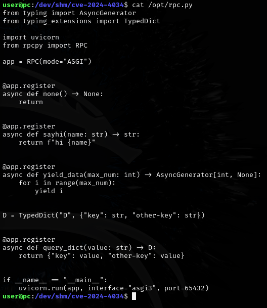
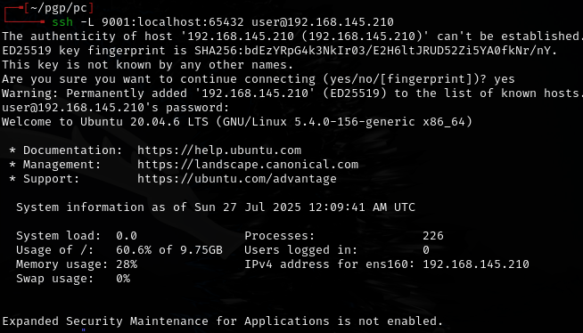
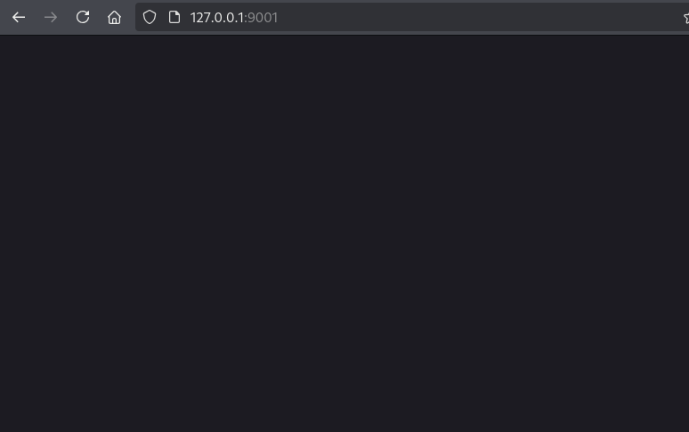
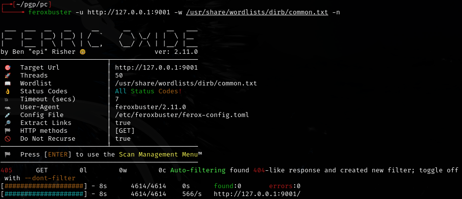
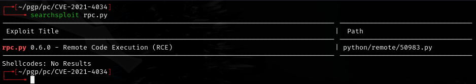
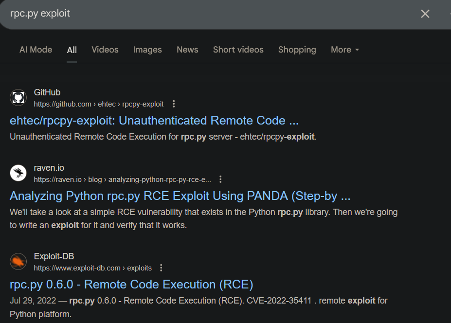
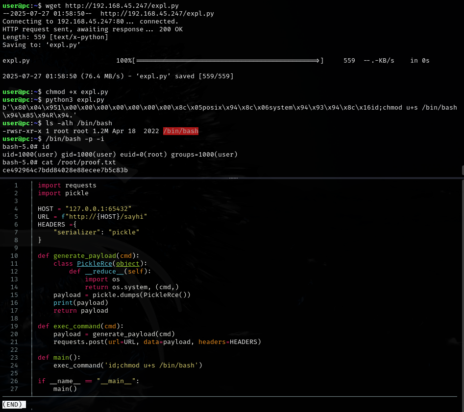

# PC -- Proving Grounds (write-up)

**Difficulty:** Intermediate
**Box:** PC (Proving Grounds)
**Author:** dkrxhn
**Date:** 2025-09-30

---

## TL;DR

### Enumeration of running processes revealed attack surface. Privesc via SUID on bash.
---

## Target info

- Host: PC (Proving Grounds)

---

## Enumeration



Checked running processes:

```bash
ps -auxww
```







---

## Foothold



**nada** -- moved on.





---

## Privilege escalation





Set SUID on bash and executed:

```bash
/bin/bash -p
```

Only needed `u+s /bin/bash` as the payload.

---

## Lessons & takeaways

- Always check running processes with `ps -auxww` for hidden services
- SUID on `/bin/bash` is a quick path to root via `bash -p`
---
