# Pelican -- Proving Grounds (write-up)

**Difficulty:** Intermediate
**Box:** Pelican (Proving Grounds)
**Author:** dsec
**Date:** 2025-05-05

---

## TL;DR

### Found a vulnerable service with a public exploit on Exploit-DB. Used sudo gcore to dump a process memory and extract credentials. Escalated to root.
---
## Target info

- Host: Proving Grounds target
- Services discovered via nmap
---
## Enumeration

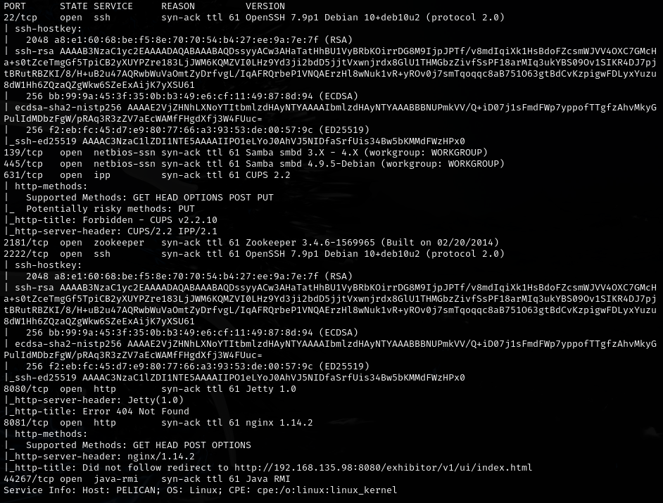

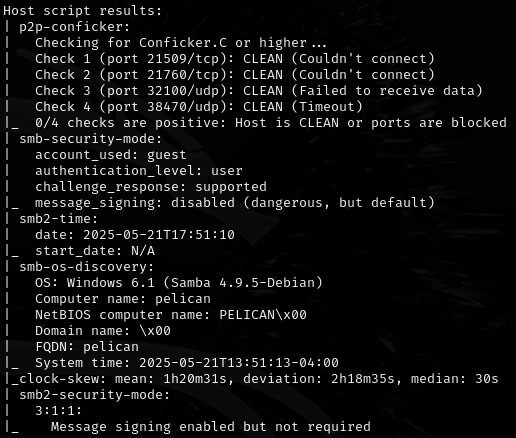

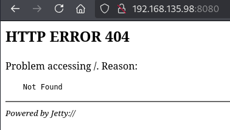


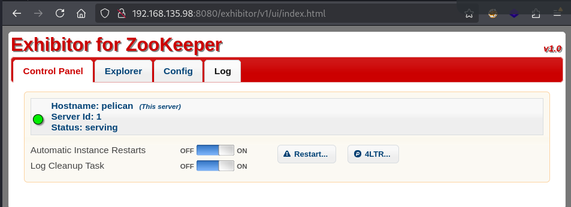

---
## Initial foothold

Found a public exploit: <https://www.exploit-db.com/exploits/48654>

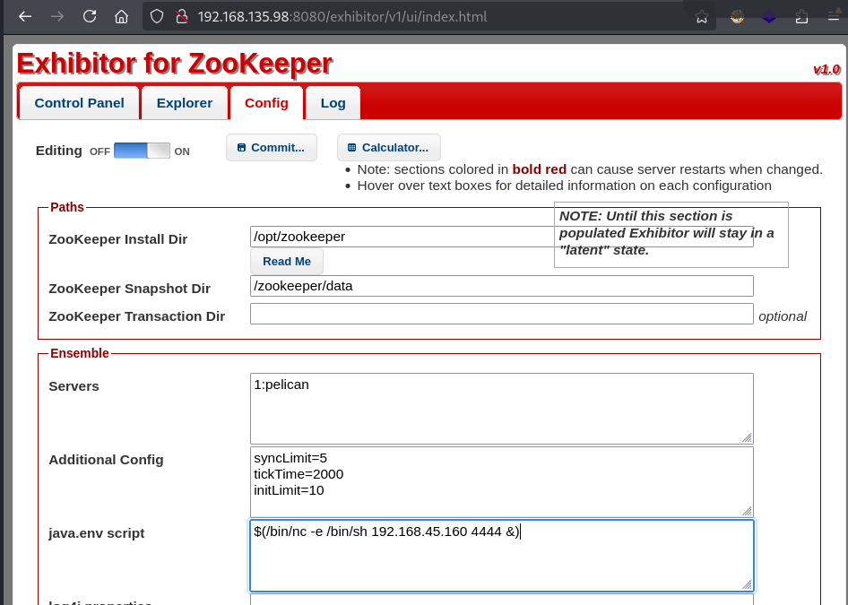

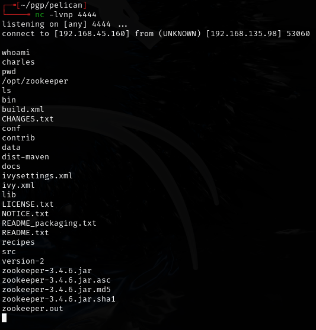

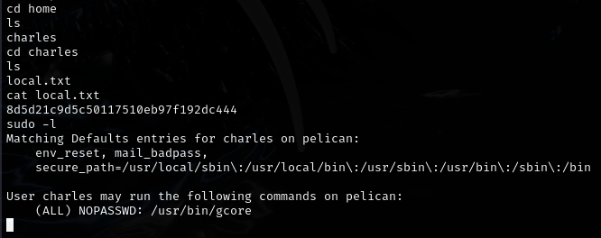

---
## Privesc

Used `sudo gcore` to dump process memory:

```bash
sudo gcore 486
cat core.486
```

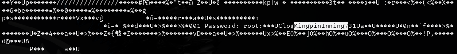

Found password in the dump: `ClogKingpinInning731`

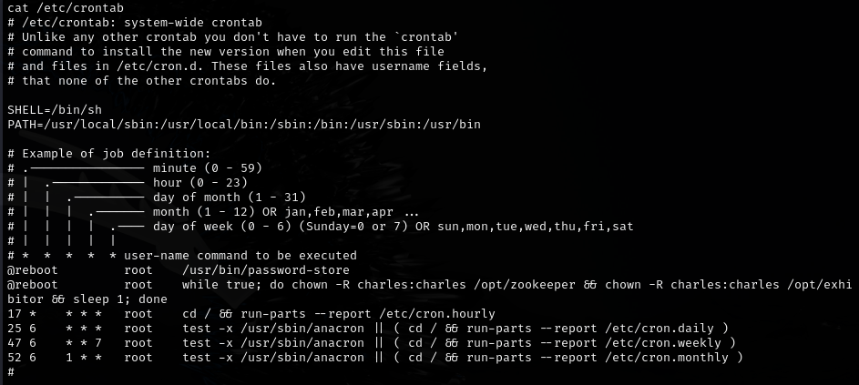

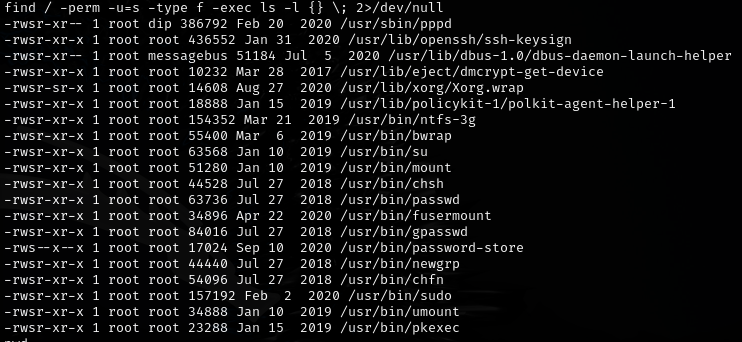

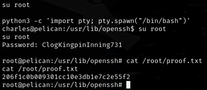

Make sure to stabilize the shell before running gcore.

---
## Lessons & takeaways

- `sudo gcore` can dump process memory, which often contains plaintext credentials
- Always stabilize your shell before running commands that produce large output
- Check Exploit-DB for known vulnerabilities when you identify service versions
---
