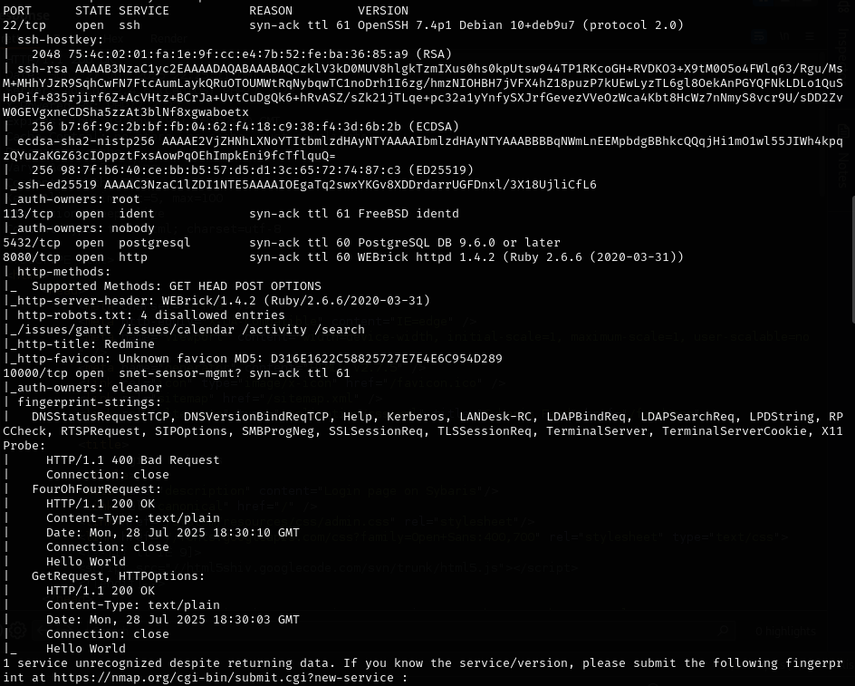
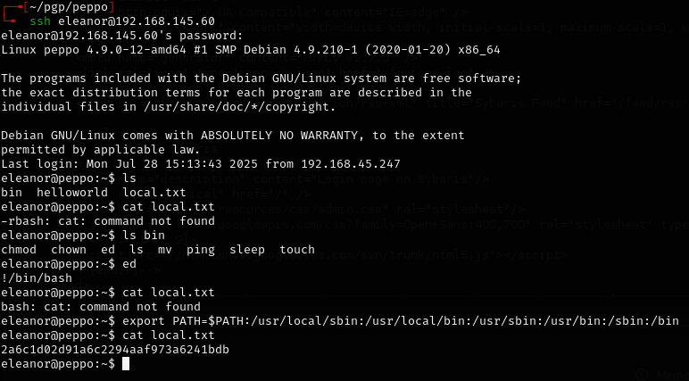
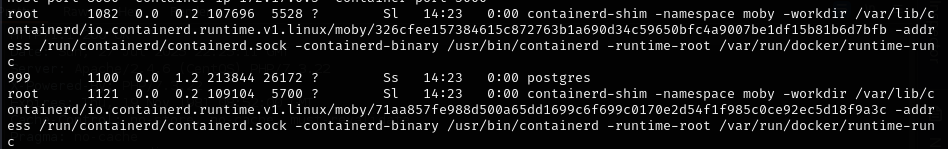
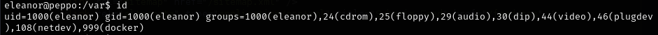
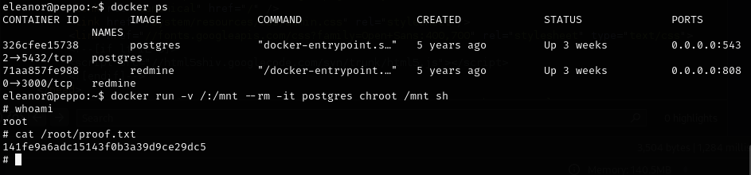

# Peppo -- Proving Grounds (write-up)

**Difficulty:** Intermediate
**Box:** Peppo (Proving Grounds)
**Author:** dsec
**Date:** 2025-09-24

---

## TL;DR

### Enumeration led to initial access. Privilege escalation via Docker.
---

## Target info

- Host: Peppo (Proving Grounds)

---

## Enumeration

---

## Foothold

---

## Privilege escalation

Escalated via Docker:

---

## Lessons & takeaways

- Docker group membership is a known privesc vector
- If a user can run Docker, they can mount the host filesystem and access everything
---
