# Phantom -- Vulnlab (write-up)

**Difficulty:** Hard
**Box:** Phantom (Vulnlab)
**Author:** dkrxhn
**Date:** 2025-09-22

---

## TL;DR

### Base64-decoded creds from enumeration. Cracked VeraCrypt backup with custom wordlist. KeePass dump -> lateral movement to svc_sspr. ICT Security group has AddAllowedToAct on DC.
---
## Target info

- Domain: Vulnlab chain
---
## Enumeration

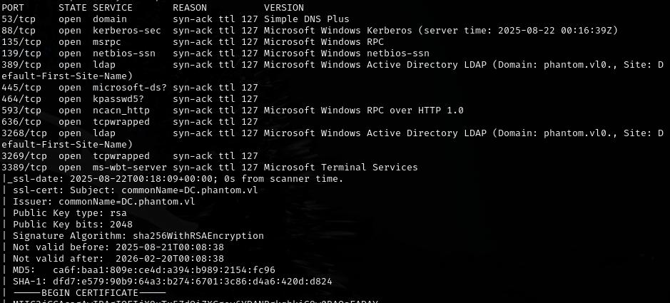

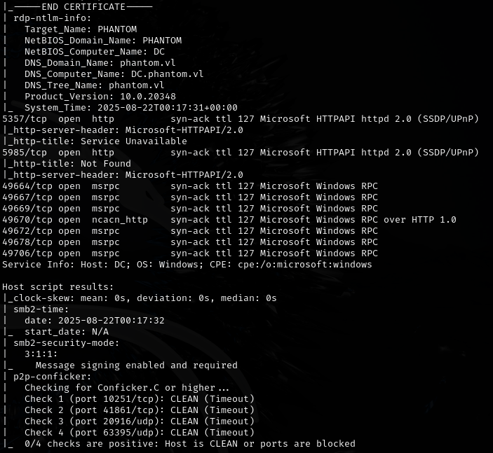

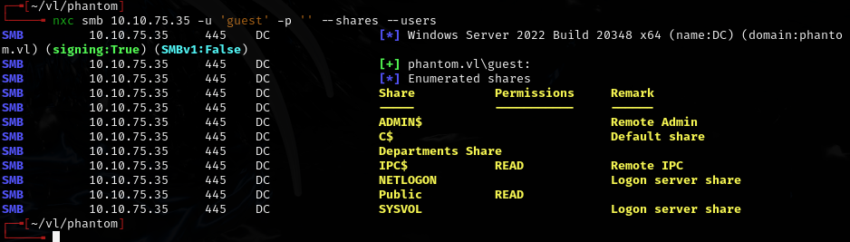

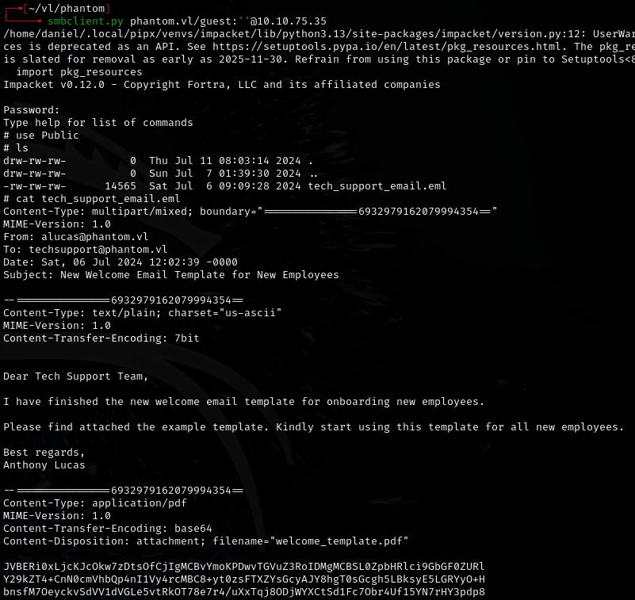

---
## Initial access

Copied base64 output from enumeration, decoded in CyberChef:

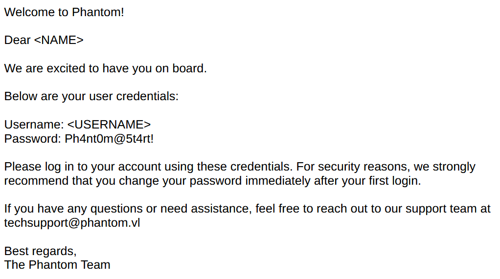

Found password: `Ph4nt0m@5t4rt!`

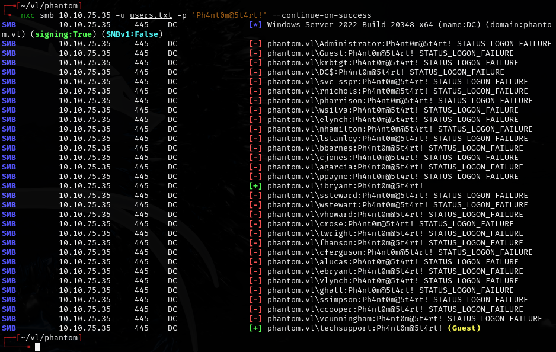

Valid: `ibryant:Ph4nt0m@5t4rt!`

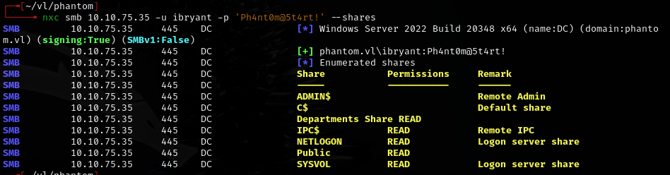

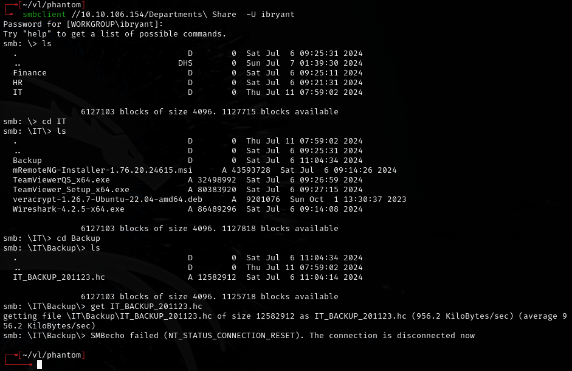

---
## VeraCrypt backup

Generated a custom wordlist based on the company name pattern (hint from Vulnlab wiki):

```bash
crunch 12 12 -t 'Phantom202%^' -o wordlist.txt
```

Cracked the VeraCrypt container:

```bash
hashcat -m 13721 IT_BACKUP_201123.hc ./wordlist.txt
```

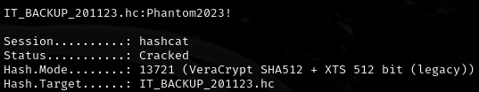

Password: `Phantom2023!`

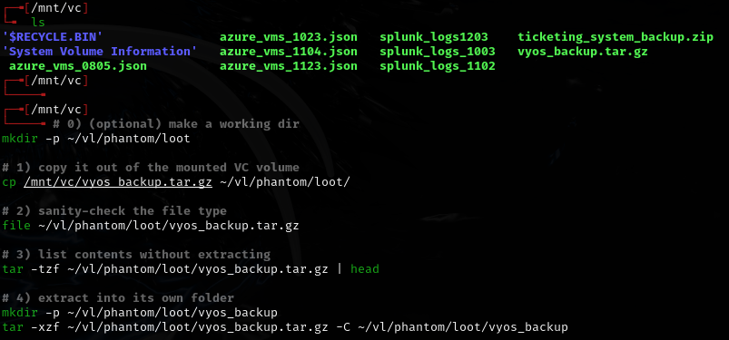

---
## Lateral movement

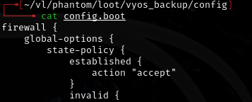

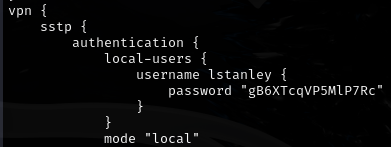

Found: `lstanley:gB6XTcqVP5MlP7Rc`

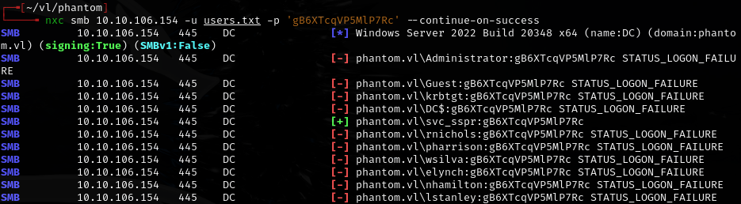

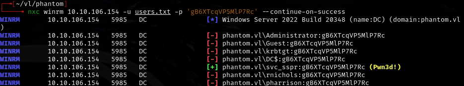

Password reuse: `svc_sspr:gB6XTcqVP5MlP7Rc`

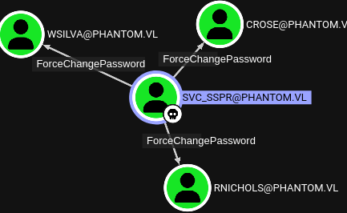

---
## Privilege escalation

All 3 users are members of ICT Security, which has AddAllowedToAct on the DC:

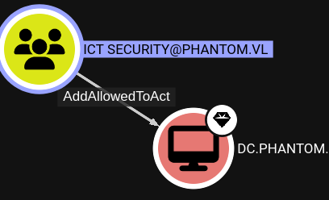

---
## Lessons & takeaways

- Custom wordlists with crunch based on company naming patterns are effective for VeraCrypt
- Always check for password reuse across service accounts
- AddAllowedToAct (RBCD) on a DC from a group membership = domain compromise
---
