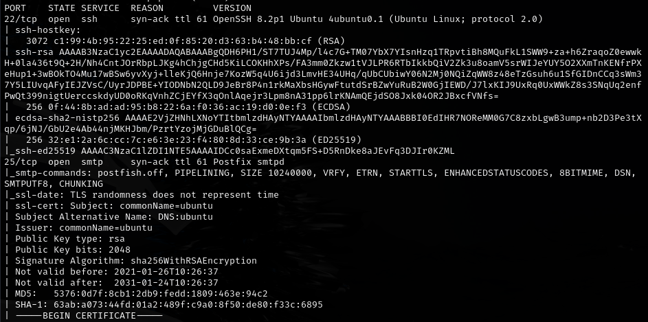
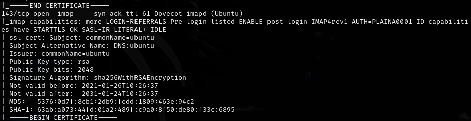
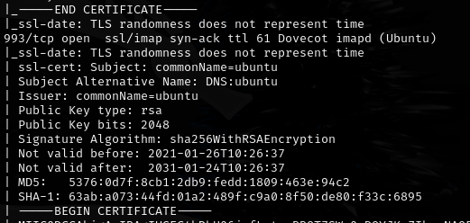
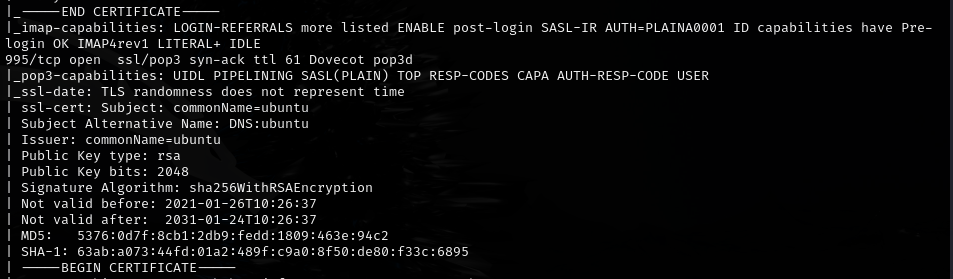
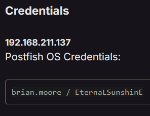
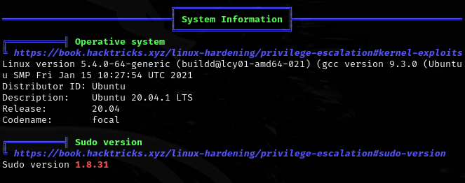
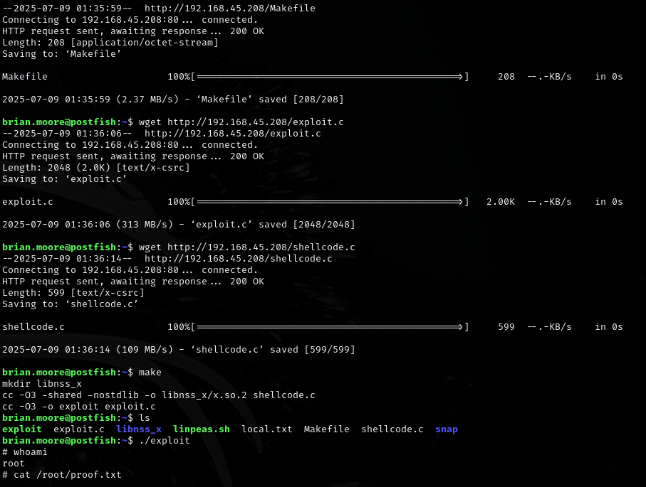

# Postfish -- Proving Grounds (write-up)

**Difficulty:** Intermediate
**Box:** Postfish (Proving Grounds)
**Author:** dsec
**Date:** 2025-07-28

---

## TL;DR

### Enumerated users/services, SSH'd in with discovered creds. Privesc via sudo 1.8.31 root exploit.
---

## Target info

- Host: see nmap results

---

## Enumeration

## Exploitation

SSH'd in with discovered creds:

## Privilege escalation

Ran linpeas:

Found vulnerable sudo version. Used sudo 1.8.31 root exploit:

<https://github.com/mohinparamasivam/Sudo-1.8.31-Root-Exploit>

---

## Lessons & takeaways

- Always check sudo version -- 1.8.31 has a known root exploit
- Linpeas highlights vulnerable sudo versions automatically
---
