# Precious -- HackTheBox (write-up)

**Difficulty:** Easy
**Box:** Precious (HackTheBox)
**Author:** dsec
**Date:** 2025-08-03

---

## TL;DR

### Web app converts pages to PDF -- exploited SSRF via pdfkit (Ruby). Found SSH creds in config files. Privesc via YAML deserialization in a sudo ruby script to copy SUID bash.
---

## Target info

- Host: see nmap results
- Services discovered: `22/tcp (ssh)`, `80/tcp (http)`

---

## Enumeration

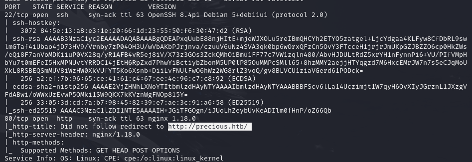

Updated `/etc/hosts`:

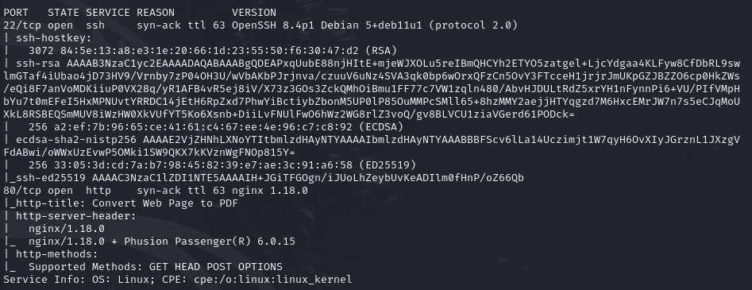

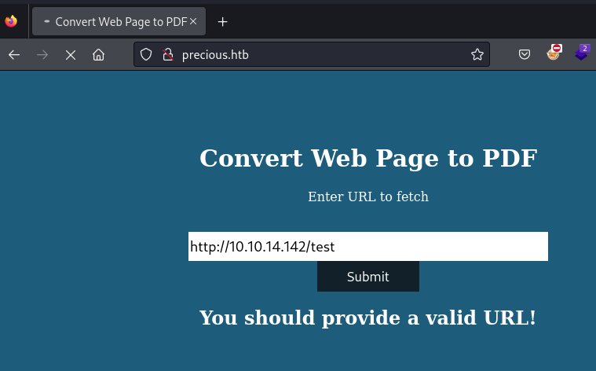

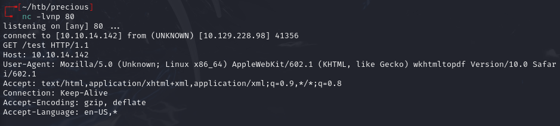

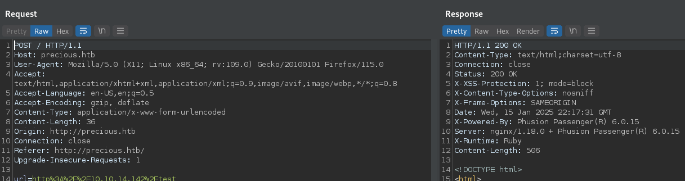

- Ruby-based PDF generation

## Exploitation

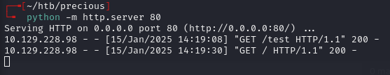

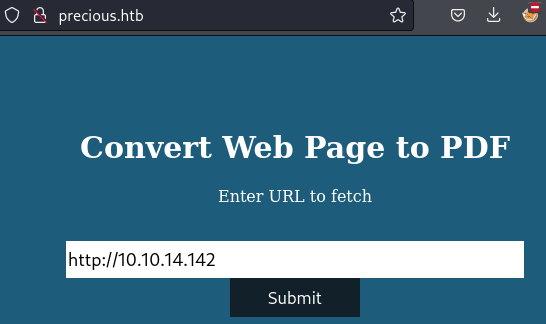

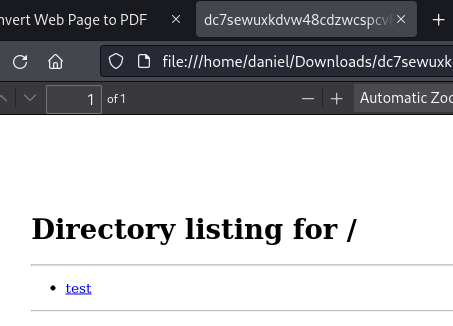

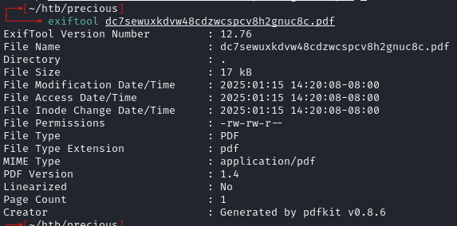

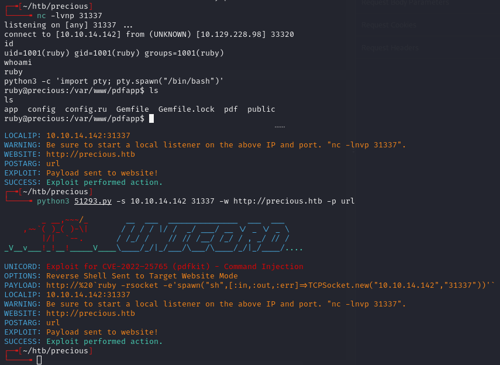

Found creds in config:

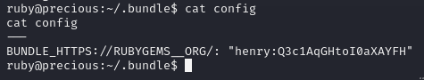

- `henry:Q3c1AqGHtoI0aXAYFH`

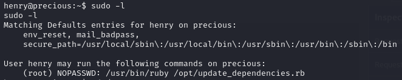

## Privilege escalation

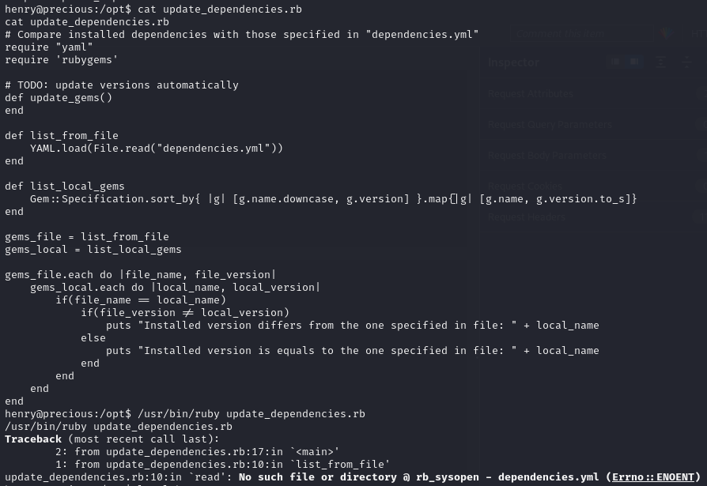

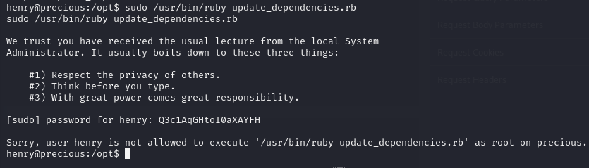

Copied YAML deserialization PoC from: <https://gist.githubusercontent.com/staaldraad/89dffe369e1454eedd3306edc8a7e565/raw/4b85e6fe8f5708f0a7ba87dbecb6954f8f380bee/ruby_yaml_load_sploit2.yaml>

Saved as `dependencies.yml`:

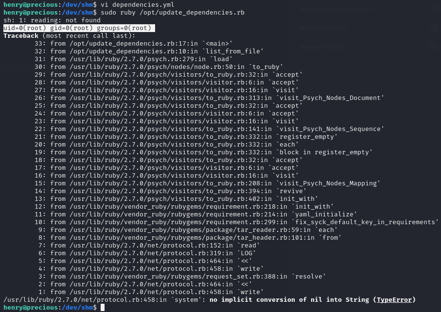

Payload: copy bash then set SUID and SGID for root:

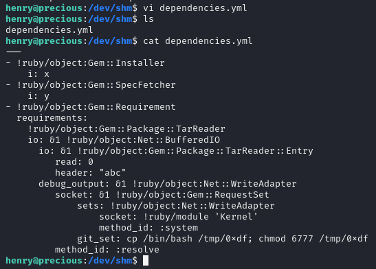

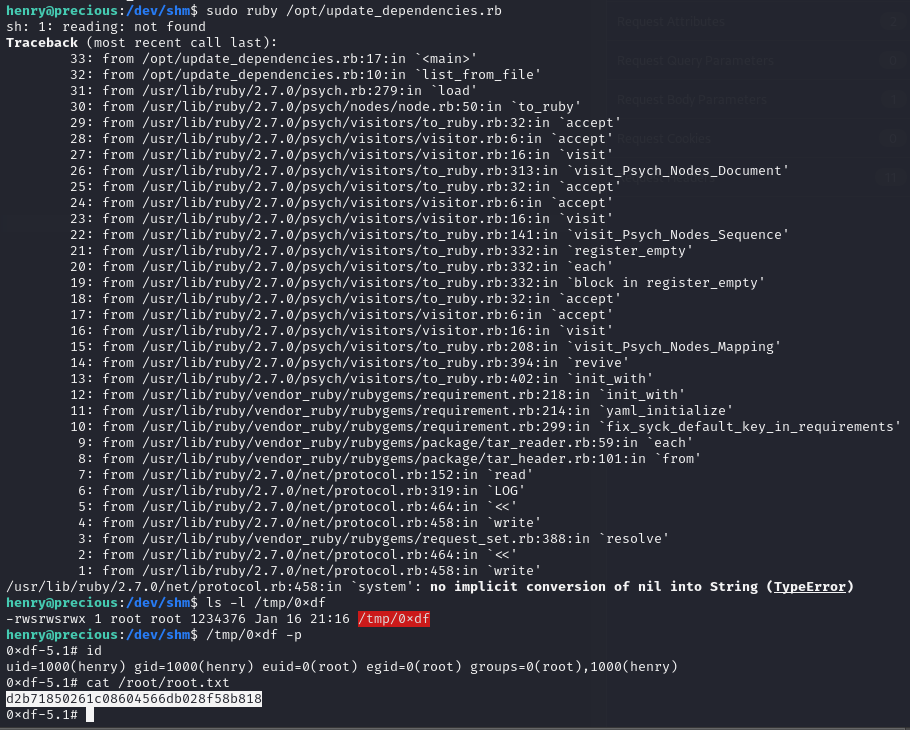

---

## Lessons & takeaways

- Webpage-to-PDF conversion can be exploited via SSRF -- check PDF metadata for the tool used
- YAML deserialization in Ruby allows arbitrary command execution
- YAML deserialization in Python is also possible (per 0xdf)
---
