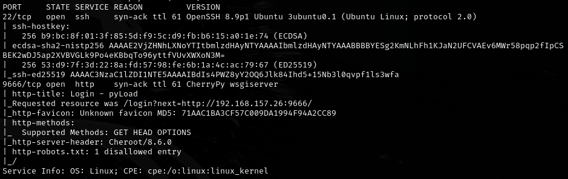
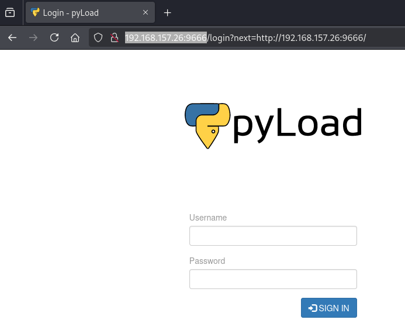
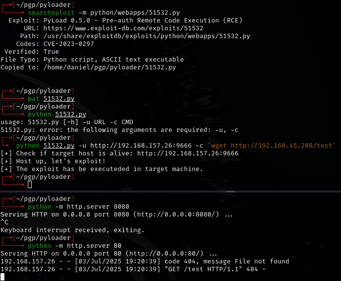
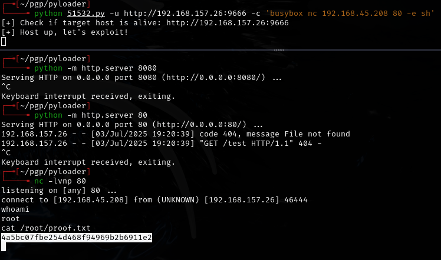

# pyLoader -- Proving Grounds (write-up)

**Difficulty:** Easy / Beginner
**Box:** pyLoader (Proving Grounds)
**Author:** dkrxhn
**Date:** 2025-05-19

---

## TL;DR

### Quick box. Enumeration and exploitation were straightforward from the screenshots.
---
## Target info

- Host: Proving Grounds target
- Services discovered via nmap
---
## Enumeration

---
## Exploitation

---
## Lessons & takeaways

- pyLoad has known RCE vulnerabilities -- check the version and search for public exploits
- Some boxes are straightforward once you identify the service
---
