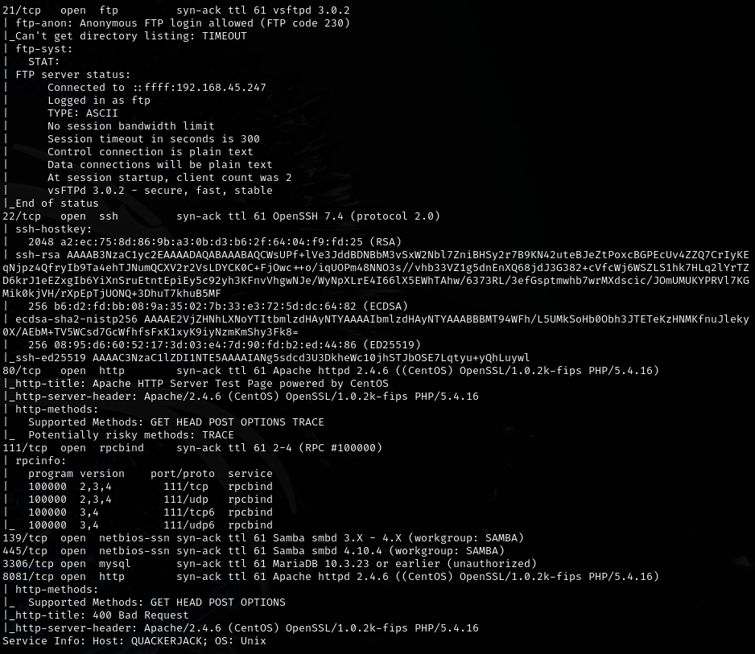
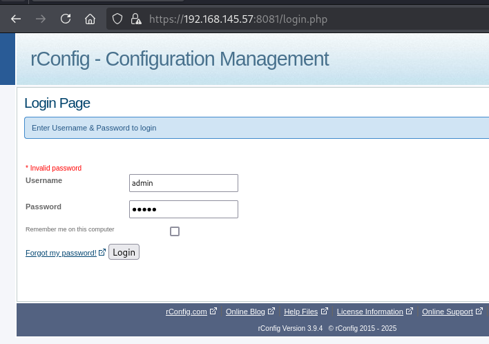
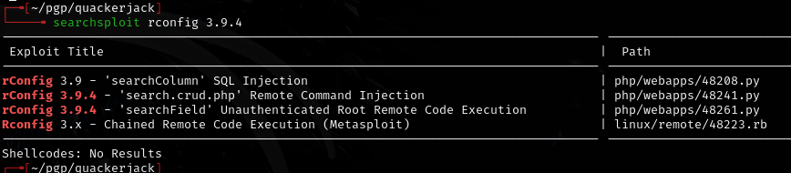
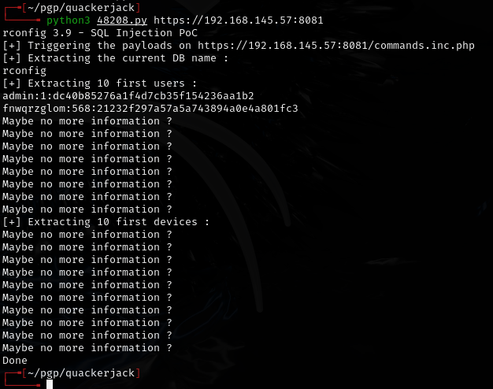
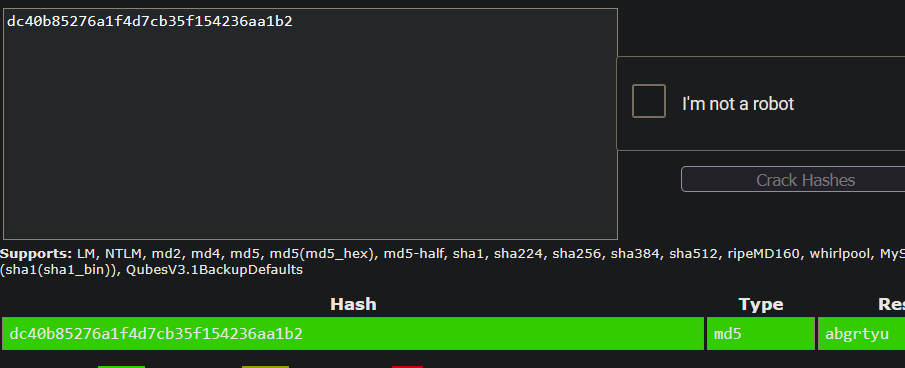
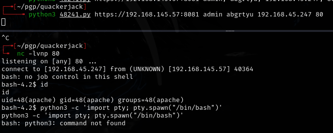
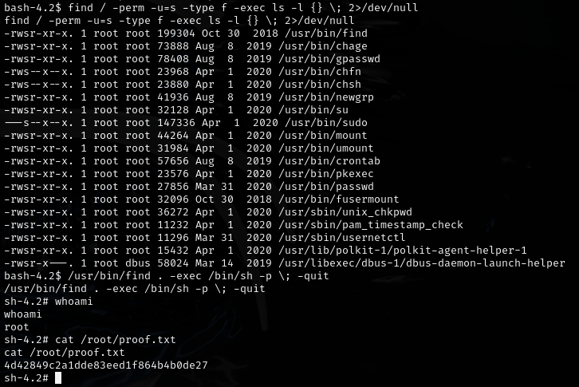

# Quackerjack -- Proving Grounds (write-up)

**Difficulty:** Intermediate
**Box:** Quackerjack (Proving Grounds)
**Author:** dkrxhn
**Date:** 2025-05-01

---

## TL;DR

### Exploited a service on port 48208 (had to fix SSL errors in the exploit code). Got admin creds, escalated from there.
---
## Target info

- Host: Proving Grounds target
- Services discovered via nmap
---
## Enumeration

---
## Initial foothold

Found exploit for port 48208. Had to fix an SSL error in the exploit code -- newer Python versions require SSL verification by default.

Got creds: `admin:abgrtyu`

---
## Privesc

---
## Lessons & takeaways

- Public exploits may need fixes for newer Python versions (especially SSL verification changes)
- Always check high-numbered ports -- services running on non-standard ports can be vulnerable
---
